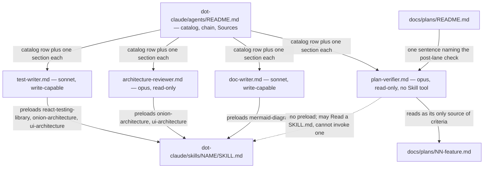

# Development Plan — four new subagents (`test-writer`, `architecture-reviewer`, `plan-verifier`, `doc-writer`)

## Overview

Today the roster in `.claude/agents/` is three agents — `researcher`, `planner`,
`implementer` — and its own README says the review half of the chain **does not exist yet**.
After this change an orchestrator can, without inventing a prompt each time:

- hand a finished change to **`test-writer`** and get tests that follow `TESTING.md`'s
  typology instead of generic testing advice;
- hand a diff to **`architecture-reviewer`** in a fresh, write-less context and get findings
  that name a rule, a location and the failure that rule prevents;
- hand a plan plus the code to **`plan-verifier`** and get a requirement-by-requirement
  conformance matrix backed by command output it ran itself;
- hand existing functionality or a settled plan to **`doc-writer`** and get it written to the
  *right* surface, with a diagram when a relationship is what needs explaining.

No product code changes. Nothing under `client/`, `server/`, `reviewer-core/` or `e2e/` is
touched.

---

## Grounding

| Source | What this plan took from it |
|---|---|
| root `INSIGHTS.md` | An agent file states **method**, never a map of this repo (2026-09-04, `researcher.md`); `skills:` is the only enforceable preload and prose "load this skill" is not (2026-09-04); a new agent **cannot be invoked in the session that writes it**, so every Acceptance here is static (2026-09-04); `routing.md` contains at least one wrong glob, so no glob is copied out of it (2026-09-04); a `description` is the entire trigger and silently under-covers its own body (2026-08-31); the Bash gate matches at command position after a substring-matching bug (2026-08-31). |
| `.claude/agents/README.md` | The catalog table's five columns, the chain block, the per-agent two-column table, the **mandatory Sources** list, and the four "Adding or editing an agent" rules that become this plan's Acceptance. |
| `researcher.md` / `planner.md` / `implementer.md` | House style: `# Role` in the second person, an explicit input gate that **stops** rather than guesses, a `# Method` of numbered steps, a fenced `# Output` template, a closing `# Never` list, and an explicit statement of which skills are excluded and why. |
| `TESTING.md` | "Typological, not exhaustive — we do not chase line coverage"; the `*.it.test.ts` convention and the two vitest invocations that implement the split; the reason `server/package.json`'s scripts are not what runs. |
| `docs/README.md` + `docs/plans/README.md` | The "What belongs where" table that becomes `doc-writer`'s routing rule, and the `specs/` vs `docs/plans/` distinction that becomes its stop-rule. |
| `.claude/skills/README.md` | The installed catalog; every name in every `skills:` list below was checked against `ls .claude/skills/`. |
| `.claude/settings.json` + `check-gate.sh` | The only hook is a `PreToolUse` Bash gate that matches `git push` and `gh pr create|merge` **at command position** after stripping heredocs and comments. No Bash command any of the four agents needs is matched. There is no `permissions` block, so there is nothing to allowlist. |

**Preload costs below are measured, not guessed.** `wc -c` over the listed `SKILL.md` files
divided by 4 reproduces the two figures already recorded in the README — the implementer's 12
skills come to exactly 2740 lines and ~31k tokens, the planner's 11 to ~24k — so the same
method is used for the new sets.

---

## Requirements

- **R1** — The four files `.claude/agents/test-writer.md`, `architecture-reviewer.md`,
  `plan-verifier.md`, `doc-writer.md` exist, and `claude plugin validate .claude/agents`
  exits 0.
- **R2** — Each of the four has frontmatter whose `name` equals its filename stem, whose
  `description` is exactly **one physical line, double-quoted, containing no `"` character**,
  and whose `model` is `opus` or `sonnet`. Checkable: `rg -c '^description:' <file>` prints
  `1` for each; `rg -n '^description: >' .claude/agents/` finds nothing.
- **R3** — `architecture-reviewer` and `plan-verifier` declare no write capability:
  `rg -n '^tools:.*(Edit|Write|NotebookEdit)' .claude/agents/architecture-reviewer.md .claude/agents/plan-verifier.md`
  exits non-zero (no match).
- **R4** — Every name under a `skills:` key in the four files resolves to an existing
  `.claude/skills/<name>/SKILL.md`.
- **R5** — Every repo path, glob and shell command written into any of the four bodies
  resolves in this tree: each is demonstrated by an `ls` or `git ls-files` that returns at
  least one entry, or appears verbatim in `TESTING.md`.
- **R6** — Every clause of each `description` maps to a named section of that same file's
  body. The mapping is reproduced as a clause → section table in the implementation report.
- **R7** — Each of the four bodies contains, as named sections: an **input contract with a
  stop-rule**, an **output template**, and an **explicit anti-scope** naming the one thing the
  agent must not become.
- **R8** — `architecture-reviewer` and `plan-verifier` each define a finding shape carrying
  *location*, *rule violated*, *concrete failure scenario* and *severity*, and a
  **false-positive gate** stated before the output template.
- **R9** — `.claude/agents/README.md` carries: one catalog row per new agent whose `Model` and
  `Preload` cells match that file's frontmatter; one per-agent section with the same
  two-column table shape and a **Sources** list; a chain block naming all seven agents; and a
  corrected version of the paragraph that currently claims the review agents "do not exist
  yet".
- **R10** — Nothing outside `.claude/agents/**` and `docs/plans/**` is modified:
  `git status --porcelain` lists only paths under those two directories.

---

## Affected modules & contracts

| Module | What changes |
|---|---|
| `.claude/agents/` | **Four new files** (`test-writer.md`, `architecture-reviewer.md`, `plan-verifier.md`, `doc-writer.md`) and **one edited** (`README.md`: catalog rows, chain block, four per-agent sections with Sources, corrected "do not exist yet" paragraph). |
| `docs/plans/` | `README.md` gains **one sentence** in *Running a plan* naming `plan-verifier` as the post-lane check. This plan file itself. |
| `client/`, `server/`, `reviewer-core/`, `e2e/` | **Nothing.** No product code, no test, no config. |

**Contracts.** There is no `@devdigest/shared` contract in play; nothing is vendored, added or
consumed. The only contract-shaped artefacts here are the four agents' **output templates** —
and per the README's own opening, a subagent returns only a summary, so each template *is* the
whole handoff. They are settled in this plan (Phase 1 task specs) before any body is written.

**Files that must NOT be edited**, decided here so no lane has to:
`.claude/skills/README.md` (no skill is added — the four are agents), the root `AGENTS.md`
(it says nothing about the agent roster today, and adding a roster there is exactly the second
copy the 2026-09-04 INSIGHTS entry forbids), `.claude/settings.json` (nothing to allowlist —
see the gate analysis below), `TESTING.md` (`test-writer` *reads* it; a pointer back would be
a copy), any `CLAUDE.md` (committed symlinks), and every path under `client/`, `server/`,
`reviewer-core/`, `e2e/`.

### The `PreToolUse` gate — checked, not assumed

`check-gate.sh` builds two regexes anchored at a command-segment boundary: `git … push` and
`gh pr create|merge`. It strips heredoc bodies and `#` comment lines first, and it fails open
on any internal error. Against that:

- `test-writer` runs vitest and typecheck; `plan-verifier` runs the plan's named verification
  commands; `architecture-reviewer` and `doc-writer` run `git diff`/`git log`/`rg`/`ls`. None
  is a push or a PR command. **The gate exits 0 for all of them; no settings change is needed.**
- One residual trap, and it is why the bodies carry a rule about it: the hook sees the
  **whole command string**. An agent that wrote a file via `cat > file <<EOF` whose *content*
  discussed pushing would once have been denied (that is the 2026-08-31 entry). Heredoc
  stripping fixed it, but the standing rule in every write-capable body here is simply: create
  and edit files with `Write`/`Edit`, never with shell redirection.
- A subagent cannot answer an interactive approval prompt, so no agent body may instruct a
  command outside its stated allowlist.

---

## Architecture changes

No onion layer and no `client/` placement applies: every path below is on the `.claude/`
tooling surface, and no product module changes. Placement is stated in those terms instead.

| Path | Placement / role |
|---|---|
| `.claude/agents/test-writer.md` | New agent definition. Write-capable, sonnet, 3 preloaded skills. Sibling of `implementer.md` in style. |
| `.claude/agents/architecture-reviewer.md` | New agent definition. Read-only (`tools: Read, Grep, Glob, Bash`), opus, 2 preloaded skills. |
| `.claude/agents/plan-verifier.md` | New agent definition. Read-only **and Skill-less**, opus, **no `skills:` key**. |
| `.claude/agents/doc-writer.md` | New agent definition. Write-capable, sonnet, 1 preloaded skill. |
| `.claude/agents/README.md` | Edited: catalog, chain, four new per-agent sections + Sources, corrected review paragraph. |
| `docs/plans/README.md` | Edited: one sentence in *Running a plan*. |

### Per-agent decisions (settled here; implementers do not re-decide)

#### 1. `test-writer`

```yaml
---
name: test-writer
description: "Use proactively when tests are the deliverable — writing or extending React component and hook tests in client/ (Vitest, jsdom, React Testing Library), unit tests in server/test/ and reviewer-core/test/, and *.it.test.ts integration tests that need a real Postgres. Picks the one case per behaviour that would catch a regression this project cares about instead of chasing coverage, never asserts implementation details, and never edits product code to make a test pass. Proves its work by running that package's own suite and showing the output, and stops and reports when the behaviour under test is not stated."
tools: Read, Glob, Grep, Edit, Write, Bash, Skill
model: sonnet
skills:
  - react-testing-library
  - onion-architecture
  - ui-architecture
---
```

- **`tools`** — the `implementer` set. It writes files, so `Edit`/`Write`; it must run suites,
  so `Bash`; `Skill` because three of its needs are task-stated and left on demand (below).
  **Bash commands it needs**, exhaustively, and all gate-clean:
  `cd client && pnpm typecheck`, `cd client && pnpm test`,
  `cd server && pnpm exec vitest run --exclude '**/*.it.test.ts'`,
  `cd server && pnpm exec vitest run .it.test`,
  `cd reviewer-core && npm run typecheck`, `cd reviewer-core && npm test`,
  plus `rg`/`ls`/`cat`/`git ls-files` for locating. No install, no `docker compose`, no git
  mutation.
- **`model: sonnet`** — same logic as `implementer`. It executes against a behaviour someone
  else settled; the judgement ("is this the right architecture?") is not its question.
  Choosing *which* case is bounded by `TESTING.md`'s typology, which is a rule to apply, not a
  design to invent.
- **`skills:` preload — 3 skills · 908 lines · ~9.5k tokens.**
  - `react-testing-library` (603 lines, ~4.8k) — the only skill that says *how a test body is
    written*, and a task saying "write a test for X" never names it. `planner` deliberately
    excludes it because it decides *which* behaviour; this agent is its counterpart and must
    have it. **This is the skill the roster was missing a home for.**
  - `onion-architecture` (192 lines, ~2.9k) — its *Testing follows the same seam* section is
    the backend testing rule here: `buildApp({ config, db, overrides })` is the injection
    point, a fake in `src/adapters/mocks.ts` beats an ad-hoc `vi.mock`, and a DB-backed test
    must be `*.it.test.ts`. A task never restates this.
  - `ui-architecture` (113 lines, ~1.8k) — owns *which file, which folder, which name*,
    including the row that a client test is `<Component>.test.tsx` **beside** the component
    and that `src/test/` holds setup and the gallery smoke test only. Cheap and load-bearing.
  - **On demand via `Skill`** (task-stated, per the INSIGHTS trimming rule):
    `fastify-best-practices` when the test drives routes through `app.inject()`;
    `drizzle-orm-patterns` and `postgresql-table-design` when an `.it.test.ts` needs fixture
    SQL; `zod` when the assertion is about a contract schema.
  - **Excluded, with reasons:** `react-best-practices` and `next-best-practices` govern the
    component code, which this agent never writes; `typescript-expert` is bundler, monorepo and
    migration material, not test authoring; `security` exists to stop an agent *writing* a
    vulnerability and this one writes no product code; `mermaid-diagram` — no diagrams;
    `engineering-insights` records lessons and this agent records none.
- **Input contract** — the caller must supply: (a) the code under test, as paths or a diff;
  (b) the behaviour that must hold, in words; (c) which package(s); (d) whether integration
  tests (Docker) are in scope. **Missing any of them → say so and stop.** Specifically, it
  must not infer the intended behaviour from the implementation — a test derived from the code
  it tests asserts that the code does what it does.
- **Output template** — `## Test Report`: files added/changed; **one line per test naming the
  behaviour it pins** (not the function it calls); the suite command with its **real output**;
  a mandatory *Deliberately not tested* section with the reason per item; a mandatory *Left
  for the caller* for behaviour that could not be pinned without a product-code change.
- **Anti-scope** — *it must not become a coverage chaser or an implementation-detail asserter.*
  Concretely forbidden: adding a test whose only justification is an uncovered line;
  `querySelector` by class or id; asserting on internal call shapes rather than rendered
  output or returned value; whole-tree snapshots; editing product code to make a test pass;
  deleting or weakening an existing test to go green.
- **Overlap with `implementer` — they overlap by construction, and here is the rule.**
  `implementer` writes a test when a task's Acceptance names one, inside its lane's owned
  paths, as part of taking that lane to green. `test-writer` is for when tests *are* the
  deliverable: code already written, a plan that asked for none, or a behaviour someone wants
  pinned. **The boundary is ownership, not subject matter: while a plan is executing,
  `test-writer` is never run on a path a live lane owns.** After the lanes finish, or for code
  with no plan, `test-writer` is the one. Both bodies must be able to state this without
  contradiction, so the sentence above is quoted into `test-writer.md` and reproduced in the
  README catalog's *Never does* cell.

#### 2. `architecture-reviewer`

```yaml
---
name: architecture-reviewer
description: "Use proactively to review a diff, branch or named set of changed files against this project's architecture rules — layering and dependency direction in server/, file placement and data flow in client/, the no-I/O purity of reviewer-core. Read-only: it never edits, never commits and never writes a verdict file. Every finding carries a file:line locator, the rule it violates, the concrete failure that rule prevents, and a severity; a finding that cannot name such a failure is downgraded rather than reported as style. It reports only what affects correctness or a stated requirement, and says plainly when the diff is architecturally clean."
tools: Read, Grep, Glob, Bash
model: opus
skills:
  - onion-architecture
  - ui-architecture
---
```

- **`tools`** — exactly the read-only set the subagent docs give as their example
  (`tools: Read, Grep, Glob, Bash`, with the note that such a subagent "can't edit files, write
  files, or use any MCP tools"). No `Edit`, no `Write` — R3. **Bash commands it needs:**
  `git merge-base origin/main HEAD`, `git diff`, `git show`, `git log`, `git status`,
  `git ls-files`, `gh pr view`, `rg`, `ls`, `cat`, `head`, `tail`, `wc`, `find`. All
  gate-clean (`gh pr view` is not `create` or `merge`). **Forbidden in its body:** any
  redirection, any mutating git command, any package-manager run.
- **It does not run `dependency-cruiser`.** A config exists in
  `onion-architecture/references/enforcement.md` but is not committed in the tree, and running
  it is a package-manager invocation this agent may not make. The body says so, and says what
  follows: the mechanical half of the rule is not available to it, so it reasons from the
  imports it reads — and it must not claim a clean dependency-cruiser run it did not perform.
- **`model: opus`** — the judgement half, same reason `planner` is opus. Deciding that an
  arrow points the wrong way is easy; deciding *whether that matters here* is the hard part,
  and the false-positive gate is the single most failure-prone instruction in the file.
- **`skills:` preload — 2 skills · 305 lines · ~4.7k tokens.**
  - `onion-architecture` (~2.9k) — the actual layering rule, the per-layer import table, and
    `references/review-checklist.md`, which is written for exactly this job.
  - `ui-architecture` (~1.8k) — the placement rule for `client/`, whose *Symptom → fix* table
    is already review-shaped.
  - A review never states which of the two applies; it must decide from the paths in the diff.
    That is precisely the "rule a task never mentions" the INSIGHTS entry says to preload.
  - **On demand:** `references/review-checklist.md` **by path** (`routing.md`'s own advice:
    give the subagent that file by path rather than restating it), `references/layers.md` when
    a placement call is close, `next-best-practices` when the diff contains an RSC-boundary
    question, and `react-best-practices` when the diff touches `client/**/*.tsx` — with the
    explicit narrowing that only its **CRITICAL and HIGH** rows are in scope (render factories
    breaking reconciliation, index keys on reorderable lists, derived state in `useState`) and
    its MEDIUM rows are not, because those are the door into style linting.
  - **Excluded, with reasons:** `security` — security review is a separate pass that this
    agent must not absorb (`implementer.md` already promises "other agents will judge the
    architecture **and** the security", two agents, and security is not planned here);
    `fastify-best-practices` — `onion-architecture` overrides it on the one point they
    disagree, so preloading both preloads a contradiction; `drizzle-orm-patterns`,
    `postgresql-table-design`, `zod`, `typescript-expert` — schema and type *authoring*
    guidance, not review criteria; `react-testing-library` — it does not review tests.
- **Input contract** — the caller must supply: (a) the diff, or a base to compute it from, or
  an explicit file list; (b) what the change was *supposed* to do (one line is enough).
  **Missing the diff scope → stop.** Missing the intent → proceed, and say in the report that
  every "does not match the requirement" judgement was unavailable.
- **Finding shape** (falsifiable by construction):

  ```
  ### F<n> · <CRITICAL | MAJOR | Nit> · <Container | Component | Code>
  - **Location:** `path/to/file.ts:42`
  - **Rule:** <the named rule, and where it is written — a skill file or an AGENTS.md invariant>
  - **Evidence:** <verbatim excerpt actually read>
  - **Failure it causes:** <a concrete scenario — what breaks, for whom, when>
  - **Fix:** <the smallest change that satisfies the rule>
  ```

  The C4 level (Container / Component / Code) is required so the reader can tell a wiring
  problem from a local one. Severity: **CRITICAL** = correctness, tenancy or purity is
  actually breached; **MAJOR** = the rule is violated and the cost compounds; **Nit:** =
  optional polish, never blocks, **at most three per review**.
- **False-positive gate — stated before the output template, three questions each finding
  must survive:** (1) Did I *read* the line, or infer it? No locator and verbatim excerpt →
  drop it. (2) Is the code in the diff, or pre-existing on untouched lines? Half this repo's
  modules predate the layering rule and `onion-architecture` lists them as things to copy away
  from — a finding on code the author did not touch is out of scope. (3) Can I name the
  failure it causes? If the only available answer is "it violates the rule", it is a `Nit:`,
  not a MAJOR. And the standing instruction: **a clean diff is a valid, expected result — say
  so and stop; do not manufacture findings to justify the run.**
- **Anti-scope** — *it must not become a style linter.* Named and forbidden: naming
  preferences, formatting, import ordering, comment density, test style, and any finding whose
  fix is "I would have written it differently". It is also not a security reviewer, not a bug
  hunter and not a test reviewer; each of those is named with where it belongs instead.
- **Overlap with `pr-self-review`** — stated in both the body and the README:
  `pr-self-review` is an **orchestrator and a merge gate** that scopes the diff, runs
  deterministic gates, fans out per-skill subagents, computes one verdict and writes
  `.pr-self-review.json` that the `PreToolUse` hook reads. `architecture-reviewer` is **one
  reviewer**, directly invocable, that **computes no verdict, writes no state file and blocks
  nothing**. `pr-self-review` may spawn it as the reviewer for its UI or backend bucket; the
  reverse never happens.

#### 3. `plan-verifier`

```yaml
---
name: plan-verifier
description: "Use proactively after implementers finish, to check a Development Plan in docs/plans/ against the code that was actually written: every requirement id traced forward to the code and the test that satisfy it, and every changed file traced backward to the task that asked for it. Read-only, and deliberately without the Skill tool. Evidence is a file:line it read or the output of a command it ran itself, never an implementer's own report. It reports each requirement as met, partial, not met or not verifiable, flags changes no requirement asked for, and declines to comment on anything the plan does not require — it verifies conformance to that one plan and nothing else. Stops when the plan or the diff is missing rather than falling back to a generic code review."
tools: Read, Grep, Glob, Bash
model: opus
---
```

- **No `skills:` key at all — 0 skills · 0 lines · ~0 tokens.** This is a decision, not an
  omission, and the body says so. Its subject is a *document* and a *diff*; every criterion it
  applies comes from the plan. Preloading an architecture skill would hand it a second,
  competing set of criteria — which is precisely the drift its anti-scope exists to prevent.
- **`Skill` is deliberately absent from `tools`.** Per the docs, without a `skills:` key a
  subagent can still *discover and invoke* project skills through the `Skill` tool; removing
  the tool removes that. This is the one part of the anti-scope the tool allowlist can
  genuinely **enforce** rather than merely request — and given the INSIGHTS lesson that a
  body-level restriction is unenforceable prose, taking the enforceable option is the point.
  If it must read a rule a task's Acceptance cites, it may `Read` that `SKILL.md` as a file:
  same content, no tool-level invitation to start applying it.
- **`tools`** — read-only, no `Edit`/`Write` (R3). **Bash it needs**, and this set is wider
  than `architecture-reviewer`'s on purpose: `git merge-base`, `git diff`, `git show`,
  `git log`, `git status`, `git ls-files`, `rg`, `ls`, `cat`, **plus the verification commands
  the plan's own `Testing strategy` section names** — `pnpm typecheck`, `pnpm test`,
  `pnpm exec vitest run --exclude '**/*.it.test.ts'`, `pnpm exec vitest run .it.test`,
  `npm test`, `npm run typecheck`. Running them is the whole point: best practices are explicit
  that the agent should "show evidence rather than asserting success: the test output, the
  command it ran and what it returned". **Bounded in the body:** only commands the plan names,
  never an install, never a mutating git command, never `docker compose down -v`. All
  gate-clean.
- **Docker caveat, stated in the body:** the `*.it.test.ts` suite self-skips when Docker is
  unavailable. A skipped suite is **`not verifiable`**, never `met`.
- **`model: opus`** — two reasons. The discipline to refuse an out-of-scope observation is
  harder than making one, and "partial" is a judgement call between a read code path and a
  missing test. And it should not be weaker than the agent it grades: Anthropic's own
  reward-seeking research describes a model that "learned to cheat rather than completing
  tasks as intended", which is why the implementer must not grade itself and why the grader's
  evidence must be command output rather than self-report.
- **Input contract** — the caller must supply: (a) the plan path under `docs/plans/`; (b) the
  diff or base commit for the code to check; (c) optionally, which lanes ran. **Missing (a) or
  (b) → say so and stop.** It must not locate "the most recent plan" by guessing, and it must
  not review the code generically when no plan is supplied — that request belongs to
  `architecture-reviewer`, and the body says so by name.
- **Method** — (1) extract every requirement id and every task Acceptance verbatim into a
  matrix; (2) **forward trace** each requirement to the code and, where its Acceptance names a
  test, to that test's output; (3) **backward trace** each changed file to the task whose owned
  paths cover it — an empty cell in either direction is a finding, and the backward direction
  is what catches code no requirement asked for; (4) run the plan's own named commands and
  paste their output.
- **Status vocabulary** — `met` needs *both* a code path it read (file:line) and, where the
  Acceptance names a test, that test's real output. `partial` when one of the two is present.
  `not met` otherwise. `not verifiable` when the evidence was out of reach (Docker absent,
  path outside the diff). And the plan-defect branch: **if an Acceptance is unfalsifiable as
  written** — "it works", "tests pass" with no named test — report it as `not verifiable`,
  quote the criterion, and **do not substitute a criterion of your own**. That branch is the
  main fence against generic advice.
- **Output template** — `## Plan Verification — <plan path>`: a `Verdict` of
  `CONFORMS | GAPS | CANNOT VERIFY`; a **requirement matrix** in which **no requirement id may
  be absent**; per-task Acceptance lines quoting the plan's own words; an *Unasked-for changes*
  section from the backward trace ("None" is a valid value); a *Verification run* block with
  real command output; and a mandatory *Cannot verify* section.
- **Anti-scope** — *it must not become a generic code-quality reviewer.* The gate, stated as
  one question applied before any gap is written down: **which requirement id or task
  Acceptance does this fall under?** If the answer is "none", it is out of scope — drop it, do
  not add it to a "general observations" section, **and do not open one**. Reinforced by the
  verification/validation distinction: verification confirms the implementation "correctly,
  completely, consistently, and accurately includes each software requirement"; whether the
  requirement was the *right* requirement is validation and is not this agent's question.
- **Overlap** — three-way, stated in the body and the README: `architecture-reviewer` asks
  *"is this well built?"* against skills; `plan-verifier` asks *"is this what the plan said?"*
  against one document; `pr-self-review` asks *"may this be pushed?"* and is the only one of
  the three that owns a verdict and a state file. They can run on the same diff without
  colliding because their criteria come from three different places. `plan-verifier` without a
  plan does not degrade into either of the others — it stops.

#### 4. `doc-writer`

```yaml
---
name: doc-writer
description: "Use proactively to document functionality that already exists, or to turn a Development Plan, spec or research report into documentation. It decides the surface before it writes — README.md, an AGENTS.md, a package docs/, the root docs/ for a cross-package ADR, or specs/ — and draws a Mermaid diagram when a relationship rather than a procedure is what needs explaining. It documents only what it verified in the tree, never restates what the code already says, never writes code, tests, a plan or an INSIGHTS.md entry, and stops when the material describes behaviour that does not exist yet."
tools: Read, Glob, Grep, Edit, Write, Bash, Skill
model: sonnet
skills:
  - mermaid-diagram
---
```

- **`tools`** — it writes prose files, so `Edit`/`Write`. **Bash is read-only in the body**
  (`git log`, `git show`, `git diff`, `git ls-files`, `rg`, `ls`, `cat`, `head`, `wc`, `find`)
  and exists for one purpose: confirming that what it is about to document actually exists.
  All gate-clean. The body carries the standing rule: **create and edit files with
  `Write`/`Edit`, never with shell redirection** — the `PreToolUse` hook sees the whole command
  string, and a heredoc is the shape that once tripped it.
- **`model: sonnet`** — the routing decision is a table lookup and the prose comes from
  settled material. This is execution, not design, so the same logic that makes `implementer`
  and `researcher` sonnet applies. (The two reviewers are opus because they must *judge*; this
  agent must not.)
- **`skills:` preload — 1 skill · 280 lines · ~1.8k tokens.**
  - `mermaid-diagram` (~1.8k) — and this one is worth naming against the INSIGHTS trimming
    rule, which says a *task-stated* need belongs on demand. A diagram here is **not**
    task-stated: the caller asks for documentation, and *whether a relationship needs a picture*
    is a decision this agent makes on every invocation. A decision that costs a tool call is a
    decision that gets skipped. At 1.8k it is preloaded.
  - **On demand:** nothing routine. If asked to document a backend flow it may `Read`
    `onion-architecture/SKILL.md` as a file for vocabulary.
  - **Excluded, with reasons:** `onion-architecture` and `ui-architecture` — preloading a
    *rules* skill invites documenting the rule instead of the system, and the rule already
    lives in the skill where it is maintained; `engineering-insights` — writing INSIGHTS
    entries is that skill's job and this agent is explicitly forbidden from it;
    `typescript-expert`, `react-best-practices`, `next-best-practices`, `security` — advice
    skills, and this agent documents rather than advises.
- **Routing rule — the table, derived from `docs/README.md` plus `docs/plans/README.md`, and
  contradicting neither.** Every target below was verified to exist:

  | Content | Surface |
  |---|---|
  | What the project is, architecture, API map, routes | root `README.md` — the source of truth |
  | Commands, package manager, do-not-touch, gotchas, pointers, written for an agent | the relevant `AGENTS.md` — **never** the `CLAUDE.md` beside it, which is a committed symlink |
  | A lesson learned the hard way (cause + rule) | an `INSIGHTS.md` — **not this agent**; `/engineering-insights` owns that file and its three gates |
  | Reasoning behind a decision; an ADR spanning ≥2 packages | root `docs/` |
  | The same, scoped to one package | that package's `docs/` (`client/docs/`, `server/docs/`, `reviewer-core/docs/`, `e2e/docs/` — all four exist) |
  | What a feature should do and why, before it is built | root `specs/`, or that package's `specs/` |
  | Who changes which file, in what order | `docs/plans/` — **not this agent**; `planner` owns it |
  | Testing strategy and CI | `TESTING.md` |
  | How to write a reviewer agent's system prompt | `docs/agent-prompts/` |

  Two rules ride with the table. **Diátaxis** — decide which of tutorial / how-to / reference /
  explanation the piece is *before* writing, and never blend two in one document; when the
  distinctions blur there is "a complete or partial collapse of tutorials and how-to guides
  into each other, making it impossible to meet the needs served by either". And the
  **`AGENTS.md` exclusion list**, straight from best practices: no "anything Claude can figure
  out by reading code", no self-evident practices, no file-by-file descriptions of the
  codebase.
- **ADR shape**, when the surface is a `docs/` decision record: a short noun-phrase **Title**;
  **Status** (`proposed` / `accepted`); **Context** describing the forces at play; **Decision**
  in full sentences and active voice; **Consequences** — and "all consequences should be listed
  here, not just the 'positive' ones".
- **Diagram rules**, applied whenever one is drawn: every diagram gets a title naming its type
  and scope, a key when the notation is not obvious, and **every line labelled**. Mermaid
  renders natively in GitHub markdown. Syntax traps to respect: quote label text containing
  troublesome characters, capitalise the reserved word `end`, and give a node label starting
  with `o` or `x` a leading space or a capital.
- **Input contract** — **Mode A** (document what exists): the caller names the functionality
  or the paths. **Mode B** (convert supplied material): the caller supplies the plan, spec or
  report. In both modes, if the audience or surface is genuinely ambiguous after applying the
  routing table, **it states the ambiguity and stops** rather than picking. And the hard
  stop-rule: **if the material describes behaviour that does not exist in the tree, stop** —
  that is a spec, `specs/` says a spec is written by a person before the thing is built, and
  documenting unbuilt behaviour is how documentation starts lying on day one.
- **Verify before you write** — every claim (a path, a command, a flag, a route) is checked
  against the tree before it goes in a file, and a command it could not find is not documented.
- **Output template** — `## Documentation Report`: each file written or edited with a one-line
  *what it now says*; the **surface decision and the table row that routed it**; the diagram if
  any, with its type and what it shows; a mandatory *Could not verify* section; and a mandatory
  *Deliberately not documented* section.
- **Anti-scope** — *it must not restate the code.* Named and forbidden: a file-by-file
  inventory, a list of function signatures, a paragraph that says a component renders a list,
  and any sentence that would be equally true of any project.

---

## Architecture diagram



Node ids are ASCII and the two `.claude` paths are written `dot-claude/...` inside the labels
so no label begins with a character Mermaid treats specially; the real paths are the ones in
*Architecture changes* above, and the two lists name the same six files plus the skills
directory.

---

## Phased tasks

Every task below is `Type: core`. **This is a stated exception, not a fit** — see *Conflict
with the `Type` vocabulary* under Risks. No preloaded skill governs any of these tasks; the
governing rules are `.claude/agents/README.md` §"Adding or editing an agent", the house style
of `researcher.md` / `planner.md` / `implementer.md`, and the root `INSIGHTS.md` entries listed
under *Grounding*. Each task restates that so an implementer leaning on the `core` row's
`onion-architecture` + `zod` does not misapply them.

Every body must be written in the house shape: YAML frontmatter → `# Role` (second person) →
an input gate that **stops** → `# Method` as numbered steps → a fenced `# Output` template →
a closing `# Never` list. No agent body describes the repo's layout, names which package holds
what, or points at a file to read first — that is the 2026-09-04 INSIGHTS rule and it is
Acceptance, not advice.

### Phase 1 — the four agent bodies

- **T1** · Write `.claude/agents/test-writer.md` to the frontmatter and section spec in
  *Per-agent decisions §1*.
  - Module: root (`.claude/`) · Type: `core` · Lane: A
  - Owned paths: `.claude/agents/test-writer.md`
  - Depends-on: —
  - Risk: drifting into generic testing advice instead of `TESTING.md`'s typology; preloading
    `react-testing-library` and then paraphrasing it back into the body.
  - Acceptance → R1, R2, R4, R5, R6, R7: file exists and
    `claude plugin validate .claude/agents` exits 0; `rg -c '^description:' .claude/agents/test-writer.md`
    prints `1` and `rg -n '^description: ".*"$' .claude/agents/test-writer.md` matches;
    `ls .claude/skills/react-testing-library/SKILL.md .claude/skills/onion-architecture/SKILL.md .claude/skills/ui-architecture/SKILL.md`
    exits 0; every path in the body is demonstrated by one of
    `git ls-files 'client/src/**/*.test.tsx' | head -3`, `ls server/test/integration.it.test.ts`,
    `ls server/src/adapters/mocks.ts`, `ls client/src/test/setup.ts`,
    `ls reviewer-core/test/run.test.ts`, and every suite command appears verbatim in
    `TESTING.md`; the report carries the clause → section table; the body has named sections
    for the input contract with its stop-rule, the output template, and the anti-scope.

- **T2** · Write `.claude/agents/architecture-reviewer.md` to the spec in
  *Per-agent decisions §2*.
  - Module: root (`.claude/`) · Type: `core` · Lane: B
  - Owned paths: `.claude/agents/architecture-reviewer.md`
  - Depends-on: —
  - Risk: the file becomes a style linter — the single named failure mode; or it claims a
    `dependency-cruiser` result it cannot produce.
  - Acceptance → R1, R2, R3, R4, R6, R7, R8: `claude plugin validate .claude/agents` exits 0;
    `rg -n '^tools:.*(Edit|Write|NotebookEdit)' .claude/agents/architecture-reviewer.md` finds
    nothing; `rg -c '^description:' .claude/agents/architecture-reviewer.md` prints `1`;
    `ls .claude/skills/onion-architecture/SKILL.md .claude/skills/ui-architecture/SKILL.md`
    exits 0; the body contains a finding block carrying all four of location, rule, failure
    scenario and severity, and a false-positive gate section positioned **before** the output
    template; the anti-scope section names "style linter" explicitly.

- **T3** · Write `.claude/agents/plan-verifier.md` to the spec in *Per-agent decisions §3*.
  - Module: root (`.claude/`) · Type: `core` · Lane: B
  - Owned paths: `.claude/agents/plan-verifier.md`
  - Depends-on: —
  - Risk: it grows a "general observations" section, which is exactly the drift it exists to
    prevent; or a `skills:` key gets added "for consistency" with its siblings, undoing the
    deliberate zero-preload decision.
  - Acceptance → R1, R2, R3, R6, R7, R8: `claude plugin validate .claude/agents` exits 0;
    `rg -n '^tools:.*(Edit|Write|NotebookEdit|Skill)' .claude/agents/plan-verifier.md` finds
    nothing — note this one also excludes `Skill`; `rg -n '^skills:' .claude/agents/plan-verifier.md`
    finds nothing, and the body states in prose that the absence is deliberate;
    `rg -c '^description:' .claude/agents/plan-verifier.md` prints `1`; the body contains the
    requirement matrix template with the "no requirement id may be absent" rule, the four-value
    status vocabulary, the unfalsifiable-Acceptance branch, and the one-question scope gate.

- **T4** · Write `.claude/agents/doc-writer.md` to the spec in *Per-agent decisions §4*.
  - Module: root (`.claude/`) · Type: `core` · Lane: A
  - Owned paths: `.claude/agents/doc-writer.md`
  - Depends-on: —
  - Risk: the routing table drifts from `docs/README.md` and becomes a second, competing
    source of truth; or a surface is listed that does not exist.
  - Acceptance → R1, R2, R4, R5, R6, R7: `claude plugin validate .claude/agents` exits 0;
    `rg -c '^description:' .claude/agents/doc-writer.md` prints `1`;
    `ls .claude/skills/mermaid-diagram/SKILL.md` exits 0; **every surface named in the routing
    table is demonstrated to exist** by
    `ls README.md AGENTS.md TESTING.md INSIGHTS.md` and
    `ls -d docs docs/plans docs/agent-prompts specs client/docs client/specs server/docs server/specs reviewer-core/docs reviewer-core/specs e2e/docs e2e/specs`,
    both exiting 0; the body's `INSIGHTS.md` and `docs/plans/` rows both route **away** from
    this agent by name.

### Phase 2 — catalog integration

- **T5** · Extend `.claude/agents/README.md`: four catalog rows, four per-agent sections with
  a mandatory **Sources** list each, the chain block, and the corrected review paragraph.
  - Module: root (`.claude/`) · Type: `core` · Lane: C
  - Owned paths: `.claude/agents/README.md`
  - Depends-on: T1, T2, T3, T4
  - Risk: the `Preload` cells drift from the frontmatter that was actually written; the README
    starts restating rules that live in the agent files, which its own opening forbids.
  - Acceptance → R9: `rg -n 'test-writer|architecture-reviewer|plan-verifier|doc-writer' .claude/agents/README.md`
    returns matches in both the catalog table and four distinct `## ` sections
    (`rg -n '^## ' .claude/agents/README.md` lists seven agent sections); each new row's
    `Model` cell equals that file's `model:` and each `Preload` cell equals its `skills:` count
    and the token figure from this plan; `rg -n 'do not exist yet' .claude/agents/README.md`
    finds **nothing**; each of the four new sections contains a `**Sources**` list.

  Content this task must produce, decided here so Lane C does not re-derive it:

  **Catalog rows** (same five columns as the existing three):

  | Agent | Model | Preload | Does | Never does |
  |---|---|---|---|---|
  | test-writer | sonnet | 3 skills · ~9.5k | Writes the tests for a change that already exists, and runs the package's suite | writes product code, chases coverage, touches a path a live lane owns |
  | architecture-reviewer | opus | 2 skills · ~4.7k | Reviews a diff against this repo's architecture rules, with evidence | edits, computes a verdict, reports style |
  | plan-verifier | opus | — | Checks a plan's requirements and Acceptances against the code that was written | reviews anything the plan does not require |
  | doc-writer | sonnet | 1 skill · ~1.8k | Documents what exists, on the surface the content belongs on | writes code, plans, or an INSIGHTS.md entry |

  **Chain block**, replacing the current one:

  ```
  request → researcher (optional, bounded lookups)
          → planner    → docs/plans/NN-<feature>.md
          → implementer × N lanes, in parallel
          → test-writer (optional — when tests are the deliverable, after the lanes)
          → architecture-reviewer  ┐ fresh context, read-only, no verdict
            plan-verifier          ┘
          → doc-writer (optional — when the change needs documenting)
          → orchestrator: records the lanes' Insights via /engineering-insights
  ```

  **The corrected paragraph.** The current text says architecture and security review "are out
  of scope for all three" and that those agents "do not exist yet". It must now say:
  architecture review is `architecture-reviewer`; plan conformance is `plan-verifier`;
  **security review still has no agent**, and `pr-self-review` remains the only thing that
  blocks a push. `implementer`'s `Left for review` section now has two readers.

  **Sources per new section** — these exact URLs, each with the one thing it grounds; nothing
  else is to be cited, and none of them may be paraphrased into an agent body:

  - All four — [Subagents](https://code.claude.com/docs/en/sub-agents): `tools` is an
    allowlist and `disallowedTools` a denylist, "If both are set, `disallowedTools` is applied
    first, then `tools` is resolved against the remaining pool"; the read-only example
    `tools: Read, Grep, Glob, Bash` with "The subagent can't edit files, write files, or use
    any MCP tools"; "the subagent does that work in its own context and returns only the
    summary"; `skills:` — "The full content of each listed skill is injected into the
    subagent's context at startup… not which skills the subagent can access"; the model
    resolution order (per-invocation → frontmatter → `CLAUDE_CODE_SUBAGENT_MODEL` → main).
    **State the gap:** the docs contain no sentence saying `tools` cannot restrict *paths*, so
    a path restriction is a prompt-level rule — the same caveat `planner.md` already carries
    for its own `Write`.
  - All four — [Best practices](https://code.claude.com/docs/en/best-practices): "Give Claude a
    check it can run… Have Claude show evidence rather than asserting success"; **the
    trust-then-verify gap** — "Claude produces a plausible-looking implementation that doesn't
    handle edge cases. > Fix: Always provide verification… If you can't verify it, don't ship
    it."
  - `architecture-reviewer` and `plan-verifier` — same page: "A reviewer running in a fresh
    subagent context sees only the diff and the criteria you give it, not the reasoning that
    produced the change"; and the false-positive control — "A reviewer prompted to find gaps
    will usually report some, even when the work is sound… Tell the reviewer to flag only gaps
    that affect correctness or the stated requirements, and treat the rest as optional."
  - All four —
    [Multi-agent research system](https://www.anthropic.com/engineering/multi-agent-research-system):
    "Each subagent needs an objective, an output format, guidance on the tools and sources to
    use, and clear task boundaries."
  - `test-writer` — [Guiding principles](https://testing-library.com/docs/guiding-principles/)
    ("The more your tests resemble the way your software is used, the more confidence they can
    give you"); [query priority](https://testing-library.com/docs/queries/about/) (`getByRole`
    → `getByLabelText` → `getByPlaceholderText` → `getByText` → `getByDisplayValue` →
    `getByAltText` → `getByTitle` → `getByTestId` last resort; on `querySelector`, "using this
    as an escape hatch to query by class or id is not recommended because they are invisible to
    the user"); [user-event](https://testing-library.com/docs/user-event/intro/) ("fireEvent
    dispatches DOM events, whereas user-event simulates full interactions");
    [testing implementation details](https://kentcdodds.com/blog/testing-implementation-details);
    [test coverage](https://martinfowler.com/bliki/TestCoverage.html) ("high coverage numbers
    are too easy to reach with low quality testing" — aligns with `TESTING.md`'s own stance);
    [non-determinism](https://martinfowler.com/articles/nonDeterminism.html)
    (transaction-rollback isolation, rebuild the fixture per test, wrap the clock);
    [Vitest performance](https://vitest.dev/guide/improving-performance.html) ("By default
    Vitest runs every test file in an isolated environment based on the pool").
    **Do not cite** the "tell Claude it's doing TDD so it avoids creating mock implementations"
    line — it is from the retired April-2024 post and could not be verified on the current page.
  - `architecture-reviewer` —
    [Google eng-practices, the standard](https://google.github.io/eng-practices/review/reviewer/standard.html)
    ("There is no such thing as 'perfect' code"; the `Nit:` convention);
    [what to look for](https://google.github.io/eng-practices/review/reviewer/looking-for.html)
    ("Don't block CLs from being submitted based only on personal style preferences");
    [C4 diagrams](https://c4model.com/diagrams) — the Context/Container/Component/Code
    vocabulary for stating at which level a finding sits;
    [ArchUnit](https://www.archunit.org/) — deterministic dependency rules, the model the
    `onion-architecture` dependency-cruiser gate follows;
    [fitness functions](https://www.thoughtworks.com/en-us/insights/articles/fitness-function-driven-development)
    — **label MEDIUM confidence, paraphrase source**.
  - `plan-verifier` —
    [NASA SWE-067](https://swehb.nasa.gov/spaces/7150/pages/16450546/SWE-067+-+Verify+Implementation)
    (verification vs validation; verification of implementation is "confirming that the
    implementation (code) correctly, completely, consistently, and accurately includes each
    software requirement" — this is the scope fence);
    [NASA SWE-072](https://swehb.nasa.gov/display/7150/SWE-072+-+Bidirectional+Traceability+Between+Software+Test+Procedures+and+Software+Requirements)
    (bidirectional traceability; "empty cells in the matrix" flag an untested requirement or a
    test with no requirement — the backward direction is what catches scope creep);
    [Gherkin](https://cucumber.io/docs/gherkin/reference/) ("While it might be tempting to
    implement Then steps to look in the database - resist that temptation!");
    [reward-seeking research](https://alignment.anthropic.com/2026/reward-seeker/) — why the
    implementer must not grade itself. **Do not cite** ISO/IEC/IEEE 29148 or the INCOSE guide:
    both are paywalled and were only obtained by secondary paraphrase.
  - `doc-writer` — [Diátaxis map](https://diataxis.fr/map/) (the four modes, and the collapse
    that follows when they blur — the reason a routing decision is needed rather than a
    template); [docs as code](https://www.writethedocs.org/guide/docs-as-code/);
    [ADRs](https://cognitect.com/blog/2011/11/15/documenting-architecture-decisions)
    (Title / Status / Context / Decision / Consequences — "All consequences should be listed
    here, not just the 'positive' ones");
    [C4 notation](https://c4model.com/diagrams/notation) ("Every diagram should have a title…";
    "Every line should be labelled");
    [GitHub Mermaid](https://docs.github.com/en/get-started/writing-on-github/working-with-advanced-formatting/creating-diagrams);
    [Mermaid flowchart syntax](https://mermaid.js.org/syntax/flowchart.html) (quote troublesome
    text, capitalise `end`, node labels starting `o`/`x`). **Do not cite** any source for "AI
    docs restate the code and go stale" — none was found; the best-practices exclusion list is
    the closest verified statement.

- **T6** · Add one sentence to `docs/plans/README.md` §*Running a plan* naming `plan-verifier`
  as the check that runs once the lanes are green.
  - Module: root (`docs/`) · Type: `core` · Lane: C
  - Owned paths: `docs/plans/README.md`
  - Depends-on: T3
  - Risk: it grows into a restatement of `plan-verifier.md`'s rules — the second-copy failure
    this repo has already recorded twice.
  - Acceptance → R9, R10: `rg -n 'plan-verifier' docs/plans/README.md` returns **exactly one**
    line; `git diff --stat docs/plans/README.md` shows a change of at most two added lines.

### Phase 3 — static verification sweep

- **T7** · Run the whole static check set over `.claude/agents/` and report, file by file, what
  each command returned.
  - Module: root · Type: `core` · Lane: C
  - Owned paths: — (read-only sweep; owns no file, and may not edit one to fix a defect it
    finds. A failure here is reported to the orchestrator, which reopens the owning task.)
  - Depends-on: T5, T6
  - Risk: a defect surfaces in a file Lane C does not own — accepted, and the mitigation is
    that each authoring task already runs `claude plugin validate .claude/agents` itself, so
    T7 is a second pass rather than the first.
  - Acceptance → R1–R10: every command in *Testing strategy* below is run and its **real
    output** pasted; `claude plugin validate .claude/agents` exits 0; the two "must find
    nothing" greps find nothing; `git status --porcelain` lists only paths under
    `.claude/agents/` and `docs/plans/`.

---

## Dependency DAG

```
T1 ─┐
T2 ─┤
T3 ─┼─→ T5 ─→ T7
T4 ─┘         ↑
T3 ──→ T6 ────┘
```

Acyclic: T1–T4 have no dependencies; T5 and T6 depend only on Phase 1 tasks; T7 depends only
on T5 and T6. No edge points backwards.

---

## Lanes

Three lanes, and the pairing is deliberate rather than arithmetic. The two reviewers are
written by **one** implementer because their whole value is being *distinguishable* — a shared
author is what keeps `architecture-reviewer`'s anti-scope ("not a style linter") and
`plan-verifier`'s ("not a generic reviewer") from overlapping or contradicting. The two
write-capable agents pair for the same reason at a smaller scale: they share an input gate and
an output-report shape.

- **Lane A** · tasks: T1, T4 — the two write-capable agents
  - owns: `.claude/agents/test-writer.md`, `.claude/agents/doc-writer.md`
  - others own: `.claude/agents/architecture-reviewer.md`, `.claude/agents/plan-verifier.md`,
    `.claude/agents/README.md`, `docs/plans/README.md`
- **Lane B** · tasks: T2, T3 — the two read-only reviewers
  - owns: `.claude/agents/architecture-reviewer.md`, `.claude/agents/plan-verifier.md`
  - others own: `.claude/agents/test-writer.md`, `.claude/agents/doc-writer.md`,
    `.claude/agents/README.md`, `docs/plans/README.md`
- **Lane C** · tasks: T5, T6, T7 — catalog integration and the verification sweep; runs after
  A and B
  - owns: `.claude/agents/README.md`, `docs/plans/README.md`
  - others own: `.claude/agents/test-writer.md`, `.claude/agents/doc-writer.md`,
    `.claude/agents/architecture-reviewer.md`, `.claude/agents/plan-verifier.md`

No path appears in two lanes' `owns` lists.

---

## Testing strategy

**No product-package suite applies, and that is stated rather than padded**: no file under
`client/`, `server/`, `reviewer-core/` or `e2e/` changes, so running `pnpm test` or
`npm test` in any of them would prove nothing about this change. The verification for this
plan is the static check set below, run from the repo root.

```sh
# R1 — the four files parse as agent definitions
claude plugin validate .claude/agents

# R1 — they exist
ls .claude/agents/test-writer.md .claude/agents/architecture-reviewer.md \
   .claude/agents/plan-verifier.md .claude/agents/doc-writer.md

# R2 — one description line each, double-quoted, no wrapped block anywhere
rg -c '^description:' .claude/agents/test-writer.md .claude/agents/architecture-reviewer.md \
   .claude/agents/plan-verifier.md .claude/agents/doc-writer.md      # each must print 1
rg -n '^description: ".*"$' .claude/agents/                          # four matches
rg -n '^description: >' .claude/agents/                              # must find NOTHING

# R2 — name matches the filename stem, model is set
rg -n '^name:|^model:' .claude/agents/test-writer.md .claude/agents/architecture-reviewer.md \
   .claude/agents/plan-verifier.md .claude/agents/doc-writer.md

# R3 — the two reviewers have no write capability; plan-verifier also has no Skill
rg -n '^tools:.*(Edit|Write|NotebookEdit)' \
   .claude/agents/architecture-reviewer.md .claude/agents/plan-verifier.md   # must find NOTHING
rg -n '^tools:.*Skill' .claude/agents/plan-verifier.md                       # must find NOTHING
rg -n '^skills:' .claude/agents/plan-verifier.md                             # must find NOTHING

# R4 — every preloaded skill name resolves to a real directory
rg -n '^skills:' -A 6 .claude/agents/test-writer.md \
   .claude/agents/architecture-reviewer.md .claude/agents/doc-writer.md
ls .claude/skills/react-testing-library/SKILL.md \
   .claude/skills/onion-architecture/SKILL.md \
   .claude/skills/ui-architecture/SKILL.md \
   .claude/skills/mermaid-diagram/SKILL.md

# R5 — every path and glob written into a body resolves in this tree
git ls-files 'client/src/**/*.test.tsx' | head -3
git ls-files | rg 'it\.test\.ts$' | head -3
ls server/test/integration.it.test.ts server/src/adapters/mocks.ts \
   client/src/test/setup.ts client/src/test/smoke.test.tsx reviewer-core/test/run.test.ts
ls README.md AGENTS.md TESTING.md INSIGHTS.md
ls -d docs docs/plans docs/agent-prompts specs \
      client/docs client/specs server/docs server/specs \
      reviewer-core/docs reviewer-core/specs e2e/docs e2e/specs

# R6, R7, R8 — section structure, and the clause→section table in the report
rg -n '^# |^## ' .claude/agents/test-writer.md .claude/agents/architecture-reviewer.md \
   .claude/agents/plan-verifier.md .claude/agents/doc-writer.md

# R9 — the catalog, the chain, and the corrected paragraph
rg -n 'test-writer|architecture-reviewer|plan-verifier|doc-writer' .claude/agents/README.md
rg -n '^## ' .claude/agents/README.md                                # seven agent sections
rg -n 'do not exist yet' .claude/agents/README.md                    # must find NOTHING
rg -n '\*\*Sources\*\*' .claude/agents/README.md                     # seven matches

# R10 — nothing outside the two directories moved
git status --porcelain
```

**Live invocation is not verifiable in the session that writes these files.** Claude Code reads
`.claude/agents/` once at startup, so `Agent type 'test-writer' not found` after T1 is the
frozen roster, not a YAML error — do not edit the frontmatter in response to it. The smoke test
is a post-restart step, listed under *Not planned*.

---

## Risks & mitigations

| Risk | Mitigation |
|---|---|
| **Conflict with the `Type` vocabulary.** The red-flags check requires every task's `Type` to be one of `backend`/`ui`/`core`/`e2e` **and** to match its owned paths. These tasks own `.claude/agents/**`, which is none of those. I am surfacing this rather than planning around it. The honest options were: invent a fifth value `tooling` — which no agent's routing table knows about, so it would route to nothing silently, and which would need edits to `planner.md`, `implementer.md` and `docs/plans/README.md` that are outside this plan's scope; or tag `core` and say so. | Every task is `Type: core` **with an explicit note that no preloaded skill governs it** and a pointer to the rules that do. There is precedent for a `Type` with no governing skill: the implementer's own table gives `e2e` → "no skill". The red-flags line below is marked *pass with a stated exception*, not a clean pass. Extending the vocabulary is in *Not planned*. |
| **Four bodies written by two lanes drift stylistically** and stop reading as siblings of `researcher.md` / `planner.md` / `implementer.md`. | The section skeleton is pinned in this plan and is Acceptance (R7), not advice; the two reviewers — the pair most at risk of colliding — are written by one lane; T7 runs `rg -n '^# |^## '` across all four so divergence is visible in one output block. |
| **An agent body describes the repo instead of stating method** — the exact mistake `researcher.md` was corrected for twice. | Named in the shared body spec as a hard rule with its INSIGHTS citation, and checkable by reading: no body may name which package holds what, which file to read first, or what is forbidden to open. |
| **A `description` clause has no branch in its body** — the silent under-triggering failure already recorded here. | R6 makes the clause → section mapping a reported artefact, not an assumption. The four descriptions are drafted in this plan precisely so the mapping can be checked against a body written to a fixed skeleton. |
| **A `skills:` name is misspelled** and loads nothing, silently. | R4, checked with `ls` against each `SKILL.md`, and every name in this plan was already verified against `ls .claude/skills/`. |
| **A path glob is copied out of `pr-self-review/routing.md`** and is wrong — one already is (`server/db/migrations/**` vs the real `server/src/db/migrations`). | No glob in this plan came from `routing.md`; every one was produced by `ls` or `git ls-files` against the tree, and R5 re-checks them. |
| **`architecture-reviewer` reports a `dependency-cruiser` result it never ran.** | Its body states that running it is outside its tool boundary, and that a green run would be necessary but not sufficient anyway — the container hides call-through violations from import analysis. |
| **`plan-verifier` accepts the implementer's report as evidence.** | Its evidence rule names the report as a *claim* explicitly, and the output template's `Verification run` block requires command output the verifier produced itself. |
| **Preload token figures in the README go stale** as skills grow. | The figures are stated with their method (`wc -c` ÷ 4) and calibrated against the two already recorded, so the next person can recompute rather than guess. |

---

## Red-flags check

- **Every task has a `Type` and at least one Owned path** — pass, with one stated exception:
  T7 is a read-only sweep and deliberately owns nothing, because a lane that owns no file
  cannot "fix" a defect in a file another lane wrote. Its failure mode is a report, and that is
  the intent.
- **Every task's `Type` matches the paths it owns** — **pass with a stated exception.** All
  seven are `Type: core` over `.claude/**` and `docs/plans/**`, which the four-value vocabulary
  does not describe. Surfaced above as the first Risk rather than papered over; the resolution
  (adding a `tooling` value) is in *Not planned*.
- **Every task's `Type` is one of `backend`, `ui`, `core`, `e2e`** — pass. All `core`.
- **No two lanes own the same path** — pass. A owns two agent files, B owns the other two, C
  owns the two READMEs; the three sets are disjoint.
- **The dependency graph is acyclic** — pass. T1–T4 are roots; T5 and T6 depend only on Phase
  1; T7 is a sink.
- **Every requirement has at least one Acceptance referencing it** — pass. R1: T1–T4, T7. R2:
  T1–T4, T7. R3: T2, T3, T7. R4: T1, T2, T4, T7. R5: T1, T4, T7. R6: T1–T4, T7. R7: T1–T4, T7.
  R8: T2, T3, T7. R9: T5, T6, T7. R10: T6, T7.
- **Every verification command is a real command of that module** — pass.
  `claude plugin validate .claude/agents` is the command `.claude/agents/README.md:137`
  prescribes; every other line is `rg`, `ls`, `git ls-files` or `git status`, all already used
  read-only in this session. No product-package suite is claimed, because none applies.
- **The diagram names the same modules and paths as `Architecture changes`** — pass. Both name
  the four new agent files, `.claude/agents/README.md`, `docs/plans/README.md`, and
  `.claude/skills/*/SKILL.md`; nothing appears in one and not the other.
- **No task owns a lockfile, a root config, an existing contract under `src/vendor/shared/`, an
  already-merged migration, or anything under `server/clones/`** — pass. The owned set is six
  markdown files under `.claude/agents/` and `docs/plans/`. `.claude/settings.json` is a root
  config and is explicitly **not** owned by any task; the gate analysis shows no change to it
  is needed.

---

## Not planned

- **A security-review agent.** `implementer.md` promises that "other agents will judge the
  architecture and the security of what you wrote" — two agents. Only the architecture half is
  planned here. T5 must therefore *correct* the README's review paragraph rather than delete
  it: security review still has no agent, and `pr-self-review` remains the only gate that
  blocks a push. Cut because a security reviewer is a different design problem (the `security`
  skill is written for React + Express + MongoDB + JWT while this repo is Fastify + Postgres +
  Drizzle) and folding it into `architecture-reviewer` would give that agent two anti-scopes to
  hold at once.
- **Extending the `Type` vocabulary with a fifth value (`tooling`).** It would need
  coordinated edits to `planner.md`, `implementer.md` and `docs/plans/README.md` — three files
  this plan does not own — and every existing plan would keep the four-value set. Surfaced as
  a conflict above instead.
- **The post-restart smoke test.** None of the four can be invoked in the session that writes
  them; the roster is frozen at startup. After restarting, the orchestrator should run each
  once on a trivial input — `test-writer` on one existing component, `architecture-reviewer` on
  the current diff, `plan-verifier` on **this** plan against its own implementation,
  `doc-writer` on one existing package `docs/README.md` — and confirm each returns its output
  template rather than prose. That is a session boundary, not a task.
- **Preloading `react-testing-library` into `planner`.** It stays excluded there for the reason
  `planner.md` already gives — which behaviour needs a test is the planner's call, how to write
  it is not — and `test-writer` is now the agent that holds it.
- **Converting any of the four into a `.claude/skills/*/SKILL.md`.** All four are planned as
  agents; the request named `plan-verifier` and `doc-writer` "skills" in passing but listed all
  four as agents. **Assumption, flagged:** agents. Reasoning, so the decision is reversible with
  the facts intact — the two reviewers *must* be agents, because their value is the fresh
  context ("a reviewer running in a fresh subagent context sees only the diff and the criteria
  you give it, not the reasoning that produced the change"); a skill runs in the caller's
  context and would see the reasoning that produced the change, which defeats the design.
  `test-writer` benefits from context isolation for the same reason `implementer` does — a long
  write-run-fix loop should not fill the main window. **`doc-writer` is the one I would
  genuinely consider a skill:** it is the one a human would want to invoke by name mid-session
  (`/doc-writer`) on material already in the conversation, and it gains little from isolation.
  It stays an agent here because as a skill it loses both `model:` and `skills:` — it would
  inherit the caller's model and could not preload `mermaid-diagram`. Converting it later is a
  one-file move: same body, `.claude/skills/doc-writer/SKILL.md`, with
  `user-invocable: true` + `allowed-tools:` replacing `tools:`/`model:`/`skills:`.
- **Edits to `.claude/skills/README.md`, the root `AGENTS.md`, `TESTING.md` and
  `.claude/settings.json`.** Each was checked and each is a deliberate non-change, with the
  reason recorded under *Affected modules & contracts*.
