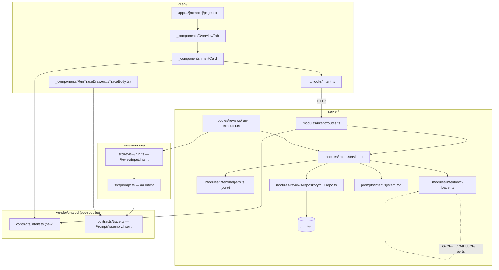

# Development Plan — L03 PR Intent Layer

## Context

A review today sees the diff, the repo map, the callers digest and the raw PR body. It never
sees *why* the PR exists. So a reviewer agent cannot tell a deliberate scope decision from an
omission, and cannot say "this file is outside what the PR set out to do" — the two most useful
judgements a human reviewer makes first.

**The scaffolding already exists and is unfed on both ends.** The `pr_intent` table, its
repository accessors (`pull.repo.ts:49`, `:64`), the `Intent` contract, the `PrIntentRecord` DTO
and a `review_intent` entry in `FEATURE_MODELS` all shipped in the starter with zero producers.
`run-executor.ts:39-41` and `run-logger.ts:16` both carry docblocks claiming the run "loads the
diff + intent once" — the intent half was never written. `reviewer-core`'s `INJECTION_GUARD`
already names "derived intent/scope" as untrusted data. This lesson's job is to **feed** that
plumbing, exactly as L02's conventions extractor fed the `conventions` table and the
`## Skills / rules` slot.

### Fixed decisions

| | |
|---|---|
| **Trigger** | Both — derived once as shared pre-work inside the review run, and via an explicit `POST /pulls/:id/intent`. Cached in `pr_intent`. |
| **Schema** | Extend the existing `pr_intent` table with one new migration. |
| **Link targets** | In-repo markdown only, read from the clone. **No external HTTP.** |
| **Model** | Reuse the existing `review_intent` entry in `FEATURE_MODELS`. No new setting, no default change. |
| **Trace visibility** | The `## Intent` block gets its **own row** in the run trace's Prompt assembly panel. |

## Overview

After this lands, a user opening a PR's **Overview** tab sees an **INTENT** card stating what the
PR is trying to do, what is in scope, what is explicitly out of scope, the evidence the statement
was built from, and a confidence level — with a **Derive intent** button that recomputes it on
demand. Every review run started from that PR carries a `## Intent` section in the prompt sent to
each agent, derived once as shared pre-work and reused across all agents in the run, and that
exact block is inspectable afterwards as its own row in the run trace's **Prompt assembly** panel.
When the PR body carries no real documentation, the intent is still produced — from title, branch,
commits and changed paths — and is marked **low** confidence rather than being absent.

## Requirements

- **R1** — `pr_intent` persists, for one PR: the intent narrative, in-scope and out-of-scope
  lists, a `confidence` of exactly `high|medium|low`, the ordered evidence `sources`, the
  `derived_from_sha` and `derived_at` used for staleness, and the model/provider/tokens/cost of
  the call that produced it. Verified by `server/test/intent.it.test.ts` asserting a row
  round-trips all of these through `POST /pulls/:id/intent` → `GET /pulls/:id/intent`.
- **R2** — `GET /pulls/:id/intent` returns `PrIntentDetail | null` and never derives;
  `POST /pulls/:id/intent` always derives and upserts. Both refuse a PR outside the caller's
  workspace with 404. Verified by three cases in `server/test/intent.it.test.ts`.
- **R3** — An intent is fresh iff `derived_from_sha === pull.head_sha` **and**
  `derived_at >= pull.updated_at`. A fresh cached intent is reused by the review run without an
  LLM call; a stale one is re-derived. Verified by unit cases over `isIntentFresh` (fresh / head
  moved / body rewritten at same head) plus one integration case asserting the mock LLM records
  zero `completeStructured` calls on the fresh path.
- **R4** — Confidence is computed in code from the evidence actually used, never read from model
  output. **The model-output schema contains no confidence field.** Verified by `computeConfidence`
  unit cases and by asserting `RawIntent`'s key set.
- **R5** — Scope entries naming a repository path not present in the PR's changed files are
  dropped before persistence; free-form prose entries are kept; lists are capped in code at
  `MAX_SCOPE_ITEMS`. Verified by `dropUngroundedScope` unit cases.
- **R6** — Document resolution reads **in-repo markdown only**. A candidate link carrying a URL
  scheme, escaping the repo root via `..`, absolute, not `.md`, or outside the allowed doc roots
  is rejected before any filesystem call. Verified by a table-driven unit test over
  `resolveRepoDocPath` covering each rejection class.
- **R7** — Intent derivation failure never fails the review run. The run proceeds, the `## Intent`
  section is omitted, `prompt_assembly.intent` is null, and the Live Log carries an `info` (not
  `error`) line. Verified by an integration case where the mock LLM's fixture is missing for
  `IntentDerivation`, asserting every queued run still reaches `status='done'`.
- **R8** — `assemblePrompt` emits `## Intent\n<untrusted source="intent">…</untrusted>` between
  `## PR description` and `## Skills / rules` when and only when `intent` is a non-empty string,
  and records it at `assembly.intent`. Verified by `reviewer-core/test/prompt.test.ts`.
- **R9** — The Prompt assembly panel renders a distinct **Intent** block when
  `prompt_assembly.intent` is present, and nothing extra when it is absent or when the key is
  missing entirely (an old trace). Verified by `TraceBody.test.tsx`.
- **R10** — The PR Overview tab renders an INTENT card with the narrative, in/out-of-scope lists,
  a confidence badge that is icon+text (never colour alone), a source list, and a stale marker;
  it renders an empty state with a working derive action when no intent exists. Verified by
  `IntentCard.test.tsx`.
- **R11** — The intent call's tokens and cost are recorded on the `pr_intent` row and are **not**
  added to any `agent_runs` row. Verified by an integration assertion that `agent_runs.tokens_in`
  equals the review call's tokens only.
- **R12** — A plan or spec reaches the derivation whether it is **linked** or **pasted inline**.
  A PR body (or linked-issue body) carrying the structure of this repo's own plan/spec templates is
  detected as such, is exempt from the ordinary prose cap, is recorded as its own `IntentSource`
  kind, and raises confidence to `high` on the same footing as a resolved in-repo doc. Verified by
  `detectInlinePlan` unit cases and by a `computeConfidence` case asserting an inline plan yields
  `high` while equally long ordinary prose yields `medium`.

## Affected modules & contracts

| Module | What changes |
|---|---|
| `server/` | New module `src/modules/intent/`; `pr_intent` widened by one migration; the reviews repository's existing intent accessors widened; `ReviewRunExecutor` gains a best-effort derive step; one prompt template; one registry entry. |
| `reviewer-core/` | `PromptParts` and `ReviewInput` gain an optional `intent`; `assemblePrompt` gains one section and one assembly field. No new I/O — purity intact. |
| `client/` | New `IntentCard` beside the PR-detail route, new `hooks/intent.ts`, new `messages/en/intent.json`, one key in `messages/en/runs.json`, one `PromptBlock` row + colour in the trace drawer. |
| `e2e/` | Untouched — see *Not planned*. |

**Contracts added** — new file, both vendored copies, additive only:

```ts
// contracts/intent.ts
IntentConfidence = z.enum(['high','medium','low'])
IntentSourceKind = z.enum(['pr_body','inline_plan','linked_issue','repo_doc','title','branch','commits','changed_paths'])
IntentSource     = z.object({ kind: IntentSourceKind, ref: z.string().nullish() })
PrIntentDetail   = PrIntentRecord.extend({
                     confidence, sources: z.array(IntentSource),
                     derived_from_sha: z.string(), derived_at: z.string(),
                     model: z.string().nullish(), provider: z.string().nullish(),
                     stale: z.boolean(),
                   })
```

Extends **`PrIntentRecord`** (`review-api.ts:60`), not `Intent`: it already carries `pr_id`, stays
structurally assignable to `Intent` so a future `PrBrief` composer can consume it, and feeds a
reserved-but-unfed scaffold instead of orphaning it. `Intent` (`brief.ts:9`) is load-bearing for
`PrBrief` at `:117` and is not touched.

**One contract edited in place, as a named exception:** `PromptAssembly` in `contracts/trace.ts`
gains `intent: z.string().nullish()`. See *Red-flags check*.

### How the vendored copies actually sync — verified

There is **no regeneration script.** Searched `scripts/` (only `dev.sh`, `e2e.sh`), all five
workflows, all four `package.json` script blocks, `.claude/`, `.git/hooks` (samples only, no
husky). `server/INSIGHTS.md:66` calls it "kept in sync by a regeneration step" — **that step does
not exist.** Budget the copy as manual work.

Only the client needs it. The two consumers resolve `@devdigest/shared` differently:

| Package | Alias target |
|---|---|
| `client/tsconfig.json:24`, `client/vitest.config.ts:10` | its **own** `src/vendor/shared` copy |
| `reviewer-core/tsconfig.json:22`, `reviewer-core/vitest.config.ts:9` | the **server's** copy |

So a contract landed on the server is visible to `reviewer-core` immediately — **T3/T4 depend
only on T2's server half.** Only Lane C/D wait on the client copy.

**`contracts/trace.ts` is already one of the drifted pairs.** `diff -rq` on `vendor/shared/`
reports 5 files (`adapters.ts`, `eval-ci.ts`, `knowledge.ts`, `productionize.ts`, `trace.ts`);
scoped to `contracts/` it reports 4 — which is why `client/AGENTS.md` says five and
`server/INSIGHTS.md` says four. Both are right, at different scopes. Copying `trace.ts` therefore
means **reconciling existing drift, not appending a field.** Do not clobber it.

Every server module may import `@devdigest/reviewer-core` with no config change: both required
aliases exist (`server/tsconfig.json:24`, `server/vitest.config.ts:8`), and `wrapUntrusted` is on
the public surface (`reviewer-core/src/index.ts:14-20`). `conventions/sampler.ts:2` already does
this import — precedent, not a new pattern.

## Architecture

### `server/` — onion placement

| Path | Layer | What it is |
|---|---|---|
| `modules/intent/routes.ts` | route | The two endpoints. Tenancy via `getContext`, params via `IdParams`. No Drizzle, no adapter calls. |
| `modules/intent/service.ts` | service | Resolve tenancy-checked PR → gather signals → resolve doc links → one `completeStructured` → verify-then-keep → compute confidence → upsert. Owns the derive-vs-reuse decision. |
| `modules/intent/doc-loader.ts` | service-adjacent I/O | Takes `Container`, reads docs via `container.git.readFile` and the linked issue via `container.github()`. Shaped like `conventions/sampler.ts`. |
| `modules/intent/helpers.ts` | pure | `RawIntent`, `resolveRepoDocPath`, `extractDocLinks`, `extractClosingIssueNumber`, `detectInlinePlan`, `buildIndirectSignals`, `dropUngroundedScope`, `computeConfidence`, `isIntentFresh`, `toIntentDetail`. Zero I/O — the tested surface. |
| `modules/intent/constants.ts` | pure | Schema name, timeouts, retries, caps, doc-root allowlist. |
| `prompts/intent.system.md` | asset | Stable instruction text, via `loadPromptTemplate`. |
| `modules/reviews/repository/pull.repo.ts` | repository | `upsertIntent`/`getIntent` widened; new `getIntentRow`. **Still the only SQL for `pr_intent`.** |
| `modules/reviews/run-executor.ts` | service | One best-effort derive step between the diff load and the per-agent loop. |
| `db/schema/reviews.ts` + `db/migrations/0013_*.sql` | schema | `prIntent` widened. |
| `modules/index.ts` | registry | One import + one entry. |

**No new repository for `pr_intent`.** The table is already declared owned by `ReviewRepository`
(`repository.ts:5-8`), handed out at `container.reviewRepo` (`container.ts:71-73`). A second class
on one table is exactly what the ownership rule prevents, and the executor already holds a
`ReviewRepository`. Feed the uncalled scaffolds rather than replace them — what L02 did.

**No transaction, no `Db | Tx`.** The whole write is one `INSERT … ON CONFLICT DO UPDATE` on one
row. Conventions needed `type Tx = Parameters<Parameters<Db['transaction']>[0]>[0]` because its
service replaces a whole row-set atomically; copying that here adds a type union with nothing to
protect. Widen it when a future task composes intent into a multi-table write — the INSIGHTS entry
records how.

**The executor may construct `IntentService`.** `ConventionsService` already news up
`SkillsService` (`conventions/service.ts:148`); a service calling a service is an inward arrow.
Inlining the derive would put prompt assembly, doc reading and model resolution in an
orchestration class, and make the manual endpoint a second copy of it.

**Tokens and cost go on the `pr_intent` row and nowhere else.** `agent_runs` is per-run and is the
sole source of the UI's `$0.014 8.2K→1.3K` badge. One shared pre-work call has no correct per-run
share: adding it to each row multiplies spend by *N*; adding it only to the first makes two
identical agents show different costs. There is no `agent_runs` row meaning "pre-work", and
inventing one would surface as a phantom run in the PR's history. The Live Log carries a visible
line (`intent: derived via openai/gpt-4.1 — 1.2K→180 tok, $0.0009`) persisted into every target
run's trace. **Consequence, stated honestly:** total spend is
`sum(agent_runs.cost_usd) + pr_intent.cost_usd`, and no screen sums that today — see *Not planned*.

### The `pr_intent` migration

Columns added to the existing empty table. Every default is non-volatile, so no table rewrite.

| Column | Type | Null | Default | Why |
|---|---|---|---|---|
| `confidence` | `text` + `CHECK (confidence IN ('high','medium','low'))` | NOT NULL | `'low'` | Business-logic-driven and expected to evolve → `TEXT` + `CHECK`, not a PG `ENUM` (which needs a migration to add a value and cannot drop one). **Drizzle's `text(…, { enum })` is types-only and emits no CHECK** — append it by hand to the generated SQL. |
| `sources` | `jsonb` `$type<IntentSource[]>()` | NOT NULL | `'[]'::jsonb` | Read whole with the row, never queried by element → no child table and **no GIN index**; a GIN index with no containment query is pure write cost. Mirrors `in_scope`/`out_of_scope`. |
| `derived_from_sha` | `text` | NOT NULL | — | Half of staleness. Every writer knows `pull.head_sha` (itself NOT NULL); the table is empty, so NOT NULL is safe and removes a null branch from `isIntentFresh`. |
| `derived_at` | `timestamptz` | NOT NULL | `now()` | The other half. `timestamptz`, never `timestamp`. |
| `provider` / `model` | `text` | NULL | — | Which provider/model produced it. |
| `tokens_in` / `tokens_out` | `integer` | NULL | — | Null = not recorded, distinct from 0. |
| `cost_usd` | `double precision` | NULL | — | **Deliberate deviation** from "money is NUMERIC": mirrors `agent_runs.cost_usd` (`runs.ts:32`), and these are sub-cent price estimates, not ledger money. Consistency with the column the UI already formats beats exactness. NULL ⇒ unpriced model ⇒ UI shows `—`, never `$0.00`. |

**No indexes.** Every access path is `WHERE pr_id = $1`, and `pr_id` is the PK — already a B-tree,
which also satisfies the FK-needs-an-index rule. Write that into the migration comment so nobody
adds a decorative one.

**`workspace_id` deliberately still absent.** `server/AGENTS.md` requires it on every *domain*
table. `pr_intent` is not one — it is a **satellite** keyed 1:1 on `pull_requests.id` by a PK that
is also a cascading FK, exactly like `findings`, `pr_files`, `pr_commits` and `pr_brief`. It is
unreachable except through a parent that already carries `workspace_id`, and a duplicated column
is a denormalization no constraint can keep in sync — it would drift silently while giving a false
sense of a DB-enforced boundary. **The boundary is enforced one layer up, and that is where it must
be reviewable:** every entry point resolves `workspaceId` via `getContext`, then loads the parent
through the already-scoped `getPull(workspaceId, prId)` (`pull.repo.ts:10-19`), throwing
`NotFoundError` before any `pr_intent` statement runs. This reasoning goes in the repository
docblock beside the intent methods and in the migration header — where the next person will look.

### `reviewer-core`

- `src/prompt.ts` — `PromptParts.intent?: string`; a section emitted **between** `## PR description`
  and `## Skills / rules` as `## Intent\n${wrapUntrusted('intent', parts.intent)}`;
  `assembly.intent = parts.intent ?? null`; truncated at a new `MAX_INTENT_SECTION_CHARS = 2000`
  beside `MAX_PR_DESCRIPTION_CHARS`. `## Diff to review` stays last.
  - Placement: the intent is a *claim about* the PR statement, so it sits adjacent to it, before
    the rules the model applies and well before the diff. The trusted instructions must come after
    the untrusted author-derived text.
  - **No new guard text.** `INJECTION_GUARD` already names "derived intent/scope" (`:18`) and
    already bounds its authority (`:26-28`). Adding anything is the keyword denylist the invariant
    forbids.
- `src/review/run.ts` — `ReviewInput.intent?: string`, copied into `promptParts` at `:130-139`.
- Purity unaffected: one optional string in, one optional string out.

### `client/`

| Path | Placement rule |
|---|---|
| `.../pulls/[number]/_components/IntentCard/{IntentCard.tsx,styles.ts,index.ts,IntentCard.test.tsx}` | One consumer → colocated beside its route, not promoted to `src/components/`. |
| `src/lib/hooks/intent.ts` | Server state is React Query over `api.ts`, grouped by domain — never a `fetch` in a component. Re-exported by name from `hooks/index.ts`. |
| `src/lib/types.ts` | New contract types re-exported here, never hand-written. |
| `messages/en/intent.json` | **New namespace.** `brief.json`'s `block.intent`/`unavailable*` are scoped to the future PR-Brief composite; borrowing them couples two unrelated surfaces to one string set. |
| `messages/en/runs.json` | `trace.prompt.intent` — the drawer's entire namespace is `runs`. |
| `.../RunTraceDrawer/constants.ts` | `PROMPT_COLORS.intent = "var(--info)"` — `--info`/`--info-bg` exist in `vendor/ui/styles.css` and are unused by the other six slots. |
| `.../RunTraceDrawer/_components/TraceBody/TraceBody.tsx` | One conditional `PromptBlock`, **before** the `skills` row so panel order matches assembly order. |

**Confidence renders as `<Badge dot>`, not `ConfidenceNum`.** `ConfidenceNum.tsx:3` takes
`value: number` and formats `0..1` as `NN% conf`; an enum through it would be a fabricated number.
Nor `CategoryTag`, which renders nothing for a string outside the findings taxonomy
(`client/INSIGHTS.md`, 2026-09-01). Icon+text, never colour alone.

**React shape.** `IntentCard` is a container: `useIntent(prId)` + `useDeriveIntent(prId)`, early
returns for loading / error / empty, small presentational body. `stale` comes off the response —
derived, never stored. **No `useEffect` anywhere** (StrictMode double-invocation already bit this
codebase). The mutation's `onSuccess` does `qc.setQueryData(["intent", prId], data)`, the shape
`useExtractConventions` uses.



## Phased tasks

### Phase 1 — Contracts and the engine slot

**T1 · `contracts/intent.ts` in both vendored copies + both barrels.** Lane A · `core`
Owns `server/src/vendor/shared/contracts/intent.ts`, `server/src/vendor/shared/index.ts`,
`client/src/vendor/shared/contracts/intent.ts`, `client/src/vendor/shared/index.ts`. Depends: —
Type rationale: a vendored contract is pure zod with zero I/O and no onion layer; `core`'s rules
govern it, `backend`'s Fastify/onion rules do not exist in this file.
Notes: `PrIntentRecord.extend({…})`, **not** `Intent.extend`. `stale` is wire-only, never a column.
Grep `IntentConfidence`, `IntentSource`, `PrIntentDetail` across `contracts/*.ts` in both copies
before naming — `export *` collisions are silent. **The copy is manual**; the two files must be
byte-identical.
Risk: writing only the server side typechecks there and fails in `client/` much later.
Acceptance → R1, R2: both `pnpm typecheck`s pass and
`diff server/src/vendor/shared/contracts/intent.ts client/src/vendor/shared/contracts/intent.ts`
is empty.

**T2 · `PromptAssembly.intent: z.string().nullish()` in both `contracts/trace.ts`.** Lane A · `core`
Depends: —
Notes: `.nullish()`, never `.nullable()` — `run_traces` stores one jsonb doc and old rows are never
migrated. Consequently **no edit at `platform/trace-builder.ts:61` or `run-executor.ts:450`**: both
already omit `callers`/`repo_map`/`pr_description` and parse only because those are nullish; adding
`intent` there is out of scope and must not be done. **`trace.ts` is already drifted between the two
copies** — reconcile, do not clobber.
Acceptance → R8, R9: `pnpm exec vitest run test/contracts.test.ts` passes, including a new case
where a persisted trace document with no `intent` key still parses.

**T3 · `PromptParts.intent` + the `## Intent` section + `assembly.intent`.** Lane A · `core`
Owns `reviewer-core/src/prompt.ts`. Depends: T2 (**server half only** — `reviewer-core` aliases to
the server's copy).
Risk: inserting the section after `## Diff to review`, or before the task line, changes the reading
order for every existing agent.
Acceptance → R8: `cd reviewer-core && npm test` — present with the untrusted wrapper, absent when
omitted, `## Diff to review` still final.

**T4 · `ReviewInput.intent` threaded into `promptParts`.** Lane A · `core`
Owns `reviewer-core/src/review/run.ts`. Depends: T3
Risk: `promptParts` is built once at `:130-139` and reused for the whole-diff assembly *and* each
map-reduce chunk; omitting the field there makes intent vanish on the map-reduce path only.
Acceptance → R8: a `run.test.ts` case in map-reduce mode asserts `outcome.assembly.intent`.

### Phase 2 — Server

**T5 · Widen `prIntent`, generate the migration.** Lane B · `backend`
Owns `db/schema/reviews.ts`, `db/migrations/0013_*.sql`, `db/migrations/meta/**`. Depends: T1
Notes: `pnpm db:generate` (next tag `0013`), then **hand-append** the `CHECK` — drizzle's
`text(…, {enum})` is types-only. Touch no existing migration.
Risk: the hand-added CHECK is invisible to drizzle-kit's snapshot. Benign (it emits no drop for a
constraint it has no record of) but must be stated in the migration header.
Acceptance → R1: `pnpm db:migrate` applies cleanly to a fresh DB; `pnpm typecheck` passes with all
nine new fields on `$inferSelect`.

**T6 · Pure helpers + constants.** Lane B · `backend`. Depends: T1
- `RawIntent` — module-internal, never a shared contract (mirrors `RawConventionCandidates`). A
  **flat** object of exactly `intent`, `in_scope`, `out_of_scope`; every property required; no
  `.optional()`, `.nullish()`, unions or nesting; **no array length bounds** — caps in code.
  Dictated by OpenAI strict output (`additionalProperties:false` + everything `required`, requested
  unconditionally at `adapters/llm/openai.ts:105`) and by OpenRouter, where an unsupported provider
  **errors** rather than degrading.
- `detectInlinePlan(text)` — **the inline case (R12).** A plan or spec reaches a reviewer two ways:
  linked, or pasted whole into the PR body. Linking is covered by `extractDocLinks` +
  `resolveRepoDocPath`; this covers the paste. Returns `{ kind: 'plan' | 'spec' | null; headings: string[] }`
  by counting **distinct** ATX headings from this repo's own two templates:
  - spec — `Goal`, `Scope`, `Out of scope`, `Design`, `Files touched`, `Verification`
    (`specs/README.md:15-36`)
  - plan — `Requirements`, `Architecture`, `Phased tasks`, `Lanes`, `Testing`, `Dependency`
    (`docs/plans/README.md`'s "What a plan must contain")

  Threshold **≥ 3 distinct headings** from one set, case-insensitive, matched on the heading text
  only. Three is chosen because two is reachable by an ordinary well-written description (`Goal`
  plus `Scope` is a common PR-template pair) while three is not; the threshold is a named constant
  so the test pins it rather than the prose. Run over the PR body **and** each linked-issue body —
  a plan pasted into the ticket instead of the PR is the same case.
- `computeConfidence(sources)` — `high` when a resolved in-repo doc was read, **or an inline plan/spec
  was detected**, or a linked issue matched by a **closing keyword**; `medium` when the body has
  ≥ `MIN_BODY_PROSE_CHARS` of prose after stripping HTML comments, checkbox lines and rules, but
  none of those; `low` otherwise. An inline plan sits on the same footing as a linked one: the
  evidence is equally present and equally readable, and the author should not be penalised for
  pasting rather than linking.
- `dropUngroundedScope(items, changedPaths)` — an entry that looks like a path is kept only if it
  prefix-matches a changed file; prose passes through. The L02 verify-then-keep gate in the only
  form with a ground truth here.
- `extractClosingIssueNumber(body)` — **a new, stricter extractor.** `octokit.ts:126-134` uses
  `/(?:closes|fixes|resolves)?\s*#(\d+)/i`, whose keyword group is *optional*, so "see #4321 for
  context" resolves #4321 as *the* linked issue — grounding an intent on that at `high` confidence
  is exactly the failure this feature must not have. Require a documented closing keyword
  (`close|closes|closed|fix|fixes|fixed|resolve|resolves|resolved`) immediately before `#N` or
  `owner/repo#N`. `GH-123` and bare URLs are undocumented and unmatched. **Leave the adapter alone**
  — it feeds `PrDetail.linked_issue`.
- `resolveRepoDocPath(raw)` — the security gate; see *Risks*.
- `isIntentFresh(row, pull)` — `row.derivedFromSha === pull.headSha && row.derivedAt >= (pull.updatedAt ?? row.derivedAt)`.
  Both halves required: the author can rewrite the description without moving the head. `updatedAt`
  is nullable (`pulls.ts:28`) and a null must not invalidate a fresh row.
- `constants.ts`: `INTENT_DERIVATION_SCHEMA_NAME = 'IntentDerivation'` (**must** match the
  `MockLLMProvider.structuredBySchema` key — `mocks.ts:91`), `DERIVE_TIMEOUT_MS = 45_000`,
  `DERIVE_RETRIES = 2`, `MAX_SCOPE_ITEMS = 8`, `MAX_SCOPE_ITEM_CHARS = 160`, `MAX_INTENT_CHARS = 600`,
  `MAX_DOCS = 3`, `MAX_DOC_BYTES = 20_000`, `MIN_BODY_PROSE_CHARS = 120`,
  `INLINE_PLAN_MIN_HEADINGS = 3`, `MAX_INLINE_PLAN_CHARS = 20_000`,
  `DOC_ROOTS = ['docs/','specs/','doc/','adr/','rfcs/']`.

  **Two body caps, not one.** Ordinary prose is capped at `MAX_BODY_CHARS = 4_000` (matching
  `reviewer-core`'s `MAX_PR_DESCRIPTION_CHARS`); a body `detectInlinePlan` recognises is capped at
  `MAX_INLINE_PLAN_CHARS` instead, on the same scale as `MAX_DOC_BYTES`. A single 4 000-char cap
  would truncate a pasted plan mid-document — the derivation would read the Goal and lose the
  Design and Out-of-scope sections, which are exactly the parts that make an intent authoritative
  about what is *not* in scope. Whichever cap applies, the block is still `wrapUntrusted`-wrapped;
  a longer allowance is not more trust.
Risk: reusing the adapter regex, or letting a model-reported confidence into the contract — both
produce authoritative-looking intents that are not grounded.
Acceptance → R3, R4, R5, R6, R12: `pnpm exec vitest run test/intent-helpers.test.ts test/intent-docs.test.ts`.

**T7 · Evidence gathering through the ports.** Lane B · `backend`
Owns `modules/intent/doc-loader.ts`. Depends: T6
Notes: takes `Container`, like `conventions/sampler.ts`. At most `MAX_DOCS` files via
`container.git.readFile`, **each in its own try/catch** — the real `SimpleGitClient.readFile`
rejects with ENOENT while `MockGitClient.readFile` returns `''`, so both paths must be handled.
Linked issue via `container.github()` guarded by try/catch (no token / offline is normal;
`pulls/routes.ts:34-38` sets the precedent). **No `fetch`, no URL.**
Risk: one unguarded `readFile` turns "the doc isn't in the clone" into a failed review run.
Acceptance → R6: a case where the injected `GitClient` **throws** for one of three candidates and
the loader still returns the other two.

**T8 · Widen the `pr_intent` accessors.** Lane B · `backend`
Owns `modules/reviews/repository/pull.repo.ts`, `modules/reviews/repository.ts`. Depends: T5, T1
Notes: grow `upsertIntent`'s `values` **and** its `onConflictDoUpdate.set`; add `getIntentRow`
returning the raw row (existing `getIntent` keeps returning the narrow `Intent` — what a future
`PrBrief` composer wants). Constructor stays `Db`. Put the tenancy reasoning in the docblock above
these methods.
Risk: a column missing from the `set` clause makes a re-derive update the narrative but keep a stale
sha — which then reads as fresh forever.
Acceptance → R1, R3: a second `POST` on a moved head overwrites `derived_from_sha`.

**T9 · `prompts/intent.system.md`.** Lane B · `backend`. Depends: —
Instruction text only, no interpolation. Must tell the model to answer only from the supplied
`<untrusted>` blocks, to put an unsupportable scope item in `out_of_scope` rather than invent one,
and to emit nothing but the three fields. **Must not ask for a confidence.**
Acceptance → R4: the derive path loads the template without throwing.

**T10 · The service.** Lane B · `backend`. Depends: T6, T7, T8, T9, T1
1. `getPull(workspaceId, prId)` → `NotFoundError` if absent. **This is the tenancy gate.**
2. `read(workspaceId, prId)` → `toIntentDetail(row, pull) | null`. No LLM.
3. `derive(workspaceId, prId, { force })` → reuse when `!force && isIntentFresh`; else gather →
   `resolveFeatureModel(container, workspaceId, 'review_intent')` → `container.llm(provider)` →
   `loadPromptTemplate('intent.system.md')` →
   `withRetry(() => withTimeout(llm.completeStructured({ schemaName: INTENT_DERIVATION_SCHEMA_NAME, schema: RawIntent, model, messages }), DERIVE_TIMEOUT_MS), { retries: DERIVE_RETRIES })`
   → `dropUngroundedScope` + caps → `computeConfidence(sources)` → `upsertIntent` with
   tokens/cost/model/provider from the `StructuredResult`.
4. `deriveForRun(...)` → the executor's entry point; returns `{ intent, detail } | null` and
   **never throws**.
Each untrusted source is wrapped with `wrapUntrusted` imported from `@devdigest/reviewer-core`, not
re-implemented. **No new `FEATURE_MODELS` entry, no settings field, no default change.**
Risk: `resolveFeatureModel(…, 'review_intent')` has zero callers today, so `openai`/`gpt-4.1` is an
untested default; a workspace with no OpenAI key throws at `container.llm(provider)` — which must
land in the best-effort catch, not `failAll`.
Acceptance → R1–R5: cache hit, forced re-derive, cross-workspace 404.

**T11 · Routes and registration.** Lane B · `backend`
Owns `modules/intent/routes.ts`, `modules/index.ts`. Depends: T10
`GET /pulls/:id/intent` returns `PrIntentDetail.nullable()` — a null body, **not a 404**, so the
card's empty state needs no error branch. `POST` always forces. Both `schema: { params: IdParams }`,
both `await getContext(...)`. **Synchronous, not a job** — same recorded rationale as
`conventions/routes.ts:33-38`: `JobRunner` has a hard 120s cap and there is no `GET /jobs/:id`;
`DERIVE_TIMEOUT_MS` sits well under it. `POST` carries
`config: { rateLimit: { max: 10, timeWindow: '1 minute' } }`, matching `POST /pulls/:id/review`.
Acceptance → R2: `test/routes-smoke.test.ts` sees both routes registered.

**T12 · Executor wiring.** Lane B · `backend`
Owns `modules/reviews/run-executor.ts`. Depends: T10, T4
Inserted immediately after the `Diff ready — …` line at `:104`, before the `for (const { agent, runId } of jobs)`
loop, so it runs once on the fanned-out `RunLogger`:

```ts
let intent: string | undefined;
try {
  runLog.info('intent: deriving…');
  const derived = await new IntentService(this.container).deriveForRun(workspaceId, pull, repo);
  if (derived) {
    intent = derived.intent;
    runLog.info(`intent: ${derived.detail.confidence} confidence — …tokens/cost…`);
  }
} catch (err) {
  runLog.info(`intent: derivation failed — continuing without the Intent section (${(err as Error).message})`);
}
```

then `...(intent ? { intent } : {})` in the `reviewPullRequest({…})` call at `:200-225`.
**Do not use `runLog.step`** — it re-throws *and* emits an `error` event (`run-logger.ts:88`),
painting the Live Log red on a benign degradation. Emit by hand; log the catch as `info`, matching
`runLog.info('callers digest: repoIntel failed — …')` at `:357`.
**Do not call `failAll`** (`:75-94`) — that exists for pre-work without which no review is possible.
Both docblocks at `:39-41` and `:52-53` become true here and need no edit.
Acceptance → R7, R11: with no `IntentDerivation` fixture, every queued run still reaches
`status='done'`, and its `agent_runs.tokens_in` equals the review call's tokens alone.

**T13 · Server tests.** Lane B · `backend`. Depends: T11, T12
Risk: naming the DB-backed file anything but `*.it.test.ts` silently breaks the unit/integration
split and it runs in the hermetic job without Docker.
Acceptance → R1–R7, R11: hermetic suite green, `.it.test` suite green with Docker.

### Phase 3 — Client (two parallel lanes)

**T14 · Hook + type re-exports.** Lane C · `ui`. Depends: T1
`useIntent(prId)` → `api.get<PrIntentDetail | null>`, `enabled: !!prId`; `useDeriveIntent(prId)` →
`api.post`, `onSuccess` → `qc.setQueryData(["intent", prId], data)`. All HTTP through `@/lib/api`.
Risk: a hand-written response interface drifts silently from the server contract.

**T15 · The card.** Lane C · `ui`. Depends: T14
`"use client"`; strings via `useTranslations("intent")`; `styles.ts` exporting `s`; confidence via
`<Badge dot>` (`--ok`/`--warn`/`--text-muted` + matching `-bg`); stale marker; a **Derive intent**
button with `aria-label`, disabled while pending; empty state on a `null` response. Under 200 lines
— if it grows, split out a sibling presentational component, not a `renderX()` helper.
Risk: reaching for `ConfidenceNum` (demands a float) or `CategoryTag` (renders nothing off-taxonomy).

**T16 · Mount on the Overview tab.** Lane C · `ui`. Depends: T15
`OverviewTab` takes `prId: string | null` alongside `prBody`; `page.tsx` passes the already-resolved
`prId`. The card renders **above** Description — the intent is the summary, the body is the raw
source. `page.tsx` stays a composer.

**T17 · The Intent block in the Prompt assembly panel.** Lane D · `ui`. Depends: T2
`PROMPT_COLORS.intent = "var(--info)"`; a `{trace.prompt_assembly.intent != null && <PromptBlock … />}`
row **before** the `skills` row so panel order matches assembly order;
`trace.prompt.intent = "Intent (derived, dynamic)"` in `runs.json`. `pr_description` is missing from
this panel today — **leave it missing**; adding it is a separate change.
Risk: an old trace has no `intent` key at all (not null). `!= null` covers both; a truthiness check
would also swallow a real "derived to empty" case.
Acceptance → R9: three cases — present, explicit null, key absent.

### Dependency graph

```
T1 ─┬─→ T5 ─→ T8 ─┐
    ├─→ T6 ─→ T7 ─┼─→ T10 ─→ T11 ─→ T13
    └─→ T14 ─→ T15 ─→ T16          ↑
T9 ───────────────┘                 │
T2 ─┬─→ T3 ─→ T4 ─→ T12 ────────────┘
    └─→ T17
```

### Lanes

| Lane | Type | Tasks | Owns |
|---|---|---|---|
| **A** | `core` | T1–T4 | both `contracts/intent.ts`, both `contracts/trace.ts`, both `vendor/shared/index.ts`, `reviewer-core/src/prompt.ts`, `reviewer-core/src/review/run.ts`, `reviewer-core/test/**` |
| **B** | `backend` | T5–T13 | `server/src/modules/intent/**`, `modules/index.ts`, `modules/reviews/repository.ts`, `modules/reviews/repository/pull.repo.ts`, `modules/reviews/run-executor.ts`, `db/schema/reviews.ts`, `db/migrations/**`, `prompts/intent.system.md`, `server/test/intent-*.test.ts`, `server/test/intent.it.test.ts` |
| **C** | `ui` | T14–T16 | `lib/hooks/intent.ts`, `lib/hooks/index.ts`, `lib/types.ts`, `_components/IntentCard/**`, `_components/OverviewTab/**`, `pulls/[number]/page.tsx`, `messages/en/intent.json` |
| **D** | `ui` | T17 | `RunTraceDrawer/constants.ts`, `RunTraceDrawer/_components/TraceBody/**`, `messages/en/runs.json` |

Four lanes by shape: the contract and engine slot must exist before anything consumes it and spans
three packages (A); the server feature is the bulk and is internally sequential (B); the two client
surfaces touch disjoint files and different message namespaces, so they parallelize cleanly (C, D).
Every shared file (`page.tsx`, `hooks/index.ts`, `modules/index.ts`, `contracts/trace.ts`) is
assigned to exactly one lane.

## Testing

| What | Command |
|---|---|
| server typecheck | `cd server && pnpm typecheck` |
| server unit (hermetic) | `cd server && pnpm exec vitest run --exclude '**/*.it.test.ts'` |
| server integration (Docker) | `cd server && pnpm exec vitest run .it.test` |
| migration | `cd server && pnpm db:generate` · `pnpm db:migrate` |
| reviewer-core | `cd reviewer-core && npm run typecheck && npm test` |
| client | `cd client && pnpm typecheck && pnpm test` |

`server/package.json` is `skip-worktree`, so server tests go through `pnpm exec vitest run …`
directly rather than a `test:*` script — matching CI.

### One case per behaviour that would catch a real regression

**`server/test/intent-helpers.test.ts`**

| Case | Regression it catches |
|---|---|
| `isIntentFresh`: same sha, `updatedAt` newer than `derivedAt` → **stale** | The author rewrites the description without pushing; a sha-only check serves a stale intent forever. |
| `isIntentFresh`: `updatedAt` is `null` → **fresh** | The nullable column making every seeded/imported PR permanently stale and re-deriving on every run. |
| `computeConfidence`: doc → `high`; **inline plan → `high`**; prose body only → `medium`; title+branch only → `low` | The "no real documentation ⇒ lower confidence" requirement collapsing to a constant, and a pasted plan being scored as if it were ordinary prose. |
| `detectInlinePlan`: a body with `## Goal`, `## Scope`, `## Out of scope` → `'spec'`; a body with only `## Goal` and `## Scope` → `null`; 6 000 chars of ordinary prose with no template headings → `null` | The threshold drifting to 2 (which an ordinary PR template reaches) or to a length heuristic, either of which turns every verbose description into a false `high`. |
| A body `detectInlinePlan` recognises is passed to the model **untruncated at 4 000 chars** | The single-cap bug: a pasted plan losing its Design and Out-of-scope sections, which are the parts that make the intent authoritative about what is *not* in scope. |
| `RawIntent` key set is exactly `{intent, in_scope, out_of_scope}` | A `confidence` field creeping back in and becoming an unverified self-report. |
| `dropUngroundedScope`: `"src/never-touched.ts"` vs changed `["src/a.ts"]` → dropped; `"error handling in the API layer"` → kept | A hallucinated file path persisted as scope and shown as fact on the card. |
| `extractClosingIssueNumber("see #4321 for context")` → `null`; `"Fixes #12"` → `12`; `"resolves owner/repo#7"` → `7` | The adapter's optional-keyword regex being reused, grounding intent on an unrelated issue at `high`. |

**`server/test/intent-docs.test.ts`**

| Case | Regression it catches |
|---|---|
| `resolveRepoDocPath` rejects, one case each: `https://…`, `../../etc/passwd`, `/etc/passwd`, `docs/x.txt`, `src/index.ts`, a `..` segment surviving normalization | Any one being the hole; one combined assertion would pass with five of six checks removed. |
| Accepts `docs/plans/02-x.md`, `./specs/y.md`, `README.md#anchor` → `README.md` | Over-tightening until no doc resolves and every intent is `low`. |
| Injected `GitClient` **throws** for one of three candidates | `MockGitClient`'s empty-string behaviour meaning the try/catch is never exercised; in production one missing doc kills the derive. |
| `MAX_DOCS` honoured with six candidate links | An unbounded body of links turning one derive into dozens of reads. |

**`server/test/intent.it.test.ts`** (Docker; the suffix is load-bearing)

| Case | Regression it catches |
|---|---|
| `POST` then `GET` round-trips all nine new columns | A column missing from `onConflictDoUpdate.set`, so a re-derive writes a half-updated row. |
| `GET` for a PR in another workspace → 404, no `pr_intent` read | The missing `workspace_id` becoming an actual cross-tenant leak because a caller skipped `getPull`. |
| Review run with a fresh cached intent → **zero** `completeStructured` calls with `schemaName: 'IntentDerivation'` | The cache being written but never consulted, paying for a derive on every run. |
| Review run with **no** `IntentDerivation` fixture → every run ends `status='done'`, `prompt_assembly.intent` null, no `error` line for intent | The best-effort invariant broken by `runLog.step` or a catch reaching `failAll`. |
| Review run with a fixture → `agent_runs.tokens_in` equals the review call's tokens; `pr_intent.tokens_in` non-null | Intent tokens folded into the per-run badge, inflating it by the number of agents. |

**`reviewer-core/test/{prompt,run}.test.ts`**

| Case | Regression it catches |
|---|---|
| `## Intent` present, `<untrusted source="intent">`-wrapped, after `## PR description`, before `## Skills / rules`, `## Diff to review` still last | The section landing after the diff, or unwrapped — the second a direct prompt-injection regression. |
| `intent` omitted → no `## Intent` heading, `assembly.intent === null` | An empty section header appearing in every pre-existing agent's prompt. |
| map-reduce path → `outcome.assembly.intent` is the supplied string | Intent dropping on the large-diff path only — the path that most needs it. |

**Client**

| File | Case | Regression it catches |
|---|---|---|
| `IntentCard.test.tsx` | `null` response → empty state, enabled button, one mutation call on click | The card showing an error for the normal "not derived yet" state. |
| `IntentCard.test.tsx` | `confidence: 'low'` renders a badge whose **text** says low | A colour-only signal, invisible to a screen reader and to a colour-blind user. |
| `IntentCard.test.tsx` | `stale: true` renders the marker; `false` does not | Staleness computed server-side then never shown. |
| `TraceBody.test.tsx` | `intent` present → block; `null` → none; key absent → none, no crash | An old trace document throwing in the drawer — the exact class the `.nullish()` rule exists for. |

`vi.mock` relative paths must be **computed** with `path.relative`, never counted by eye — these
components sit six levels under `src/app` and an undercount fails silently
(`client/INSIGHTS.md`, 2026-09-01).

## Risks

| Risk | Mitigation |
|---|---|
| **Path traversal via a PR-body link.** The body is fully attacker-controlled and its links drive filesystem reads. | `resolveRepoDocPath` rejects, in order: any URL scheme; NUL bytes; absolute paths; anything whose `path.posix.normalize` result starts with `..` or contains a `..` segment; any extension but `.md`; any first segment outside `DOC_ROOTS` unless it is a root-level `*.md`. Table-driven test per rejection class. |
| **Unmitigated, stated rather than solved: symlink escape.** `SimpleGitClient.readFile` (`adapters/git/simple-git.ts:129`) is a bare `readFile(join(clonePath, path))` with **no containment check**. A symlink committed into the reviewed repo — `docs/plans/x.md → /etc/passwd` — passes every string-level guard and reads a host file into a prompt. | Out of scope. The fix is an `fs.realpath` containment check **inside the port**, affecting every reader (repo-intel, conventions, this module), with its own test matrix and mock update. Listed in *Not planned* so it is not mistaken for an oversight. |
| **Prompt injection through the derived intent.** It is model output derived from attacker text, fed back into the reviewing model. | `wrapUntrusted('intent', …)` in `assemblePrompt`, plus `INJECTION_GUARD`, which already names "derived intent/scope" and already forbids it from descoping the review. Each source fed *into* the derive is likewise wrapped. Two wraps. No new guard rule — the invariant forbids a denylist. |
| **Tenancy with no `workspace_id` on the table.** | Every entry point goes through `getPull(workspaceId, prId)` first; the repository docblock states this as a precondition; the integration test asserts the cross-workspace 404. |
| **Strict structured output erroring rather than degrading.** OpenRouter's enforcement varies by provider and an unsupported combination *errors*; OpenAI requires `additionalProperties:false` with everything `required`. | `RawIntent` is flat, three required fields, no optionals/unions/nesting, no array-length bounds — caps in code. Any provider error lands in the best-effort catch and degrades to no-intent, not to failure. |
| **`review_intent`'s default has never run.** Zero callers today, so `openai`/`gpt-4.1` is untested and a workspace with no OpenAI key throws at `container.llm(provider)`. | The throw is inside the best-effort catch on the run path, and surfaces as a normal error with the provider's message on the manual endpoint. No default changed. |
| **Stale intent misleads a review** — a *wrong* intent is worse than none. | Both halves of `isIntentFresh`, plus `stale` on the wire and a marker on the card. *Residual:* the plan file changing on the base branch at the same head sha — unmitigated, low impact. |
| **Weak ticket resolution.** REST exposes no closing-issue field; GraphQL `closingIssuesReferences` is the only reliable source and we use neither. A PR linked via GitHub's Development sidebar yields no issue; cross-repo is skipped; offline never resolves. | The consequence is always identical and safe: the source is absent → `computeConfidence` cannot return `high` from it → the card reads medium/low and its source list names what is missing. **The failure is always under-confidence, never over-confidence.** |
| **The hand-added CHECK is invisible to drizzle-kit.** | Documented in the migration header. Drizzle-kit emits no drop for a constraint absent from its snapshot; the risk is surprise, which the header addresses. |
| **`model-router.ts` looks like the thing to use** — it has `routeModel(task: …\|'intent'\|…)`, zero callers, and a `Provider` union missing `'openrouter'`. | **Ruled on: do not use it, do not delete it.** Using it routes around `resolveFeatureModel` and silently ignores the workspace's configured model; its union would reject the `openrouter` default `FEATURE_MODELS` already uses elsewhere. Deleting it contradicts the root instruction not to remove unfed scaffolds. No task owns that file. |
| **Client contract drift.** Both new/edited contracts must land in both copies in the same commit, **by hand** — no script does it. `trace.ts` is already drifted. | T1 and T2 own both copies; T1's acceptance is a `diff` returning empty. |

## Red-flags check

- Every task has a Type and Owned paths — **pass** (T1–T17).
- Type matches owned paths — **pass**, with one stated interpretation: T1/T2 own vendored contract
  files and are `core`, because those are pure zod with no I/O and no onion layer.
- No two lanes own the same path — **pass**. `messages/en/intent.json` is C only,
  `messages/en/runs.json` is D only; `page.tsx` and `hooks/index.ts` are C only; `modules/index.ts`
  is B only; `contracts/trace.ts` is A only.
- The dependency graph is acyclic — **pass**.
- Every requirement has an acceptance referencing it — **pass**: R1 (T1, T5, T8, T10, T13),
  R2 (T1, T10, T11), R3 (T6, T8, T10), R4 (T6, T9, T10), R5 (T6, T10), R6 (T6, T7), R7 (T12),
  R8 (T2, T3, T4), R9 (T2, T17), R10 (T14, T15, T16), R11 (T12), R12 (T6).
- Every verification command is real for its module — **pass**.
- No task owns a lockfile, root config, merged migration, or anything under `server/clones/` —
  **pass**. T5 owns only the new `0013_*.sql` and the regenerated `meta/` snapshot.
- No task owns an existing contract under `src/vendor/shared/` — **fails on exactly one file,
  deliberately.** T2 adds one field to `PromptAssembly` in `contracts/trace.ts`, which
  `server/AGENTS.md`'s *Never* list forbids ("add new files instead"). Surfaced rather than passed
  over, with why the crossing is right:
  1. The trace-visibility decision is fixed by the user, and the panel reads
     `trace.prompt_assembly.<slot>` **by name** (`TraceBody.tsx:74-91`) — a named row requires a
     named field.
  2. **There is no extension point.** `PromptAssembly` is one flat object inside one `run_traces`
     jsonb document. A sibling contract cannot add a key to it; a parallel field elsewhere in
     `RunTrace` would put the same data in two places.
  3. **The precedent is in-tree** — `repo_map` and `pr_description` were added to this same object
     the same way.
  4. **Blast radius is one nullish key.** Nothing is renamed, narrowed or removed; old documents
     still parse, which T2's acceptance asserts directly.

  If a reviewer rejects the crossing, the fallback is: drop T2 and T17, and the `## Intent` block
  stays visible inside the existing **User / diff** block, because `assemblePrompt` joins every
  section into `assembly.user`. That is "visible" but not "its own row", so it does not meet the
  decision as written.

## Two decisions taken against the obvious

1. **The model is not asked for its confidence at all.** A model-reported `0..1` float would be
   indistinguishable in the UI from the grounded floats this repo already renders
   (`findings.confidence`, `conventions.confidence`) while being the one number with no ground
   truth behind it — and the L02 lesson embedded in `verifyCandidates` is that unverifiable model
   output gets dropped, not persisted. So `RawIntent` has three fields, and `computeConfidence` is
   a pure function of the evidence gathered. **Cost:** a model genuinely unsure about a
   well-documented PR still yields `high`. Accepted — `high` here means "grounded in a document",
   not "the model feels certain", and the card's source list makes that legible.
2. **No `Db | Tx` typing.** This feature is one row and one upsert. Copying the conventions shape
   would cargo-cult a pattern whose reason — an atomic multi-row replace — is absent. The condition
   that would change it is written down instead.

## Not planned

- **`fs.realpath` containment inside `GitClient.readFile`** — the one unmitigated security gap.
  An adapter-wide behaviour change affecting every reader; it needs its own task and test matrix,
  and does not belong in a feature diff.
- **A total-spend view** combining `sum(agent_runs.cost_usd)` with `pr_intent.cost_usd`. The
  accounting decision makes this the only place the two can be added, and no screen does it today.
- **`pr_description` as its own row in the Prompt assembly panel.** Missing today; a one-line fix,
  but an unrequested change to an existing panel that would make this diff harder to review.
- **`model-router.ts`** — neither used nor deleted.
- **Feeding intent into `pr_brief` / the `PrBrief` composer.** `PrIntentDetail` is deliberately
  assignable to `Intent` so that composer can consume it later, but `pr_brief` has no producer.
  `brief.json`'s reserved keys stay reserved.
- **A new `FEATURE_MODELS` entry, a settings field, or a default change** — fixed by decision 4.
- **External HTTP for linked documents** — fixed by decision 3.
- **An e2e flow.** The user-visible surface is one card and one drawer row, both covered by
  component tests against mocked `fetch`; an e2e flow would need a seeded intent row and a stubbed
  model in the hermetic stack — more scaffolding than the coverage is worth.
- **A `server/docs/` ADR for the tenancy exception.** The reasoning goes where it will be read —
  the repository docblock and the migration header — not a document nobody opens while editing the
  query.

## Manual verification, end to end

`cd server && pnpm db:migrate && pnpm db:seed`, then `./scripts/dev.sh`:

1. A PR whose body links an in-repo plan → **Derive intent** → card shows the narrative,
   in/out-of-scope, **`high`**, the plan file in the source list, `derived_at` and a short sha.
2. A PR with **no link**, but with a whole spec pasted into the body (`## Goal`, `## Scope`,
   `## Out of scope`, `## Design`, …) → **`high`**, with `inline_plan` in the source list. Confirm
   the derived out-of-scope list reflects the pasted `## Out of scope` section, which proves the
   body was not truncated at 4 000 chars.
3. A PR whose body is an untouched template (HTML comments + empty checkboxes) → **`low`**, and a
   source list naming only title/branch/commits.
4. Run a review on (1) → run trace → **Prompt assembly** shows an **Intent** row; expanding it shows
   the `<untrusted source="intent">` wrapper; expanding **User / diff** shows `## Intent` between
   `## PR description` and `## Skills / rules`.
5. Run **all agents** → Live Log shows `intent: deriving…` **once**, fanned into every agent's
   stream; a second review reuses the cache with no derive line.
6. Settings → Feature Models → switch **PR Review · Intent** to `deepseek/deepseek-v4-flash` →
   re-derive → the card's model and cost change; the runs' own cost figures do not.
7. Force-push → card reports **stale**, a review re-derives. Then edit the description without
   moving the head → it re-derives again.
8. Break it deliberately: point `review_intent` at a model with no structured-output support → the
   review still completes with findings, the Live Log carries
   `intent: derivation failed — continuing without the Intent section` as an **info** line, and the
   prompt has no `## Intent` section.

