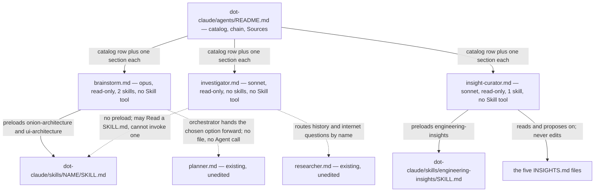

# Development Plan — three more subagents (`brainstorm`, `investigator`, `insight-curator`)

## Overview

Today `.claude/agents/` holds seven agents and its chain runs
`researcher → planner → implementer × N → test-writer → reviewers → doc-writer →
/engineering-insights`. Three things that chain cannot do:

- **Weigh approaches before one is chosen.** `planner` decides *what will be built* and its
  template has no "options considered" section; when a request "still does not decompose into
  tasks with paths and checks" (`planner.md:83-102`) the chain stops with a *Cannot plan* note
  and nothing generates the alternatives. After this change, **`brainstorm`** returns three to
  five materially different options for one problem, each with mechanism, blast radius, cost,
  risk and what it forecloses, ranked against criteria it states up front, ending in one
  recommendation and the fact that would flip it.
- **Trace structure without paying for a research agent's breadth.** `researcher` answers a
  *question* and reaches for git history and the internet. After this change,
  **`investigator`** answers "what reaches what, in the tree as it stands" — a chain of
  `file:line` hops with the import or call line that connects each one, the boundary where the
  trace stops, a blast-radius list, and the frontier it did not open when its read budget ran
  out.
- **Look at the `INSIGHTS.md` files as a set.** The `engineering-insights` skill dedupes one
  candidate at a time, is append-only, and its "Prune quarterly" line
  (`engineering-insights/SKILL.md:263`) has no owner — no agent, no command, no hook. After
  this change, **`insight-curator`** audits all five files at once and *proposes*: duplicate
  clusters, rules confirmed often enough to be promoted, entries whose evidence no longer
  resolves, and files approaching the split threshold. It writes nothing.

No product code changes. Nothing under `client/`, `server/`, `reviewer-core/` or `e2e/` is
touched, and no `INSIGHTS.md`, `AGENTS.md` or `SKILL.md` is edited by any task in this plan.

---

## Grounding

One line per source, per the *Before answering* rule.

| Source | What this plan took from it |
|---|---|
| root `INSIGHTS.md` | **The restart rule is superseded** (`:109-124`): a newly written `.claude/agents/*.md` **is** invocable in the session that wrote it, and "Never write *verifiable only after a restart* into a plan's Acceptance; write the invocation as the check" — so this plan has a live-invocation requirement (R14) where plan 01 had a *Not planned* note. Also: `skills:` is the only enforceable preload and prose "load this skill" is not (`:125-139`); an agent file states **method**, never a map of this repo (`:80-91`); a `description` under-covers its own body silently (`:93-107`); a ranking step nothing consumes is decorative and hides a dropped limit (`:56-65`); `routing.md`'s globs are prose and one is already wrong (`:45-54`) — no glob here came from it. |
| `.claude/agents/README.md` | The five catalog columns (`:13-21`), the chain block (`:30-39`), the per-agent two-column table in the fixed row order **Responsibility → Tools → Model → Preload → Input → Output** (`:50-56`, `:136-143`), the mandatory `**Sources**` list with `**Gap stated:**` lines, and the four rules of `## Adding or editing an agent` (`:334-347`) which become Acceptance. Also its own caution that a skill can declare broad `allowed-tools` (`:125-127`). |
| `plan-verifier.md:17-33` | The **enforceable** form of "no skills": drop `Skill` from `tools`, because omitting `skills:` alone still leaves a subagent free to discover and invoke project skills. All three new agents take this. |
| `researcher.md` (read in full) | The `# Interview first` block shape and its "do not enter it when answerable under a stated assumption" clause; the read-only `## Bash` allowlist copied verbatim in structure; the `### Not found / gaps` mandatory-section convention; and the exact text `investigator` must not duplicate — `researcher` already calls itself "a read-only investigator" at `:10`. |
| `doc-writer.md:111-130` | The shortest instance of the output-template convention: fenced ```markdown block, `##` title line, `###` sections, angle-bracket placeholders, at least one `<mandatory …>` section recording what was **not** done. |
| `engineering-insights/SKILL.md` | The three gates (`:24-34`), the module routing (`:66-80`), the entry format with `Rule` + `Evidence` as the two required fields (`:153-158`), the single promotion rule — a `Rule` confirmed a **second** time goes into that package's `AGENTS.md` (`:118-121`, `:260-262`) — the refusal to serve `docs/` content (`:143-144`), append-only (`:244-246`), the ownerless "Prune quarterly … past roughly 30 entries, split it by domain" (`:263`), and the `grep -c '^### '` over-count trap (`:248-252`). |
| `docs/README.md` | The five-surface table. `AGENTS.md` and `docs/` are sanctioned destinations for promoted material; **`specs/` is "a spec per feature, written before it is built"** and skills are named nowhere — the fact that decides `insight-curator`'s routing rule. |
| `docs/plans/01-agent-suite-four-subagents.md` | R1–R6 reused as static Acceptance; the `Type: core` stated exception; the preload-cost method (`wc -c` ÷ 4) recalibrated below. |
| research brief (`scratchpad/research-three-agents.md`) | Frontmatter schema, tool-name spelling, `model` values, the 15,000-token combined-description budget, the built-in `Explore` description, and the per-agent overlap analysis. Treated as established. |

**Preload costs are measured, not guessed** — `wc -c` ÷ 4, the method plan 01 calibrated
against the two figures already in the README:

| Skill | lines | bytes | ~tokens |
|---|---|---|---|
| `onion-architecture` | 192 | 11,701 | ~2.9k |
| `ui-architecture` | 113 | 7,091 | ~1.8k |
| `engineering-insights` | 263 | 14,676 | ~3.7k |

`onion-architecture` + `ui-architecture` = 305 lines · ~4.7k, which reproduces the
`architecture-reviewer` row already in the README (`:19`) exactly.

**One correction to the research brief, found while grounding.** The brief cites
`INSIGHTS.md:141-153` for "a new agent cannot be invoked in the session that wrote it". That
entry is **superseded** by `INSIGHTS.md:109-124`, which says the opposite and explains that the
false rule already propagated into plan 01's *Testing strategy* and into three implementer
briefs. This plan follows the superseding entry.

---

## Requirements

- **R1** — The three files `.claude/agents/brainstorm.md`, `.claude/agents/investigator.md`,
  `.claude/agents/insight-curator.md` exist, and `claude plugin validate .claude/agents`
  exits 0.
- **R2** — Each of the three has frontmatter whose `name` equals its filename stem, whose
  `description` is exactly **one physical line, double-quoted, containing no `"` character**,
  and whose `model` is `opus` or `sonnet`. Checkable: `rg -c '^description:' <file>` prints `1`
  for each; `rg -n '^description: >' .claude/agents/` finds nothing.
- **R3** — All three are read-only **and** `Skill`-less: for each file,
  `rg -n '^tools:.*(Edit|Write|NotebookEdit|Skill)' <file>` finds nothing, and its `tools:`
  line is exactly `Read, Grep, Glob, Bash` (`investigator`, `insight-curator`) or
  `Read, Glob, Grep, Bash` (`brainstorm`) — no `WebSearch`, no `WebFetch`, no `Agent`.
- **R4** — Every name under a `skills:` key in the three files resolves to an existing
  `.claude/skills/<name>/SKILL.md`, and every name is drawn from the 14 installed skills.
- **R5** — Every repo path, glob and shell command written into any of the three bodies
  resolves in this tree: each is demonstrated by an `ls` or `git ls-files` that returns at
  least one entry.
- **R6** — Every clause of each `description` maps to a named section of that same file's body.
  The mapping is reproduced as a clause → section table in the implementation report.
- **R7** — Each of the three bodies contains, as named sections: an **input gate with a
  stop-rule** of the shape this plan assigns it (`# Interview first` for `brainstorm`,
  `# Input contract` for the other two), a fenced **`# Output` template**, an explicit
  **`# Anti-scope`** naming the one thing the agent must not become, a **`## Bash`** allowlist,
  and a closing **`# Never`** list.
- **R8** — Every `# Output` template carries the mandatory "what I did not do" sections this
  plan specifies for it, each marked `<mandatory …>` in the template text: `brainstorm` two
  (*Not explored*, *Could not establish*), `investigator` two (*Frontier*, *Not established*),
  `insight-curator` three (*Unsanctioned suggestions*, *Deliberately left alone*, *Could not
  verify*).
- **R9** — `investigator.md` carries a `# Overlap with researcher` section that names all four
  narrowings this plan settles — no internet tools, no history commands, an input contract
  instead of an interview gate, and a stated read budget — and names the built-in `Explore`
  alongside them. Checkable: the heading exists, and `rg -n 'WebSearch|WebFetch' <file>` matches
  only inside that section's prose, never on the `tools:` line.
- **R10** — `insight-curator.md` names `AGENTS.md` and a `docs/` as its **only** promotion
  targets, routes any `specs/`- or skill-aimed suggestion into a separate non-promotion section,
  and excludes `server/clones/**` from its corpus by name. Checkable: the body contains a
  promotion-routing table with a sanctioned and an unsanctioned column;
  `rg -n 'server/clones' .claude/agents/insight-curator.md` matches at least once.
- **R11** — `brainstorm.md` states a bounded option count **and** the step that consumes the
  ranking: exactly one `### Recommendation` naming one option, its runner-up, and the fact that
  would flip the choice. No ordering step in the body is left without a consumer.
- **R12** — `.claude/agents/README.md` carries: one catalog row per new agent whose `Model` and
  `Preload` cells equal that file's frontmatter and the figures in this plan; one `##` section
  per new agent with the same six-row two-column table and a `**Sources**` list; and a chain
  block naming all **ten** agents.
- **R13** — Nothing outside `.claude/agents/**` and `docs/plans/**` is modified:
  `git status --porcelain` lists only paths under those two directories.
- **R14** — Each of the three is **invoked once, live, in the session that writes it**, on the
  trivial input this plan names, and returns its own output template rather than prose. A real
  `Agent type 'x' not found` is recorded as this-run evidence and is **not** a reason to edit
  the frontmatter; the report says which of the two happened.

---

## Affected modules & contracts

| Module | What changes |
|---|---|
| `.claude/agents/` | **Three new files** (`brainstorm.md`, `investigator.md`, `insight-curator.md`) and **one edited** (`README.md`: three catalog rows, the chain block, three per-agent sections with Sources, one disambiguation sentence for `researcher` vs `investigator`). |
| `docs/plans/` | This plan file. Nothing else — `docs/plans/README.md` is **not** edited; none of the three sits in the plan-execution loop. |
| `client/`, `server/`, `reviewer-core/`, `e2e/` | **Nothing.** No product code, no test, no config. |

**Contracts.** No `@devdigest/shared` contract is in play; nothing is vendored, added or
consumed, and the two drifted copies under `src/vendor/shared/` are untouched. The only
contract-shaped artefacts here are the three agents' **output templates** — per
`.claude/agents/README.md:3-6` a subagent returns only a summary, so each template *is* the
whole handoff. They are settled below, in full, before any body is written.

**Files that must NOT be edited**, decided here so no lane has to ask:

- `.claude/skills/engineering-insights/SKILL.md` — `insight-curator` **preloads and obeys** it;
  changing it would be inventing a new routing rule for the repo, which the brief for this plan
  forbids. The gap between what the skill sanctions and what the curator was asked to propose is
  handled *inside the curator's report* (see *Promotion routing*), not by editing the skill.
- `.claude/agents/researcher.md` — narrowing its `description` so it stops matching "search the
  codebase" is a live agent's trigger and a separate change; see *Risks* and *Not planned*.
- `.claude/agents/planner.md` — `brainstorm` is invoked by the orchestrator, not by `planner`,
  so no edit is needed; see the `Agent`-tool caveat under *Risks*.
- Any `INSIGHTS.md`, any `AGENTS.md`, any `CLAUDE.md` (committed symlinks), `.claude/settings.json`,
  `docs/README.md`, `specs/README.md`, `docs/plans/README.md`, and everything under
  `client/`, `server/`, `reviewer-core/`, `e2e/` and `server/clones/`.

### The `PreToolUse` gate — checked, not assumed

`.claude/settings.json` carries one hook: the `pr-self-review` `PreToolUse` Bash gate, which
matches `git … push` and `gh pr create|merge` **at command position** after stripping heredocs
and comments. All three new agents are read-only and their allowlists contain no push and no PR
command, so the gate exits 0 for every command any of them may run. **No settings change is
needed, and no task owns `.claude/settings.json`.**

---

## Architecture changes

No onion layer and no `client/` placement applies — every path is on the `.claude/` tooling
surface and no product module changes. Placement is stated in those terms instead.

| Path | Placement / role |
|---|---|
| `.claude/agents/brainstorm.md` | New agent definition. Read-only, `opus`, **2 preloaded skills**, no `Skill` tool. Pre-code, sits before `planner`. Interview-gated, like `researcher` and `planner`. |
| `.claude/agents/investigator.md` | New agent definition. Read-only, `sonnet`, **no `skills:` key**, no `Skill` tool. Sibling of `researcher` in method, narrower in every axis. |
| `.claude/agents/insight-curator.md` | New agent definition. Read-only, `sonnet`, **1 preloaded skill**, no `Skill` tool. Post-hoc, sits after the orchestrator's `/engineering-insights` step and runs periodically rather than per change. |
| `.claude/agents/README.md` | Edited: three catalog rows, the ten-agent chain block, three per-agent sections with Sources, one disambiguation sentence. |

### Per-agent decisions (settled here; implementers do not re-decide)

---

#### 1. `brainstorm`

```yaml
---
name: brainstorm
description: "Use proactively before any code or plan is written, when the how is not settled — generates three to five materially different solution options for one problem, grounded in what this repo already does, and weighs them against criteria it states up front. Each option names its mechanism, the modules and paths it would touch, its cost, its risk and what it forecloses; the report ends with exactly one recommendation, the runner-up, and the single fact that would flip the choice. Read-only: it writes no file, and it produces no task breakdown, no owned paths, no lanes and no acceptance criteria — that is the planner's job, and it hands over a chosen approach rather than a plan. Returns clarifying questions instead of options when the prompt names a solution rather than an outcome, or when the criterion that decides the winner is missing."
tools: Read, Glob, Grep, Bash
model: opus
skills:
  - onion-architecture
  - ui-architecture
---
```

- **`tools`** — the documented read-only set. No `Write`: the artefact is a summary to the
  caller, settled below. No `WebSearch`/`WebFetch`: comparing what upstream libraries offer is
  `researcher`'s mode B, and the orchestrator runs that first if the options depend on it. No
  `Agent`: it does not fan out.
- **No `Skill` tool, with `skills:` present.** Same construction as `architecture-reviewer`
  (`tools: Read, Grep, Glob, Bash` plus a `skills:` key). The two preloaded skills are its
  feasibility constraints; the other twelve are readable as files with `Read` when an option
  turns out to hinge on one. Dropping `Skill` is what stops an option-weighing run from turning
  into a rules-application run — the same enforceability argument `plan-verifier.md:26-33`
  makes, and the one part of it a tool allowlist can actually hold.
- **`model: opus`** — the judgement half, the same reason `planner` and the two reviewers are
  opus. Generating three options is easy; deciding which one wins *here*, and naming the fact
  that would flip it, is the hard part and the failure-prone instruction in the file.
- **`skills:` preload — 2 skills · 305 lines · ~4.7k tokens.**
  - `onion-architecture` (~2.9k) — an option that puts an effect in the wrong ring is not an
    option here, and a request never says "check the layering". Its *Keep it pragmatic* section
    is directly a cost input: an interface earns its existence only with a second
    implementation.
  - `ui-architecture` (~1.8k) — the same for the client: "promote on the second consumer" and
    the local → folder → shared progression are what make one option cheaper than another.
  - Together they are the "rules a task never mentions" that the root `INSIGHTS.md` trimming
    rule says to preload; everything else stays off.
  - **Excluded, with reasons:** `react-testing-library` and the four advice skills
    (`react-best-practices`, `next-best-practices`, `typescript-expert`, `zod`) describe how to
    write code this agent never writes; `fastify-best-practices` conflicts with
    `onion-architecture` on repositories, so preloading both preloads a contradiction;
    `drizzle-orm-patterns` and `postgresql-table-design` matter only once an option is chosen;
    `security` is a separate pass this repo still has no agent for; `mermaid-diagram` — the
    report is a comparison, not a picture; `engineering-insights` records lessons and this agent
    records none; `pr-self-review` is a merge gate.
- **`# Interview first`, not `# Input contract`** — it is a pre-code agent and the house shape
  for pre-code agents is the interview gate (`researcher.md:15-55`, `planner.md:47-81`). But the
  triggers are narrowed, because *a fuzzy problem is this agent's normal input* and bouncing on
  ordinary fuzziness would make it useless. Enter interview mode on exactly three conditions:
  1. **No problem at all** — a topic or a file with nothing to decide.
  2. **The prompt names a solution, not an outcome** — "how do we add a Redis cache?" with no
     statement of what is too slow. Ask what outcome is wanted, because the option set is
     otherwise pre-truncated to one.
  3. **The deciding criterion is missing and would change the winner** — when the options rank
     differently under "ship this week" than under "cheapest to maintain", and nothing in the
     prompt says which.

  And explicitly, mirroring `researcher.md:33-36`: **do not enter it** when the problem is
  vague but the criteria are inferable from the tree and can be stated as an assumption. Same
  `## Clarification needed` block, at most 3 questions, each with a *Default if unanswered*,
  and resumable.
- **The artefact — settled: a summary, no file.** `brainstorm` writes nothing, and this is what
  keeps it from colliding with `planner`'s artefact. Rationale, stated in the body so nobody
  re-opens it: `planner`'s template has no "alternatives rejected" section and `## Not planned`
  is cut *scope*, not weighed *approaches*, so there is no plan section for this content to
  land in; the only in-repo surface that asks for rejected alternatives is `specs/README.md`
  `## Design — The approach, and the alternatives rejected`, and a spec is written by a person
  before the thing is built. The body therefore names two, and only two, durable routes and
  takes neither itself: the caller pastes the chosen option into `planner`'s brief, and if the
  decision is architectural and worth keeping, `doc-writer` writes it as an ADR into `docs/`
  (its routing table already owns that row and its `# ADR shape` section already has the form).
- **Who invokes it — the orchestrator, not `planner`.** `planner` is the only agent with
  `Agent` in `tools`, and the official docs list `Agent` among tools removed from subagents,
  annotated "(at depth limit)" — ambiguous as rendered and not verified at runtime. Making
  `brainstorm` reachable only through `planner` would stake it on that unverified behaviour, and
  would require editing `planner.md`, which no task here owns. So: the orchestrator runs
  `brainstorm` **before** `planner`, and again when `planner` returns its *Cannot plan* note —
  which is precisely the state `planner.md:83-102` describes, "you asked, you were answered, and
  the request still does not decompose". The chain block encodes that position.
- **Best-of-N — what it is and is not.** No official Best-of-N subagent pattern exists; the
  closest documented framing is a *dynamic workflow* that "runs many subagents and cross-checks
  their results … or a plan drafted from several angles", which is a workflow-level construct,
  not a subagent-level one. So the body says two things plainly: within one run it generates
  **exactly three options, up to five when the solution space genuinely splits further**; and
  genuine Best-of-N is the **orchestrator** running several `brainstorm` instances in parallel
  on the same problem and comparing their recommendations — the documented parallel-subagent
  pattern. The agent never claims to be doing Best-of-N by itself.
- **The ranking must be consumed.** Per the root `INSIGHTS.md` entry that a ranking step nothing
  reads is decorative and hides a dropped limit: the comparison table is consumed by exactly one
  `### Recommendation`, which names one option, one runner-up and one flipping fact. No "several
  good candidates" ending. That is R11.
- **`## Bash` allowlist** — read-only, the `researcher.md:69-79` set:
  - **Allowed:** `git log`, `git blame`, `git show`, `git diff`, `git log -S`, `git status`,
    `rg`, `ls`, `cat`, `head`, `tail`, `wc`, `find`, `gh pr view`. History is in scope here
    (unlike `investigator`) because "we tried that before and reverted it" is a first-class cost
    input for an option.
  - **Forbidden, without exception:** any redirection or pipe-to-file (`>`, `>>`, `tee`); any
    git command that mutates state; any package-manager install or script run; `mkdir`, `rm`,
    `mv`, `cp`, `touch`, `sed -i`, `chmod`. If an option can only be costed by running a
    forbidden command, that goes under *Could not establish*.
- **Body sections, in order:** `# Role` · `# Interview first` · `# What counts as an option` ·
  `# Method` · `## Bash` · `# Anti-scope` · `# Overlap` · `# Output` · `# Never`.
- **`# What counts as an option`** — options must differ in **mechanism**, not in naming or
  file layout; two options that compile to the same design are one option. At least one option
  is always **the smallest change that could work** (including "do nothing / keep the current
  behaviour"), so the comparison has a floor. An option that this repo's preloaded rules forbid
  is not listed as an option — it is named under *Not explored* with the rule that excludes it.
- **`# Method`** — numbered: (1) restate the outcome in one line and state every assumption;
  (2) name the decision criteria, in priority order, and where each came from — the prompt, the
  tree, or a stated assumption; (3) read the constraints in the tree rather than guessing them,
  bounded to the modules the problem touches; (4) generate three options that differ in
  mechanism, up to five; (5) for each, fill mechanism / touches / cost / risk / forecloses,
  where *touches* names real paths read from the tree; (6) score every option against every
  criterion; (7) recommend exactly one, name the runner-up, and name the single fact that would
  flip the choice.
- **`# Anti-scope` — it must not become a planner.** Named and forbidden: task ids, owned paths,
  lanes, a dependency DAG, acceptance criteria, a phased breakdown, a file it writes, and any
  sentence that assigns work to someone. It also must not become a `researcher`: no internet
  claim, no citation it did not read from this tree. And it must not return one option — a
  single-option report is an opinion, not a brainstorm, and the correct move when only one
  option survives is to say so *and* list what the others were and which rule killed them.
- **`# Overlap`** — three-way, stated by name: `researcher` establishes **what is true** and
  decides nothing; `brainstorm` weighs **what could be done** and writes nothing; `planner`
  decides **what will be done** and writes the file. They can run on the same request without
  colliding because their outputs are a fact list, an option set, and a work breakdown.
- **`# Output` template** (fenced ```markdown, house shape):

  ```markdown
  ## Options — <problem in one line>
  **Outcome wanted:** <restated in one line; every assumption stated>
  **Decision criteria:** <2 to 4, in priority order, each with where it came from>

  ### Option A — <short name>
  - **Mechanism:** <how it works, one or two sentences>
  - **Touches:** <modules and real paths read from the tree>
  - **Cost:** <size of change, new dependency, migration, ongoing maintenance>
  - **Risk:** <what could go wrong, and anything this repo already records about it>
  - **Forecloses:** <what it makes harder or impossible later>

  ### Comparison
  <one row per option, one column per criterion, plus a one-line verdict per row>

  ### Recommendation
  <exactly one option, why it wins on the stated criteria in priority order>
  **Runner-up:** <one option>
  **What would flip this:** <one fact, and how the caller could check it>

  ### Not explored
  <mandatory — approaches considered and dropped before analysis, each with the reason or the
  rule that excludes it; "none" is not a valid value once more than three were considered>

  ### Could not establish
  <mandatory — a constraint, cost or risk that could not be checked against the tree, where you
  looked, and what would be needed to settle it>
  ```
- **`# Never`** — never write, create or edit a file, and never claim you did; never return a
  work breakdown; never return fewer than the stated minimum without saying which options died
  and why; never invent a path, symbol or cost figure — an unverified cost is an assumption and
  is labelled; never recommend on a criterion the report did not state up front.
- **Live-invocation input for R14:** *"Options for where a shared HTTP retry policy should live
  in `server/`."* — a real, small, answerable question whose answer this plan does not need.

---

#### 2. `investigator`

```yaml
---
name: investigator
description: "Use proactively for a bounded structural trace of this repo as it stands right now — where a symbol is defined, who calls it, what a file transitively reaches, and what would have to change with it. It takes a named starting point (a path, symbol, route, table, message key or error string) and returns a chain of file:line hops with the import or call line that connects each one, the boundary where the chain stops, and a blast-radius list. Working tree only: no git history, no internet, no library documentation, no recommendation and no judgement of the code it reads. It stops and says what is missing rather than guessing when no starting point is given, and when its stated read budget runs out it reports the frontier it did not open instead of continuing."
tools: Read, Grep, Glob, Bash
model: sonnet
---
```

- **The narrowing, in four enforceable levers.** This is the settled answer to "why is this not
  a second `researcher`", and all four are visible in the file rather than asserted in prose:
  1. **No internet.** `WebSearch` and `WebFetch` are absent from `tools` — `researcher` has
     both. This is a tool-level fact, not a request. Mode B does not exist here.
  2. **No history.** `git log`, `git blame`, `git show` and `git diff` are **excluded from the
     `## Bash` allowlist**; the allowlist is `rg`, `git grep`, `git ls-files`, `ls`, `cat`,
     `head`, `tail`, `wc`, `find`. "When and why did this change" is routed to `researcher` by
     name. This is prompt-level, and the body says so honestly.
  3. **No interview gate.** `# Input contract` with a stop-rule, the four post-hoc agents'
     shape. `researcher` negotiates — up to three questions, each with a default, resumable.
     `investigator` either has a starting point and traces, or has none and stops in one line.
     It never asks a question with a default and never fills a gap by assumption.
  4. **A stated read budget.** `# Budget`: at most **25 file reads** and at most **6 hops** from
     the starting point, and when either cap is reached it stops and reports the frontier. This
     is the documented fix for "the infinite exploration" made into a number rather than an
     adjective, and `researcher` has no equivalent for its project mode.
- **The artefact is different, and that is the real distinction.** `researcher` returns a cited
  **finding list** answering a question. `investigator` returns a **trace** — the *edges*, each
  carrying the verbatim import or call line that justifies it — plus a blast radius. Two agents
  that both read files are not the same agent when one produces facts and the other produces a
  graph.
- **`model: sonnet`** — it executes a bounded search against an explicit target; nothing here is
  a judgement call, and the anti-scope forbids the only judgement it could make.
- **No `skills:` key, and no `Skill` tool — a decision, with the paragraph that says so**, in
  the shape of `plan-verifier.md:17-33`. Its subject is the import graph and the lines it reads;
  every criterion it would need is the caller's target. Preloading an architecture skill turns a
  trace into a review, which is `architecture-reviewer`'s job and its anti-scope's first entry.
  Dropping `Skill` removes the discovery path entirely rather than asking in prose not to take
  it. If a task's target happens to be a rule written in a `SKILL.md`, `Read` that file like any
  other file. **Preload: `—` · 0 tokens** — the cheapest agent in the roster, which is the point.
- **`# Input contract`** — the caller must supply:
  1. **A named starting point** — a path, a symbol, a route, a table name, a message key, or an
     error string. **Missing → stop and say so in one line.** Never pick a plausible starting
     point from a topic.
  2. **A question shape**, one of exactly four: `where defined` · `who calls it` · `what it
     reaches` · `blast radius`. **Missing → default to `blast radius` and say that you did**,
     because it is the superset of the other three; this is the one inference the contract
     allows, and it is stated rather than silent.
  3. **Optionally, a scope narrowing** — one package, or a path prefix. Not required.

  And the routing line: a request that needs history, upstream documentation, an option weighed
  or a rule applied is **not** narrowed into scope — name the agent it belongs to
  (`researcher`, `brainstorm`, `architecture-reviewer`) and stop.
- **`# Overlap with researcher`** — mandatory per house convention, and it must state all four
  narrowings above plus this: `researcher.md:10` already opens "You are a read-only
  investigator", so the two files must not both claim the same ground in prose. The line that
  settles it, to appear in this section: *`researcher` answers a question and may leave the tree
  to do it; `investigator` answers a structural relation and may not leave the tree at all.* The
  section also names the built-in **`Explore`** — read-only, optimised for file discovery and
  code search, and documented to skip `CLAUDE.md` files and git status to stay cheap. The
  boundary: `Explore` finds *where things are* and returns a summary; `investigator` returns a
  **checkable trace**, every hop with a locator and the connecting line, plus a budget and a
  frontier. When the caller only needs to locate something, `Explore` is the cheaper tool and
  the body says so rather than competing for it.
- **`# Budget`** — the two caps, the frontier rule, and the instruction that the budget counters
  are reported in the output header whether or not they were hit. A budget nobody reports is a
  budget nobody keeps.
- **`# Method`** — numbered: (1) restate the starting point and the question shape;
  (2) `Glob` to locate, `Grep`/`git grep` to narrow, `Read` **excerpts** — never a whole file
  when a range will do; (3) for each hop, record the locator **and the verbatim import or call
  line that connects it to the previous hop** — a hop with no connecting line is not a hop and
  is dropped; (4) stop at a boundary — a port interface, a vendor SDK, a network or filesystem
  call, a package edge, or the budget — and name which; (5) for `blast radius`, enumerate every
  file that would need to change, each with a locator, and say plainly when the answer is "none
  beyond the chain".
- **`## Bash` allowlist** — **Allowed:** `rg`, `git grep`, `git ls-files`, `ls`, `cat`, `head`,
  `tail`, `wc`, `find`. **Forbidden, without exception:** `git log`, `git blame`, `git show`,
  `git diff`, `gh` in any form; any redirection or pipe-to-file; any git command that mutates
  state; any package-manager install or script run; `mkdir`, `rm`, `mv`, `cp`, `touch`,
  `sed -i`, `chmod`. A question needing a forbidden command is routed by agent name, not run.
- **`# Anti-scope` — it must not become a reviewer or a researcher.** Named and forbidden: a
  recommendation, a refactor, an opinion about the code it read, a severity, a rule citation, a
  fact from outside the working tree, a claim about *why* something is the way it is, and any
  hop it did not read the connecting line for. It reports what reaches what; the caller decides
  what that means.
- **`# Output` template:**

  ```markdown
  ## Trace — <target in one line>
  **Starting point:** <the path, symbol, route, table, key or error string given>
  **Question shape:** where defined | who calls it | what it reaches | blast radius
  **Budget:** <n> of 25 files read, <n> of 6 hops

  ### Chain
  1. `path/file.ts:42` — `<symbol>` — <what this hop does, one line>
     ↳ `path/next.ts:88` — `<symbol>`
       ```
       <the verbatim import or call line that connects them, as read>
       ```

  ### Boundary
  <where the chain stops and why — a port, a vendor SDK, a network or filesystem call, a
  package edge, or the budget>

  ### Blast radius
  <every file that would need to change with the target, each with a locator; "none beyond the
  chain above" is a valid and complete answer>

  ### Frontier
  <mandatory — paths seen but not opened, so the caller can re-aim a second run; "none — the
  chain closed inside budget" is a valid value>

  ### Not established
  <mandatory — what was sought and not found, where you looked, and why nothing was concluded>
  ```
- **`# Never`** — never leave the working tree; never quote a line you did not read; never
  report a hop without its connecting line; never continue past the budget silently; never
  recommend, rate or refactor; never modify, create or delete anything, and never claim you did.
- **Live-invocation input for R14:** *"Blast radius of `getContext` in `server/src/`."* — a real
  symbol in this tree, bounded, and a trace whose result this plan does not depend on.

---

#### 3. `insight-curator`

```yaml
---
name: insight-curator
description: "Use proactively to audit this repo's INSIGHTS.md files as a set — the root one and each package's — for the same lesson recorded twice, for a rule confirmed often enough to be promoted, for entries whose evidence locator no longer resolves, and for a file large enough to need splitting. Read-only by construction: it proposes and never writes, because the engineering-insights skill is the only thing that may edit an INSIGHTS.md and pruning one is a human decision. It proposes promotions only into surfaces this repo already sanctions — a package AGENTS.md for a twice-confirmed rule, a docs/ for the reasoning behind a decision — and reports any suggestion aimed at specs/ or at a skill in a separate section, as a routing rule this repo does not have rather than as a promotion. It excludes the copies under server/clones/, states how it counted entries, and quotes the exact text it proposes so a human can apply or reject it unchanged."
tools: Read, Grep, Glob, Bash
model: sonnet
skills:
  - engineering-insights
---
```

- **`tools`** — read-only. No `Edit`, no `Write`: it proposes.
- **No `Skill` tool, with `skills:` present — and here that choice is load-bearing twice
  over.** First, the ordinary reason: it removes the discovery path that prose cannot close.
  Second, and specific to this agent: `engineering-insights` declares
  `allowed-tools: Read, Edit, Glob, Grep`, and `.claude/agents/README.md:125-127` already
  records the caution that a skill can declare broad tool access. Whether invoking a skill can
  expand a subagent's own allowlist is **not verified here** — and dropping `Skill` makes the
  question moot, which is exactly why it is dropped rather than argued. The skill's *content*
  still arrives, in full, through `skills:`. The body states this in a `# No `Skill` tool`
  section, including the unverified part, labelled as unverified.
- **`model: sonnet`** — the corpus is small and fixed (five files, 23 real entries), every
  criterion it applies is written in the skill it preloads, and every proposal is gated by a
  human before anything changes. The failure mode is a rejected proposal, not a bad merge. The
  two `opus` reviewers are opus because their output *is* the gate; this one's is not.
- **`skills:` preload — 1 skill · 263 lines · ~3.7k tokens: `engineering-insights`.** It is the
  entire rulebook for this agent's subject — the three gates, the module routing, the fixed
  entry format with `Rule` and `Evidence` as the two required fields, the one promotion rule,
  the append-only constraint, and the counting trap — and a task saying "audit the insights"
  names none of it. That is precisely the "rules a task never mentions" case the root
  `INSIGHTS.md` trimming rule says to preload.
  - **Excluded, with reasons:** every other skill. The curator judges *entries*, not code; an
    architecture or advice skill would hand it criteria for the wrong artefact and invite it to
    re-litigate the lesson rather than route it. `pr-self-review` is a merge gate and irrelevant.
- **`# Corpus` — fixed, and the exclusions are part of it.** Exactly five files: root
  `INSIGHTS.md`, `client/INSIGHTS.md`, `server/INSIGHTS.md`, `reviewer-core/INSIGHTS.md`,
  `e2e/INSIGHTS.md`. **`server/clones/**` is excluded by name** — `find` returns five more
  `INSIGHTS.md` there and the root `AGENTS.md` forbids touching that tree; a curator that
  silently folded them in would report phantom duplicates of every real entry.
  **The counting rule, stated because it is a trap already recorded at
  `engineering-insights/SKILL.md:248-252`:** `grep -c '^### '` over-counts by exactly one per
  file, because each file embeds the entry template as a commented example. Real counts today —
  root 11, `server/` 7, `client/` 5, `reviewer-core/` 0, `e2e/` 0; 23 total. The body states the
  correction as a **method** ("subtract the template heading, and say in the report that you
  did"), not as a memorised table — the numbers will drift and an agent file does not carry a
  map of this repo.
- **`# Promotion routing` — the sanctioned/unsanctioned split, which is the whole answer to
  "into skills / docs / specs".** The requested wording names three destinations; only two are
  grounded, and the body must not invent the third.

  | Candidate | Destination | Grounding |
  |---|---|---|
  | A `Rule` independently confirmed a **second** time | that package's `AGENTS.md` | `engineering-insights/SKILL.md:118-121` — the skill's only promotion rule |
  | Reasoning behind a decision, an ADR-shaped lesson | root `docs/` for cross-package, that package's `docs/` otherwise | `SKILL.md:143-144` refuses to hold it; `docs/README.md` says `docs/` holds design notes and ADRs |
  | Anything aimed at `specs/` | **not a promotion** | `docs/README.md`: a spec is "written before it is built" — a lesson from a past session is by definition not spec material |
  | Anything aimed at a `.claude/skills/*/SKILL.md` | **not a promotion** | no rule anywhere in this repo routes an insight into a skill |

  The rule, stated in the body: **propose only into the two sanctioned surfaces.** A candidate
  the curator believes belongs in `specs/` or a skill goes into the report's
  `### Unsanctioned suggestions` section, phrased as *a routing rule this repo does not have*,
  naming the surface, the one sentence of `docs/README.md` or `engineering-insights/SKILL.md`
  that would have to change first, and the human who would have to decide. It is never phrased
  as a promotion, never counted among the promotions, and never acted on.

  Two more rules ride with the table. **A promotion is proposed, never performed** — an
  `AGENTS.md` change "changes an instruction file every future session loads — never make it
  silently" (`SKILL.md:189`), so the proposal *is* the visible step, and applying it is a human's
  or `doc-writer`'s act. **A prune is proposed, never performed** — the skill is append-only
  ("Never delete or reword an existing entry", `:244-246`) and no agent in this roster may edit
  an `INSIGHTS.md` at all, so a duplicate cluster produces a recommendation and a locator, not
  an edit.
- **`# Input contract`** — the caller supplies:
  1. **The scope.** **Default: all five files.** A named subset is accepted. This agent's corpus
     is discoverable, so a missing scope is not a stop — it is the default, stated in the report.
  2. **Optionally, a focus** — one of `duplicates` · `promotions` · `stale` · `file health`, or
     all four, which is the default.

  **The stop-rules**, which are the real content of this contract: **stop** if asked to *write*
  an entry — that is `/engineering-insights` and its three gates, and the curator does not
  pre-clear a write for it; **stop** if asked to prune, delete, reword or apply any of its own
  proposals; **stop** if asked to curate anything under `server/clones/`. In each case say which
  agent, skill or human owns the request instead.
- **`# Method`** — numbered: (1) inventory the five files, count real entries with the
  correction, and state the counts; (2) index every entry by its `Rule` and its `Evidence`
  locator, the two required fields and the units a promotion moves; (3) cluster entries whose
  `Rule` states the same thing across files or within one; (4) check each candidate's `Evidence`
  locator still resolves, with `ls`/`rg`, and record the command whose output showed it does
  not; (5) classify each cluster as duplicate, promotion candidate, stale or correctly-placed;
  (6) route each promotion candidate through the table above; (7) report per-file counts against
  the 30-entry split threshold.
- **`## Bash` allowlist** — **Allowed:** `rg`, `git grep`, `git ls-files`, `ls`, `cat`, `head`,
  `tail`, `wc`, `find`, and `git log`/`git show` limited to establishing whether an entry's
  subject was since changed. **Forbidden, without exception:** any redirection or pipe-to-file;
  any git command that mutates state; any package-manager install or script run; `mkdir`, `rm`,
  `mv`, `cp`, `touch`, `sed -i`, `chmod`; and **any command whose path argument begins
  `server/clones/`**.
- **`# Anti-scope` — it must not become an editor of the files it reads, and it must not
  re-litigate a lesson.** Named and forbidden: editing, pruning, rewording or reordering any
  entry; writing a new entry; proposing into `specs/` or a skill as though it were a promotion;
  disputing whether a recorded lesson was correct (it curates placement and duplication, not
  truth); grading the writing; and proposing a promotion from a single occurrence — the rule is
  a *second* confirmation, and a first occurrence is left alone and said to be left alone.
- **`# Overlap with the `engineering-insights` skill`** — stated by name: the skill decides
  whether **one new finding** is worth writing and where it goes, at the moment it is learned,
  and it is the only thing that may edit an `INSIGHTS.md`. The curator looks at **the corpus
  that has already accumulated**, across files, after the fact, and may edit nothing. The skill's
  dedupe is a pre-write grep on one candidate; the curator's is a cross-file audit of all of
  them — the job the skill's own "so a human can prune the old one" and ownerless "Prune
  quarterly" line leave undone. They never contend for the same action because only one of them
  has an action.
- **`# Output` template:**

  ```markdown
  ## Insights Audit — <scope: all five files, or the ones named>
  **Corpus:** <file → real entry count>, counted by <method, including the template correction>.
  `server/clones/**` excluded.

  ### Duplicate clusters
  - **D1** — <the one rule stated more than once, in your words, one line>
    - Entries: `INSIGHTS.md:93`, `server/INSIGHTS.md:41`
    - **Proposal:** keep <which one> — <why that one>. The other is a human prune; no agent in
      this roster may edit an INSIGHTS.md.

  ### Promotion candidates
  - **P1** → `<server/AGENTS.md | docs/ | client/docs/>`
    - Source entry: `server/INSIGHTS.md:41`
    - **Rule, verbatim:** <quoted from the entry, unchanged>
    - **Second confirmation:** <the other entry or the code fact, with its locator>
    - **Proposed text, to be applied by a human or doc-writer:** <the exact sentence to add>

  ### Stale
  - `<file:line>` — <why: the Evidence locator no longer resolves | the bug it records is
    fixed>, shown by `<the command you ran and what it returned>`

  ### File health
  <per file: real entry count against the 30-entry split threshold, and the domain split you
  would propose for any file at or over it>

  ### Unsanctioned suggestions
  <mandatory — anything you would have aimed at specs/ or at a skill, stated as a routing rule
  this repo does not have: the surface, the sentence of docs/README.md or the skill that would
  have to change first, and who decides. Never phrased as a promotion. "None" is valid>

  ### Deliberately left alone
  <mandatory — entries examined and not proposed on, and why: correctly placed, unique, current,
  or a first occurrence awaiting a second confirmation>

  ### Could not verify
  <mandatory — an evidence locator, a duplicate judgement or a count you could not settle, and
  what would be needed>
  ```
- **`# Never`** — never edit, prune, reword or create any `INSIGHTS.md`, `AGENTS.md`, `docs/`
  file or `SKILL.md`, and never claim you did; never read or report anything under
  `server/clones/`; never present a `specs/`- or skill-aimed suggestion as a promotion; never
  propose a promotion from one occurrence; never report a raw `grep -c '^### '` count as the
  entry count; never dispute whether a recorded lesson is true.
- **Live-invocation input for R14:** *"Audit `reviewer-core/INSIGHTS.md` and `e2e/INSIGHTS.md`."*
  — both have zero real entries, so the correct report is almost entirely
  *Deliberately left alone* plus a corrected count, which is the sharpest possible test of both
  the counting rule and the "do not pad" discipline.

---

## Architecture diagram



Node ids are ASCII and the `.claude` paths are written `dot-claude/...` inside labels so no
label begins with a character Mermaid treats specially; the real paths are the ones in
*Architecture changes*. Solid edges are changes this plan makes; dashed edges are relationships
the bodies *state* without either file being edited — `planner.md` and `researcher.md` are named
here precisely because they are **not** owned by any task.

---

## Phased tasks

Every task below is `Type: core`. **This is a stated exception, not a fit** — see *Conflict with
the `Type` vocabulary* under Risks; it is the same exception plan 01 recorded and it has not
been resolved since. No preloaded skill governs any of these tasks. The governing rules are
`.claude/agents/README.md` §"Adding or editing an agent", the house body shape settled above,
and the root `INSIGHTS.md` entries listed under *Grounding*. Each task restates that, so an
implementer leaning on the `core` row's `onion-architecture` + `zod` does not misapply them.

**The shared body rule, binding on T1–T3:** frontmatter → `# Role` in the second person → the
input gate this plan assigns → `# Method` as numbered steps → `## Bash` allowlist → `# Anti-scope`
→ the overlap section this plan assigns → a fenced `# Output` template → a closing `# Never`.
**No body may describe this repo's layout, name which package holds what, or point at a file to
read first** — that is the root `INSIGHTS.md:80-91` rule, and it is Acceptance, not advice. The
one permitted exception is `insight-curator`'s `# Corpus`, because the five `INSIGHTS.md` files
*are* its subject rather than navigation advice; it still states the counting **method** rather
than the current numbers.

### Phase 1 — the three agent bodies

- **T1** · Write `.claude/agents/brainstorm.md` to the frontmatter and section spec in
  *Per-agent decisions §1*.
  - Module: root (`.claude/`) · Type: `core` · Lane: A
  - Owned paths: `.claude/agents/brainstorm.md`
  - Depends-on: —
  - Risk: it drifts into a planner — options acquire owned paths, phases and acceptance
    criteria, and the file becomes a second `planner.md` that writes nothing. Second risk: the
    interview gate fires on ordinary fuzziness, which is this agent's normal input, and it never
    produces options at all.
  - Acceptance → R1, R2, R3, R4, R6, R7, R8, R11: file exists and
    `claude plugin validate .claude/agents` exits 0;
    `rg -c '^description:' .claude/agents/brainstorm.md` prints `1` and
    `rg -n '^description: ".*"$' .claude/agents/brainstorm.md` matches;
    `rg -n '^tools:.*(Edit|Write|NotebookEdit|Skill|WebSearch|WebFetch|Agent)' .claude/agents/brainstorm.md`
    finds nothing; `ls .claude/skills/onion-architecture/SKILL.md .claude/skills/ui-architecture/SKILL.md`
    exits 0; the body has named sections `# Interview first`, `# What counts as an option`,
    `# Method`, `## Bash`, `# Anti-scope`, `# Overlap`, `# Output`, `# Never`; the `# Output`
    template contains both `<mandatory` markers (*Not explored*, *Could not establish*) and
    exactly one `### Recommendation`; the `# Anti-scope` section names "planner" explicitly; the
    report carries the clause → section table.

- **T2** · Write `.claude/agents/investigator.md` to the spec in *Per-agent decisions §2*.
  - Module: root (`.claude/`) · Type: `core` · Lane: B
  - Owned paths: `.claude/agents/investigator.md`
  - Depends-on: —
  - Risk: it reads as a paraphrase of `researcher.md`'s mode A — the failure this whole agent is
    one decision away from. Second risk: the budget is written as an adjective ("bounded") rather
    than the two numbers, so nothing constrains a run and nothing is reportable.
  - Acceptance → R1, R2, R3, R6, R7, R8, R9: `claude plugin validate .claude/agents` exits 0;
    `rg -c '^description:' .claude/agents/investigator.md` prints `1`;
    the `tools:` line is exactly `Read, Grep, Glob, Bash` and
    `rg -n '^tools:.*(Edit|Write|NotebookEdit|Skill|WebSearch|WebFetch|Agent)' .claude/agents/investigator.md`
    finds nothing; `rg -n '^skills:' .claude/agents/investigator.md` finds nothing **and** the
    body states in prose that the absence is deliberate; the body has a `# Overlap with researcher`
    heading whose section names all four narrowings and the built-in `Explore`; the `# Budget`
    section states **two numeric caps**; the `## Bash` allowlist section names `git log`,
    `git blame`, `git show` and `git diff` under *Forbidden*; the `# Output` template contains
    both `<mandatory` markers (*Frontier*, *Not established*) and a `**Budget:**` header line.

- **T3** · Write `.claude/agents/insight-curator.md` to the spec in *Per-agent decisions §3*.
  - Module: root (`.claude/`) · Type: `core` · Lane: B
  - Owned paths: `.claude/agents/insight-curator.md`
  - Depends-on: —
  - Risk: it invents a routing rule — proposing into `specs/` or a skill as though the repo
    sanctioned it, which is the one thing the brief for this plan forbids. Second risk: it
    reports raw `grep -c '^### '` counts and over-states every file by one. Third: a `skills:`
    entry gets added or `Skill` gets restored "for consistency", re-opening the write path the
    design closes.
  - Acceptance → R1, R2, R3, R4, R6, R7, R8, R10: `claude plugin validate .claude/agents`
    exits 0; `rg -c '^description:' .claude/agents/insight-curator.md` prints `1`;
    `rg -n '^tools:.*(Edit|Write|NotebookEdit|Skill|WebSearch|WebFetch|Agent)' .claude/agents/insight-curator.md`
    finds nothing; `ls .claude/skills/engineering-insights/SKILL.md` exits 0;
    `rg -n 'server/clones' .claude/agents/insight-curator.md` matches at least once; the body
    contains a promotion-routing table with `AGENTS.md` and `docs/` marked sanctioned and
    `specs/` and skills marked **not a promotion**; the `# Output` template contains all three
    `<mandatory` markers (*Unsanctioned suggestions*, *Deliberately left alone*, *Could not
    verify*); the `# Corpus` section states the template-over-count correction as a method; the
    five corpus paths are demonstrated by
    `ls INSIGHTS.md client/INSIGHTS.md server/INSIGHTS.md reviewer-core/INSIGHTS.md e2e/INSIGHTS.md`
    exiting 0, and the promotion targets by
    `ls AGENTS.md client/AGENTS.md server/AGENTS.md reviewer-core/AGENTS.md e2e/AGENTS.md` and
    `ls -d docs client/docs server/docs reviewer-core/docs e2e/docs` both exiting 0.

### Phase 2 — catalog integration

- **T4** · Extend `.claude/agents/README.md`: three catalog rows, the ten-agent chain block,
  three per-agent sections each with a `**Sources**` list, and one disambiguation sentence.
  - Module: root (`.claude/`) · Type: `core` · Lane: C
  - Owned paths: `.claude/agents/README.md`
  - Depends-on: T1, T2, T3
  - Risk: `Model` and `Preload` cells drift from the frontmatter actually written; or the README
    starts restating rules that live in the agent files, which its own opening (`:8-9`) forbids.
  - Acceptance → R12:
    `rg -n 'brainstorm|investigator|insight-curator' .claude/agents/README.md` returns matches in
    the catalog table, the chain block and three distinct `## ` sections;
    `rg -n '^## ' .claude/agents/README.md` lists **ten** agent sections plus `Catalog`,
    `The chain` and `Adding or editing an agent`; each new row's `Model` cell equals that file's
    `model:` and each `Preload` cell equals its `skills:` count and the token figure from this
    plan's *Grounding* table; `rg -n '\*\*Sources\*\*' .claude/agents/README.md` returns **ten**
    matches.

  Content this task must produce, decided here so Lane C does not re-derive it:

  **Catalog rows** (same five columns, appended in chain order — `brainstorm` and `investigator`
  before `planner`, `insight-curator` last):

  | Agent | Model | Preload | Does | Never does |
  |---|---|---|---|---|
  | brainstorm | opus | 2 skills · ~4.7k | Generates and weighs 3–5 materially different approaches to one problem, and recommends one | writes any file, produces a task breakdown, returns a single option |
  | investigator | sonnet | — | Traces structure in the current working tree — definitions, callers, reach, blast radius — inside a stated read budget | reads git history, leaves the tree, recommends or judges anything |
  | insight-curator | sonnet | 1 skill · ~3.7k | Audits the five INSIGHTS.md files as a set and proposes dedupes, promotions and prunes | edits any file, proposes into specs/ or a skill, promotes on one occurrence |

  **Chain block**, replacing the current one:

  ```
  request → brainstorm (optional — when the how is not settled; N options, one recommendation)
          → researcher   (optional, bounded lookups — project or internet, cited)
            investigator (optional, bounded structural trace of the current tree)
          → planner    → docs/plans/NN-<feature>.md
          → implementer × N lanes, in parallel
          → test-writer (optional — when tests are the deliverable, after the lanes)
          → architecture-reviewer  ┐ fresh context, read-only, no verdict
            plan-verifier          ┘
          → doc-writer (optional — when the change needs documenting)
          → orchestrator: records the lanes' Insights via /engineering-insights
          ⋯ insight-curator (periodic, not per change — audits the INSIGHTS.md set and proposes)
  ```

  The `⋯` is deliberate and must be explained in one sentence beneath the block:
  `insight-curator` is not a step in a change's chain — it runs on the corpus, on its own
  cadence, and it is the owner the skill's "Prune quarterly" line never had.

  **The disambiguation sentence**, placed under the catalog: `researcher` answers a question and
  may leave the tree to do it — history, upstream docs, both; `investigator` answers a structural
  relation and may not leave the tree at all. When you only need to locate something, the
  built-in `Explore` is cheaper than either.

  **Sources per new section** — these exact URLs, each with the one thing it grounds. Nothing
  else is to be cited, and none of these may be paraphrased into an agent body.

  - All three — [Subagents](https://code.claude.com/docs/en/sub-agents): the read-only example
    `tools: Read, Grep, Glob, Bash` with "The subagent can't edit files, write files, or use any
    MCP tools"; `skills:` — "The full skill content is injected, not only the description.
    Subagents can still invoke unlisted project, user, and plugin skills through the Skill tool",
    which is exactly why all three drop `Skill`; "the subagent does that work in its own context
    and returns only the summary"; the model resolution order.
    **Gap stated:** the docs contain no sentence saying `tools` can restrict *paths*, so any path
    restriction here is a prompt-level rule — the same caveat every existing section carries.
    **Gap stated:** `Agent` is listed among tools removed from subagents, annotated "(at depth
    limit)", which is ambiguous as rendered and unverified at runtime; this is why `brainstorm`
    is invoked by the orchestrator rather than by `planner`.
  - All three — [Best practices](https://code.claude.com/docs/en/best-practices): "Give Claude a
    check it can run… Have Claude show evidence rather than asserting success"; and, for
    `investigator` specifically, **the infinite exploration** — "You ask Claude to 'investigate'
    something without scoping it. Claude reads hundreds of files, filling the context. > Fix:
    Scope investigations narrowly or use subagents so the exploration doesn't consume your main
    context" — the sentence the read budget turns into two numbers.
  - All three —
    [Multi-agent research system](https://www.anthropic.com/engineering/multi-agent-research-system):
    "Each subagent needs an objective, an output format, guidance on the tools and sources to
    use, and clear task boundaries."
  - `brainstorm` — [Best practices](https://code.claude.com/docs/en/best-practices): "Separate
    research and planning from implementation to avoid solving the wrong problem", and the
    interview pattern — "Ask about technical implementation, UI/UX, edge cases, concerns, and
    tradeoffs. Don't ask obvious questions, dig into the hard parts I might not have considered."
    **Gap stated:** `AskUserQuestion` is removed from all subagents, so a subagent cannot run
    that interview itself; the house substitute is the `# Interview first` block that returns
    questions as the deliverable.
    Also [Agents / dynamic workflows](https://code.claude.com/docs/en/agents): "For independent
    investigations, spawn multiple subagents to work simultaneously", and a dynamic workflow as
    "A script that runs many subagents and cross-checks their results… or **a plan drafted from
    several angles**". **Gap stated:** neither page uses the term Best-of-N and neither describes
    generating competing options inside one subagent — so the N-options-per-run behaviour is a
    local convention, and true Best-of-N is the orchestrator running several instances.
  - `investigator` — [Agents](https://code.claude.com/docs/en/agents), the built-in `Explore`:
    "A fast, read-only agent optimized for searching and analyzing codebases… file discovery,
    code search, codebase exploration", Write and Edit denied, and it "skips `CLAUDE.md` files
    and git status to keep research fast and inexpensive" — the neighbour this agent must not
    duplicate, and the reason its own value has to be the checkable trace rather than the search.
    **Gap stated:** no official source addresses two subagent descriptions matching the same
    request; the only quantified limit is the 15,000-token combined-description budget, past
    which Claude Code warns at startup and still loads every subagent.
  - `insight-curator` — [Skills](https://code.claude.com/docs/en/skills): "Claude Code loads a
    listing of skill names and descriptions into context… full skill content only loads when
    invoked", which is why the rulebook is preloaded through `skills:` rather than requested in
    prose. **Gap stated:** whether a skill's own `allowed-tools` can widen a subagent's allowlist
    is not verified here; dropping `Skill` makes the question moot rather than answering it.
    In-repo, not a URL, and cited as such: `engineering-insights/SKILL.md` for the three gates,
    the routing, the entry format, the single promotion rule, append-only, and the ownerless
    "Prune quarterly"; `docs/README.md` for the five-surface table that makes `specs/` an
    unsanctioned destination.

### Phase 3 — verification

- **T5** · Run the whole static check set over `.claude/agents/` and report, file by file, what
  each command returned.
  - Module: root · Type: `core` · Lane: C
  - Owned paths: — (read-only sweep; owns no file, and may not edit one to fix a defect it
    finds. A failure is reported to the orchestrator, which reopens the owning task.)
  - Depends-on: T4
  - Risk: a defect surfaces in a file Lane C does not own — accepted; each authoring task
    already runs `claude plugin validate .claude/agents` itself, so T5 is a second pass.
  - Acceptance → R1–R13: every command in *Testing strategy* is run and its **real output**
    pasted; `claude plugin validate .claude/agents` exits 0; every "must find nothing" grep finds
    nothing; `git status --porcelain` lists only paths under `.claude/agents/` and `docs/plans/`.

- **T6** · Invoke each of the three agents **live, in this session**, on the trivial input named
  in its *Per-agent decisions* block, and report what came back.
  - Module: root · Type: `core` · Lane: C
  - Owned paths: — (read-only smoke; owns no file)
  - Depends-on: T5
  - Risk: the run costs real tokens on three agents, one of them `opus`; and an `opus` rate limit
    is a known outcome here (it is what stopped a live check once already, per
    `INSIGHTS.md:109-124`). Mitigation: the three inputs are deliberately tiny, and a rate-limit
    failure is reported as a rate limit — it is not a frontmatter defect and must not be
    "fixed" by editing the file.
  - Acceptance → R14: each of the three is invoked once with the input this plan names; the
    report states for each, in one line, **which** of three outcomes occurred — it returned its
    own output template (pass), it returned prose that does not match its template (a body
    defect: name the missing section and reopen the owning task), or `Agent type 'x' not found`
    (recorded as this-run evidence, **not** a YAML error, and **not** grounds for editing the
    frontmatter). The `brainstorm` run additionally shows a `### Recommendation` naming exactly
    one option; the `investigator` run shows a `**Budget:**` line with two numbers; the
    `insight-curator` run shows entry counts of `0` for both files it was pointed at, with the
    template correction stated.

---

## Dependency DAG

```
T1 ─┐
T2 ─┼─→ T4 ─→ T5 ─→ T6
T3 ─┘
```

Acyclic: T1–T3 are roots with no dependencies; T4 depends only on Phase 1; T5 on T4; T6 on T5,
and T6 is a sink. No edge points backwards.

---

## Lanes

Three lanes, and the split is by *body shape*, not arithmetic. `brainstorm` is the only one of
the three with an `# Interview first` gate and the only one that makes a judgement, so it is
written alone. `investigator` and `insight-curator` are near-twins in construction — both
read-only with an `# Input contract` stop-rule, both `sonnet`, both dropping `Skill` with a
prose paragraph explaining it, both carrying a mandatory "what I did not establish" section — and
a shared author is what keeps their anti-scopes from colliding: the tracer must not curate, and
the curator must not trace.

- **Lane A** · tasks: T1
  - owns: `.claude/agents/brainstorm.md`
  - others own: `.claude/agents/investigator.md`, `.claude/agents/insight-curator.md`,
    `.claude/agents/README.md`
- **Lane B** · tasks: T2, T3
  - owns: `.claude/agents/investigator.md`, `.claude/agents/insight-curator.md`
  - others own: `.claude/agents/brainstorm.md`, `.claude/agents/README.md`
- **Lane C** · tasks: T4, T5, T6 — catalog integration and both verification passes; runs after
  A and B
  - owns: `.claude/agents/README.md`
  - others own: `.claude/agents/brainstorm.md`, `.claude/agents/investigator.md`,
    `.claude/agents/insight-curator.md`

No path appears in two lanes' `owns` lists. T5 and T6 own nothing by design.

---

## Testing strategy

**No product-package suite applies, and that is stated rather than padded.** No file under
`client/`, `server/`, `reviewer-core/` or `e2e/` changes, so `pnpm test` or `npm test` in any of
them would prove nothing about this change. Verification is the static set below plus the live
invocations of T6, all run from the repo root.

```sh
# R1 — the three files parse as agent definitions
claude plugin validate .claude/agents

# R1 — they exist
ls .claude/agents/brainstorm.md .claude/agents/investigator.md \
   .claude/agents/insight-curator.md

# R2 — one description line each, double-quoted; no wrapped block anywhere in the roster
rg -c '^description:' .claude/agents/brainstorm.md .claude/agents/investigator.md \
   .claude/agents/insight-curator.md          # each must print 1
rg -n '^description: ".*"$' .claude/agents/   # ten matches
rg -n '^description: >' .claude/agents/       # must find NOTHING

# R2 — name matches the filename stem, model is set
rg -n '^name:|^model:' .claude/agents/brainstorm.md .claude/agents/investigator.md \
   .claude/agents/insight-curator.md

# R3 — all three are read-only, Skill-less, internet-less and cannot spawn
rg -n '^tools:.*(Edit|Write|NotebookEdit|Skill|WebSearch|WebFetch|Agent)' \
   .claude/agents/brainstorm.md .claude/agents/investigator.md \
   .claude/agents/insight-curator.md          # must find NOTHING
rg -n '^tools:' .claude/agents/brainstorm.md .claude/agents/investigator.md \
   .claude/agents/insight-curator.md          # inspect the three lines

# R4 — every preloaded skill name resolves to a real directory
rg -n '^skills:' -A 3 .claude/agents/brainstorm.md .claude/agents/insight-curator.md
rg -n '^skills:' .claude/agents/investigator.md      # must find NOTHING
ls .claude/skills/onion-architecture/SKILL.md \
   .claude/skills/ui-architecture/SKILL.md \
   .claude/skills/engineering-insights/SKILL.md

# R5 — every path written into a body resolves in this tree
ls INSIGHTS.md client/INSIGHTS.md server/INSIGHTS.md \
   reviewer-core/INSIGHTS.md e2e/INSIGHTS.md
ls AGENTS.md client/AGENTS.md server/AGENTS.md reviewer-core/AGENTS.md e2e/AGENTS.md
ls -d docs docs/plans specs client/docs server/docs reviewer-core/docs e2e/docs
ls docs/README.md specs/README.md

# R6, R7, R8 — section structure; the clause -> section table lives in each lane's report
rg -n '^# |^## ' .claude/agents/brainstorm.md .claude/agents/investigator.md \
   .claude/agents/insight-curator.md
rg -n '<mandatory' .claude/agents/brainstorm.md          # 2 matches
rg -n '<mandatory' .claude/agents/investigator.md        # 2 matches
rg -n '<mandatory' .claude/agents/insight-curator.md     # 3 matches

# R9 — the investigator boundary is written down, and is not on the tools line
rg -n '^# Overlap with researcher' .claude/agents/investigator.md
rg -n 'Explore' .claude/agents/investigator.md
rg -n 'git log|git blame|git show|git diff' .claude/agents/investigator.md   # under Forbidden

# R10 — the curator's corpus exclusion and its unsanctioned routing
rg -n 'server/clones' .claude/agents/insight-curator.md
rg -n 'specs/' .claude/agents/insight-curator.md        # only in the not-a-promotion rows

# R11 — the ranking has exactly one consumer
rg -n '^### Recommendation' .claude/agents/brainstorm.md                     # 1 match

# R12 — the catalog, the chain, the sections and the Sources lists
rg -n 'brainstorm|investigator|insight-curator' .claude/agents/README.md
rg -n '^## ' .claude/agents/README.md                   # ten agent sections plus three others
rg -n '\*\*Sources\*\*' .claude/agents/README.md        # ten matches

# R13 — nothing outside the two directories moved
git status --porcelain
```

**R14 is not a shell command** — it is the three live invocations of T6, each on the input its
*Per-agent decisions* block names. Per root `INSIGHTS.md:109-124`, **write the invocation as the
check**; do not write "verifiable only after a restart" into any Acceptance in this plan, and do
not treat a real `Agent type 'x' not found` as a YAML error.

---

## Risks & mitigations

| Risk | Mitigation |
|---|---|
| **`investigator` is a net negative — a second `researcher` competing for the same delegations.** Stating it plainly, as asked: `researcher.md:10` already opens "You are a read-only investigator", its mode A method *is* this agent's method, and the built-in `Explore` covers the same ground more cheaply. `description` is the sole delegation signal and no official source arbitrates two descriptions matching one request, so the most likely failure is not a bad trace but the **wrong agent being picked**, silently, in both directions. On the merits I would have folded a read budget and a trace template into `researcher` as a third mode rather than shipping a tenth agent. It is planned anyway, per the brief. | Four enforceable narrowings rather than prose (no `WebSearch`/`WebFetch` on the `tools` line; history commands under *Forbidden*; an input contract instead of an interview gate; two numeric caps), a mandatory `# Overlap with researcher` section, a distinct artefact (a trace with connecting lines, not a finding list), and a disambiguation sentence in the README catalog. Residual risk is accepted and named here. |
| **Delegation collision, concretely.** `researcher`'s description contains "where something lives", which is also `investigator`'s territory. | `investigator`'s description leads with the artefact ("returns a chain of file:line hops") and front-loads the exclusions ("no git history, no internet"), so the two triggers differ on their first clause. Narrowing `researcher`'s own description would be the real fix and is in *Not planned* — it is a live agent `planner` depends on, and changing its trigger has its own blast radius. |
| **The combined-description budget.** Three more descriptions enter the 15,000-token startup budget shared by every subagent; past it Claude Code warns and still loads everything. | The three descriptions are of a length the roster already carries (each is shorter than `plan-verifier`'s), and detail lives in the bodies, which load only when the agent runs — the documented trim. T5's `rg -n '^description: ".*"$'` prints all ten so their total length is inspectable in one output block. |
| **`brainstorm` collides with `planner`'s artefact** — options acquire phases and owned paths and the roster gains a second planner that writes nothing. | Settled and enforced three ways: no `Write` in `tools`; `# Anti-scope` names "planner" and forbids task ids, owned paths, lanes, DAGs and acceptance criteria by name; and the only two durable routes for a chosen option are named as *other people's jobs* (`planner`'s brief, or an ADR in `docs/` via `doc-writer`). |
| **`brainstorm`'s interview gate fires on its normal input** and it never produces options. | Exactly three narrow triggers, plus the explicit "do not enter it when the criteria are inferable and can be stated as an assumption" clause copied in structure from `researcher.md:33-36`. |
| **The `Agent`-tool caveat.** `planner.md:4` lists `Agent`, but the docs place `Agent` among tools removed from subagents, annotated "(at depth limit)" — ambiguous and unverified at runtime. A `brainstorm` invoked *by* `planner` would depend on the answer. | It is invoked by the orchestrator instead, `planner.md` is not edited and is owned by no task, and the ambiguity is written into the README's Sources as a **Gap stated:** line rather than resolved by assumption. |
| **`insight-curator` invents a routing rule** and proposes into `specs/` or a skill as though the repo sanctioned it. | The promotion-routing table has two columns and the unsanctioned side is *not a promotion* by construction; the output template's `### Unsanctioned suggestions` is mandatory, is phrased as "a routing rule this repo does not have", and must name the sentence that would have to change first. `# Never` forbids the mislabel. R10 checks the table exists. |
| **`insight-curator` acquires a write path** — through `Edit`, or through a skill's own `allowed-tools`. | No `Edit`/`Write` in `tools`, and **no `Skill` tool**, which closes the only route by which a skill's `allowed-tools` could matter. Whether that route is real is unverified and the body says so rather than claiming otherwise. `# Never` lists every file class it may not touch. |
| **The `grep -c '^### '` over-count** silently inflates every file's entry count by one and makes a 29-entry file look like it needs splitting. | The trap is in the `# Corpus` spec as a method, is in `# Never`, and its correction must be *stated in the report* on every run. Verified against the tree while writing this plan: raw counts are 12/8/6/1/1, real counts 11/7/5/0/0. |
| **Conflict with the `Type` vocabulary.** The red-flags check requires every task's `Type` to be one of `backend`/`ui`/`core`/`e2e` **and** to match its owned paths. These own `.claude/agents/**`, which is none of those. Surfaced rather than planned around — the same conflict plan 01 recorded, still unresolved. | Every task is `Type: core` **with an explicit note that no preloaded skill governs it** and a pointer to the rules that do. Precedent exists: the implementer's own table gives `e2e` → "no skill". The red-flags line below is marked *pass with a stated exception*. Extending the vocabulary is in *Not planned*. |
| **The restart caveat gets re-applied from plan 01** and three lanes are told live verification is impossible — the exact propagation `INSIGHTS.md:109-124` describes and calls "expensive because it is load-bearing". | R14 and T6 make the live invocation a requirement, not a hope; the superseding entry is quoted in *Grounding*; and the phrase "verifiable only after a restart" appears nowhere in this plan's Acceptances. If a run really does return "not found", T6's Acceptance already says how to record it. |
| **Bodies drift stylistically** and stop reading as siblings of the seven existing agents. | The section list per agent is pinned above and is Acceptance (R7), not advice; the two near-twins are written by one lane; T5 runs `rg -n '^# \|^## '` across all three so divergence shows in one output block. |
| **A body describes the repo instead of stating method** — root `INSIGHTS.md:80-91`. | Named as a binding rule on T1–T3, with the one permitted exception (`insight-curator`'s `# Corpus`) written down and justified, so an implementer does not have to guess whether it applies. |

---

## Red-flags check

- **Every task has a `Type` and at least one Owned path** — pass, with one stated exception:
  T5 and T6 are verification passes and deliberately own nothing, because a lane that owns no
  file cannot "fix" a defect in a file another lane wrote. Their failure mode is a report, and
  that is the intent.
- **Every task's `Type` matches the paths it owns** — **pass with a stated exception.** All six
  are `Type: core` over `.claude/agents/**`, which the four-value vocabulary does not describe.
  Surfaced in *Risks* rather than papered over; the resolution is in *Not planned*.
- **Every task's `Type` is one of `backend`, `ui`, `core`, `e2e`** — pass. All `core`.
- **No two lanes own the same path** — pass. A owns `brainstorm.md`; B owns `investigator.md`
  and `insight-curator.md`; C owns `.claude/agents/README.md`. The three sets are disjoint, and
  T5/T6 own nothing.
- **The dependency graph is acyclic** — pass. T1–T3 are roots, T4 → T5 → T6 is a chain, T6 is a
  sink, no edge points backwards.
- **Every requirement has at least one Acceptance referencing it** — pass. R1: T1, T2, T3, T5.
  R2: T1, T2, T3, T5. R3: T1, T2, T3, T5. R4: T1, T3, T5. R5: T3, T5. R6: T1, T2, T3. R7: T1,
  T2, T3. R8: T1, T2, T3, T5. R9: T2, T5. R10: T3, T5. R11: T1, T5. R12: T4, T5. R13: T5.
  R14: T6.
- **Every verification command is a real command of that module** — pass.
  `claude plugin validate .claude/agents` is the command `.claude/agents/README.md:344`
  prescribes; every other line is `rg`, `ls` or `git status`, all run read-only while writing
  this plan. No product-package suite is claimed, because none applies.
- **The diagram names the same modules and paths as `Architecture changes`** — pass. Both name
  the three new agent files and `.claude/agents/README.md`; the diagram additionally shows
  `.claude/skills/*/SKILL.md`, the five `INSIGHTS.md` files, and `planner.md`/`researcher.md` on
  **dashed** edges, which the diagram's own caption labels as relationships stated without an
  edit — and *Affected modules & contracts* lists all of those under files that must not be
  edited. Nothing appears in one section and not the other.
- **No task owns a lockfile, a root config, an existing contract under `src/vendor/shared/`, an
  already-merged migration, or anything under `server/clones/`** — pass. The owned set is four
  markdown files under `.claude/agents/` plus this plan file. `.claude/settings.json` is a root
  config and is explicitly **not** owned (the gate analysis shows no change is needed);
  `server/clones/**` is not merely unowned but is excluded by name inside
  `insight-curator.md`'s corpus and its Bash allowlist.

---

## Not planned

- **Narrowing `researcher`'s `description`** so it stops matching "where something lives". This
  is the real fix for the delegation collision and it is deliberately cut: `researcher` is a live
  agent that `planner` delegates to, its `description` is its entire trigger, and a trigger
  change under-covers its own body silently (root `INSIGHTS.md:93-107`). Doing it properly means
  re-mapping every clause of that description onto `researcher.md`'s sections — a separate change
  with its own verification, not a line squeezed into a plan that adds three agents. The
  collision is mitigated here by wording and by the README disambiguation sentence, and the
  residual is named in *Risks*.
- **Editing `planner.md` to delegate to `brainstorm`.** It would stake the new agent on the
  unverified `Agent`-at-depth-limit behaviour and would touch a file no task here owns. The
  orchestrator-invoked position is the conservative choice; if `Agent` is later confirmed to work
  from inside a subagent, adding one line to `planner.md:106-110` is a one-file change.
- **Adding an "Options considered" section to `planner`'s output template.** That would give
  `brainstorm`'s content a home inside the plan file, which is tempting and wrong for now: it
  changes the artefact of a live agent that has already produced two plans in this repo, and the
  same content already has a sanctioned home in `docs/` via `doc-writer`'s ADR shape. Revisit
  once `brainstorm` has actually been run a few times and it is clear what survives the handoff.
- **Extending the `Type` vocabulary with a fifth value (`tooling`).** Unchanged from plan 01: it
  needs coordinated edits to `planner.md`, `implementer.md` and `docs/plans/README.md` — three
  files this plan does not own — and every existing plan would keep the four-value set. Surfaced
  as a conflict instead.
- **A security-review agent.** Still absent, still promised by `implementer.md`'s "other agents
  will judge the architecture **and** the security", and still out of scope here. Named so the
  next reader does not assume this plan closed it.
- **Any automation of `insight-curator`** — a hook, a schedule, or a `PreToolUse` gate that runs
  it. The skill's "Prune quarterly" line now has an *agent*, which is what was asked for; giving
  it a *cadence* means touching `.claude/settings.json`, and an audit that fires automatically
  and proposes into `AGENTS.md` is exactly the silent instruction-file change
  `engineering-insights/SKILL.md:189` warns against. It stays caller-invoked.
- **Measuring whether the three new descriptions push the roster past the 15,000-token
  combined-description budget.** No command exists in this tree to measure it, and the documented
  consequence is a startup warning rather than a failure. T5 prints all ten descriptions so the
  question is inspectable; quantifying it is not planned.
