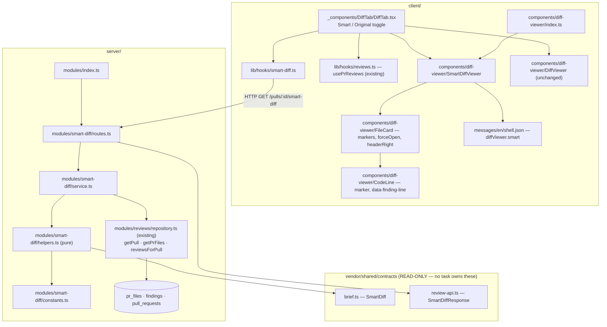

# Development Plan — L03 Smart Diff

## Context

A reviewer opening the **Files changed** tab today gets GitHub's own file order — which is
alphabetical-ish and indifferent to consequence. On a normal PR that means `pnpm-lock.yaml` and
`db/migrations/meta/_journal.json` are read before the service method that actually changed
behaviour. Smart Diff reorders that list by risk.

**Every input already exists and is unfed.** `SmartDiff`, `SmartDiffGroup`, `SmartDiffFile`,
`SmartDiffRole` and `ProposedSplit` are declared in `server/src/vendor/shared/contracts/brief.ts:81-113`
with **zero producers and zero consumers**; `SmartDiffResponse = SmartDiff` is reserved in
`review-api.ts:63-65`; `client/src/lib/types.ts` already re-exports `SmartDiff`. `GET /pulls/:id`
persists `pr_files` (`pulls/routes.ts:193-201`) and returns `PrFile[]` — path, additions, deletions,
patch, and nothing else (`platform.ts:184-189`). `GET /pulls/:id/reviews` returns findings carrying
`file`, `start_line`, `end_line`, `severity` and `id` (`findings.ts:46-62`). This lesson **feeds**
that plumbing, exactly as L03's intent module fed `pr_intent` — with the difference that Smart Diff
adds no table, no migration and no model call at all.

**Grounding taken from the files this repo already wrote down:**

- `server/INSIGHTS.md` — the server's vendored contract copy runs ahead of the client's; a contract
  change is a two-sided, manual job. **Verified not to apply here:** `diff` reports
  `brief.ts`, `review-api.ts`, `findings.ts` and `platform.ts` byte-identical between the two copies
  today, and this plan edits none of them. Also: a wire DTO does not necessarily carry every column
  the row has — which is why `SmartDiffFile` deliberately has no `severity` and no `patch`.
- `client/INSIGHTS.md` — `CategoryTag` silently renders `null` for any string outside the findings
  taxonomy, so a role label (`core`/`wiring`/`boilerplate`) must be plain text or a `Badge`, never
  `CategoryTag`; and a `vi.mock` relative path must be computed with `path.relative`, never counted
  by eye, because a wrong count fails silently.
- `client/INSIGHTS.md` (2026-08-29) — an effect consuming a **one-shot** needs a `useRef` guard and
  a `<StrictMode>` test. This plan deliberately consumes no one-shot; see *Decisions taken against
  the obvious* #3.
- Root `INSIGHTS.md` — a step nothing consumes is decorative. Every constant named below is read by
  a named function, and every threshold is asserted from the constant rather than from a literal.
- `server/AGENTS.md` — tenancy comes from `getContext(container, req)` and every query is scoped by
  `workspaceId`; `src/vendor/shared` is never edited in place; a DB-backed test must be `*.it.test.ts`.

### Fixed decisions

These are settled. Do not re-open them.

| | |
|---|---|
| **Contract** | `SmartDiff` (`brief.ts:81-113`) **already exists** — not redesigned, not edited. `SmartDiffResponse` (`review-api.ts:63-65`) is the route's response schema. **No file under `src/vendor/shared/` is touched by any task.** |
| **Route** | `GET /pulls/:id/smart-diff` → `SmartDiffResponse`. Computed on read. |
| **Persistence** | **None.** No `smart_diff` table, no migration, no cache. Classification is pure and recomputed per request. |
| **`pseudocode_summary`** | Always `null`. No LLM step, no heuristic, no table. The UI renders no "What this does" line. It stays an unfed slot like the others this repo keeps on purpose. |
| **Model calls** | **Zero**, on every path. Proved, not asserted — see R4. |
| **Thresholds & patterns** | All in `server/src/modules/smart-diff/constants.ts`. None inline in the classifier. |
| **Severity vocabulary** | The assignment's *blocker / warning / suggestion* map 1:1 onto the existing `Severity` enum `CRITICAL / WARNING / SUGGESTION`, rendered by the existing `SeverityBadge` (labels *Critical / Warning / Suggestion*). No second severity vocabulary is introduced — see *Decisions taken against the obvious* #2. |
| **Scope** | backend + UI + tests. **No `e2e` lane**, no demo-video task, no PR-opening task. |

## Overview

After this lands, a user on a PR's **Files changed** tab sees a **Smart order / Original order**
toggle in the section header. In **Smart order** the diff is re-rendered as a *reviewer-ordered
diff*: three labelled groups — **Core logic** ("The substance of the change — review closely"),
**Wiring** ("Hooks the core into the app") and **Boilerplate** ("Generated / mechanical — skim") —
each with an `N files` count on the right. A lock-file is always in Boilerplate and always starts
collapsed. Once a review has run, every file that carries a finding renders expanded with a severity
marker on the marked lines and a clickable finding-count badge that expands the file if needed and
scrolls the diff to that finding. Before any review has run, the ordering still works — just without
badges or markers. **Original order** renders exactly what the tab renders today. Nothing in this
path talks to a model, to GitHub, or to a new table.

## Requirements

- **R1** — `GET /pulls/:id/smart-diff` returns a body that parses as `SmartDiffResponse`, carrying
  **exactly three groups, always present, in the order `core`, `wiring`, `boilerplate`** (empty ones
  included), and 404s for a PR outside the caller's workspace without reading `pr_files`. Verified by
  `server/test/smart-diff.it.test.ts` — cases *"returns all three groups in role order"*,
  *"404s for a PR in another workspace"*.
- **R2** — A lock-file is classified `boilerplate` **unconditionally**, ahead of every other rule.
  Verified by `server/test/smart-diff-helpers.test.ts` case *"every LOCKFILE_BASENAMES entry is
  boilerplate, at any depth"*, which iterates the imported `LOCKFILE_BASENAMES` constant rather than
  a literal list.
- **R3** — Within a response, `core` sorts above `wiring`, which sorts above `boilerplate`; within a
  group, files carrying findings sort first, then by descending `additions + deletions`, then by
  `path` ascending — a total order, so two calls on unchanged data return identical bodies. Verified
  by `smart-diff-helpers.test.ts` cases *"group order is ROLE_ORDER"*, *"within-group order is
  findings → size → path"*, *"the same input twice yields a deep-equal result"*.
- **R4** — **No model call happens anywhere in the Smart Diff path.** Verified by
  `server/test/smart-diff.it.test.ts` with the `MockLLMProvider.calls` technique of
  `docs/plans/02-pr-intent-layer.md`'s R3 (`intent.it.test.ts:130-136`): case *"a smart-diff read on a
  never-reviewed PR leaves `llm.calls` empty"* and case *"a smart-diff read after a completed review
  does not increase `llm.calls.length`"* (snapshot the length, issue two GETs, compare).
- **R5** — Every threshold, path pattern and basename list lives in
  `server/src/modules/smart-diff/constants.ts`; `helpers.ts` contains **no regex literal, no path
  string and no numeric threshold**. Verified structurally by the tests in
  `smart-diff-helpers.test.ts` deriving every boundary from the imported constant — e.g. the
  `too_big` boundary cases are built from `SPLIT_TOO_BIG_MAX_LINES` and
  `SPLIT_TOO_BIG_MAX_LINES + 1`, never from `400` — so moving a value in `constants.ts` cannot leave
  a green test behind a stale classifier.
- **R6** — `finding_lines` is the ascending, de-duplicated set of lines covered by that file's
  **non-dismissed** findings, expanded from `start_line..end_line`, with a finding whose span exceeds
  `MAX_FINDING_LINE_SPAN` contributing only its `start_line`, and the array truncated at
  `MAX_FINDING_LINES_PER_FILE`. Verified by `smart-diff-helpers.test.ts` cases *"a 3-line finding
  yields its three lines"*, *"two overlapping findings de-duplicate"*, *"a dismissed finding
  contributes nothing"*, *"a span over MAX_FINDING_LINE_SPAN contributes only start_line"*.
- **R7** — Every `SmartDiffFile.pseudocode_summary` is `null`, and no UI string renders it. Verified
  by `smart-diff.it.test.ts` case *"every file's pseudocode_summary is null"* and by
  `SmartDiffViewer.test.tsx` case *"renders no summary line for a file"* (queries that no element
  carries the file's `pseudocode_summary` text when the fixture is given a non-null one).
- **R8** — `split_suggestion` is filled deterministically: `total_lines` sums
  `additions + deletions` over **non-`boilerplate`** files only; `too_big` is true iff
  `total_lines > SPLIT_TOO_BIG_MAX_LINES` **or** the non-`boilerplate` file count exceeds
  `SPLIT_TOO_BIG_MAX_FILES`; `proposed_splits` is `[]` when `too_big` is false, and otherwise the
  non-`boilerplate` files grouped by their first `SPLIT_KEY_SEGMENTS` path segments, groups smaller
  than `MIN_SPLIT_FILES` dropped, sorted by descending changed lines then name, capped at
  `MAX_PROPOSED_SPLITS`. Verified by `smart-diff-helpers.test.ts` cases *"a 5 000-line lock-file
  alone does not make a PR too_big"*, *"boundary at SPLIT_TOO_BIG_MAX_LINES and +1"*, *"splits group
  by two path segments and are capped"*, *"not too_big ⇒ proposed_splits is empty"*.
- **R9** — The **Files changed** tab renders a `Smart order` / `Original order` control in the
  `SectionLabel` `right` slot; `Original order` renders the existing `DiffViewer` with unchanged
  markup and the existing comment affordances. Verified by `DiffTab.test.tsx` cases *"defaults to
  original order and renders DiffViewer"*, *"toggling to smart order renders the three group
  headings"*, *"toggling back restores the original list"*.
- **R10** — In Smart order each non-empty group renders its title, its description and an `N files`
  count; an empty group renders nothing; patches come from the `PrFile[]` the tab already holds,
  joined by `path`, and a smart-diff entry with no matching `PrFile` is skipped. Verified by
  `SmartDiffViewer.test.tsx` cases *"renders title, description and count per non-empty group"*,
  *"omits an empty group"*, *"renders patch lines for a joined file"*, *"skips a path absent from
  files"*.
- **R11** — A `boilerplate` file starts **collapsed even when it carries findings**; a `core` or
  `wiring` file with a non-empty `finding_lines` starts **expanded**; every other file keeps the
  existing `AUTO_EXPAND_MAX_LINES` rule. Verified by `SmartDiffViewer.test.tsx` cases *"a lock-file
  with findings starts collapsed"*, *"a core file with findings starts expanded"*, *"a large core
  file with no findings starts collapsed"*.
- **R12** — A marked line renders a severity marker that is **icon + text, never colour alone**,
  taken from the highest-severity non-dismissed finding covering that line
  (`CRITICAL > WARNING > SUGGESTION`). Verified by `SmartDiffViewer.test.tsx` cases *"a CRITICAL
  finding's line renders the Critical marker"*, *"a line covered by both a WARNING and a CRITICAL
  renders Critical only"*, *"an unmarked line renders no marker"*.
- **R13** — The per-file finding-count badge is a `<button>` with an `aria-label` naming the file;
  clicking it expands the file when collapsed and scrolls to that file's first marked line, and a
  second click on the same badge scrolls again. Verified by `SmartDiffViewer.test.tsx` cases *"badge
  click expands a collapsed boilerplate file and calls scrollIntoView on the first marked line"* and
  *"a second click scrolls again"* (with `Element.prototype.scrollIntoView` stubbed by `vi.fn()`, as
  jsdom does not implement it).

## Affected modules & contracts

| Module | What changes |
|---|---|
| `server/` | **New module** `src/modules/smart-diff/` (`routes.ts`, `service.ts`, `helpers.ts`, `constants.ts`); one import + one entry in `src/modules/index.ts`; two new test files. **No schema, no migration, no repository, no adapter, no port.** |
| `client/` | `src/components/diff-viewer/` gains `SmartDiffViewer/` and optional props on `FileCard`/`CodeLine`; one new hook `src/lib/hooks/smart-diff.ts`; three type re-exports in `src/lib/types.ts`; new keys under `messages/en/shell.json` → `diffViewer.smart`; the toggle in `DiffTab`. |
| `reviewer-core/` | **Untouched.** No prompt, no engine change — the feature makes no model call. |
| `e2e/` | **Untouched** — see *Not planned*. |

**Contracts: consumed only, none added, none edited.**

| Contract | Where | Used for |
|---|---|---|
| `SmartDiffResponse` / `SmartDiff` | `review-api.ts:63-65`, `brief.ts:105-113` | the route's response schema and return type |
| `SmartDiffGroup`, `SmartDiffFile`, `SmartDiffRole`, `ProposedSplit` | `brief.ts:81-103` | the builder's output types and the client's props |
| `PrFile` | `platform.ts:184-189` | classifier input (path + counts; `patch` is not read by the classifier) |
| `Finding` / `FindingRecord`, `Severity` | `findings.ts:46-62`, `review-api.ts:15-20` | `finding_lines` on the server; markers and badges on the client |

The four contract files above are **byte-identical between `server/src/vendor/shared/contracts/` and
`client/src/vendor/shared/contracts/` today** (verified by `diff` this session), so the client-copy
regeneration `server/INSIGHTS.md` warns about is not in scope for this plan. **No task owns any path
under `src/vendor/shared/`.**

## Architecture changes

### `server/` — onion placement

| Path | Layer | What it is |
|---|---|---|
| `src/modules/smart-diff/routes.ts` | route | `GET /pulls/:id/smart-diff`. `app.withTypeProvider<ZodTypeProvider>()`, `schema: { params: IdParams, response: { 200: SmartDiffResponse } }`, tenancy via `getContext(app.container, req)`, delegates to the service. No Drizzle, no `container.github()`, no `container.llm()`. |
| `src/modules/smart-diff/service.ts` | service | The use case: `reviewRepo.getPull(workspaceId, prId)` → `NotFoundError`; `reviewRepo.getPrFiles(prId)`; `reviewRepo.reviewsForPull(prId)`; then one pure `buildSmartDiff(...)` call. Owns nothing else. |
| `src/modules/smart-diff/helpers.ts` | pure | `classifyPath`, `findingLinesFor`, `sortFilesInGroup`, `splitKeyFor`, `buildSplitSuggestion`, `buildSmartDiff`. Zero I/O, zero literals — the tested surface. |
| `src/modules/smart-diff/constants.ts` | pure | Every pattern list and threshold, plus the documented precedence order. |
| `src/modules/index.ts` | registry | One import + one entry, per that file's own "ADD A MODULE" docblock. |
| `server/test/smart-diff-helpers.test.ts` | unit | Hermetic, no Docker. |
| `server/test/smart-diff.it.test.ts` | integration | Real Postgres. The `.it.test.ts` suffix is load-bearing. |

**Why a new module rather than growing `modules/pulls/`.** `pulls/routes.ts` is one of the files the
onion skill lists as a thing to copy *away from*: its handlers call `container.github()` and issue
raw Drizzle statements inside the route (`:186-231`). Adding a fourth endpoint there would extend a
known violation and would put two lanes' worth of edits into one 300-line file. A separate module
registering a route under someone else's URL prefix is the established shape here —
`modules/intent/routes.ts` owns `/pulls/:id/intent` the same way. The module is named for the
feature, the route for the resource.

**No new repository, and no new SQL.** Everything the service reads already exists on
`container.reviewRepo`: `getPull(workspaceId, prId)` (`repository.ts:32`), `getPrFiles(prId)`
(`repository.ts:40`) and `reviewsForPull(prId)` (`repository/review.repo.ts:88-105`). A service
reading another module's repository through `container.*Repo` is an inward arrow and is explicitly
allowed; a second class over `pr_files` would break the one-owner-per-table rule this repo enforces.

**A service, not route → repository.** The skill's "don't create a service to forward one query"
escape hatch does not apply: this is three reads, a tenancy gate with a branch, and a composition
step. The service is where that sequence is reviewable.

**Tenancy.** `pr_files` and `findings` carry no `workspace_id` — they are satellites reached through
`pull_requests`, which carries it. The gate is therefore the first statement of the use case:
`getPull(workspaceId, prId)` throws `NotFoundError` before any satellite is read. Same reasoning,
same shape, as `pull.repo.ts:56-65` records for `pr_intent`. R1's cross-workspace case asserts it.

**No GitHub call.** Unlike `GET /pulls/:id`, this route never refreshes from GitHub — it reads the
`pr_files` rows that call already persisted. Consequence, stated: on a PR whose detail has never been
fetched the response is three empty groups. In practice the page loads `GET /pulls/:id` before
`DiffTab` mounts, so the rows exist by the time the toggle is reachable; the UI still handles the
empty case (R10).

**First route in this repo to declare a `response` schema.** No `modules/**/routes.ts` currently
declares one. It is safe: `app.setSerializerCompiler(serializerCompiler)` is already installed
globally (`src/app.ts:65`). The benefit is that R1 becomes self-enforcing — a body that does not
match `SmartDiff` fails at serialization instead of reaching the client.

### The classifier — patterns, precedence, defaults

All of the following are **named exports of `constants.ts`**, with the values shown. They were chosen
against this repo's own tree, not from a generic list.

```ts
LOCKFILE_BASENAMES        = ['pnpm-lock.yaml','package-lock.json','yarn.lock','npm-shrinkwrap.json',
                             'bun.lockb','Cargo.lock','poetry.lock','Gemfile.lock','composer.lock','go.sum']
GENERATED_PATH_SEGMENTS   = ['/dist/','/build/','/out/','/.next/','/coverage/','/node_modules/',
                             '/__snapshots__/','/__generated__/','/db/migrations/meta/']
GENERATED_BASENAME_SUFFIXES = ['.snap','.min.js','.min.css','.map','.generated.ts','.gen.ts']
DOC_EXTENSIONS            = ['.md','.mdx']
TEST_BASENAME_PATTERNS    = [/\.test\.[cm]?[jt]sx?$/, /\.spec\.[cm]?[jt]sx?$/]
TEST_PATH_SEGMENTS        = ['/test/','/tests/','/__tests__/']
CONFIG_BASENAMES          = ['package.json','docker-compose.yml','Dockerfile','.env.example',
                             '.gitignore','.npmrc','.nvmrc']
CONFIG_BASENAME_PATTERNS  = [/^tsconfig(\..+)?\.json$/, /\.config\.[cm]?[jt]s$/,
                             /^\.eslintrc.*$/, /^\.prettierrc.*$/]
CI_PATH_PREFIXES          = ['.github/workflows/']
BARREL_BASENAMES          = ['index.ts','index.tsx','index.js','index.mjs']
DEFAULT_ROLE              = 'core'
ROLE_ORDER                = ['core','wiring','boilerplate'] as const
SPLIT_TOO_BIG_MAX_LINES   = 400
SPLIT_TOO_BIG_MAX_FILES   = 20
SPLIT_KEY_SEGMENTS        = 2
MIN_SPLIT_FILES           = 2
MAX_PROPOSED_SPLITS       = 4
MAX_FINDING_LINE_SPAN     = 50
MAX_FINDING_LINES_PER_FILE = 200
```

**Precedence — first match wins, in exactly this order.** The order is the rule; it is stated in the
`constants.ts` header and is the order of the checks in `classifyPath`.

| # | Rule | Role | Why here |
|---|---|---|---|
| 1 | `LOCKFILE_BASENAMES` (basename, any depth) | `boilerplate` | **R2 makes this unconditional.** It runs first so no later rule can reclassify a lock-file. |
| 2 | `GENERATED_PATH_SEGMENTS` / `GENERATED_BASENAME_SUFFIXES` | `boilerplate` | Build output and snapshots. `/db/migrations/meta/` catches drizzle-kit's own snapshots — real files in this tree — while leaving `db/migrations/*.sql` to fall through to `core`, which is right: a migration is the substance of a change. |
| 3 | `DOC_EXTENSIONS` | `boilerplate` | Prose, not executable behaviour. A judgement call — see *Decisions taken against the obvious* #1. |
| 4 | `TEST_BASENAME_PATTERNS` / `TEST_PATH_SEGMENTS` | `wiring` | A test is how the change is proved, so it must be read — but after the logic it covers. Catches `server/test/**` and `*.it.test.ts` alike. |
| 5 | `CONFIG_BASENAMES` / `CONFIG_BASENAME_PATTERNS` / `CI_PATH_PREFIXES` | `wiring` | The assignment's "configuration". Note `package.json` is `wiring` while `pnpm-lock.yaml` is `boilerplate` — rule 1 already decided the second. |
| 6 | `BARREL_BASENAMES` | `wiring` | The assignment's "index/entry files". |
| 7 | nothing matched | `DEFAULT_ROLE` = `core` | An unrecognised path is business logic until proven otherwise. Under-classifying as boilerplate would hide a real change; over-classifying as core only costs reading order. |

**Matching is on a normalised path**: GitHub paths are repo-relative and POSIX, so `classifyPath`
matches segment rules against `'/' + path` (so a leading `test/` matches `/test/`), basename rules
against the last segment, and extension rules case-insensitively. `path.posix` is not needed and is
not imported — `helpers.ts` stays free of Node APIs so it stays trivially unit-testable.

**Worked examples from this tree** (each is a case in `smart-diff-helpers.test.ts`):
`server/pnpm-lock.yaml` → `boilerplate` (1) · `server/src/db/migrations/meta/_journal.json` →
`boilerplate` (2) · `docs/plans/04-smart-diff.md` → `boilerplate` (3) ·
`server/test/smart-diff-helpers.test.ts` → `wiring` (4) · `client/vitest.config.ts` → `wiring` (5) ·
`.github/workflows/server-unit.yml` → `wiring` (5) · `client/src/components/diff-viewer/index.ts` →
`wiring` (6) · `server/src/modules/smart-diff/service.ts` → `core` (7) ·
`server/src/db/migrations/0014_x.sql` → `core` (7).

### `finding_lines`, and how the three-value `Severity` reaches the UI

A `Finding` has `start_line` and `end_line` — there is **no `line` field**; the assignment's wording
is loose. `findingLinesFor(path, findings)`:

1. keeps findings where `f.file === path` and `dismissedAt == null`;
2. for each, if `end_line - start_line + 1 > MAX_FINDING_LINE_SPAN`, contributes `[start_line]` only
   (a model that emits `end_line` at end-of-file must not produce a 5 000-entry array); otherwise
   contributes `start_line..end_line`;
3. de-duplicates, sorts ascending, truncates at `MAX_FINDING_LINES_PER_FILE`.

`SmartDiffFile` carries **no severity** — the contract has none, and it is not edited. So the split is:

| Signal | Source | Consumer |
|---|---|---|
| *which lines are marked*, and therefore whether a file auto-expands | server `finding_lines` | `SmartDiffViewer` expansion rule (R11) |
| *which severity* marks a line, and *which finding id* a badge jumps to | the `FindingRecord[]` the PR page has already fetched via `usePrReviews(prId)` (a React Query cache hit on key `["reviews", prId]`) | the marker and the badge (R12, R13) |

Both derive from the same rows; the server's view is severity-blind by contract. The client maps
`CRITICAL → SEV.CRITICAL` (icon `AlertOctagon`, label "Critical"), `WARNING → SEV.WARNING`
(`AlertTriangle`, "Warning"), `SUGGESTION → SEV.SUGGESTION` (`Lightbulb`, "Suggestion") via the
existing `SeverityBadge`, which is already icon+label by construction
(`src/vendor/ui/primitives/Badge.tsx:49-88`). Highest severity wins on a line covered by more than one
finding.

### `client/` — placement

| Path | Placement rule |
|---|---|
| `src/components/diff-viewer/SmartDiffViewer/{SmartDiffViewer.tsx,index.ts,SmartDiffViewer.test.tsx}` | It composes `FileCard`, `helpers.parsePatch`, `styles.s` and `constants` from this folder. Building it under the route's `_components/` would mean importing past the `diff-viewer` barrel into its internals — the thing the barrel exists to prevent. It is a **second entry point of the same renderer**, so it lives inside it. |
| `src/components/diff-viewer/index.ts` | Widened by one named export: `export { SmartDiffViewer } from "./SmartDiffViewer";`. The barrel lists exports by name today and keeps doing so. **Owned by the UI lane only** — no other lane touches this file. |
| `src/components/diff-viewer/FileCard/FileCard.tsx` | Gains three **optional** props: `markers?: Map<number, Severity>`, `forceOpen?: boolean` (initial state override), `headerRight?: React.ReactNode`. Absent ⇒ today's behaviour, byte-for-byte. |
| `src/components/diff-viewer/CodeLine/CodeLine.tsx` | Gains optional `marker?: Severity` and sets `data-finding-line={\`${path}:${lineNo}\`}` on the row when marked, so the badge's scroll can query it — the `[data-finding-id=…]` + `CSS.escape` pattern already used at `ReviewRunAccordion.tsx:82-86`. |
| `src/components/diff-viewer/constants.ts` | Gains `SMART_ROLE_KEYS: Record<SmartDiffRole, { title: string; desc: string }>` — the message-key map — and nothing else. `AUTO_EXPAND_MAX_LINES` is reused, not duplicated. |
| `src/components/diff-viewer/styles.ts` | Gains the group-header and marker style objects, exported through the existing `s`. |
| `src/lib/hooks/smart-diff.ts` + `src/lib/hooks/index.ts` | Server state is React Query over `src/lib/api.ts`, grouped by domain; the barrel re-exports by name (`export { useSmartDiff } from "./smart-diff";`). Never a `fetch` in a component. |
| `src/lib/types.ts` | Re-export `SmartDiffFile`, `SmartDiffGroup`, `SmartDiffRole` beside the `SmartDiff` already re-exported there. Contract types are never hand-written. |
| `messages/en/shell.json` → `diffViewer.smart.*` | `DiffViewer`, `FileCard` and `CodeLine` all already call `useTranslations("shell")`; a second namespace inside one component folder would mean two different namespaces in sibling files. Extends the namespace that folder already speaks. |
| `src/app/repos/[repoId]/pulls/[number]/_components/DiffTab/DiffTab.tsx` | The container: calls `useSmartDiff(prId)` and `usePrReviews(prId)`, holds the `smart` boolean, and puts the toggle in the `SectionLabel` `right` slot beside the existing comments button — the precedent for a control in that slot. |

**Toggle shape.** One `Button kind="ghost" size="sm"` with `active={smart}` and `aria-pressed={smart}`
whose label flips between the two message strings. `Button` extends `ButtonHTMLAttributes` and spreads
`...rest` (`Button.tsx:10-22`), so both attributes pass through. **Not** the `Toggle` primitive: it
renders a bare `role="switch"` with no label prop and no `aria-label` passthrough, so it cannot be
made accessible from outside `src/vendor/ui/` — which is do-not-edit-in-place.

**React shape.** `DiffTab` fetches, `SmartDiffViewer` renders. No derived state in `useState`: the
per-file marker map and badge counts are computed during render (memoised only over `findings`, which
is a real per-file scan). The one effect is the scroll, keyed on a click nonce so a second click on
the same badge scrolls again — a ref guard keyed to the finding id would make the second click dead,
which is precisely why `ReviewRunAccordion` uses `targetNonce` rather than a guard
(`ReviewRunAccordion.tsx:64-87`). The scroll waits for `open` before querying the DOM, for the same
reason recorded there: the line only exists on the render *after* the file expands.

## Architecture diagram



## Phased tasks

### Phase 1 — Server (Lane A)

- **T1** · Write `constants.ts`: every list, threshold and the precedence order in the file header.
  - Module: `server/` · Type: `backend` · Lane: A
  - Owned paths: `server/src/modules/smart-diff/constants.ts`
  - Depends-on: —
  - Risk: a value inlined here *and* in `helpers.ts` would let the two drift silently; the header
    must state that `helpers.ts` imports every one of these and defines none.
  - Acceptance → R5: `cd server && pnpm typecheck` passes and every name in the table above is
    exported with the value shown.

- **T2** · Write `helpers.ts`: `classifyPath`, `findingLinesFor`, `sortFilesInGroup`, `splitKeyFor`,
  `buildSplitSuggestion`, `buildSmartDiff(files, findings): SmartDiff`. Pure — no `await`, no Node
  API, no literal pattern or threshold. `buildSmartDiff` always emits the three groups in
  `ROLE_ORDER` and sets every `pseudocode_summary` to `null`.
  - Module: `server/` · Type: `backend` · Lane: A
  - Owned paths: `server/src/modules/smart-diff/helpers.ts`
  - Depends-on: T1
  - Risk: reordering the precedence checks silently reclassifies lock-files; and a `Finding` whose
    `file` does not exactly match a `PrFile.path` contributes nothing — acceptable here because the
    grounding gate already constrains findings to real diff hunks, but it must be an exact-equality
    comparison and not a `startsWith`, or one file's findings leak onto a sibling path.
  - Acceptance → R2, R3, R6, R7, R8: `cd server && pnpm exec vitest run test/smart-diff-helpers.test.ts`
    (written in T5) is green, including the boundary cases derived from the constants.

- **T3** · Write `service.ts`: `SmartDiffService(container)` with one method
  `build(workspaceId, prId): Promise<SmartDiff>` — `getPull` → `NotFoundError` → `getPrFiles` +
  `reviewsForPull` → `buildSmartDiff`.
  - Module: `server/` · Type: `backend` · Lane: A
  - Owned paths: `server/src/modules/smart-diff/service.ts`
  - Depends-on: T2
  - Risk: reading `pr_files` before the tenancy check would leak the existence of another
    workspace's PR through timing/behaviour; `getPull` must be the first statement.
  - Acceptance → R1: the cross-workspace case in `smart-diff.it.test.ts` returns 404 and no
    `pr_files` row is read (asserted by the response body being an error, and by the case running
    against a PR that has files).

- **T4** · Write `routes.ts` and register the module.
  - Module: `server/` · Type: `backend` · Lane: A
  - Owned paths: `server/src/modules/smart-diff/routes.ts`, `server/src/modules/index.ts`
  - Depends-on: T3
  - Risk: `response: { 200: SmartDiffResponse }` is the first response schema in this codebase; if
    the builder emits a shape `SmartDiff` rejects, the route 500s instead of returning a wrong body.
    That is the intended failure mode, but it must be exercised before merge, not discovered later.
  - Acceptance → R1: `cd server && pnpm exec vitest run test/routes-smoke.test.ts` sees
    `GET /pulls/:id/smart-diff` registered, and the integration test's happy path returns 200.

- **T5** · Write `server/test/smart-diff-helpers.test.ts` (hermetic) and
  `server/test/smart-diff.it.test.ts` (Docker), with exactly the cases named in R1–R8.
  - Module: `server/` · Type: `backend` · Lane: A
  - Owned paths: `server/test/smart-diff-helpers.test.ts`, `server/test/smart-diff.it.test.ts`
  - Depends-on: T4
  - Risk: naming the DB-backed file anything but `*.it.test.ts` breaks the unit/integration split and
    it runs in the hermetic CI job without Docker. The zero-call assertion must filter
    `llm.calls` the way `intent.it.test.ts:130-136` does — a bare `toHaveLength(0)` on a fixture app
    that also runs a review would be a false failure.
  - Acceptance → R1, R2, R3, R4, R6, R7, R8:
    `cd server && pnpm exec vitest run --exclude '**/*.it.test.ts'` and
    `cd server && pnpm exec vitest run .it.test` are both green.

### Phase 2 — Client (Lane B, parallel with Phase 1)

Lane B is unblocked from minute one: `SmartDiff` and its members already exist in the client's
vendored copy and are already re-exported by `src/lib/types.ts`.

- **T6** · `useSmartDiff(prId)` + type re-exports.
  - Module: `client/` · Type: `ui` · Lane: B
  - Owned paths: `client/src/lib/hooks/smart-diff.ts`, `client/src/lib/hooks/index.ts`,
    `client/src/lib/types.ts`
  - Depends-on: —
  - Risk: a hand-written response interface would drift from the contract; the hook must be typed
    `api.get<SmartDiff>(...)` with `enabled: !!prId`, the `useIntent` shape (`hooks/intent.ts:11-17`).
  - Acceptance → R9: `cd client && pnpm typecheck` passes with `useSmartDiff` exported from
    `@/lib/hooks` and `SmartDiffGroup`/`SmartDiffFile`/`SmartDiffRole` from `@/lib/types`.

- **T7** · Optional props on the existing renderer: `FileCard` (`markers`, `forceOpen`,
  `headerRight`), `CodeLine` (`marker`, `data-finding-line`), the new style objects and
  `SMART_ROLE_KEYS`.
  - Module: `client/` · Type: `ui` · Lane: B
  - Owned paths: `client/src/components/diff-viewer/FileCard/**`,
    `client/src/components/diff-viewer/CodeLine/**`,
    `client/src/components/diff-viewer/styles.ts`, `client/src/components/diff-viewer/constants.ts`
  - Depends-on: —
  - Risk: changing `FileCard`'s existing initial-open computation instead of overriding it would
    change the Original-order tab, which R9 requires to be unchanged. `forceOpen` must be applied as
    `useState(forceOpen ?? <today's expression>)`, and every new prop must be optional.
  - Acceptance → R9, R11, R12: `cd client && pnpm test` stays green (no existing test changes
    behaviour) and `cd client && pnpm typecheck` passes.

- **T8** · `SmartDiffViewer` + the barrel export + the `shell.json` strings.
  - Module: `client/` · Type: `ui` · Lane: B
  - Owned paths: `client/src/components/diff-viewer/SmartDiffViewer/**`,
    `client/src/components/diff-viewer/index.ts`, `client/messages/en/shell.json`
  - Depends-on: T6, T7
  - Risk: reaching for `CategoryTag` for the role label renders nothing at all
    (`client/INSIGHTS.md`, 2026-09-01) — role labels are plain text/`Badge`. Second risk: computing
    the marker map inside the render loop per line is O(lines × findings); build one
    `Map<number, Severity>` per file first.
  - Acceptance → R7, R10, R11, R12, R13:
    `cd client && pnpm exec vitest run src/components/diff-viewer/SmartDiffViewer/SmartDiffViewer.test.tsx`
    is green on the cases named in those requirements.

- **T9** · The toggle in `DiffTab`.
  - Module: `client/` · Type: `ui` · Lane: B
  - Owned paths: `client/src/app/repos/[repoId]/pulls/[number]/_components/DiffTab/**`
  - Depends-on: T8
  - Risk: rendering `SmartDiffViewer` unconditionally would drop the inline-comment affordances that
    only `DiffViewer` carries; the two are alternatives behind the boolean, and Original order stays
    the default.
  - Acceptance → R9: `cd client && pnpm exec vitest run "src/app/repos/[repoId]/pulls/[number]/_components/DiffTab/DiffTab.test.tsx"`
    is green on the three cases named in R9.

- **T10** · The client test files.
  - Module: `client/` · Type: `ui` · Lane: B
  - Owned paths:
    `client/src/components/diff-viewer/SmartDiffViewer/SmartDiffViewer.test.tsx`,
    `client/src/app/repos/[repoId]/pulls/[number]/_components/DiffTab/DiffTab.test.tsx`
  - Depends-on: T9
  - Risk: two known silent-failure modes here. (1) A `vi.mock` relative path counted by eye — compute
    it with `node -e "console.log(require('path').relative(…))"` from the package root
    (`client/INSIGHTS.md`, 2026-09-01); `DiffTab` sits seven levels under `src`. (2) jsdom does not
    implement `Element.prototype.scrollIntoView` — stub it with `vi.fn()` in the test file, or R13's
    assertion throws rather than fails. Messages come from `NextIntlClientProvider` with
    `messages/en/shell.json`, the shape every other component test here uses.
  - Acceptance → R7, R9, R10, R11, R12, R13: `cd client && pnpm test` is green.

## Dependency DAG

```
T1 → T2 → T3 → T4 → T5

T6 ─┐
    ├─→ T8 → T9 → T10
T7 ─┘
```

Acyclic: Lane A is a straight chain; Lane B is a diamond that converges on T8. The two lanes share no
edge and no path.

## Lanes

- **Lane A** · Type `backend` · tasks: T1, T2, T3, T4, T5
  - owns: `server/src/modules/smart-diff/**`, `server/src/modules/index.ts`,
    `server/test/smart-diff-helpers.test.ts`, `server/test/smart-diff.it.test.ts`
  - others own: `client/src/lib/hooks/smart-diff.ts`, `client/src/lib/hooks/index.ts`,
    `client/src/lib/types.ts`, `client/src/components/diff-viewer/**`,
    `client/messages/en/shell.json`,
    `client/src/app/repos/[repoId]/pulls/[number]/_components/DiffTab/**`
- **Lane B** · Type `ui` · tasks: T6, T7, T8, T9, T10
  - owns: `client/src/lib/hooks/smart-diff.ts`, `client/src/lib/hooks/index.ts`,
    `client/src/lib/types.ts`, `client/src/components/diff-viewer/**`,
    `client/messages/en/shell.json`,
    `client/src/app/repos/[repoId]/pulls/[number]/_components/DiffTab/**`
  - others own: `server/src/modules/smart-diff/**`, `server/src/modules/index.ts`,
    `server/test/smart-diff-helpers.test.ts`, `server/test/smart-diff.it.test.ts`

**Two lanes, by the shape of the work.** The server side is a self-contained chain in one new folder.
The client side is one connected chain through one component tree — hook → renderer props →
`SmartDiffViewer` → tab — and splitting it would put `diff-viewer/index.ts` and `DiffTab.tsx` on
opposite sides of a hard dependency for no parallelism gain, while creating exactly the shared-file
collision the disjoint-paths rule exists to prevent. The two lanes need no synchronisation point:
the contract they meet at already exists in both vendored copies, unchanged and identical.

## Testing strategy

| What | Command (run from inside the package) |
|---|---|
| server typecheck | `cd server && pnpm typecheck` |
| server unit (hermetic) | `cd server && pnpm exec vitest run --exclude '**/*.it.test.ts'` |
| server, this feature only | `cd server && pnpm exec vitest run test/smart-diff-helpers.test.ts` |
| server integration (needs Docker) | `cd server && pnpm exec vitest run .it.test` |
| client typecheck | `cd client && pnpm typecheck` |
| client | `cd client && pnpm test` |
| client, this feature only | `cd client && pnpm exec vitest run src/components/diff-viewer` |

`server/package.json` is `skip-worktree`, so its `test:*` scripts are not what actually runs — server
tests go through `pnpm exec vitest run …` directly, matching CI. `server` and `client` use **pnpm**;
`reviewer-core` and `e2e` use npm and are untouched here.

### One case per behaviour that would catch a real regression

**`server/test/smart-diff-helpers.test.ts`** (hermetic)

| Case | Regression it catches |
|---|---|
| Every `LOCKFILE_BASENAMES` entry, at repo root and nested, is `boilerplate` | A later rule (`.md`, config, barrel) being moved ahead of rule 1 and reclassifying a lock-file. |
| `server/src/db/migrations/meta/_journal.json` → `boilerplate`, `server/src/db/migrations/0014_x.sql` → `core` | The generated-path rule widening to `db/migrations/` and burying an actual schema change under "skim". |
| `client/vitest.config.ts` → `wiring`, `server/test/helpers/pg.ts` → `wiring`, `components/diff-viewer/index.ts` → `wiring` | The three `wiring` classes collapsing into the `core` default, which would make the feature a no-op on a normal PR. |
| `server/src/modules/smart-diff/service.ts` → `core` (nothing matched) | The default flipping to `boilerplate`, which would hide business logic. |
| Group order equals `ROLE_ORDER`; within a group: findings → size → path | The grouping being emitted in map-iteration order, which is stable per run but not across inputs. |
| The same input built twice is deep-equal | A `Date`, a `Math.random` tiebreak, or a set-iteration order leaking into the response. |
| A 3-line finding → 3 lines; two overlapping findings de-duplicate; a dismissed finding contributes nothing; a span > `MAX_FINDING_LINE_SPAN` → `[start_line]` only | The four distinct ways `finding_lines` goes wrong — one combined assertion would pass with three of them broken. |
| A 5 000-line lock-file alone leaves `too_big` false | Counting boilerplate into `total_lines`, which would mark every dependency bump as needing a split. |
| `too_big` at exactly `SPLIT_TOO_BIG_MAX_LINES` (false) and `+1` (true), both derived from the imported constant | The threshold being inlined in `helpers.ts`, where moving `constants.ts` would leave the test green and the classifier stale (R5). |
| `too_big` false ⇒ `proposed_splits` is `[]`; true ⇒ groups keyed on two segments, sorted, capped at `MAX_PROPOSED_SPLITS`, groups under `MIN_SPLIT_FILES` dropped | A split suggestion that lists every file individually, which is advice nobody can act on. |
| Every emitted file's `pseudocode_summary` is `null` | The unfed slot quietly acquiring a heuristic. |

**`server/test/smart-diff.it.test.ts`** (Docker; the `.it.test.ts` suffix is load-bearing)

| Case | Regression it catches |
|---|---|
| 200 with three groups in role order for a seeded PR with files | The route being registered but the response schema rejecting the body — the 500 the new `response:` schema makes possible. |
| A smart-diff read on a never-reviewed PR leaves `llm.calls` empty | **R4.** The "no model call" property being asserted in prose only. |
| A smart-diff read after a completed review does not increase `llm.calls.length` | The same property on the path that actually has an LLM in the app — the one where a future "summarise this file" call would land. |
| A PR in another workspace → 404 | The tenancy gate being skipped because `pr_files` carries no `workspace_id` of its own. |
| A PR whose `pr_files` rows are absent → three empty groups, 200, not a 500 | The local-first posture breaking on an unfetched PR. |
| Findings on a lock-file still leave it in the `boilerplate` group | R2 being weakened to "boilerplate unless it has findings". |

**Client**

| File | Case | Regression it catches |
|---|---|---|
| `SmartDiffViewer.test.tsx` | Non-empty group renders title, description and `N files`; an empty group renders nothing | Three empty headers on a one-file PR, or a missing count. |
| `SmartDiffViewer.test.tsx` | A file present in `groups` but absent from `files` is skipped, and a joined file renders its patch lines | The path join being assumed rather than checked — the response carries no `patch`. |
| `SmartDiffViewer.test.tsx` | A lock-file **with** findings starts collapsed; a core file with findings starts expanded; a large core file without findings starts collapsed | R11's three-way precedence collapsing into "expand anything with a finding". |
| `SmartDiffViewer.test.tsx` | A CRITICAL line renders the Critical marker; a line covered by WARNING **and** CRITICAL renders Critical only; an unmarked line renders no marker | A colour-only signal, or the highest-severity rule silently becoming last-wins. |
| `SmartDiffViewer.test.tsx` | Badge click expands a collapsed file and calls `scrollIntoView` on its first marked line; a second click scrolls again | The one-shot-guard reflex killing the second click — the exact inverse of the StrictMode lesson, and why this uses a nonce. |
| `SmartDiffViewer.test.tsx` | No element renders a file's `pseudocode_summary`, even when the fixture supplies one | The unfed slot leaking into the UI. |
| `DiffTab.test.tsx` | Defaults to Original order and renders `DiffViewer`; toggling shows the three group headings; toggling back restores the original list | The toggle becoming one-way, or Smart order replacing the commentable diff. |

## Risks & mitigations

| Risk | Mitigation |
|---|---|
| **A lock-file reclassified by a later rule** — the single most visible failure of this feature. | Rule 1 runs first and is unconditional; R2's test iterates the constant, so adding a lock-file name adds a case automatically. |
| **A future "explain this file" call sneaks into the view path**, quietly making a read cost money. | R4 asserts `llm.calls` on both a reviewed and an unreviewed PR. A call added anywhere in the service or route fails that test. |
| **Thresholds drift back inline.** A literal copied into `helpers.ts` "just for now" makes `constants.ts` decorative. | Every boundary case in the test is computed from the imported constant, so an inlined literal fails the moment the constant moves. Stated in the `constants.ts` header. |
| **`total_lines` inflated by generated files**, marking trivial PRs `too_big`. | `total_lines` and the `too_big` file count both exclude `boilerplate`; one test asserts a 5 000-line lock-file alone is not too big. *Residual:* a genuinely huge generated file still never counts, which is the intended trade. |
| **A runaway `end_line`** (a model emitting end-of-file) producing a 5 000-entry `finding_lines`. | `MAX_FINDING_LINE_SPAN` degrades that finding to its `start_line`; `MAX_FINDING_LINES_PER_FILE` caps the array. |
| **The first `response:` schema in this codebase.** A shape mismatch becomes a 500 rather than a wrong body. | `setSerializerCompiler` is already installed globally (`src/app.ts:65`); the integration happy path exercises it before merge. The strictness is the point — it makes R1 self-enforcing. |
| **Two sources for "this line has a finding"** (server `finding_lines`, client `FindingRecord[]`) drifting apart. | The division is fixed and written into `SmartDiffViewer`'s docblock: the server decides *marked*, the client decides *which severity and which id*. Both read the same rows; the client's fetch is a cache hit on the key the PR page already populated. *Residual:* a review completing between the two fetches shows markers for a file the smart-diff response left unmarked — cosmetic, and self-corrects on the next poll. |
| **A finding's `file` not matching a `PrFile.path` exactly**, so its lines never appear. | Exact equality, never `startsWith` — a prefix match would leak one file's findings onto a sibling. The grounding gate already constrains findings to real diff hunks, so the exact match is the correct comparison; the failure mode is a missing marker, never a wrong one. |
| **`FileCard`'s existing behaviour changing** and silently altering the Original-order tab. | Every new prop is optional and the initial-open expression is `forceOpen ?? <today's expression>`; the existing client suite must stay green with no test edits (T7's acceptance). |
| **jsdom has no `scrollIntoView`** — R13's assertion throws instead of failing informatively. | Stubbed with `vi.fn()` in the test file; named in T10's risk so it is not rediscovered. |
| **A `vi.mock` path counted by eye** — fails silently and passes for the wrong reason. | `client/INSIGHTS.md`'s rule: compute it with `path.relative`. Named in T10. |
| **`CategoryTag` used for a role label** — renders nothing, with no type error. | `client/INSIGHTS.md`, 2026-09-01. Role labels are plain text or `Badge`. Named in T8. |
| **The smart-diff read on a PR whose detail was never fetched** returning empty groups. | Documented behaviour, not an error: the route is local-first and never calls GitHub. The UI renders `diffViewer.smart.unavailable` and the toggle stays usable. |

## Red-flags check

- Every task has a `Type` and at least one Owned path — **pass** (T1–T10).
- Every task's `Type` matches the paths it owns — **pass**: T1–T5 own only `server/**` and are
  `backend`; T6–T10 own only `client/**` and are `ui`.
- Every task's `Type` is one of `backend`, `ui`, `core`, `e2e` — **pass**. No `core` task exists
  because `reviewer-core` and the vendored contracts are untouched; no `e2e` task exists by the fixed
  scope decision.
- No two lanes own the same path — **pass**. `server/src/modules/index.ts` is Lane A only;
  `client/src/components/diff-viewer/index.ts`, `client/src/lib/hooks/index.ts`,
  `client/src/lib/types.ts` and `client/messages/en/shell.json` are Lane B only.
- The dependency graph is acyclic — **pass**: one chain and one converging diamond, no back edge.
- Every requirement has at least one Acceptance referencing it — **pass**: R1 (T3, T4, T5),
  R2 (T2, T5), R3 (T2, T5), R4 (T5), R5 (T1, T2), R6 (T2, T5), R7 (T2, T5, T8, T10), R8 (T2, T5),
  R9 (T6, T7, T9, T10), R10 (T8, T10), R11 (T7, T8, T10), R12 (T7, T8, T10), R13 (T8, T10).
- Every verification command is a real command of that module — **pass**: `pnpm typecheck` and
  `pnpm test` exist in `client/package.json:9-10`; the server commands are the
  `pnpm exec vitest run …` forms `server/AGENTS.md` and `TESTING.md` prescribe because
  `server/package.json` is `skip-worktree`.
- The diagram names the same modules and paths as *Architecture changes* — **pass**; the contracts
  subgraph is marked read-only and is owned by no task.
- **No task owns** a lockfile, a root config, an existing contract under `src/vendor/shared/`, an
  already-merged migration, or anything under `server/clones/` — **pass, with no exception.** This
  plan adds no migration at all and edits no contract: `SmartDiff` and `SmartDiffResponse` already
  exist, and the four contract files it reads are identical between the two vendored copies today, so
  no client-copy regeneration is scheduled or needed.

## Decisions taken against the obvious

1. **`.md` is `boilerplate`, not a fourth group.** Documentation is neither the substance of a change
   nor the wiring that attaches it, and the contract's enum has exactly three values it must not
   grow. Between "review closely" and "skim", prose belongs in skim: a reviewer reads a README diff
   after the code it describes. **Cost, stated:** a PR that is *only* a docs change lands entirely in
   Boilerplate and starts fully collapsed. Accepted — the file list is still there, one click away,
   and the alternative (docs as `core`) would push `README.md` above the service method on every
   mixed PR, which is the exact failure this feature exists to fix.
2. **No "blocker" label is introduced.** The assignment says *blocker / warning / suggestion*; this
   repo's `Severity` enum is `CRITICAL / WARNING / SUGGESTION` and its `SeverityBadge` already
   renders icon+label for each (`primitives/tokens.ts:10-13`). Adding a second word for the same
   value would fork the vocabulary across two screens of one page — the Findings tab would say
   "Critical" and the diff would say "blocker" about the same row. The three markers map 1:1 onto the
   three severities and reuse the existing badge. **Cost:** the UI says "Critical" where the
   assignment says "blocker".
3. **The badge scroll does not use `lib/finding-target.ts`, and adds no second one-shot.** That module
   exists for a *cross-page* handoff — a hover preview on the PR list queuing a finding for the PR
   page it is about to navigate to — and its `useRef` guard is load-bearing precisely because it
   consumes a take-once value across a navigation. The badge click is in-page, in an already-mounted
   subtree, with no navigation and no unmount; routing it through a module-level slot would make the
   value survive nothing and would break R13's second click, because a guard keyed to the finding id
   returns early the second time. The right in-repo precedent is `ReviewRunAccordion.tsx:64-87` —
   a `{ id, nonce }` target, an effect that waits for `open`, then a `requestAnimationFrame` +
   `querySelector` with `CSS.escape`. `finding-target.ts` is not touched, and the StrictMode
   double-invocation hazard does not arise because nothing is consumed once. **If an implementer
   nonetheless reaches for a module-level one-shot, the `client/INSIGHTS.md` rule applies in full:
   ref guard plus a `<StrictMode>` test.**
4. **The client fetches findings itself rather than the contract carrying severity.** Widening
   `SmartDiffFile` with a severity field would edit a contract under `src/vendor/shared/` — forbidden
   by `server/AGENTS.md` and by this plan's own red-flag check — and would duplicate data the PR page
   has already loaded on the same React Query key. The cost is one extra `usePrReviews(prId)` call in
   `DiffTab`, which is a cache hit.

## Not planned

- **An e2e flow** for the toggle. Fixed out of scope; `e2e/` is untouched. The flow would be worth
  adding later, since it is a two-click deterministic journey on seeded data.
- **Persisting the smart diff.** No table, no cache, no migration — fixed decision. Classification is
  microseconds over a few dozen paths; caching it would add an invalidation problem (head moves,
  review completes) in exchange for nothing measurable.
- **Filling `pseudocode_summary`.** No LLM step, no heuristic. It stays an unfed slot, and the UI
  renders no "What this does" line — fixed decision.
- **Remembering the toggle** across navigations or in the URL (`?order=smart`). Original order stays
  the default on every mount. Adding it is a `setParam` call on the PR page, but it is page-level
  state the tab does not own today, and it would widen this diff into `page.tsx`.
- **A jump from a finding card in the Findings tab into the smart-ordered diff.** The mechanism this
  plan builds (a `data-finding-line` attribute plus a nonce target) is what such a hop would need,
  but it crosses tabs and would pull `page.tsx` and `FindingsTab` into the diff.
- **Reclassifying `src/vendor/**`.** Vendored files fall to the default `core` role. That is
  deliberate: a change under `src/vendor/shared/contracts/` is a contract change and belongs at the
  top of the list, not under "skim".
- **Any change to `pulls/routes.ts`.** Its container-reaching handlers are a known, pre-existing
  deviation from the onion rule; fixing them is its own change with its own tests, and this feature
  routes around it by living in its own module rather than extending it.
