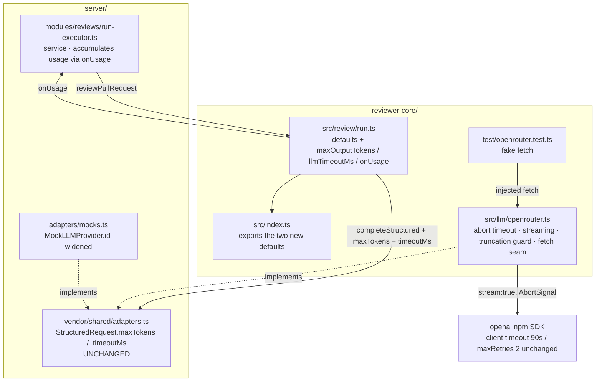

# Development Plan — long agent review runs dying with `read ECONNRESET` / `Socket timeout`

## Grounding

What I took from the files that record prior cost, in one line each:

- `reviewer-core/INSIGHTS.md` — empty (all sections `_No entries yet._`); nothing to inherit.
- `server/INSIGHTS.md` — the live lesson that bites here is **2026-08-31**: the two vendored
  contract copies already differ in four files, so a contract change is a two-sided change.
  This plan is designed to need **zero** contract edits, which sidesteps it entirely.
- `reviewer-core/AGENTS.md` invariants — no I/O except the injected `LLMProvider`; the
  grounding gate is mandatory; `src/index.ts` is the only public surface. `openrouter.ts` is
  the documented exception (it *is* a provider implementation); this plan keeps the network
  call inside that one file and adds a `fetch` injection seam rather than widening the
  exception.
- `server/AGENTS.md` invariants — `src/vendor/shared` is the canonical contracts copy and is
  never edited in place; `*.it.test.ts` is required for DB-backed tests.
- `server/src/modules/reviews/constants.ts:5-11` — the `single-pass` default is a **written,
  reasoned decision**, not an oversight. That is why candidate (f) is deferred rather than
  quietly reversed (see *Not planned*).

Facts 1–8 in the brief were spot-checked, not re-derived. Two corrections worth recording,
both verified:

1. `LLMProvider.id` in `server/src/vendor/shared/adapters.ts:81` is already
   `'openai' | 'anthropic' | 'openrouter'`, and `ContainerOverrides.llm`
   (`server/src/platform/container.ts:49`) already accepts an `openrouter` key. Only
   `MockLLMProvider` (`server/src/adapters/mocks.ts:58-64`) and the `appWith(…, provider)`
   helper in `server/test/reviews.it.test.ts:113` are narrowed to two providers. Widening is a
   local edit, not a contract change.
2. The two doc comments at `reviewer-core/src/review/run.ts:29,31` claim their defaults
   "match the server's `FILE_MAP_THRESHOLD_LINES`" and "`REVIEW_MAX_RETRIES`". Neither
   symbol exists anywhere in `server/src` any more. That is direct evidence that copying an
   engine default into `server/src/modules/reviews/constants.ts` rots — it has already
   happened twice — and it is why this plan puts the new numbers in the engine **once**
   instead of following the brief's suggestion to park a constant next to `REVIEW_STRATEGY`.

## Overview

Today a review of a large PR through the OpenRouter path is an unbounded, unstreamed,
untimed HTTP request: no output ceiling, no wall-clock limit, and a socket that sits idle for
the entire generation. Three of four agents on the observed PR died mid-body at 16–18 minutes
with `read ECONNRESET`; the one that finished took 38 minutes and 134 670 output tokens.

Afterwards: every LLM call the review engine makes is bounded in output length (64 000
tokens) and in wall-clock time (15 minutes); the OpenRouter response is **streamed**, so bytes flow
continuously and an idle intermediary has nothing to reap; a request that exceeds either
bound fails fast with a message that names the bound instead of a transport error at an
unpredictable hour; and a failed run records the tokens it actually burned rather than `0/0`.
The provider that does all of this — `reviewer-core/src/llm/openrouter.ts`, which has zero
tests today — gets a test file that drives the real SDK through an injected `fetch`.

## Requirements

- **R1** — Every `completeStructured` call issued by `reviewPullRequest` carries a non-zero
  `maxTokens`, defaulting to 64 000, overridable per call via `ReviewInput.maxOutputTokens`.
- **R2** — Every such call carries a non-zero `timeoutMs`, defaulting to 900 000 ms,
  overridable via `ReviewInput.llmTimeoutMs`.
- **R3** — `OpenRouterProvider.completeStructured` aborts the in-flight HTTP request when
  `req.timeoutMs` elapses and rejects with an error naming the elapsed budget and the
  `schemaName`. The abort must reach the transport (the `AbortSignal` handed to `fetch` is
  aborted), not merely lose a `Promise.race`.
- **R4** — The OpenRouter request is streamed: the serialized request body contains
  `"stream":true` and `"stream_options":{"include_usage":true}`, and the returned
  `StructuredResult.tokensIn` / `tokensOut` / `costUsd` are populated from the final usage
  chunk exactly as they are from `res.usage` today.
- **R5** — A response truncated by the output ceiling (`finish_reason === 'length'`) rejects
  immediately, naming truncation and the ceiling, **without** entering the repair loop — i.e.
  exactly one upstream request is issued.
- **R6** — The existing HTTP-200-with-no-`choices` guard survives the move to streaming: a
  stream that carries an `error` payload or yields no content at all rejects with the current
  `OpenRouter returned no choices for <schemaName>` message, error text appended when present.
- **R7** — When a run fails after at least one LLM call has consumed tokens, the
  `agent_runs` row records those tokens and the derived cost instead of the current hard
  `tokensIn: 0, tokensOut: 0, costUsd: null`.
- **R8** — `MockLLMProvider` accepts, stores and reports `id: 'openrouter'`, and
  `server/test/reviews.it.test.ts` drives one full review through an agent whose
  `provider` is `openrouter`.

## Chosen values, and why

| Value | Number | Reasoning |
|---|---|---|
| `DEFAULT_REVIEW_MAX_OUTPUT_TOKENS` | **64 000** (revised post-implementation; planned as 8192) | The original 8192 was reasoned from `server/src/adapters/llm/anthropic.ts:17` (`DEFAULT_MAX_TOKENS = 4096` for the same `Review` schema, doubled). That reasoning holds only for a model whose `max_tokens` bounds *content*. Querying `agent_runs` + `run_traces` for 47 completed runs against `deepseek-v4-flash` showed it does not: the emitted review body never exceeded ~1.5k tokens, while billed completion tokens for those same runs spanned 151 → 231 197, driven by reasoning length rather than findings count. **11 of the 47 billed more than 8192** — 7 of them single-pass, several carrying real findings — so the planned ceiling would have truncated ~23 % of healthy traffic. 64 000 clears the largest single-pass run observed (46 091) and still sits below the runaway cluster (134 670 / 136 763 / 231 197). |
| `DEFAULT_LLM_TIMEOUT_MS` | **900 000** (15 min) (revised post-implementation; planned as 600 000) | Re-derived from the same 47 runs rather than from a token-rate estimate. Every success finished within 622 298 ms except three runaways (2 290 928 / 2 685 941 / 5 354 347); every transport failure landed between 975 446 ms and 1 102 692 ms. Nothing occupies the gap between 622 s and 975 s. The planned 600 000 ms would have cut two runs that completed healthily at 586 s and 622 s; 900 000 ms clears them and still fires before the failure band. |
| SDK client `timeout` | **unchanged at 90 000** (`openrouter.ts:54`) | Under streaming the SDK's client timeout governs the *header* phase only. 90 s to first byte is a correct, useful guard and is now complementary to R2 rather than a substitute for it. Do not touch it, and do not start passing `timeoutMs` from `container.ts:191`. |
| SDK client `maxRetries` | **unchanged at 2** (`openrouter.ts:55`) | Streaming removes the SDK's ability to silently retry a body that died mid-flight, which is the compounding this brief worried about. Two header-phase retries are cheap and correct. |
| Added backoff / retry | **none** | See *Not planned*, candidate (c). |

> **Post-implementation amendment (2026-09-07).** Both numbers above were revised after all nine tasks landed green, on evidence from the production `devdigest` database rather than from estimates. The change is confined to the two constants and their doc comments in `reviewer-core/src/review/run.ts`; `reviewer-core/test/run.test.ts` now asserts against the exported constants instead of hard-coded literals, so the numbers live in one place. Every other decision in this plan stands as written.
>
> **Validated on a live run the same day.** With the planned 8192 still in place, 3 of 5
> agents rejected with R5's truncation message (naming `maxTokens=8192`) instead of hanging —
> the mechanism worked, the number did not. Re-run at 64 000: 5 of 5 completed, zero
> transport errors, and the two agents that billed past 8192 (36 205 and 10 410 output
> tokens) produced all 7 findings. The `read ECONNRESET` / `Socket timeout` cluster this
> plan was written against has not recurred.

## Affected modules & contracts

| Module | What changes | Contracts |
|---|---|---|
| `reviewer-core/` | `ReviewInput` gains three optional fields; two new exported defaults; `OpenRouterProvider` gains an abort-based timeout, streaming, truncation detection and a `fetch` seam; one new test file | **Consumes** `StructuredRequest.maxTokens` (`adapters.ts:61`) and `.timeoutMs` (`:62`) — both already exist and are already honoured by `openai.ts` and `anthropic.ts`. **No contract is added or edited.** |
| `server/` | `run-executor.ts` records partial usage on failure; `MockLLMProvider.id` widened to the union the port already declares | none |
| `client/` | untouched | none — and therefore `client/src/vendor/shared/` needs no regeneration, which is the whole point of designing R1/R2 onto existing fields |

`reviewer-core` aliases `@devdigest/shared` to `../server/src/vendor/shared`
(`reviewer-core/vitest.config.ts:8`, and the same alias in its `tsconfig.json`), so there is
exactly **one** copy of the port in play here. No task may edit it.

## Architecture changes

| Path | Layer / placement | Change |
|---|---|---|
| `reviewer-core/src/review/run.ts` | engine orchestration, pure | `DEFAULT_REVIEW_MAX_OUTPUT_TOKENS`, `DEFAULT_LLM_TIMEOUT_MS`; `ReviewInput.maxOutputTokens`, `.llmTimeoutMs`, `.onUsage`; the `completeStructured` call at `:177-184` gains `maxTokens` + `timeoutMs`; the chunk loop reports usage per chunk and on failure |
| `reviewer-core/src/index.ts` | the package's only public surface | export the two new constants alongside `DEFAULT_REVIEW_MAX_RETRIES` (`:41`) |
| `reviewer-core/src/llm/openrouter.ts` | provider implementation — the engine's one sanctioned I/O site | abort-based `req.timeoutMs`; `stream: true` + `stream_options.include_usage` with delta accumulation; `finish_reason === 'length'` fast-fail; usage attached to thrown errors; optional `fetch` in `OpenRouterProviderOptions` |
| `reviewer-core/test/openrouter.test.ts` | **new** | drives the real `openai` SDK against an injected fake `fetch` |
| `server/src/modules/reviews/run-executor.ts` | service layer (onion: orchestration + persistence; no SQL, no HTTP) | accumulate usage via `onUsage`; write it in the `catch` at `:344-362` instead of hard zeros |
| `server/src/adapters/mocks.ts` | adapter fakes | `MockLLMProvider.id` and its constructor param widened to `'openai' \| 'anthropic' \| 'openrouter'` |
| `server/test/reviews.it.test.ts` | integration test | `appWith`'s `provider` param widened; one openrouter-agent review case |

No route, repository, migration, container wiring or DI change. The onion is untouched:
`run-executor.ts` continues to reach the LLM only through the `LLMProvider` port resolved by
`container.llm(...)` at `:190-194`, and the new knobs travel as plain data on an existing
request object.

## Architecture diagram



## Phased tasks

### Phase 1 — stop the bleeding

- **T1** · Bound every engine LLM call in output length and wall-clock time
  - Module: `reviewer-core/` · Type: `core` · Lane: B
  - Owned paths: `reviewer-core/src/review/run.ts`, `reviewer-core/src/index.ts`,
    `reviewer-core/test/run.test.ts`
  - Depends-on: —
  - Exact edit: beside `DEFAULT_MAP_THRESHOLD_LINES` (`run.ts:30`) and
    `DEFAULT_REVIEW_MAX_RETRIES` (`:32`) add
    `export const DEFAULT_REVIEW_MAX_OUTPUT_TOKENS = 64_000;` and
    `export const DEFAULT_LLM_TIMEOUT_MS = 900_000;`. Add optional
    `maxOutputTokens?: number` and `llmTimeoutMs?: number` to `ReviewInput`. In the chunk
    loop, extend the `completeStructured` object at `:177-184` with
    `maxTokens: input.maxOutputTokens ?? DEFAULT_REVIEW_MAX_OUTPUT_TOKENS` and
    `timeoutMs: input.llmTimeoutMs ?? DEFAULT_LLM_TIMEOUT_MS` — unconditionally, not behind a
    conditional spread, since the whole defect is that these arrive `undefined`. Export both
    constants from `src/index.ts` in the existing `./review/run.js` export block (`:38-46`).
    Write the doc comments so they describe the number's own reasoning; **do not** write
    "matches the server's X" — the two comments at `:29` and `:31` that do so both point at
    symbols that no longer exist.
  - Risk: the map-reduce path issues one call per file, so the ceiling is per call, not per
    review — correct, but state it in the doc comment so nobody later reads it as a run budget.
  - Acceptance → R1, R2: `reviewer-core/test/run.test.ts` gains a case that runs
    `reviewPullRequest` with a `MockLLMProvider` and asserts that the recorded
    `llm.calls[0].req` has `maxTokens === DEFAULT_REVIEW_MAX_OUTPUT_TOKENS` and
    `timeoutMs === DEFAULT_LLM_TIMEOUT_MS` (asserted against the exported constants, not
    literals, so the numbers live in one place), plus a second
    case passing `maxOutputTokens: 1234` / `llmTimeoutMs: 5678` and asserting both are
    forwarded. Verified by `cd reviewer-core && npm test`.

- **T2** · Make `req.timeoutMs` real for OpenRouter, and make it abort the socket
  - Module: `reviewer-core/` · Type: `core` · Lane: A
  - Owned paths: `reviewer-core/src/llm/openrouter.ts`
  - Depends-on: —
  - Exact edit: in `completeStructured` (`:59-116`), when `req.timeoutMs` is set, create an
    `AbortController` per attempt, arm a `setTimeout` that calls `abort()`, and pass
    `{ signal: controller.signal }` as the SDK's second `RequestOptions` argument to
    `this.client.chat.completions.create(body, options)` — `RequestOptions` declares both
    `signal` and `timeout` (`openai/core.d.ts:205-221`). Clear the timer in a `finally`.
    Translate an abort into
    `` `OpenRouter request for ${req.schemaName} exceeded ${req.timeoutMs}ms` `` so the run log
    names the budget. Also add `fetch?: ClientOptions['fetch']` to
    `OpenRouterProviderOptions` and forward it into `new OpenAI({...})` at `:50-56` — this is
    the injection seam T4 needs, and it keeps `openrouter.ts` the only file in the package
    that touches the network.
  - Risk: `Promise.race`-style timeouts (the shape `server/src/platform/resilience.ts:13`
    uses) leave the request running. Do not copy that shape here — `resilience.ts` is server
    code and `reviewer-core` must not import it; abort is both the correct fix and the only
    one available.
  - Acceptance → R3: `reviewer-core/test/openrouter.test.ts` (T4) constructs the provider with
    a fake `fetch` that captures its `AbortSignal` and never resolves, calls
    `completeStructured` with `timeoutMs: 50`, asserts the promise rejects with a message
    containing `50ms` and that the captured signal's `aborted` is `true`.

- **T3** · Stream the OpenRouter completion and stop generating past the ceiling
  - Module: `reviewer-core/` · Type: `core` · Lane: A
  - Owned paths: `reviewer-core/src/llm/openrouter.ts`
  - Depends-on: T2 (same file; sequential)
  - Exact edit: replace the one-shot `create()` + `res.choices?.[0]` read (`:69-98`) with
    `stream: true` plus `stream_options: { include_usage: true }`, iterating the returned
    `Stream<ChatCompletionChunk>` and concatenating `chunk.choices[0]?.delta?.content` into
    `lastRaw`. Read `usage` off the final chunk (`include_usage` makes the SDK emit a trailing
    usage-only chunk) and keep the existing accumulation at `:94-98` byte-for-byte, including
    the OpenRouter `usage.cost` extension read. Preserve the no-choices guard: if the stream
    ends having produced no content, throw the same
    `OpenRouter returned no choices for <schemaName>` message, appending any `error.message`
    seen on a chunk. Add the truncation guard: if the last chunk's
    `choices[0].finish_reason === 'length'`, `throw` immediately — before `parseWithRepair`
    and before the loop's next iteration — with a message naming the ceiling and the
    `maxTokens` value, so the repair loop never re-sends a full prompt for a response that was
    cut off rather than malformed.
  - Risk: TypeScript picks the non-streaming `create` overload when `stream` is widened to
    `boolean` by a spread. Write `stream: true` as a literal member of a body object typed
    `ChatCompletionCreateParamsStreaming` (`openai/resources/chat/completions/completions.d.ts:1332`),
    which resolves to the `APIPromise<Stream<ChatCompletionChunk>>` overload at `:43`. Second
    risk: streaming changes what "success" looks like for a run — a review that previously
    succeeded at 134 670 tokens now fails at the ceiling. That is intended (see *Risks*), and R5's
    message is what makes it actionable.
  - Acceptance → R4, R5, R6: three cases in `reviewer-core/test/openrouter.test.ts` (T4) —
    (i) a fake `fetch` returning a canned SSE body asserts the captured request body parses to
    `stream === true` and `stream_options.include_usage === true`, and that the result's
    `tokensIn`/`tokensOut`/`costUsd` come from the usage chunk; (ii) an SSE body whose last
    chunk carries `finish_reason: 'length'` rejects with a message containing `8192` and the
    fake `fetch` was called exactly once; (iii) an SSE body carrying only an `error` payload
    rejects with `returned no choices`.

- **T4** · First test coverage for `OpenRouterProvider`
  - Module: `reviewer-core/` · Type: `core` · Lane: A
  - Owned paths: `reviewer-core/test/openrouter.test.ts` (new file)
  - Depends-on: T2, T3
  - Exact edit: create the file. Build a fake `fetch` helper that returns a `Response` whose
    body is a canned `text/event-stream` string, and pass it through
    `new OpenRouterProvider('test-key', { fetch: fakeFetch, estimateCost })`. Prefer this over
    `vi.mock('openai')`: it exercises the real SDK's stream parsing and the real abort plumbing,
    and it is a fake rather than a call-shape mock, matching the repo's stated preference. The
    file holds the four cases named in T2's and T3's acceptance, plus a happy-path case
    asserting a valid `Review` JSON parses and `attempts === 1`.
  - Risk: none to product code — this is the first file in the package that constructs the
    provider, so a compile error here is a genuine finding, not test noise.
  - Acceptance → R3, R4, R5, R6: `cd reviewer-core && npx vitest run test/openrouter.test.ts`
    passes with 5 cases, and `cd reviewer-core && npm run typecheck` is clean. The file is
    picked up by CI automatically — `.github/workflows/reviewer-core.yml` runs `npm test`
    with `include: ['test/**/*.test.ts', …]` (`reviewer-core/vitest.config.ts:16`).

### Phase 2 — attribution and provider coverage from the server

- **T5** · Attach consumed usage to the errors `OpenRouterProvider` throws
  - Module: `reviewer-core/` · Type: `core` · Lane: A
  - Owned paths: `reviewer-core/src/llm/openrouter.ts`
  - Depends-on: T3
  - Exact edit: the schema-validation throw at `:115` discards `tokensIn` / `tokensOut` /
    `costFromApi` accumulated across up to three completed round-trips — and T1's ceiling makes
    that path *more* likely, since a truncated body is a parse failure. Define a local
    `class StructuredCallError extends Error` in this file carrying `tokensIn`, `tokensOut`,
    `costUsd` and `attempts` as own properties, and throw it from all four throw sites
    (no-choices, truncation, timeout, schema-validation) with whatever has accumulated so far.
    Keep it local: do **not** add it to `src/index.ts`, because the consumer reads the fields
    structurally (T6) and an exported error class would be a new public surface for no gain.
  - Risk: nothing may wrap or replace the existing error *messages* — `run-executor.ts:348`
    persists `(err as Error).message` verbatim and the UI shows it. Extend, don't rename.
  - Acceptance → R7: a case in `reviewer-core/test/openrouter.test.ts` feeds two SSE responses
    that each return well-formed usage but schema-invalid JSON, with `maxRetries: 1`, and
    asserts the rejected error's `tokensOut` equals the sum of both usage chunks.

- **T6** · Surface per-chunk and on-failure usage out of the engine
  - Module: `reviewer-core/` · Type: `core` · Lane: B
  - Owned paths: `reviewer-core/src/review/run.ts`, `reviewer-core/test/run.test.ts`
  - Depends-on: T1, T5
  - Exact edit: add
    `onUsage?: (u: { tokensIn: number; tokensOut: number; costUsd: number | null }) => void`
    to `ReviewInput`, documented in the same injection style as the neighbouring `onEvent`
    (`:86`) and `checkCancelled` (`:93`). Call it after each successful chunk in the loop
    (`:186-189`), and wrap the `completeStructured` call in a `try`/`catch` that, when the
    caught error carries numeric `tokensIn`/`tokensOut` own properties, fires `onUsage` with
    them **before rethrowing the original error unchanged** — rethrowing a wrapper would break
    `err instanceof RunCancelledError` at `run-executor.ts:345`.
  - Risk: `onUsage` must never throw into the run. Guard the call the way `emit` guards
    `onEvent` (optional call, no await).
  - Acceptance → R7: a case in `reviewer-core/test/run.test.ts` passes an `onUsage` sink and a
    provider stub that throws an error carrying `{ tokensIn: 900, tokensOut: 300 }`, and
    asserts the sink received those numbers and that the original error propagated.

- **T7** · Record real token usage on a failed run
  - Module: `server/` · Type: `backend` · Lane: B
  - Owned paths: `server/src/modules/reviews/run-executor.ts`
  - Depends-on: T6
  - Exact edit: in `runOneAgent`, declare running `tokensInSoFar` / `tokensOutSoFar` /
    `costSoFar` before the `try`, pass `onUsage` into the `reviewPullRequest` call
    (`:230-260`) to accumulate them, and in the `catch` replace the hard
    `tokensIn: 0, tokensOut: 0, costUsd: null` at `:349-351` with those running totals.
    Cost accumulates with the same null-poisoning rule the engine already uses at `run.ts:185`
    (any `null` share makes the total `null`). Add one `runLog.info` line reporting the
    consumed tokens on failure so the Live Log shows it too. Leave `findingsCount: 0` and
    `grounding: '0/0 passed'` alone — those are correct for a failed run.
  - Risk: `agent_runs.tokens_in` / `tokens_out` feed the Stats/observability surfaces; a
    failed run now contributes non-zero tokens where it contributed zero. That is the
    intended correction (the tokens were genuinely billed), but any aggregate that assumed
    "failed ⇒ free" changes value. No schema or contract change is needed — the columns exist
    and already accept these values.
  - Acceptance → R7: a server unit test asserts that when the injected provider throws an
    error carrying `tokensIn`/`tokensOut`, `completeAgentRun` is called with those values and
    `status: 'failed'`. Verified by
    `cd server && pnpm exec vitest run --exclude '**/*.it.test.ts'`.

- **T8** · Let the mock provider be an OpenRouter provider
  - Module: `server/` · Type: `backend` · Lane: C
  - Owned paths: `server/src/adapters/mocks.ts`
  - Depends-on: —
  - Exact edit: widen `MockLLMProvider.id` and its constructor parameter (`:58-64`) from
    `'openai' | 'anthropic'` to `'openai' | 'anthropic' | 'openrouter'` — the union the port
    already declares at `server/src/vendor/shared/adapters.ts:81`. In `listModels` (`:70-77`)
    the `provider` field must report `this.id` rather than the current two-way ternary.
  - Risk: none structurally — `ContainerOverrides.llm` (`container.ts:49`) already keys on all
    three. Be explicit in the docblock that this fake replaces the provider wholesale and
    therefore gives **no** coverage of `OpenRouterProvider`; T4 is what covers that file.
  - Acceptance → R8: `cd server && pnpm typecheck` is clean and
    `cd server && pnpm exec vitest run --exclude '**/*.it.test.ts'` still passes.

- **T9** · Exercise the openrouter provider path end to end from the server
  - Module: `server/` · Type: `backend` · Lane: C
  - Owned paths: `server/test/reviews.it.test.ts`
  - Depends-on: T8
  - Exact edit: widen the `provider` parameter of `appWith` (`:113`) to the three-provider
    union, then add one case that creates an agent with `provider: 'openrouter'`, runs a
    review through it against the existing `DIFF` fixture, and asserts the review persists
    with findings — proving that `container.llm('openrouter')` resolves the injected override
    and that nothing on the openrouter branch of `run-executor` is broken.
  - Risk: this is a `*.it.test.ts` and needs Docker; it runs in the `server-integration` CI
    lane, not the unit lane. Do not rename it out of that suffix.
  - Acceptance → R8: `cd server && pnpm exec vitest run .it.test` passes including the new
    openrouter case.

## Dependency DAG

```
T1 ──────────────► T6 ──► T7
T2 ──► T3 ──► T4
       T3 ──► T5 ──► T6
T8 ──► T9
```

Acyclic: T1, T2 and T8 are roots; every edge points forward; T6 is the only node with two
predecessors and neither reaches back to it.

## Lanes

- **Lane A** · tasks: T2, T3, T4, T5 — *the provider*
  - owns: `reviewer-core/src/llm/openrouter.ts`, `reviewer-core/test/openrouter.test.ts`
  - others own: `reviewer-core/src/review/run.ts`, `reviewer-core/src/index.ts`,
    `reviewer-core/test/run.test.ts`, `server/src/modules/reviews/run-executor.ts`,
    `server/src/adapters/mocks.ts`, `server/test/reviews.it.test.ts`
- **Lane B** · tasks: T1, T6, T7 — *the wiring, engine through service*
  - owns: `reviewer-core/src/review/run.ts`, `reviewer-core/src/index.ts`,
    `reviewer-core/test/run.test.ts`, `server/src/modules/reviews/run-executor.ts`
  - others own: `reviewer-core/src/llm/openrouter.ts`,
    `reviewer-core/test/openrouter.test.ts`, `server/src/adapters/mocks.ts`,
    `server/test/reviews.it.test.ts`
- **Lane C** · tasks: T8, T9 — *provider coverage from the server side*
  - owns: `server/src/adapters/mocks.ts`, `server/test/reviews.it.test.ts`
  - others own: everything under `reviewer-core/`, and
    `server/src/modules/reviews/run-executor.ts`

**What runs in parallel:** T1 (Lane B), T2 (Lane A) and T8 (Lane C) start simultaneously —
disjoint files, no shared symbol. Lane C then runs to completion independently of both others.

**What must be sequential:** T2 → T3 → T4 → T5 within Lane A, because all four edit the same
function in the same file. T6 blocks on Lane A's T5 (it reads the properties T5 attaches), and
T7 blocks on T6 (it consumes the `onUsage` callback T6 adds).

**Cross-package note for every lane:** `server` type-checks and runs `reviewer-core`'s raw
`.ts` through a tsconfig alias, so a Lane A or Lane B edit lands in `server`'s typecheck with
no build step in between. `reviewer-core/node_modules` must exist or the server dies at boot
with `ERR_MODULE_NOT_FOUND` (root `CLAUDE.md`). Run `npm ci` in `reviewer-core` before any
`server` command.

## Testing strategy

Each command runs from **inside** its own package directory; the package managers differ and
mixing them breaks `--frozen-lockfile` in CI.

| Module | Command | Covers |
|---|---|---|
| `reviewer-core/` | `cd reviewer-core && npm run typecheck` | T1–T6 compile, against the aliased `@devdigest/shared` |
| `reviewer-core/` | `cd reviewer-core && npm test` | the whole engine suite incl. the new `test/openrouter.test.ts` |
| `reviewer-core/` | `cd reviewer-core && npx vitest run test/openrouter.test.ts` | the tight loop for Lane A (R3–R6) |
| `reviewer-core/` | `cd reviewer-core && npx vitest run test/run.test.ts` | the tight loop for Lane B's engine half (R1, R2) |
| `server/` | `cd server && pnpm typecheck` | T7, T8, plus reviewer-core's raw source through the alias |
| `server/` | `cd server && pnpm exec vitest run --exclude '**/*.it.test.ts'` | T7's usage-on-failure case, T8's widening (unit lane, no Docker) |
| `server/` | `cd server && pnpm exec vitest run .it.test` | T9's openrouter review (needs Docker) |

`server/package.json` is `skip-worktree`, so its `test` script is not what CI runs — always
invoke `pnpm exec vitest run …` directly, as `.github/workflows/server-unit.yml:99` does.

No test in this plan makes a network call: `reviewer-core`'s provider tests drive the SDK
through an injected `fetch`, and the server's go through `MockLLMProvider`.

## Risks & mitigations

| Risk | Mitigation |
|---|---|
| **A review that used to succeed now fails.** The 38-minute / 134 670-token run hits the 64 000 ceiling and rejects under R5. | Accepted deliberately: a 38-minute review is not a usable product, and three of its four siblings died anyway. R5's message names the ceiling and the knob, R7 records the tokens burned, and `ReviewInput.maxOutputTokens` raises it without a code change. **Borne out in practice:** the ceiling was revisited immediately (see the amendment under *Chosen values*) precisely because the planned 8192 rejected healthy runs; at 64 000 a live 5-agent run had two agents bill 36 205 and 10 410 output tokens and carry all 7 findings between them, with no rejection. |
| **Streaming changes the shape of every failure on this path.** The no-choices guard, the usage read and the cost extension all move from one object to a chunk sequence. | R4 and R6 exist precisely to pin those three behaviours, and T4 is the first test this file has ever had. Do not merge T3 without T4. |
| **`stream: true` resolves to the wrong SDK overload** and the code silently type-checks against `ChatCompletion` instead of `Stream<ChatCompletionChunk>`. | Type the request body as `ChatCompletionCreateParamsStreaming` explicitly (T3's risk note). `npm run typecheck` in `reviewer-core` catches it. |
| **Timeouts stack invisibly.** Three timeout mechanisms now exist on this path: the SDK client's 90 s header timeout, R2's 600 s abort, and the SDK's two retries. | The plan changes exactly one of them and documents the other two as intentional in the *Chosen values* table. No hand-rolled retry is added (candidate (c), deferred), so nothing multiplies. |
| **Failed runs suddenly report non-zero cost** (T7), moving any aggregate that assumed failures were free. | It is a correction, not a regression — the tokens were billed. Flagged here so whoever reads the Stats tab afterwards knows why the numbers moved. Requires no migration; the columns already accept these values. |
| **Cross-package typecheck coupling.** A Lane A edit can break `server`'s typecheck with no build step in between. | Every lane runs `cd server && pnpm typecheck` before declaring done, after `npm ci` in `reviewer-core`. |

## Red-flags check

- Every task has a `Type` and at least one Owned path — **pass** (T1–T9 all carry both).
- Every task's `Type` matches the paths it owns — **pass** (`core` ⇔ `reviewer-core/**`;
  `backend` ⇔ `server/**`).
- Every task's `Type` is one of `backend`, `ui`, `core`, `e2e` — **pass** (six `core`, three
  `backend`; no `ui` or `e2e` work exists in this change).
- No two lanes own the same path — **pass** (A: `src/llm/openrouter.ts` + its test; B:
  `src/review/run.ts`, `src/index.ts`, `test/run.test.ts`, `run-executor.ts`; C:
  `mocks.ts`, `reviews.it.test.ts` — three disjoint sets).
- The dependency graph is acyclic — **pass** (roots T1/T2/T8; all edges forward; verified above).
- Every requirement has at least one Acceptance referencing it — **pass** (R1,R2→T1; R3→T2,T4;
  R4,R5,R6→T3,T4; R7→T5,T6,T7; R8→T8,T9).
- Every verification command is a real command of that module — **pass**: `npm test` /
  `npm run typecheck` are declared in `reviewer-core/package.json:7-10`; `pnpm typecheck` and
  `pnpm exec vitest run --exclude '**/*.it.test.ts'` are what
  `.github/workflows/server-unit.yml:66,99` actually run.
- The diagram names the same modules and paths as *Architecture changes* — **pass** (all seven
  paths in the table appear as nodes; the `openai` SDK and the unchanged port are shown as
  boundaries).
- No task owns a lockfile, a root config, an existing contract under `src/vendor/shared/`, an
  already-merged migration, or anything under `server/clones/` — **pass**. R1 and R2 are
  designed onto `StructuredRequest.maxTokens` / `.timeoutMs`, which already exist
  (`adapters.ts:61-62`) and are already honoured by two of three providers, so no contract
  edit is needed and none is authorised. No migration; no `db/schema` change; no
  `package.json` or lockfile touched in any package.

## Not planned

Deliberately out of scope, each with the reason:

- **(c) A hand-rolled retry with backoff around `create()`.** It compounds multiplicatively
  with the SDK's own `maxRetries: 2` (`openrouter.ts:55`) and the parse-repair loop
  (`:68-114`) — worst case 18 full-prompt sends of a diff that is already the thing timing
  out. Streaming (T3) removes the idle-socket cause, and the SDK already retries transport
  errors in the header phase. Revisit only if post-Phase-1 telemetry still shows
  `ECONNRESET` — R7 is what will make that measurable.
- **(f) Changing the `single-pass` default.** `server/src/modules/reviews/constants.ts:5-11`
  documents this as a considered trade ("map-reduce makes one call PER FILE, which is slow and
  fragile — any single file's transient 5xx fails the entire run"). Reversing it swaps one
  failure mode for another and is a product decision, not a bug fix. The related observation —
  that `run.ts:119`'s early return makes the `totalLines > 400` branch unreachable — is **not
  a defect in `run.ts`**: that branch is reachable whenever `strategy` is `'auto'`, and the
  `strategy` column (`server/src/db/schema/agents.ts:19-22`) already accepts `'auto'`
  per-agent. Nothing in the engine needs changing to use it; only the default would.
- **An idle/stall timer on the stream** (reset per chunk). Redundant once generations are
  capped at 64 000 tokens and bounded by a 15-minute wall clock; add it only if a stream is
  observed hanging with the ceiling in place.
- **Porting the abort-based timeout back into `openai.ts` / `anthropic.ts`.** Both already
  honour `req.timeoutMs`, just via `Promise.race` (`server/src/platform/resilience.ts:13`),
  which leaks the underlying request. Real, but a different defect on a path that is not
  failing; it deserves its own change.
- **A per-agent UI knob for the output ceiling** (an `agents` column plus an Agent-editor
  field). Would need a migration, a contract change and a client change — three boundaries
  this plan is specifically shaped to avoid. `ReviewInput.maxOutputTokens` is the seam it
  would eventually plug into.
- **Recording `finish_reason` / attempt counts in `run_traces`.** Useful diagnostics, but a
  jsonb-document field addition governed by the `.nullish()` rule in `server/INSIGHTS.md`
  (2026-08-29), and not needed to prove any requirement here.
- **Anything under `client/`.** No contract changes means no client-side vendored-shared
  regeneration and no UI work.
