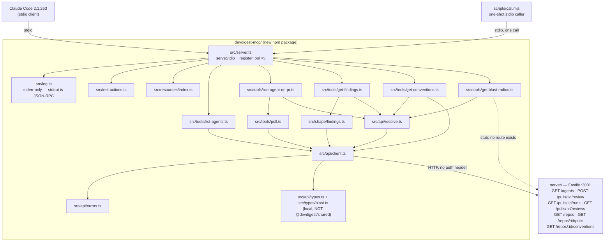

# Development Plan — `devdigest-mcp`: a stdio MCP server exposing DevDigest review to Claude Code

## Grounding

- Root `INSIGHTS.md:27-42` — an Acceptance line must name a command **and** an assertion that
  command actually runs; a green suite is not evidence for a claim it never makes. Every
  Acceptance below therefore names the assertion, and where the assertion does not exist yet
  the task that writes it is the same task that claims it.
- `server/AGENTS.md` Invariants — `repo-intel` is reached **only** through
  `container.repoIntel.*`; `src/vendor/shared` is the canonical contracts copy and is never
  edited in place; a DB-backed test must be `*.it.test.ts`. This plan touches **no** file under
  `server/` at all, which is how it holds all three.
- `TESTING.md` — one suite per package, its own runner, its own workflow, its own `paths:`
  filter. A fifth package therefore needs a fifth workflow or it gets zero CI.
- `server/INSIGHTS.md:115-132` — `reapStaleRuns()` on boot writes bare
  `.set({ status: 'failed' })`. Consumed as R5 below.
- `server/INSIGHTS.md:70-86` — barrel `export *` name collisions are silent. Consumed as R14:
  this package declares **local** types and adds no third copy of the contracts.
- `docs/plans/06-devdigest-mcp-server-comparison.md` — the conceptual comparison against orig's
  shipped `mcp-server/`. Three mechanisms it found on orig's side and none on this plan's are
  ported here rather than left in the comparison: the stdout rule (R15), the pinned client
  deadline and the one-shot harness (R16). Its *Keep* items are already requirements (R13, R5)
  and are unchanged. Two of its *Settle* questions are resolved below — v1 is named as T1's
  fallback, and `offset` joins `severity` in R6; the third (whether the blast stub's wire shape
  survives the later lesson) is **not** resolved and stays R8 as written.

## Overview

Afterwards, a Claude Code session anywhere on this machine can review a DevDigest pull request
without leaving the conversation: list the configured reviewer agents, start a review on a PR
and **wait for it**, read back a completed review's verdict and findings, and read the repo's
extracted conventions. A fifth tool, `get_blast_radius`, is registered as an honest stub shaped
to the wire contract so a later lesson implements a mapper and a route rather than a contract
change.

Today none of this is reachable from an agent: the API is HTTP-only, `POST /pulls/:id/review`
returns before the review exists, and there is no MCP surface of any kind in the tree.

## Requirements

- **R1** — The protocol era Claude Code 2.1.263 negotiates with
  `@modelcontextprotocol/server@2.0.0` is *observed*, not assumed, and the observation is
  recorded in `devdigest-mcp/README.md` before any era-dependent behaviour is written.
- **R2** — The server registers **exactly five** tools: `list_agents`, `run_agent_on_pr`,
  `get_findings`, `get_conventions`, `get_blast_radius`. A test asserts the registered set
  equals that five-name set (no more, no fewer).
- **R3** — `list_agents` never emits `Agent.system_prompt`, on any code path. A test asserts the
  serialized result contains neither the key `system_prompt` nor the prompt text of a fixture
  agent.
- **R4** — `run_agent_on_pr` does not return while the run is `running`: it polls
  `GET /pulls/:id/runs` until every started run reaches a terminal status (`done` / `failed` /
  `cancelled`), emitting one progress notification per poll, and on exceeding `timeout_s`
  returns the `run_ids` with a "call `get_findings` later" instruction rather than throwing.
- **R5** — A run row with `status:'failed'`, `error:null` **and** `duration_ms:null` is reported
  as *"the API restarted mid-run (stale-run reaper) — this is not a review failure; re-run"*,
  distinct from a run that failed with a real `error` string.
- **R6** — `get_findings` supports `detail: concise|full`, a `severity` filter over
  `CRITICAL|WARNING|SUGGESTION`, a `limit` (default 20, max 100) **and an `offset` (default 0)**.
  `concise` omits the two markdown size drivers (`rationale`, `suggestion`); `full` includes
  them. A test asserts both the omission and the inclusion on one fixture. Filter and window are
  independent axes — orig's server has the window and not the filter, this one has both.
- **R7** — `get_conventions` accepts a repo uuid **or** `owner/repo`, and supports a
  `status: pending|accepted|rejected` filter and a `limit`. `concise` omits
  `ConventionEvidence.snippet`.
- **R8** — `get_blast_radius` returns a payload that parses against the **wire** shape
  `{changed_symbols, downstream[{symbol, callers, endpoints_affected, crons_affected}], summary}`
  (`server/src/vendor/shared/contracts/brief.ts:16-44`, snake_case), with empty arrays and a
  `summary` that says it is not implemented. A test asserts the returned object satisfies a
  locally-declared schema with those exact key names.
- **R9** — `run_agent_on_pr` and `get_findings` accept a PR uuid **or** `owner/repo#N`;
  `get_conventions` and `get_blast_radius` accept a repo uuid **or** `owner/repo`. The
  human-form path is the only way an agent can reach a PR, because **none of the five tools
  returns a PR id**. The tool description states that resolving `owner/repo#N` triggers a
  GitHub sync that backfills up to 10 PRs (`server/src/modules/pulls/routes.ts:89`).
- **R10** — Every non-2xx API response is turned into tool-visible text built from the envelope's
  `error.code` (`contracts/platform.ts:274-280`), with a named next action for at least these
  four: `invalid_run_request` → "pass `agent_id` or `all_agents`", 404 on run → "call
  `list_agents` for a valid id", 429 → "the review route is capped at 10/min; wait and retry",
  500 → "the API is up but the database may be unseeded — run `pnpm db:seed` in `server/`".
- **R11** — The server's `instructions` string is **one line** stating call order. All reference
  prose (score rubric, severity vocabulary, blast-radius explainer) is exposed as MCP
  **Resources**, which cost nothing at session start.
- **R12** — Each of the three tools whose result can overrun (`get_findings`,
  `get_conventions`, `list_agents`) declares `_meta["anthropic/maxResultSizeChars"]` and offers
  at least one filter parameter, so a truncation message points at something real.
- **R13** — `cd devdigest-mcp && npm run typecheck && npm test` is green, and a
  `.github/workflows/mcp.yml` runs exactly that — plus the R15 stdout guard — under a `paths:`
  filter that includes `devdigest-mcp/**` and the workflow file itself.
- **R14** — No file under `server/`, `client/`, `reviewer-core/` or `e2e/` is modified. The new
  package declares its own narrow local types and adds **no** third copy of
  `@devdigest/shared`. Verified by `git status --porcelain` listing nothing outside
  `devdigest-mcp/`, `.github/workflows/mcp.yml`, `.mcp.json`, `AGENTS.md`, `TESTING.md` and
  `docs/plans/`.

- **R15** — **stdout is the JSON-RPC channel and nothing else writes to it.** All logging goes
  through `devdigest-mcp/src/log.ts`, which writes to `stderr` via `console.error`. No file under
  `devdigest-mcp/src/` or `devdigest-mcp/scripts/` calls `console.log`, and CI fails if one does.
  A single stray stdout write corrupts the protocol with no error message, which is why this is a
  checked property and not a convention.

- **R16** — The server is reachable without hand-wiring, and its client-side deadline is a
  known number rather than an unobserved default: a committed root `.mcp.json` registers the
  server and sets `env.MCP_TOOL_TIMEOUT` **above** `run_agent_on_pr`'s own `timeout_s` default,
  so the tool always wins the race and returns its own "still running" result instead of being
  cut off. `devdigest-mcp/scripts/call.mjs` calls one tool over stdio in one shot, so every tool
  can be exercised without a Claude Code session.
  **Status (2026-09-09): fulfilled.** T13 originally shipped this; the committed `.mcp.json`
  was later removed and the docs (`devdigest-mcp/README.md`, both `AGENTS.md` files) rewritten
  to describe on-demand `claude mcp add` registration instead — with no `INSIGHTS.md` entry
  recording why. That divergence is reversed as of this date: `.mcp.json` is committed again
  at the repo root exactly as specified below, and the three docs are restored to describe
  automatic registration. If on-demand registration is ever chosen again, record the reason in
  `devdigest-mcp/INSIGHTS.md` this time.

## Affected modules & contracts

| Module | What changes |
|---|---|
| `devdigest-mcp/` (**new**, npm) | The whole package. Standalone; no path alias to `@devdigest/shared`, no dependency on any other package's source. |
| `server/` | **Nothing.** Consumed over HTTP at `http://localhost:3001` only. |
| `client/`, `reviewer-core/`, `e2e/` | **Nothing.** |
| root | `.github/workflows/mcp.yml` (new), `.mcp.json` (new — registers the server and pins `MCP_TOOL_TIMEOUT`, R16), `AGENTS.md` and `TESTING.md` (a fifth package must appear in the repo shape and the suite map, or both files become wrong). |

**Contracts.** None are added to, or edited in, `src/vendor/shared/`. The two vendored copies
(server + client) are already out of sync (`server/INSIGHTS.md:88-99`); aliasing a third
consumer into them would make that a three-way problem, and `BlastRadius`, `Finding`,
`ReviewRecord`, `Agent`, `RunSummary` and `ConventionScan` are all already taken in a barrel
whose collisions are silent. This package therefore declares **response-shaped local types** in
`devdigest-mcp/src/api/types.ts` and `devdigest-mcp/src/types/blast.ts`, narrowed to the fields
the five tools actually read. The cost is a drift risk against the server's contracts; the
mitigation is in *Risks*.

## Architecture changes

Layering inside the package, outermost last:

| Path | Layer |
|---|---|
| `devdigest-mcp/src/log.ts` | the **only** sanctioned output path — `console.error` to stderr (R15); stdout belongs to JSON-RPC |
| `devdigest-mcp/src/api/types.ts` | local response types — the only place a server field name is spelled |
| `devdigest-mcp/src/api/errors.ts` | `error.code` → actionable text (R10) |
| `devdigest-mcp/src/api/client.ts` | the single `fetch` chokepoint; base URL from `DEVDIGEST_API_BASE` (default `http://localhost:3001`); sends **no** auth header |
| `devdigest-mcp/src/api/resolve.ts` | `owner/repo#N` → PR uuid, `owner/repo` → repo uuid (R9) |
| `devdigest-mcp/src/shape/findings.ts` | `concise`/`full` projection + severity/limit filters (R6) |
| `devdigest-mcp/src/tools/poll.ts` | terminal-status polling + progress notifications + reaper detection (R4, R5) |
| `devdigest-mcp/src/tools/*.ts` | one file per tool, each exporting `register<Name>(server)` |
| `devdigest-mcp/src/resources/index.ts` | score rubric, severity vocabulary, blast explainer (R11) |
| `devdigest-mcp/src/instructions.ts` | the one-line `instructions` string (R11) |
| `devdigest-mcp/src/server.ts` | composition root — builds the server, calls the five `register*`, then `serveStdio` |
| `devdigest-mcp/probe/probe.ts` | Phase 0 only; a one-tool server that answers the era question (T2) |
| `devdigest-mcp/scripts/call.mjs` | one-shot stdio harness: spawn a server, call one tool, print, exit (R16) |

Nothing under `src/tools/` imports another tool. Every tool reaches the API only through
`src/api/client.ts`.

## Architecture diagram



## Phased tasks

### Phase 0 — Compatibility probe (nothing else may start)

- **T1** · Scaffold the package: `package.json` (`name` `@devdigest/mcp`, `private`, `type:
  module`, `engines.node >=22`, scripts `typecheck` = `tsc --noEmit -p tsconfig.json`, `test` =
  `vitest run --passWithNoTests`, `probe` = `tsx probe/probe.ts`), `tsconfig.json` copied in
  shape from `reviewer-core/tsconfig.json` **minus its `paths` block**, `vitest.config.ts` with
  `include: ['test/**/*.test.ts']` and **no** alias, `.gitignore` for `node_modules`. Install
  `@modelcontextprotocol/server@2.0.0`, `zod@^4.2.0`, and dev `tsx`, `typescript`, `vitest`,
  `@types/node` with **npm** (`npm install`, producing `devdigest-mcp/package-lock.json`).
  - Module: `devdigest-mcp/` · Type: `core` · Lane: A
  - Owned paths: `devdigest-mcp/package.json`, `devdigest-mcp/package-lock.json`,
    `devdigest-mcp/tsconfig.json`, `devdigest-mcp/vitest.config.ts`, `devdigest-mcp/.gitignore`
  - Depends-on: —
  - Risk: `zod@^4` is a major ahead of `reviewer-core`'s `zod@^3`. Because there is no alias and
    no shared source, the two never meet — but only as long as no `paths` entry is added. Do not
    add one.
  - **Named fallback, not an assumption.** If T2's probe shows the v2 server cannot connect at
    all, fall back to `@modelcontextprotocol/sdk@^1` + `zod@^3` — the generation orig's
    `mcp-server/` is shipping against this same client today
    (`docs/plans/06-devdigest-mcp-server-comparison.md`, Divergence 1). That swap changes three
    things and nothing else: the entry point becomes `new StdioServerTransport()` +
    `server.connect(transport)`, `inputSchema` becomes a raw zod shape record instead of
    `z.object({...})`, and the imports become `@modelcontextprotocol/sdk/server/mcp.js` /
    `…/server/stdio.js`. It also re-opens the local-types decision (R14), because on zod 3 a
    `paths` alias into the server's contracts stops being hazardous — record that as a follow-up
    rather than acting on it inside this plan.
  - Acceptance → R13: `cd devdigest-mcp && npm run typecheck` exits 0 on the empty `src/`, and
    `node -e "console.log(require('./node_modules/@modelcontextprotocol/server/package.json').version)"`
    run from `devdigest-mcp/` prints `2.0.0`.

- **T2** · Write the probe and the harness that drives it, and observe the negotiated era.
  `probe/probe.ts` builds a
  v2 server with a single tool `probe_era` whose handler (a) writes
  `JSON.stringify(extra._meta)` to `process.stderr`, and (b) **returns** the observed value of
  `_meta["io.modelcontextprotocol/protocolVersion"]` (or the literal string `absent`) as its
  text content — the return is the primary evidence because it lands in the transcript, the
  stderr line is the backup for when the tool cannot be called at all. Entry point is the
  **function** `serveStdio` from `@modelcontextprotocol/server/stdio`, not v1's
  `new StdioServerTransport()` + `server.connect()`. Register it with
  `claude mcp add devdigest-probe -- npx tsx <abs path>/devdigest-mcp/probe/probe.ts`, call
  `probe_era` from a Claude Code session, then `claude mcp remove devdigest-probe`. Record the
  result verbatim under a `## Protocol era` heading in `devdigest-mcp/README.md`, as one of
  **`2026-07-28` (present)** or **`legacy` (absent)**, with the date observed.
  **The harness the probe is driven by is permanent, and the probe is not.** Write
  `scripts/call.mjs` in this task rather than reaching for `claude mcp add`: it spawns a server
  over stdio, performs the handshake, calls exactly one tool with a JSON argument, prints the
  result to stdout and exits — `node scripts/call.mjs probe/probe.ts probe_era` here, and every
  real tool later (`npm run call -- src/server.ts list_agents '{}'`). It honours
  `DEVDIGEST_API_BASE`. This is the mechanism orig has and this plan did not
  (`…-comparison.md`, *Where orig is stronger* #1); having it makes T14 scriptable and every
  tool exercisable without a Claude Code session. `package.json` gains
  `"call": "node scripts/call.mjs"`.
  - Module: `devdigest-mcp/` · Type: `core` · Lane: A
  - Owned paths: `devdigest-mcp/probe/**`, `devdigest-mcp/scripts/call.mjs`,
    `devdigest-mcp/README.md`
  - Depends-on: T1
  - Risk: the probe server may fail to start at all (v2 API drift), or Claude Code may list the
    tool but never surface `_meta`. **Both outcomes are results, not failures** — record what
    happened. Do not edit `probe.ts` in response to a bare "server failed to connect" without
    first reading the stderr log; per root `INSIGHTS.md:112-115`, same-session availability of a
    newly registered definition is not a property that may be assumed either way.
  - Acceptance → R1: `devdigest-mcp/README.md` contains a `## Protocol era` section naming one
    of the two outcomes above and the transcript text the `probe_era` tool returned.
  - Acceptance → R16 (harness half): `cd devdigest-mcp && node scripts/call.mjs probe/probe.ts
    probe_era` prints a JSON tool result to stdout and exits 0 without a Claude Code session;
    the same command with an unknown tool name exits non-zero and names the tool it could not
    find.

**What changes if the probe comes back `legacy`:** the plan does **not** change shape. Three
things are then explicitly *not* relied upon anywhere downstream, and T10 must state so in a
comment: (a) deterministic `tools/list` ordering — so `src/server.ts` registers in a fixed
source order and no test asserts client-side ordering; (b) `ttlMs` / `cacheScope` result caching
— so no tool declares them; (c) the `io.modelcontextprotocol/tasks` extension — which is
already out of scope (see *Not planned*), so `run_agent_on_pr` polls either way. If the probe
comes back `2026-07-28`, those three become available and are **still not used** by this plan;
they become a follow-up.

### Phase 1 — API foundations (Lane A; B, C, D are blocked)

- **T3** · The HTTP chokepoint. `src/api/types.ts` declares narrow local types for exactly the
  fields the five tools read — `AgentSummary` (`id`, `name`, `description`, `provider`, `model`,
  `enabled`, `strategy`, `ci_fail_on`; **`system_prompt` is deliberately absent from the type**,
  so R3 is a compile-time property and not only a runtime one), `RunSummaryLite` (`run_id`,
  `agent_id`, `agent_name`, `status`, `error`, `duration_ms`, `score`, `findings_count`,
  `blockers`, `cost_usd`, `ran_at`), `ReviewLite` + `FindingLite`, `ConventionLite`,
  `RepoLite` (`id`, `owner`, `name`, `full_name`), `PrMetaLite` (`id`, `number`, `title`,
  `status`). `src/api/errors.ts` maps envelope `error.code` → next-action text (R10) and
  exports an `ApiError` carrying `status` and `code`. `src/api/client.ts` exposes
  `apiGet(path)` / `apiPost(path, body)` over `fetch`, reads `DEVDIGEST_API_BASE` defaulting to
  `http://localhost:3001`, sends **no** `Authorization` header (`LocalNoAuthProvider` ignores
  `req` entirely), and throws `ApiError` on non-2xx.
  Also in this task: `src/log.ts`, the package's **only** sanctioned output path. It exports
  `log.info/warn/error`, each writing a timestamped line through `console.error` — i.e. to
  stderr. stdout is the JSON-RPC channel; anything written there corrupts the protocol with no
  error message and no clue as to why (R15). The file header says so, and so does the package's
  `AGENTS.md` (T13) and the CI guard (T11). Nothing under `src/` or `scripts/` may call
  `console.log`.
  - Module: `devdigest-mcp/` · Type: `core` · Lane: A
  - Owned paths: `devdigest-mcp/src/api/types.ts`, `devdigest-mcp/src/api/errors.ts`,
    `devdigest-mcp/src/api/client.ts`, `devdigest-mcp/src/log.ts`,
    `devdigest-mcp/test/api/client.test.ts`, `devdigest-mcp/test/api/errors.test.ts`
  - Depends-on: T2
  - Risk: a local type that drifts from the server's contract fails silently at runtime, not at
    compile time. Mitigated by narrowness — every field listed above is one a tool reads.
  - Acceptance → R10: this task **writes** `test/api/errors.test.ts`, whose cases assert that
    the message produced for `invalid_run_request` contains the substring `agent_id`, for a 404
    contains `list_agents`, for 429 contains `10/min`, and for 500 contains `db:seed`. Verified
    by `cd devdigest-mcp && npx vitest run test/api/errors.test.ts` exiting 0 with 4 passing
    cases.
  - Acceptance → R15: the same task adds a case to `test/api/client.test.ts` that spies on
    `console.log` and `console.error`, calls `log.info('x')`, and asserts `console.log` was
    **not** called while `console.error` was. The repo-wide half of R15 is T11's CI guard.

- **T4** · The resolver. `src/api/resolve.ts` exports `resolveRepo(ref)` — a uuid passes
  through, `owner/repo` is matched case-insensitively against `full_name` from `GET /repos` —
  and `resolvePr(ref)` — a uuid passes through, `owner/repo#N` resolves the repo then finds
  `number === N` in `GET /repos/:id/pulls`. When no match is found, the thrown message names
  what was searched and lists the candidate `full_name`s (or PR numbers) that *were* found, so
  the agent can retry without a second tool.
  - Module: `devdigest-mcp/` · Type: `core` · Lane: A
  - Owned paths: `devdigest-mcp/src/api/resolve.ts`, `devdigest-mcp/test/api/resolve.test.ts`
  - Depends-on: T3
  - Risk: `GET /repos/:id/pulls` **syncs from GitHub and backfills up to 10 PRs**
    (`server/src/modules/pulls/routes.ts:89`) — resolving a human ref is not free and not
    read-only against the upstream cache. It is still the only path to a PR id. Every tool that
    calls it says so in its description; `resolvePr` short-circuits on a uuid so the side effect
    is avoidable.
  - Acceptance → R9: this task **writes** `test/api/resolve.test.ts` with a stubbed `fetch`,
    whose cases assert (i) a uuid input performs **zero** fetch calls, (ii) `acme/web#42`
    returns the fixture PR's `id`, (iii) an unknown `owner/repo` throws a message containing the
    fixture's `full_name`. `cd devdigest-mcp && npx vitest run test/api/resolve.test.ts` exits 0
    with 3 passing cases.

### Phase 2 — Tools (Lanes B, C, D in parallel; Lane A continues on A-only files)

- **T5** · `list_agents`. No required parameters; optional `enabled_only` (boolean, default
  false). Calls `GET /agents`, projects each row through `AgentSummary` — dropping
  `system_prompt` and `output_schema` — and returns them. Annotations `readOnlyHint: true`,
  `idempotentHint: true`, `openWorldHint: false`. `_meta["anthropic/maxResultSizeChars"]`
  set to `100000`. Description written for the tool-search corpus: the words *agent, reviewer,
  configured, id, model, provider* appear in it.
  - Module: `devdigest-mcp/` · Type: `core` · Lane: B
  - Owned paths: `devdigest-mcp/src/tools/list-agents.ts`,
    `devdigest-mcp/test/tools/list-agents.test.ts`
  - Depends-on: T3
  - Risk: none material; this is the cheapest of the five.
  - Acceptance → R3: this task **writes** `test/tools/list-agents.test.ts`, whose case stubs
    `fetch` with a fixture agent whose `system_prompt` is the sentinel string
    `SENTINEL_SYSTEM_PROMPT` and asserts that `JSON.stringify(result)` contains neither
    `"system_prompt"` nor `SENTINEL_SYSTEM_PROMPT`. `cd devdigest-mcp && npx vitest run
    test/tools/list-agents.test.ts` exits 0.

- **T6** · `get_conventions`. Parameters: `repo` (string, uuid or `owner/repo`), `status`
  (optional enum `pending|accepted|rejected`), `limit` (integer, default 50, max 200), `detail`
  (enum `concise|full`, default `concise`). Resolves the repo through `resolveRepo`, calls
  `GET /repos/:id/conventions`, filters `candidates` by `status`, truncates to `limit`, and in
  `concise` omits `evidence.snippet` while keeping `evidence.path` and the line range.
  Also returns `sampled_files`, `dropped_unverified`, `scanned_sha` and the count that was
  filtered out, so a truncated result is visibly truncated. `readOnlyHint: true`;
  `_meta["anthropic/maxResultSizeChars"]` `100000`. Schema stays flat — no nested objects, no
  exotic `format` values (a schema the Anthropic API rejects makes the tool vanish silently).
  - Module: `devdigest-mcp/` · Type: `core` · Lane: B
  - Owned paths: `devdigest-mcp/src/tools/get-conventions.ts`,
    `devdigest-mcp/test/tools/get-conventions.test.ts`
  - Depends-on: T4
  - Risk: L02's extractor may leave every candidate `pending`, making a `status: accepted`
    default return nothing. Hence the default is **no status filter**.
  - Acceptance → R7, R12: this task **writes** `test/tools/get-conventions.test.ts`, whose cases
    assert (i) with `status: 'accepted'` only the accepted fixture rows come back, (ii) with
    `detail: 'concise'` the serialized result does not contain the fixture snippet text but does
    contain its `path`, (iii) `limit: 1` returns one candidate and a stated total. `cd
    devdigest-mcp && npx vitest run test/tools/get-conventions.test.ts` exits 0 with 3 passing
    cases.

- **T7** · `run_agent_on_pr` — the only write tool. Parameters: `pr` (string, uuid or
  `owner/repo#N`), `agent_id` (optional string), `all_agents` (optional boolean), `timeout_s`
  (integer, default 600, max 1800). Handler: resolve the PR; if neither `agent_id` nor
  `all_agents` is set, return the R10 `invalid_run_request` text naming `list_agents` **without
  calling the API**; `POST /pulls/:id/review` with `{agentId}` / `{all:true}`; take `runs[].run_id`
  from the immediate response; then hand off to `src/tools/poll.ts`, which polls
  `GET /pulls/:id/runs` every 3 s (backing off to 10 s after the first minute), emits one
  progress notification per poll — which resets the 30-minute stdio idle window but explicitly
  does **not** extend the client's hard wall clock — and resolves when every started `run_id`
  has a terminal `status`. On terminal, fetch `GET /pulls/:id/reviews`, keep only reviews whose
  `run_id` is one of the started ones, and return the same concise projection `get_findings`
  produces. On `timeout_s` exceeded: return the `run_ids`, the last seen status of each, and the
  literal instruction to call `get_findings` with this PR later — **never throw**. Annotations
  `readOnlyHint: false`, `destructiveHint: false`, `idempotentHint: false`,
  `openWorldHint: true`.
  - Module: `devdigest-mcp/` · Type: `core` · Lane: C
  - Owned paths: `devdigest-mcp/src/tools/run-agent-on-pr.ts`, `devdigest-mcp/src/tools/poll.ts`,
    `devdigest-mcp/test/tools/run-agent-on-pr.test.ts`, `devdigest-mcp/test/tools/poll.test.ts`
  - Depends-on: T4
  - Risk: **testing hazard.** `pnpm dev` is `tsx watch` over the imported graph including
    `reviewer-core`'s raw `.ts`; saving any file kills in-flight runs, and the next boot's
    `reapStaleRuns()` marks them failed. Do not edit `server/` or `reviewer-core/` while
    manually exercising this tool. Second risk: the review route is rate-limited to **10/min**
    (`server/src/modules/reviews/routes.ts:29`) — the poll loop must poll `GET /pulls/:id/runs`,
    which is under the 120/min global cap, and must never re-POST.
  - Acceptance → R4: this task **writes** `test/tools/poll.test.ts` with fake timers and a
    stubbed `fetch` scripted to return `status:'running'` twice then `status:'done'`. Its cases
    assert (i) the poll function does not resolve before the third response, (ii) exactly two
    progress notifications were sent to the injected notifier, (iii) with a `timeout_s` shorter
    than the scripted sequence it resolves with an object whose `run_ids` array equals the
    started ids and whose text contains `get_findings`. `cd devdigest-mcp && npx vitest run
    test/tools/poll.test.ts` exits 0 with 3 passing cases.
  - Acceptance → R5: the same file's fourth case scripts a run row
    `{status:'failed', error:null, duration_ms:null}` and asserts the returned text contains the
    substring `restarted mid-run`, while a row `{status:'failed', error:'boom', duration_ms:120}`
    does **not**.
  - Acceptance → R10: a fifth case calls the tool handler with neither `agent_id` nor
    `all_agents` and asserts the stubbed `fetch` was **never called** and the returned text
    contains `list_agents`.

- **T8** · `get_findings`. Parameters: `pr` (string, uuid or `owner/repo#N`), `run_id` (optional
  string), `severity` (optional array of `CRITICAL|WARNING|SUGGESTION`), `limit` (integer,
  default 20, max 100), `offset` (integer, default 0), `detail` (enum `concise|full`, default
  `concise`). `severity` narrows *which* findings; `offset`/`limit` choose *which window* of what
  survived — independent axes, and the result states the total so a second call can page. Calls
  `GET /pulls/:id/reviews`; if `run_id` is given, keeps only the `ReviewRecord`s whose `run_id`
  matches (the API has no run-scoped reviews route, so this filter is client-side). Returns
  `verdict`, `score`, `summary`, per-severity counts, and the findings through
  `src/shape/findings.ts`: `concise` keeps `id`, `severity`, `category`, `title`, `file`,
  `start_line`, `end_line`, `confidence` and **drops** `rationale` and `suggestion`; `full`
  adds both back. Always reports how many findings were filtered or truncated away, and names
  the parameter that would widen it. `readOnlyHint: true`, `idempotentHint: true`;
  `_meta["anthropic/maxResultSizeChars"]` `200000`.
  - Module: `devdigest-mcp/` · Type: `core` · Lane: C
  - Owned paths: `devdigest-mcp/src/tools/get-findings.ts`,
    `devdigest-mcp/src/shape/findings.ts`, `devdigest-mcp/test/tools/get-findings.test.ts`,
    `devdigest-mcp/test/shape/findings.test.ts`
  - Depends-on: T4
  - Risk: a PR with many reviews makes the `run_id` filter O(all reviews on the PR) — the whole
    payload crosses the wire before it is narrowed. Accepted; noted in *Risks*.
  - Acceptance → R6: this task **writes** `test/shape/findings.test.ts`, whose cases assert
    (i) `concise` output for a fixture finding contains its `title` and **not** its `rationale`
    text, (ii) `full` output contains both, (iii) `severity: ['CRITICAL']` drops the fixture's
    `WARNING` row, (iv) `limit: 1` returns one finding and a stated dropped-count of the rest,
    (v) `offset: 1, limit: 1` returns the **second** finding of the filtered set and reports the
    same total as (iv) — so filter and window compose rather than shadow each other.
    `cd devdigest-mcp && npx vitest run test/shape/findings.test.ts` exits 0 with 5 passing
    cases.

- **T9** · `get_blast_radius` — stub. Parameters: `repo` (string, uuid or `owner/repo`),
  `files` (array of strings). `src/types/blast.ts` declares the **wire** shape locally as a Zod
  schema `BlastRadiusWire` with exactly `changed_symbols`, `downstream[{symbol, callers,
  endpoints_affected, crons_affected}]` and `summary` — snake_case, matching
  `server/src/vendor/shared/contracts/brief.ts:16-44`, **not** the camelCase internal facade
  `BlastResult` (`server/src/modules/repo-intel/types.ts:147`). The handler resolves the repo
  (so a bad ref still fails usefully) and returns `{changed_symbols: [], downstream: [],
  summary: '<not implemented>'}` where the summary states plainly that blast-radius analysis is
  not implemented yet, names the files it was asked about, and tells the caller to fall back to
  reading the diff. The tool **description** — which is the tool-search corpus — leads with
  *impact, callers, downstream, affected files, symbols* and ends with "not yet implemented;
  returns an empty impact set". `readOnlyHint: true`, `idempotentHint: true`.
  - Module: `devdigest-mcp/` · Type: `core` · Lane: D
  - Owned paths: `devdigest-mcp/src/tools/get-blast-radius.ts`,
    `devdigest-mcp/src/types/blast.ts`, `devdigest-mcp/test/tools/get-blast-radius.test.ts`
  - Depends-on: T3
  - Risk: shipping a tool that returns nothing invites the model to treat an empty result as
    "no impact". The mitigation is entirely in the wording of `summary` and the description —
    both must say *not implemented*, never *no impact found*.
  - Acceptance → R8: this task **writes** `test/tools/get-blast-radius.test.ts`, whose cases
    assert (i) `BlastRadiusWire.safeParse(result.structuredContent).success === true`, (ii) the
    parsed object's key set is exactly `['changed_symbols','downstream','summary']`, (iii) the
    summary text contains `not implemented` and does not contain the phrase `no impact`.
    `cd devdigest-mcp && npx vitest run test/tools/get-blast-radius.test.ts` exits 0 with 3
    passing cases.

- **T10** · Resources and the one-line `instructions`. `src/instructions.ts` exports a single
  sentence naming the call order (`list_agents` → `run_agent_on_pr` → `get_findings`), because
  the `instructions` string is **not** deferred by tool search — it is billed every turn under
  `# MCP Server Instructions` whether or not a tool is called, and truncated at an unknown
  threshold. `src/resources/index.ts` registers three resources — `devdigest://score-rubric`
  (the 0–100 rubric, transcribed from the `.describe()` at
  `server/src/vendor/shared/contracts/findings.ts:74-76`), `devdigest://severity-vocabulary`
  (`CRITICAL|WARNING|SUGGESTION` and the `bug|security|perf|style|test` categories), and
  `devdigest://blast-radius` (what the stub will do once implemented). Resources cost nothing
  at session start; this is why the prose lives here and not in `instructions`.
  - Module: `devdigest-mcp/` · Type: `core` · Lane: A
  - Owned paths: `devdigest-mcp/src/instructions.ts`, `devdigest-mcp/src/resources/index.ts`,
    `devdigest-mcp/test/resources/instructions.test.ts`
  - Depends-on: T2
  - Risk: a user's `alwaysLoad` setting forces every tool definition into turn 1 regardless of
    what this server does. Not preventable server-side; it only makes the description budget
    matter more, not less.
  - Acceptance → R11: this task **writes** `test/resources/instructions.test.ts`, whose cases
    assert (i) the exported `instructions` string contains no newline character and is under 200
    characters, (ii) it contains all three of `list_agents`, `run_agent_on_pr`, `get_findings`.
    `cd devdigest-mcp && npx vitest run test/resources/instructions.test.ts` exits 0 with 2
    passing cases.

- **T11** · CI workflow. `.github/workflows/mcp.yml`, modelled on
  `.github/workflows/reviewer-core.yml`: triggers on `push` to `main` and on `pull_request`,
  `paths:` of exactly `devdigest-mcp/**` and `.github/workflows/mcp.yml` — and **nothing under
  `server/`**, because this package has no compile-time dependency on the server's source (that
  is the payoff of the local-types decision, and the reason `reviewer-core.yml` needs
  `server/src/vendor/shared/**` while this one does not). Job: `actions/setup-node@v4` with
  `node-version: 22`, `cache: npm`, `cache-dependency-path: devdigest-mcp/package-lock.json`;
  steps `npm ci`, `npm run typecheck`, `npm test`, and a **stdout guard** (R15) — a step named
  `stdout discipline` running `! grep -rn "console.log(" src/ scripts/`, which exits non-zero
  the moment a `console.log` lands anywhere in the package's source. All with
  `defaults.run.working-directory: devdigest-mcp`. `concurrency` group `mcp-${{ github.ref }}`,
  `permissions: contents: read`. The header comment states why the `paths:` filter names no
  other package, and why the guard exists (a stray stdout write corrupts JSON-RPC silently —
  there is no error to catch at runtime, so it is caught at CI time instead).
  - Module: root · Type: `core` · Lane: A
  - Owned paths: `.github/workflows/mcp.yml`
  - Depends-on: T1
  - Risk: without this file the new top-level directory matches **no** existing workflow's
    `paths:` filter and gets zero CI, silently.
  - Acceptance → R13: `grep -n "devdigest-mcp/\*\*" .github/workflows/mcp.yml` returns a line
    under both the `push` and the `pull_request` `paths:` blocks, and
    `grep -c "working-directory: devdigest-mcp" .github/workflows/mcp.yml` returns at least 1.
  - Acceptance → R15: `grep -n 'console.log(' .github/workflows/mcp.yml` returns the guard step,
    and the guard is proved to bite — `cd devdigest-mcp && printf 'console.log(1)\n' >
    src/_guard-probe.ts && ! grep -rn "console.log(" src/ scripts/; echo $?` prints `1` (the
    grep found it, so the negated command fails), after which `rm src/_guard-probe.ts` restores
    the tree. A guard that has never been seen to fail is not a guard.

### Phase 3 — Assembly and wiring

- **T12** · The composition root. `src/server.ts` constructs the v2 server with `name`
  `devdigest`, a version, and the one-line `instructions`; calls the five `register*` functions
  in a fixed source order (`list_agents`, `run_agent_on_pr`, `get_findings`, `get_conventions`,
  `get_blast_radius`); registers the resources; then calls the **function** `serveStdio` from
  `@modelcontextprotocol/server/stdio`. A comment records the Phase-0 outcome and states that
  deterministic `tools/list` ordering, `ttlMs`/`cacheScope` and the `tasks` extension are
  deliberately not relied on. `package.json` gains `"bin"`/`"start"` pointing at
  `tsx src/server.ts`.
  - Module: `devdigest-mcp/` · Type: `core` · Lane: A
  - Owned paths: `devdigest-mcp/src/server.ts`, `devdigest-mcp/test/server.test.ts`
    (`devdigest-mcp/package.json` is already Lane A's from T1)
  - Depends-on: T5, T6, T7, T8, T9, T10
  - Risk: this is the only file that imports across lane boundaries. It cannot be written before
    all five tool files exist, which is why it is alone in its phase.
  - Acceptance → R2: this task **writes** `test/server.test.ts`, which builds the server with a
    fake `registerTool` collector (no transport) and asserts the collected name array, sorted,
    deep-equals `['get_blast_radius','get_conventions','get_findings','list_agents','run_agent_on_pr']`
    — an equality check, so a sixth tool fails it. `cd devdigest-mcp && npx vitest run
    test/server.test.ts` exits 0.

- **T13** · Package docs, repo-level docs, and the committed registration.
  `devdigest-mcp/AGENTS.md` (commands, the npm/pnpm rule, the "no `@devdigest/shared` alias —
  ever" invariant, the local-types drift risk, and — as an **Invariant**, not a note — R15's
  stdout rule: *all output goes through `src/log.ts`; nothing under `src/` or `scripts/` calls
  `console.log`; stdout belongs to JSON-RPC*),
  `devdigest-mcp/CLAUDE.md` as a **committed symlink** to it (`ln -s AGENTS.md CLAUDE.md` —
  never a copy), `devdigest-mcp/INSIGHTS.md` with the standard empty section skeleton copied in
  shape from `reviewer-core/INSIGHTS.md`, and `devdigest-mcp/README.md` extended (it already
  holds `## Protocol era` from T2) with the tool table, the `claude mcp add` line, and
  `DEVDIGEST_API_BASE`. Root `AGENTS.md`: the package count and per-package package-manager list
  gain `devdigest-mcp` (npm). Root `TESTING.md`: a `mcp` row in the *Suite map* table
  (`devdigest-mcp/` · unit · vitest · `mcp.yml` · Docker no) and a `cd devdigest-mcp && npm test`
  line under *Running locally*.

  **And the registration itself** (R16): a committed root `.mcp.json` —

  ```json
  {
    "mcpServers": {
      "devdigest": {
        "type": "stdio",
        "command": "npx",
        "args": ["tsx", "devdigest-mcp/src/server.ts"],
        "env": {
          "DEVDIGEST_API_BASE": "http://localhost:3001",
          "MCP_TOOL_TIMEOUT": "660000"
        }
      }
    }
  }
  ```

  so anyone who opens Claude Code in this repo gets the server without hand-wiring, and the
  client's hard wall clock is a **known number** instead of an undocumented default. `660000` is
  `timeout_s`'s 600 s default plus a 60 s margin: the tool must lose no race it could have won,
  because the client's wall clock is the one thing a progress notification cannot extend. A user
  who raises `timeout_s` toward its 1800 s cap must raise this too, and `devdigest-mcp/README.md`
  says so next to the parameter.
  - Module: root + `devdigest-mcp/` · Type: `core` · Lane: A
  - Owned paths: `devdigest-mcp/AGENTS.md`, `devdigest-mcp/CLAUDE.md`,
    `devdigest-mcp/INSIGHTS.md`, `devdigest-mcp/README.md`, `AGENTS.md`, `TESTING.md`,
    `.mcp.json`
  - Depends-on: T12
  - Risk: root `CLAUDE.md` is a symlink to root `AGENTS.md` (`ls -l` confirms
    `CLAUDE.md -> AGENTS.md`). Edit `AGENTS.md`; never touch `CLAUDE.md`.
  - Acceptance → R13: `test -L devdigest-mcp/CLAUDE.md && readlink devdigest-mcp/CLAUDE.md`
    prints `AGENTS.md`; `grep -c devdigest-mcp AGENTS.md TESTING.md` returns a non-zero count
    for both files.
  - Acceptance → R16 (deadline half): `node -e "const c=require('./.mcp.json').mcpServers.devdigest;
    if(Number(c.env.MCP_TOOL_TIMEOUT) <= 600000) process.exit(1)"` exits 0 — i.e. the committed
    deadline is strictly greater than `timeout_s`'s default in milliseconds — and
    `grep -n MCP_TOOL_TIMEOUT devdigest-mcp/README.md` returns the line telling the reader to
    raise both together.
  - Acceptance → R15 (documented half): `grep -n "console.log" devdigest-mcp/AGENTS.md` returns
    the invariant line.

- **T14** · Live wiring check. No `claude mcp add` is needed any more — T13 committed
  `.mcp.json`, so opening Claude Code at the repo root registers the server; confirm with
  `claude mcp list` (or `/mcp`) that `devdigest` is connected and lists exactly five tools.
  Run the API first (`./scripts/dev.sh`, seeded). Before touching Claude Code at all, exercise
  each tool through the T2 harness — `cd devdigest-mcp && npm run call -- src/server.ts
  list_agents '{}'` and so on — which fails faster and prints the raw result. Then, from a
  Claude Code session: call `list_agents` and
  confirm an agent id comes back with no `system_prompt`; call `get_findings` on a seeded PR by
  its `owner/repo#N` form; call `get_blast_radius` and confirm the stub wording. Do **not** run
  `run_agent_on_pr` against a live LLM as part of this check unless a key is configured —
  instead confirm the no-`agent_id` branch returns the `invalid_run_request` text without
  hitting the API. Record the outcome of each of the four calls in the task report. Per root
  `INSIGHTS.md:112-115`, a `not found` / not-listed result here is a legitimate recorded outcome
  for this run, not a defect to debug by editing frontmatter or the entry file.
  - Module: `devdigest-mcp/` · Type: `core` · Lane: A
  - Owned paths: — (verification only; edits nothing)
  - Depends-on: T12, T13
  - Risk: an unseeded database surfaces as **500**, not 401 — if `list_agents` 500s, run
    `cd server && pnpm db:seed` before concluding anything about the MCP layer.
  - Acceptance → R2, R9: the task report quotes, for each of the four calls, the tool name and
    the first line of what came back. `cd devdigest-mcp && npm run typecheck && npm test` exits
    0 immediately before the check.

- **T15** · Repo-hygiene gate. Run `git status --porcelain` and confirm every changed or added
  path is under `devdigest-mcp/`, `.github/workflows/mcp.yml`, `.mcp.json`, `AGENTS.md`,
  `TESTING.md` or `docs/plans/`.
  - Module: root · Type: `core` · Lane: A
  - Owned paths: — (verification only)
  - Depends-on: T14
  - Risk: an accidental `paths` entry or a stray edit to `server/src/vendor/shared/**` is exactly
    what R14 exists to catch, and it is invisible in a green test run.
  - Acceptance → R14: `git status --porcelain | grep -v -E '^\?\?|^.M? ?(devdigest-mcp/|\.github/workflows/mcp\.yml|\.mcp\.json|AGENTS\.md|TESTING\.md|docs/plans/)'`
    produces no output, and `grep -rn "@devdigest/shared" devdigest-mcp/ --include='*.ts'
    --include='*.json'` returns nothing.
  - Acceptance → R15: `cd devdigest-mcp && ! grep -rn "console.log(" src/ scripts/` exits 0 over
    the finished tree — the same command CI runs, run once by hand before the plan is called
    done.

## Dependency DAG

```
T1 → T2 → T3 → T4 → T6
                T4 → T7
                T4 → T8
          T3 → T5
          T3 → T9
     T2 → T10
T1 → T11
T5, T6, T7, T8, T9, T10 → T12 → T13 → T14 → T15
```

Acyclic: every edge points from a lower task number to a higher one, so no cycle is
representable.

## Lanes

Parallelism here is **real only in Phase 2**, and this is worth stating plainly rather than
implying four lanes run for the whole plan:

- Phase 0 and Phase 1 are strictly serial in Lane A — every other lane needs `src/api/client.ts`
  and `src/api/resolve.ts`, and the probe gates everything.
- Phase 2 is genuinely four-way parallel (B, C, D on disjoint tool files; A on
  instructions/resources/CI).
- Phase 3 is serial in Lane A again, because `src/server.ts` is the one file that imports across
  every lane boundary.

**Lane A** · tasks: T1, T2, T3, T4, T10, T11, T12, T13, T14, T15
- owns: `devdigest-mcp/package.json`, `devdigest-mcp/package-lock.json`,
  `devdigest-mcp/tsconfig.json`, `devdigest-mcp/vitest.config.ts`, `devdigest-mcp/.gitignore`,
  `devdigest-mcp/probe/**`, `devdigest-mcp/scripts/**`, `devdigest-mcp/src/api/**`,
  `devdigest-mcp/src/log.ts`, `devdigest-mcp/src/instructions.ts`,
  `devdigest-mcp/src/resources/**`, `devdigest-mcp/src/server.ts`, `devdigest-mcp/test/api/**`,
  `devdigest-mcp/test/resources/**`, `devdigest-mcp/test/server.test.ts`,
  `devdigest-mcp/README.md`, `devdigest-mcp/AGENTS.md`, `devdigest-mcp/CLAUDE.md`,
  `devdigest-mcp/INSIGHTS.md`, `.github/workflows/mcp.yml`, `.mcp.json`, `AGENTS.md`,
  `TESTING.md`
- others own: `devdigest-mcp/src/tools/**`, `devdigest-mcp/src/shape/**`,
  `devdigest-mcp/src/types/**`, `devdigest-mcp/test/tools/**`, `devdigest-mcp/test/shape/**`

**Lane B** · tasks: T5, T6
- owns: `devdigest-mcp/src/tools/list-agents.ts`, `devdigest-mcp/src/tools/get-conventions.ts`,
  `devdigest-mcp/test/tools/list-agents.test.ts`,
  `devdigest-mcp/test/tools/get-conventions.test.ts`
- others own: everything else under `devdigest-mcp/`, plus `.github/workflows/mcp.yml`,
  `.mcp.json`, `AGENTS.md`, `TESTING.md`

**Lane C** · tasks: T7, T8
- owns: `devdigest-mcp/src/tools/run-agent-on-pr.ts`, `devdigest-mcp/src/tools/poll.ts`,
  `devdigest-mcp/src/tools/get-findings.ts`, `devdigest-mcp/src/shape/findings.ts`,
  `devdigest-mcp/test/tools/run-agent-on-pr.test.ts`, `devdigest-mcp/test/tools/poll.test.ts`,
  `devdigest-mcp/test/tools/get-findings.test.ts`, `devdigest-mcp/test/shape/findings.test.ts`
- others own: everything else under `devdigest-mcp/`, plus `.github/workflows/mcp.yml`,
  `.mcp.json`, `AGENTS.md`, `TESTING.md`

**Lane D** · tasks: T9
- owns: `devdigest-mcp/src/tools/get-blast-radius.ts`, `devdigest-mcp/src/types/blast.ts`,
  `devdigest-mcp/test/tools/get-blast-radius.test.ts`
- others own: everything else under `devdigest-mcp/`, plus `.github/workflows/mcp.yml`,
  `.mcp.json`, `AGENTS.md`, `TESTING.md`

## Testing strategy

Exact commands, per module:

| What | Command |
|---|---|
| New package — types | `cd devdigest-mcp && npm run typecheck` (`tsc --noEmit -p tsconfig.json`) |
| New package — full suite | `cd devdigest-mcp && npm test` (`vitest run`) |
| New package — one file | `cd devdigest-mcp && npx vitest run test/tools/get-findings.test.ts` |
| Install | `cd devdigest-mcp && npm ci` (**npm**, matching `reviewer-core`/`e2e` — never pnpm) |
| One-shot tool call (any tool, no session) | `cd devdigest-mcp && npm run call -- src/server.ts <tool> '<json args>'` |
| Probe (T2) | `cd devdigest-mcp && node scripts/call.mjs probe/probe.ts probe_era` — read the returned protocol version; `claude mcp add devdigest-probe …` only if the harness itself is in doubt |
| Stdout guard (R15) | `cd devdigest-mcp && ! grep -rn "console.log(" src/ scripts/` |
| Live wiring (T14) | `./scripts/dev.sh` (seeded), then open Claude Code at the repo root — `.mcp.json` registers the server; `claude mcp list` shows `devdigest` |
| Regression guard | `cd server && pnpm exec vitest run --exclude '**/*.it.test.ts'` — expected unchanged, since no `server/` file is touched |

Notes that are easy to get wrong here:

- **No `*.it.test.ts` in this package.** That suffix is `server/`'s unit/integration split
  convention; this package has no database and every test stubs `fetch`. Naming a test
  `*.it.test.ts` here would be meaningless — `vitest.config.ts` includes `test/**/*.test.ts`,
  which would collect it into the one and only suite anyway.
- **`server/package.json` is `skip-worktree`**, so its `test:*` scripts are not what runs. The
  regression guard above spells out the real command, as CI does.
- Every test in the new package is hermetic: `vi.stubGlobal('fetch', …)`, no Docker, no API, no
  network, no LLM key.

## Risks & mitigations

| Risk | Mitigation |
|---|---|
| **Unproven:** whether `@modelcontextprotocol/server@2.0.0` negotiates `2026-07-28` with Claude Code 2.1.263. The v2 migration guide says parties settle on `2025-11-25`; the package README claims `2026-07-28`. | T1/T2 is the probe, and it gates everything era-dependent. The plan is written so that **neither** answer changes its shape — see the paragraph after T2. |
| ~~**Unproven:** `MCP_TOOL_TIMEOUT`'s default~~ — **closed by R16.** A progress notification resets the 30-minute stdio idle window but explicitly does **not** extend the hard wall clock, so a long review could be cut by a limit this plan cannot observe. | The committed `.mcp.json` (T13) **pins** `MCP_TOOL_TIMEOUT` to 660 000 ms — 60 s above `timeout_s`'s 600 s default — so the deadline is a number this repo chose rather than one it inherited, and the tool always reaches its own cut-off first. Defence in depth: on cut-off the tool returns `run_ids` rather than failing, so the work is recoverable via `get_findings`. Raising `timeout_s` without raising this is the one way back into the original risk; `README.md` says so at the parameter. |
| A stray `console.log` anywhere under `src/` or `scripts/` writes into the JSON-RPC channel. The server connects, then answers nothing, and neither the client nor the runtime reports a cause. | R15, enforced three ways rather than documented once: `src/log.ts` is the only sanctioned output path (T3), the package's `AGENTS.md` carries it as an Invariant (T13), and CI fails on `grep -rn "console.log(" src/ scripts/` (T11) — whose Acceptance requires the guard to be *seen failing* on a planted line before it is trusted. |
| Local response types drift from `server/src/vendor/shared/contracts/**`; a renamed field fails at runtime, not at `tsc`. | Types are narrowed to only the fields the five tools read, and `devdigest-mcp/AGENTS.md` records the trade explicitly. The alternative — a third alias into the vendored contracts — was rejected: the two existing copies are already out of sync (`server/INSIGHTS.md:88-99`) and barrel collisions are silent (`server/INSIGHTS.md:70-86`). |
| Resolving `owner/repo#N` calls `GET /repos/:id/pulls`, which syncs from GitHub and backfills up to 10 PRs — a write-ish side effect behind a read-shaped tool. | Unavoidable: no tool among the five returns a PR id, so the human form is the only entry point. `resolvePr` short-circuits on a uuid, and every tool that can trigger it says so in its description. |
| `get_findings` with `run_id` pulls every review on the PR before narrowing. | Accepted. `GET /pulls/:id/reviews` is the only reviews route; `limit` and `detail: concise` cap what reaches the model even when the fetch is large. |
| A stub that returns empty arrays reads as "no impact found". | `summary` and the tool description both say *not implemented*; T9's Acceptance asserts the string `no impact` is **absent**. |
| The `zod@^4` / `zod@^3` split between this package and `reviewer-core`. | No shared source and no `paths` alias — the two never meet. T1's risk note forbids adding one. |
| Editing any file under `server/` or `reviewer-core/` while manually exercising `run_agent_on_pr` kills the in-flight run (`tsx watch`), and the next boot's reaper marks it failed with a null error. | T7's risk note; R5 makes the resulting state legible rather than mysterious. |
| A schema the Anthropic API rejects makes a tool vanish silently into `# Unavailable MCP Tools`. | All five schemas stay flat and primitive — strings, integers, booleans, plain enums, one array of enum — with no exotic `format` values. T14's live check is what would catch a vanished tool. |

## Red-flags check

- Every task has a `Type` and at least one Owned path — **pass**, with two stated exceptions:
  T14 and T15 are verification-only tasks that edit nothing, and their Owned paths are written
  as `—` deliberately rather than by omission.
- Every task's `Type` matches the paths it owns — **pass**. All are `core`: this package is pure
  TypeScript with no Fastify route, no React tree and no browser flow. Nothing in it is
  `backend`, `ui` or `e2e`.
- Every task's `Type` is one of `backend`, `ui`, `core`, `e2e` — **pass** (all `core`).
- No two lanes own the same path — **pass**. Lane A owns `src/api/**`, `src/server.ts`,
  `src/instructions.ts`, `src/resources/**` and the config/doc/CI files; B, C and D own disjoint
  files under `src/tools/`, `src/shape/`, `src/types/` and their tests. `src/server.ts` *imports*
  the other lanes' files but is written after them, in Phase 3.
- The dependency graph is acyclic — **pass**; every edge runs from a lower task number to a
  higher one.
- Every requirement has at least one Acceptance referencing it — **pass**: R1→T2, R2→T12/T14,
  R3→T5, R4→T7, R5→T7, R6→T8, R7→T6, R8→T9, R9→T4/T14, R10→T3/T7, R11→T10, R12→T6, R13→T1/T11/T13,
  R14→T15, R15→T3/T11/T13/T15, R16→T2/T13.
- Every verification command is a real command of that module — **pass**: `npm run typecheck`,
  `npm test`, `npx vitest run <file>` are this package's own scripts as defined in T1; the
  `server/` regression command is quoted from `server/AGENTS.md`; `claude mcp add` / `remove`
  are Claude Code CLI commands.
- The diagram names the same modules and paths as *Architecture changes* — **pass**; every node
  in the Mermaid graph is a row in that table.
- **No task owns** a lockfile, a root config, an existing contract under `src/vendor/shared/`, an
  already-merged migration, or anything under `server/clones/` — **pass with two disclosures**:
  T13 owns `.mcp.json`, which *is* a root config — but a **new** one this work creates, not an
  existing one it edits; `ls .mcp.json` currently fails, and R16 exists precisely because the
  alternative (every user hand-running `claude mcp add`, against an unobserved client deadline)
  is worse. T1 owns `devdigest-mcp/package-lock.json`, which is a **new** lockfile generated as
  output of `npm install` in a directory that does not exist yet. No existing lockfile is touched, no
  contract under `src/vendor/shared/` is read-modified, and no file under `server/` changes at
  all (T15 asserts this). Root `AGENTS.md` and `TESTING.md` are prose docs, not config, and both
  become factually wrong if a fifth package lands without them.

## Not planned

- **The `io.modelcontextprotocol/tasks` extension.** Whether Claude Code drives it for
  third-party servers is unproven, and building `run_agent_on_pr` on an unproven mechanism when
  polling demonstrably works would put the plan's riskiest tool on its least certain foundation.
  Polling it is. Revisit only if the probe returns `2026-07-28` **and** the extension is
  separately confirmed.
- **The SSE route `GET /runs/:id/events`** as the wait mechanism, despite being the natural fit
  (`rateLimit: false`, replay-first, ends on `done`). Polling `GET /pulls/:id/runs` was chosen
  because one poll covers *all* runs started by an `all_agents: true` call in a single request,
  `RunSummary` already carries `status`, `score`, `findings_count` and `blockers`, and there is
  no SSE client to add or keep alive. If polling proves too coarse, SSE is the first thing to
  reconsider.
- **The real `get_blast_radius`.** It needs a route on `server/` and a mapper from the camelCase
  facade `BlastResult` (`server/src/modules/repo-intel/service.ts:220`, which tags
  `degraded: true` on its fallback path) to the snake_case wire `BlastRadius`. That is server
  work behind the `container.repoIntel.*` invariant and belongs in the later lesson, not here.
  The stub exists precisely so that work is a mapper plus a route rather than a contract change.
- **A sixth tool of any kind** — no `cancel_run`, no `get_trace`, no `extract_conventions`, no
  `import_repo`. The scope is five, and `GET /runs/:id/trace` in particular is the largest
  payload the API serves and the worst possible tool result.
- **Multi-tenancy / workspace selection.** `LocalNoAuthProvider` ignores the request entirely,
  so the MCP server inherits whatever workspace the API resolves, with no selector and no way to
  offer one. This is fine for a local-first tool and would have to be revisited the moment the
  API grows real auth.
- **`prompts/` (MCP slash commands).** They cost nothing at session start and would be a
  reasonable follow-up (a `/review-pr` prompt), but nothing in the five-tool scope needs one.
- **Anything under `server/`, `client/`, `reviewer-core/` or `e2e/`.** R14 makes that a checked
  property rather than an intention.
