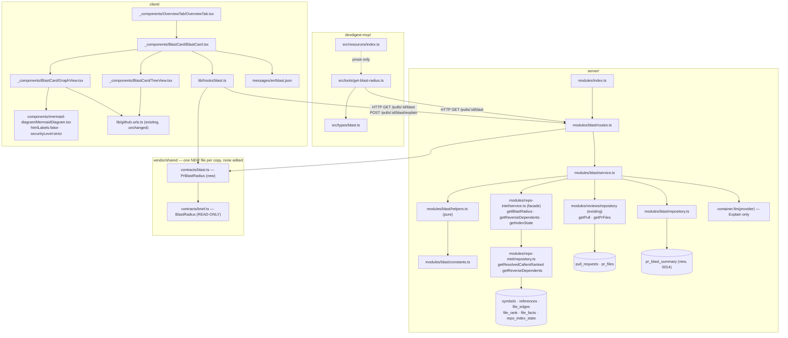

# Development Plan — L04 Blast Radius

## Context

A reviewer opening a PR today sees what changed and — since L03 — *why* it changed. What no
screen answers is **what else this touches**: which symbols the diff declares, who calls them,
and which HTTP endpoints sit downstream of those callers. That question is already answered
inside the server and is thrown away: `container.repoIntel.getBlastRadius(repoId, changedFiles)`
(`server/src/modules/repo-intel/types.ts:147`, implemented at `service.ts:220`) returns changed
symbols, ranked callers and impacted endpoints on a **pure-SQL persistent path**
(`tryPersistentBlast`, `service.ts:315-391`) and has **no HTTP surface and no UI**. Its only
in-tree consumers are one hermetic test and one mock literal.

The wire contract is also already written and unfed: `BlastRadius`, `ChangedSymbol`,
`BlastCaller` and `DownstreamImpact` live at `server/src/vendor/shared/contracts/brief.ts:16-44`,
byte-identical in the client copy, with `BlastRadius` reserved for L05's `PrBrief`
(`brief.ts:116-122`). `devdigest-mcp`'s `get_blast_radius` already answers **in that exact wire
shape** as a deliberate stub (`devdigest-mcp/src/tools/get-blast-radius.ts`), and its own docblock
names the finish line: *"a route plus a mapper from the camelCase facade `BlastResult` to the
snake_case wire contract"*. The module registry docblock names `blast` as a lesson module that
lands with one import and one entry (`server/src/modules/index.ts:24-27`).

So this lesson is mostly **plumbing an existing engine to three surfaces** — plus four real
defects in that engine which the assignment's own wording makes in-scope, and one piece of
genuinely new backend logic (the reverse import traversal).

**Grounding taken from the files this repo already wrote down:**

- `server/INSIGHTS.md:70-86` — grep a new contract name across `contracts/*.ts` in **both** copies
  before choosing it; `export *` collisions are silent and surface as unrelated-looking type
  errors. Done: `PrBlastRadius`, `BlastIndexState`, `BlastDependent`, `BlastReverseImpact`,
  `BlastExplanation` return **zero** hits across `server/src`, `client/src`, `devdigest-mcp/src`
  and `reviewer-core/src`. `IndexStatus` **is** taken (`contracts/platform.ts:258`) — that name is
  not used.
- `server/INSIGHTS.md:88-99` — the two vendored copies drift and there is **no regeneration
  script**; the copy is manual and part of the same commit. Verified still true; `brief.ts` is
  *not* one of the drifted pairs, so this plan's new file is an append on both sides, not a
  reconciliation.
- `server/INSIGHTS.md:115-132` — `tsx watch` restarts on any save under `server/src/` or
  `reviewer-core/src/`, and boot reaps every `running` row to `failed` with no error text. The
  demo (Lane F) runs a live review; see *Risks*.
- `server/INSIGHTS.md:52-68` — the **service** owns transactions, and a repository that must run
  inside one takes `Db | Tx`. This plan writes one row with one upsert, so it does neither; the
  condition that would change that is stated in *Decisions taken against the obvious* #4.
- `client/INSIGHTS.md` (2026-09-06) — never remount a child to change state it owns; use an
  optional controlled `open?`/`onOpenChange?` pair. The Tree view's per-symbol disclosure follows
  this from the start.
- `client/INSIGHTS.md` (2026-09-01, 2026-09-05) — `CategoryTag` renders `null` for any string
  outside the findings taxonomy, so the status badge is a plain `Badge`; `EmptyState.cta` has no
  `aria-label` passthrough, so a custom action goes through `secondary`.
- Root `INSIGHTS.md:27-42` — an Acceptance line must name a command **and** an assertion that
  command actually runs. Consequence for this plan: **no task's Acceptance says
  `routes-smoke.test.ts` sees a route registered** — that file holds four cases and no
  route-registry assertion of any kind. Route registration is proved by a 200 in
  `server/test/blast.it.test.ts`, a file this plan owns.
- `server/AGENTS.md` — `repo-intel` is reached **only** through `container.repoIntel.*`; every
  domain query is scoped by `workspaceId`; a DB-backed test **must** be `*.it.test.ts`; and
  `src/vendor/shared` is never edited in place — **add new files instead**.

### Fixed decisions

These are settled by the user or by this plan. Do not re-open them.

| | |
|---|---|
| **UI placement** | A **card on the existing Overview tab**, beside `IntentCard`, inside `OverviewTab.tsx`. **Not** a fourth tab. The assignment says "tab"; the reference screenshots and the user say card. |
| **Views** | **Both Tree and Graph**, behind a toggle. **Tree is the default.** R11 (rendered `href`s) is asserted on Tree; the Graph's links are asserted on the **generated diagram source** by R16 — see *Decisions taken against the obvious* #1. |
| **Graph implementation** | **mermaid**, through the existing `client/src/components/mermaid-diagram/MermaidDiagram.tsx`. `GraphView` generates `flowchart` source with one `click <id> href "<url>"` line per node. `click … href` is **not** gated by `securityLevel` — `flowDb.ts:544-552` `setLink` has no gate, while only `setClickFun` (`:489-493`) checks `securityLevel !== 'loose'`; the renderer inserts `<svg:a xlink:href=…>` (`rendering-util/rendering-elements/nodes.ts:37-48`) and `securityLevel` only picks the anchor's `target`. **mermaid's own docs are wrong on this** (flowchart.html#interaction and the config schema both claim click is disabled under `strict`) — the source is the citation, not the docs. **No new dependency**, no new `@devdigest/ui` primitive, no hand-rolled SVG. |
| **mermaid configuration** | Root-level **`htmlLabels: false`** plus the default **`securityLevel: 'strict'`** (already set at `MermaidDiagram.tsx:37`). `strict` is the *safer* setting, not the restrictive one: `utils.ts:247-259` runs every href through `@braintree/sanitize-url` under all levels **except** `loose`, neutralising `javascript:`/`data:`/`vbscript:` to `about:blank`. With `htmlLabels: false` the DOMPurify branch in `common.ts` is skipped and `createText.ts:283-286` writes the label into an SVG `<text>` via d3 `.text()` — i.e. `textContent`, so markup renders as literal characters and can never become an element. Use the **root-level** key: `flowchart.htmlLabels` is deprecated and emits `FLOWCHART_HTML_LABELS_DEPRECATED`. **Cost, stated:** no `<br/>` line breaks and no markdown labels. |
| **LLM summary** | In scope, behind an explicit **Explain** button. `GET` never calls a model. `POST /pulls/:id/blast/explain` makes **exactly one** call, persists it, and every later `GET` serves it from `pr_blast_summary`. |
| **Model for it** | The existing, currently **unfed** `risk_brief` entry in `FEATURE_MODELS` (`contracts/platform.ts:59-64`, zero server callers today). **No new `FeatureModelId`** — that enum is an existing contract and adding a member would edit one. |
| **Contract** | A **new file** `vendor/shared/contracts/blast.ts` in both copies, `PrBlastRadius = BlastRadius.extend({…})`, plus **one** additive `export *` line in each `vendor/shared/index.ts`. `brief.ts` is **not** edited — `BlastRadius` stays exactly as `PrBrief` consumes it. |
| **Persistence** | **One** new table, `pr_blast_summary`, for the LLM paragraph only. The **map itself is never cached** — it is 5 SQL reads, and caching it would add an invalidation problem (head moves, reindex lands) for nothing measurable. Same posture as Smart Diff (`04-smart-diff.md:47`). |
| **Which sha links point at** | Callers are index rows computed at `lastIndexedSha`, **not** at the PR head. Every `file:line` link built from index data is pinned to `indexed_sha`, carried **in the blast response** — not fetched from a second `GET /repos/:id/index-state` request. One request, and the sha is guaranteed to be the one the rows in *that* body came from; a second request could return a sha from a reindex that landed in between. |
| **MCP input** | Becomes `{ pr: string }`, resolved by `resolvePr`. The old `{ repo, files }` form is **dropped, not aliased** — see *Decisions taken against the obvious* #2. |
| **Demo PR** | A PR against **this repository** (dev-digest), imported into DevDigest itself. Lane F. |
| **Out of scope, fixed** | `.github/workflows/mcp.yml` is **not** restored (deleted in `d2ffee5`). No in-app jump to the Files-changed tab. No `e2e/` flow. |

## Overview

After this lands, a user on a PR's **Overview** tab sees a **BLAST RADIUS** card beside INTENT.
It states, from the persistent code index and nothing else: the symbols this PR's changed files
declare; for each, up to 20 callers ranked by file importance, each rendered as a clickable
`file:line` that opens the exact line on github.com at the sha the index was built against; and
the HTTP endpoints and cron jobs that sit within two levels of the reverse import graph of the
changed files, labelled **potentially affected** and never asserted as reached. A **Tree / Graph**
toggle switches between the nested list and a hand-drawn SVG node-link view of the same data. A
badge states the index's honesty: **indexed**, **partial** (working index, but rank or facts may
be incomplete — with the reason spelled out), **degraded** (running on the ripgrep fallback, ranks
are all zero) or **not indexed** (an empty state with a link to re-analyze, never an empty array
pretending to be an all-clear). An **Explain** button makes exactly one model call, which is
persisted and served from cache on every later read. The same map is reachable from Claude Code:
`get_blast_radius` takes a PR reference and returns the compact structured result of the very same
`GET /pulls/:id/blast` route.

## Requirements

- **R1** — `GET /pulls/:id/blast` returns a body that parses as `PrBlastRadius`, and 404s with the
  `not_found` error envelope for a PR outside the caller's workspace **before** any `pr_files` or
  repo-intel row is read. Verified by `server/test/blast.it.test.ts` — cases *"returns 200 and a
  parseable PrBlastRadius for an indexed repo"* and *"404s for a PR in another workspace"*.
- **R2** — The caller cap is **per changed symbol**, not total: given *N* changed symbols each with
  more than `MAX_CALLERS_PER_SYMBOL` resolved callers, every symbol carries exactly
  `MAX_CALLERS_PER_SYMBOL` callers, and the rows kept are the highest-`file_rank` ones — selected
  **in SQL** by `ROW_NUMBER() OVER (PARTITION BY to_symbol ORDER BY rank DESC, …) <= N`, never by
  materialising the full set and slicing in JS. Verified by
  `server/test/repo-intel-blast.it.test.ts` — cases *"two changed symbols each keep MAX_CALLERS_PER_SYMBOL callers"*
  and *"the kept callers are the top MAX_CALLERS_PER_SYMBOL by file_rank"*.
- **R3** — A reference whose `from_path` equals the file that declares the symbol is **excluded**
  from `callers`, on the persistent path, explicitly in the SQL predicate. Verified by
  `server/test/repo-intel-blast.it.test.ts` case *"a reference from the declaring file itself is
  not a caller"*, seeded with a `references` row whose `from_path = decl_file`.
- **R4** — `getReverseDependents(repoId, files)` walks `file_edges` **backwards** (`to_file` →
  `from_file`, using `file_edges_repo_to_idx`) to **exactly `REVERSE_DEPTH = 2` levels**, never
  returns the changed file itself, never returns a depth-2 row for a file already reached at
  depth 1, and attaches each dependent's `file_facts` endpoints and crons. Verified by
  `server/test/repo-intel-blast.it.test.ts` cases *"depth 1 and depth 2 are both returned with the
  right depth and via"*, *"a file three hops away is absent"*, *"the changed file is never its own
  dependent, even inside an import cycle"* and *"a file reachable at both depths appears once, at
  depth 1"*.
- **R5** — `PrBlastRadius.status` is one of `indexed | partial | degraded | none`, derived from
  `IndexState.status` (**never** from `IndexState.degraded`, because `partial` is a working index
  and carries no degraded flag — `repo-intel/repository.ts:218`), and `reason` is a non-empty
  human-readable string on every non-`indexed` status. A repo with `repoIntelEnabled` off yields
  `degraded` with a reason naming the flag — **not** `none`, because that path still returns real
  callers with `rank: 0`. Verified by `server/test/blast-helpers.test.ts` cases *"full → indexed,
  no reason"*, *"partial → partial, reason names the incomplete index"*, *"flag off → degraded,
  reason names the flag"* and *"never indexed → none, reason names it"*, plus
  `server/test/repo-intel-blast-degraded.test.ts` case *"status is read off IndexState.status, not
  IndexState.degraded"*.
- **R6** — On a `full` index, the request reads **only Postgres**: no AST parse, no import-graph
  build, no clone read, no subprocess. Verified by `server/test/blast.it.test.ts` case *"a blast
  read on a fully-indexed repo touches neither the code-index nor the git port"*, which injects a
  `CodeIndex` and a `GitClient` whose every method **throws** via `ContainerOverrides`
  (`platform/container.ts:41-55`) and asserts the route still returns 200 with non-empty
  `changed_symbols`.
- **R7** — `getBlastRadius` **never throws**, on any path, including a DB error inside the
  persistent path (which propagates today — `tryPersistentBlast` has no try/catch). A failure
  degrades to a `degraded` result carrying `reason`, never a rejected promise. Verified by
  `server/test/repo-intel-blast-degraded.test.ts` case *"a repository that rejects yields a
  degraded result, not a rejection"*, which stubs `RepoIntelRepository.getSymbolRows` to reject.
- **R8** — **Zero** model calls on `GET /pulls/:id/blast`, on every path. `POST
  /pulls/:id/blast/explain` makes **exactly one**, persists it to `pr_blast_summary`, and a second
  `POST` at the same `head_sha` **and** the same `lastIndexedSha` makes **none**. Verified by
  `server/test/blast.it.test.ts` cases *"two GETs leave llm.calls empty"*, *"one POST adds exactly
  one llm call"* and *"a second POST at the same head and index sha adds none"*, all snapshotting
  `MockLLMProvider.calls.length` the way `intent.it.test.ts:130-136` does.
- **R9** — `contracts/blast.ts` exists in **both** vendored copies and is byte-identical; each
  `vendor/shared/index.ts` gains exactly **one** `export * from './contracts/blast.js';` line; no
  other file under either `src/vendor/shared/` is modified. Verified by `diff
  server/src/vendor/shared/contracts/blast.ts client/src/vendor/shared/contracts/blast.ts` being
  empty, by `git diff --stat -- '*vendor/shared*'` showing exactly two new files and two one-line
  barrel additions, and by both `pnpm typecheck`s passing.
- **R10** — The card renders four distinct states off `status` — `indexed` (the map), `partial` and
  `degraded` (the map **plus** a badge that is icon+text+colour, never colour alone, carrying the
  reason), and `none` (an `EmptyState`, never an empty tree) — and a **Tree / Graph** toggle that
  defaults to Tree. Verified by `BlastCard.test.tsx` cases *"renders the tree by default"*,
  *"status partial renders a badge whose text names the reason"*, *"status degraded renders a
  badge with an icon and text"*, *"status none renders the empty state and no tree"* and *"toggling
  to graph renders the mermaid diagram and back restores the tree"* (with `MermaidDiagram` mocked —
  see R16).
- **R11** — In the Tree view every caller's `file:line` is a `MonoLink` whose `href` is
  `githubBlobUrl(repoFullName, indexed_sha, file, line)` — pinned to the index sha, **never** the
  PR head sha — and every changed symbol's declaration line likewise. Verified by
  `BlastCard.test.tsx` cases *"a caller's link href carries indexed_sha and #L<line>"* and *"the
  link href does not contain the PR head sha"* (fixture gives the two shas different values).
- **R12** — `get_blast_radius` takes exactly `{ pr: string }`, resolves it with `resolvePr`, calls
  `GET /pulls/:id/blast` and **no other** endpoint, and its `structuredContent` retains `status`,
  `reason` and `indexed_sha` after `BlastRadiusWire.parse`. Verified by
  `devdigest-mcp/test/tools/get-blast-radius.test.ts` cases *"the only fetches are the resolver's
  and /pulls/:id/blast"*, *"structuredContent keeps status, reason and indexed_sha"*, *"a
  `{repo,files}` argument is rejected by the input schema"* and *"a degraded payload's summary
  never says the change is safe"*.
- **R13** *(deferred — Lane F not run)* — On the demo PR — a change to `server/src/modules/_shared/schemas.ts` in this repository
  — the card shows **at least two real callers** and **at least one HTTP endpoint**, each of which
  is checked by hand against the code and recorded. Verified by `docs/demos/07-blast-radius.md`
  naming the PR URL, the exact caller `file:line`s the card rendered, the `METHOD /path` it listed,
  and the `server/src/modules/*/routes.ts` line each was confirmed against.
  **Status: not met because T16 was never run, not because it failed.** It needs a running stack
  (`./scripts/dev.sh`, seeded), this repository imported into DevDigest, an index built for it, and
  a human to open the PR and check the card's numbers against the code by hand. Nothing in the
  shipped code blocks it; every other requirement it depends on is met.
- **R14** — No UI or MCP string asserts that an endpoint **is** affected: every endpoint and cron
  is labelled *potentially affected*, and no empty result is ever worded as an all-clear. Verified
  by `BlastCard.test.tsx` case *"the endpoints heading uses the potentiallyAffected string"* and by
  `devdigest-mcp/test/tools/get-blast-radius.test.ts` case *"a degraded payload's summary never
  says the change is safe"* (asserts the summary contains the status word and does not match
  `/no impact|safe|all.clear/i`).
- **R15** — `pr_blast_summary` is a satellite of `pull_requests`: `pr_id` is **both** the primary
  key and an `ON DELETE CASCADE` foreign key; it carries **both** `derived_from_sha` and
  `derived_from_index_sha` as `NOT NULL` (a single sha column would let a reindex leave a
  paragraph describing callers that no longer exist); and it declares **no** index beyond the
  primary key. Verified by `cd server && pnpm db:migrate` applying `0014_*` cleanly to a fresh
  database and `cd server && pnpm typecheck` resolving all ten columns on `$inferSelect`, plus
  `server/test/blast.it.test.ts` case *"deleting the pull request removes its blast summary row"*.
- **R16** — `buildFlowchart(payload, repoFullName, indexedSha)` is a **pure function** returning
  mermaid `flowchart` source in which (a) every caller and dependent node carries a
  `click <id> href "<url>"` line whose URL is `githubBlobUrl(repoFullName, indexedSha, file, line)`
  — the same sha rule as R11 — and (b) every label is passed through `escapeMermaidLabel`, which
  replaces `#` **before** `"` (`#` → `#35;`, `"` → `#quot;`) and strips newlines. Verified by
  `BlastCard.test.tsx` (or a colocated `helpers.test.ts` in the same folder) cases
  *"a label containing # and \" is escaped # first, yielding #35; not #35;quot;"*, *"a label
  containing a newline emits a single-line label"*, *"a label containing %%{init: cannot start a
  directive line"*, *"every caller node has a click href line carrying indexed_sha"* and *"no click
  href line contains the PR head sha"*.
- **R17** — `client` depends on mermaid **≥ 11.16.1**: `client/package.json` declares
  `"mermaid": "^11.16.1"` and `client/pnpm-lock.yaml` resolves it, closing the five advisories open
  against the installed 11.15.0 — CVE-2026-50159 / GHSA-6x64-9x62-f2gx (moderate; CSS
  sibling-combinator escape via diagram-supplied `themeCSS`; affects `>=11.0.0-alpha.1, <11.16.1`),
  CVE-2026-71437 and CVE-2026-71438 (prototype pollution), CVE-2026-71436 and CVE-2026-71439 (DoS).
  Verified by `cd client && pnpm typecheck && pnpm test` staying green and by
  `git diff --stat -- client/pnpm-lock.yaml` showing a delta confined to mermaid and its
  transitive dependencies — **no package outside mermaid's own subtree changes version**; a dedupe
  collapsing a duplicate entry onto a version already declared elsewhere is not a version change.
- **R18** — `BlastResult.truncatedSymbols` is a **required** `string[]` naming every changed symbol
  whose caller list was cut at `MAX_CALLERS_PER_SYMBOL`, and `PrBlastRadius.callers_truncated` is
  derived from it and **never** from a count. It is decided from the **raw, pre-dedup** rows: the
  ranked query fetches `perSymbolLimit + 1` rows per symbol so a row with
  `rn === perSymbolLimit + 1` is an exact "more existed" signal, and `tryPersistentBlast` drops
  that extra row before anything downstream sees it. Always `[]` on the ripgrep path, which is
  uncapped. Verified by `server/test/repo-intel-blast.it.test.ts` cases *"a symbol over the cap
  (alpha, beta: 30 callers) is truncated"*, *"a symbol with exactly MAX_CALLERS_PER_SYMBOL callers
  and no more is NOT truncated"*, *"a capped set that collapses under dedup is still reported
  truncated"* and *"two identical runs report the identical truncation set"*, plus
  `server/test/blast-helpers.test.ts` case *"carries callers_truncated from
  BlastResult.truncatedSymbols, never from a MAX-count heuristic"*.

  **Why a list and not a count.** `callers_truncated` had no honest signal otherwise. A post-cap
  count cannot tell "exactly 20 callers exist" from "capped at 20, more existed" — both read as 20.
  A post-**dedup** count is strictly worse: dedup can collapse a truncated set *below* the cap, so a
  genuinely truncated symbol reports 17 callers and passes as complete. Only the raw pre-dedup row
  count knows, which is why the `+1` fetch and `rn` exist.

## Affected modules & contracts

| Module | What changes |
|---|---|
| `server/` | **New module** `src/modules/blast/` (`routes.ts`, `service.ts`, `helpers.ts`, `constants.ts`, `repository.ts`); one import + one entry in `src/modules/index.ts`; **four defect fixes, one new query and the truncation signal (R18) inside `src/modules/repo-intel/`** (`service.ts`, `repository.ts`, `types.ts`, `constants.ts`); one new table `pr_blast_summary` in `db/schema/reviews.ts` + migration `0014_*`; four new test files; one one-line fix to an existing mock literal in `test/conventions.it.test.ts`. |
| `client/` | New `_components/BlastCard/` on the PR route; new `src/lib/hooks/blast.ts` + one barrel line; type re-exports in `src/lib/types.ts`; new keys in the **already-committed** `messages/en/blast.json`; `OverviewTab.tsx` gains one child. **Two files outside the feature folder:** `src/components/mermaid-diagram/MermaidDiagram.tsx` gains `htmlLabels: false` and a `secure` list, and `package.json` + `pnpm-lock.yaml` move mermaid `11.15.0 → 11.16.1` (five open advisories — argued in *Red-flags check* item 9). |
| `devdigest-mcp/` | `src/tools/get-blast-radius.ts` becomes real (in place, same tool name); `src/types/blast.ts` widened; `src/resources/index.ts` blast resource text; `README.md` tool row; its test rewritten. |
| `reviewer-core/` | **Untouched.** No prompt change — the Explain call is a plain `complete()` from the server, not a review. |
| `e2e/` | **Untouched** — see *Not planned*. |

**Contracts — one file added to both copies, none edited.**

```ts
// vendor/shared/contracts/blast.ts   (identical in server/ and client/)
import { z } from 'zod';
import { BlastRadius } from './brief.js';

/** How much the map can be trusted. Driven by IndexState.status, never by
 *  IndexState.degraded — 'partial' is a working index and carries no flag. */
export const BlastIndexState = z.enum(['indexed', 'partial', 'degraded', 'none']);
export type BlastIndexState = z.infer<typeof BlastIndexState>;

/** One file that transitively imports a changed file, within REVERSE_DEPTH. */
export const BlastDependent = z.object({
  file: z.string(),
  depth: z.number().int(),            // 1 or 2
  via: z.string(),                    // the depth-1 file it was reached through
  endpoints: z.array(z.string()),     // "METHOD /path" — potentially affected
  crons: z.array(z.string()),
});
export type BlastDependent = z.infer<typeof BlastDependent>;

/** The reverse import walk rooted at one changed file. */
export const BlastReverseImpact = z.object({
  changed_file: z.string(),
  dependents: z.array(BlastDependent),
});
export type BlastReverseImpact = z.infer<typeof BlastReverseImpact>;

/** The cached one-paragraph model explanation. Null until Explain is pressed. */
export const BlastExplanation = z.object({
  text: z.string(),
  model: z.string().nullish(),
  provider: z.string().nullish(),
  derived_at: z.string(),
});
export type BlastExplanation = z.infer<typeof BlastExplanation>;

export const PrBlastRadius = BlastRadius.extend({
  status: BlastIndexState,
  /** Non-empty on every non-'indexed' status. Never masked by an empty array. */
  reason: z.string().nullish(),
  /** The sha the index rows were computed at — what every file:line links to. */
  indexed_sha: z.string().nullish(),
  /** True when any symbol hit MAX_CALLERS_PER_SYMBOL, so the UI can say so. */
  callers_truncated: z.boolean(),
  reverse: z.array(BlastReverseImpact),
  explanation: BlastExplanation.nullish(),
});
export type PrBlastRadius = z.infer<typeof PrBlastRadius>;
```

`BlastRadius.summary` (inherited) is **always a non-empty deterministic sentence** built in
`helpers.ts` — counts plus the status word. It is never the model's output; the model's paragraph
lives in `explanation`. That keeps `summary` useful to MCP with zero model calls and keeps L05's
`PrBrief` consumer seeing exactly the field it always saw.

**Why extend, not widen.** `server/AGENTS.md` — *"Edit `src/vendor/shared` in place … **Add new
files instead**"*; the barrel header (`vendor/shared/index.ts:19-20`) — *"feature agents EXTEND
with new files, they do not edit existing ones"*. Precedent in-tree: `git show --stat b8a545d --
'*vendor/shared*'` is 106 insertions / 0 deletions, adding `contracts/intent.ts` to both copies
plus one barrel line each. `BlastRadius` itself is load-bearing for `PrBrief` (`brief.ts:116-122`)
and is not touched.

**Names checked for collision** (`server/INSIGHTS.md:70-86`): `PrBlastRadius`, `BlastIndexState`,
`BlastDependent`, `BlastReverseImpact`, `BlastExplanation` — zero hits across `server/src`,
`client/src`, `devdigest-mcp/src`, `reviewer-core/src`. `IndexStatus` **is** already taken by
`contracts/platform.ts:258` and is deliberately not used.

## Architecture changes

### `server/` — repo-intel, the four defects and the new query

All of these are inside `src/modules/repo-intel/` and are reached only through the facade, per
`server/AGENTS.md`. The blast module writes **no SQL over repo-intel tables** — one owner per
table.

| Path | Layer | What changes |
|---|---|---|
| `repo-intel/repository.ts` | repository | **New** `getResolvedCallersRanked(repoId, declFiles, names, perSymbolLimit)` — replaces the unordered, unlimited `getResolvedCallers` (`:503-531`) for the blast path, with `ORDER BY` and `LIMIT` **in SQL**, the declaring-file exclusion in the predicate, and `rn` returned alongside each row — the query keeps `rn <= perSymbolLimit + 1` so the extra row is R18's exact truncation signal (`repository.ts:580`). **New** `getReverseDependents(repoId, files, depth, limitPerFile)` — the first reverse use of `file_edges`. |
| `repo-intel/service.ts` | service | `tryPersistentBlast` (`:315-391`) calls the new ranked query and drops the JS `sort` + `slice(0, MAX_CALLERS_PER_SYMBOL)` at `:372`/`:386`; `getBlastRadius` (`:220`) wraps the persistent call in try/catch (R7) and fills the new `status`/`reason` fields on every return. **New** facade method `getReverseDependents`. |
| `repo-intel/types.ts` | contract | `BlastResult` gains **two required** fields — `status: IndexStatus` and `truncatedSymbols: string[]` (R18, `:94-100`) — and keeps `reason?: DegradedReason` unchanged; `ResolvedCallerRow` gains `rn` (`repository.ts:131-146`); new `ReverseDependentRow`; `RepoIntel` gains one method. Making `status` required is deliberate — `tsc` then names every producer and every mock that must be updated. |
| `repo-intel/constants.ts` | pure | `REVERSE_DEPTH = 2`, `MAX_DEPENDENTS_PER_FILE = 25`. The stale comment at `:29` — *"(ORDER BY rank DESC LIMIT N)"*, which the code did not do — becomes true. |
| `test/conventions.it.test.ts` | test | One-line fix: the inline `RepoIntel` mock literal supplies `status` and the new method. It is the only other place `getBlastRadius` is stubbed. |

**The ranked-callers query.** `ROW_NUMBER() OVER (PARTITION BY r.to_symbol ORDER BY fr.rank DESC,
r.from_path ASC, r.line ASC)` over the existing `references ⋈ file_rank` join, with
`r.decl_file IN (:declFiles)`, `r.to_symbol IN (:names)` and — new — `r.from_path <> r.decl_file`,
wrapped so the outer query keeps `rn <= :perSymbolLimit`. The extra `from_path`/`line` sort keys
make the order **total**, so two calls on unchanged data return identical bodies; `rank` alone
ties constantly, because `file_rank` is per file and a file usually holds several callers.

**The reverse walk.** Two `DISTINCT` CTEs over `file_edges`, both keyed on `(repo_id, to_file)` —
which is exactly what `file_edges_repo_to_idx` (`db/schema/repo-intel.ts:66`, migration `0004`)
indexes, and the reason its own docblock at `:52-53` says the index exists *"for blast"*. Level 1
joins the changed files; level 2 joins level 1 and excludes both the root and anything level 1
already reached; the union is left-joined to `file_facts` and `file_rank`, ordered by
`(root, depth, rank DESC NULLS LAST, file)` and capped per root by a second `ROW_NUMBER()`.
`file_facts` is **sparse** (`repository.ts:373` keeps only rows with ≥1 endpoint or cron), so the
join must be a `LEFT JOIN` and a missing row means "no endpoints", never "not indexed" — that
distinction is what R5's `status` carries instead.

**`status` on `BlastResult`.** Four returns exist in `getBlastRadius`/`tryPersistentBlast` and each
gets an explicit value: the persistent path → the `IndexState.status` it already read at
`service.ts:319` mapped through (`full` → `indexed`, `partial` → `partial`); the ripgrep path →
`degraded`; the empty path → `degraded` with the existing `reason`. The map from
`IndexStatus`+config to `BlastIndexState` is a **pure function in `blast/helpers.ts`**, not in
repo-intel — repo-intel reports facts, the feature decides how to word them.

### `server/` — the new `blast` module (onion placement)

| Path | Layer | What it is |
|---|---|---|
| `modules/blast/routes.ts` | route | `GET /pulls/:id/blast` → `schema: { params: IdParams, response: { 200: PrBlastRadius } }`; `POST /pulls/:id/blast/explain` → same params, `config: { rateLimit: { max: 10, timeWindow: '1 minute' } }` matching `POST /pulls/:id/review`. Both `app.withTypeProvider<ZodTypeProvider>()`, both `await getContext(app.container, req)`, both delegate. No Drizzle, no adapter call. |
| `modules/blast/service.ts` | service | `read(workspaceId, prId)`: `reviewRepo.getPull(workspaceId, prId)` → `NotFoundError` — **the tenancy gate, first statement** — then `pull.repoId`, `reviewRepo.getPrFiles(prId)` → `files.map(f => f.path)`, then in parallel `repoIntel.getBlastRadius`, `repoIntel.getReverseDependents`, `repoIntel.getIndexState` and `blastRepo.getSummary(prId)`, then one pure `toPrBlastRadius(...)`. `explain(workspaceId, prId)`: the same read, then the freshness check, then one `llm.complete`, then `blastRepo.upsertSummary`. |
| `modules/blast/helpers.ts` | pure | `mapStatus`, `groupDownstream`, `buildSummary`, `toPrBlastRadius(blast, reverse, state, summaryRow, config)`, `isSummaryFresh`, `buildExplainPrompt`. **Zero I/O, zero literals** — every threshold imported from `constants.ts`. The tested surface, mirroring `smart-diff/helpers.ts:206-230`. |
| `modules/blast/repository.ts` | repository | The **only** SQL over `pr_blast_summary`: `getSummary(prId)`, `upsertSummary(row)`. Constructor takes `Db` — one row, one upsert, no transaction. |
| `modules/blast/constants.ts` | pure | `MAX_DOWNSTREAM_SYMBOLS = 50`, `EXPLAIN_TIMEOUT_MS = 45_000`, `EXPLAIN_RETRIES = 2`, `MAX_EXPLAIN_CHARS = 1_200`, `EXPLAIN_MAX_TOKENS = 400`, `EXPLAIN_FEATURE_MODEL_ID = 'risk_brief'`, and the status→reason wording map. |
| `modules/index.ts` | registry | One import + one entry, exactly as its own docblock at `:24-27` names `blast`. |
| `db/schema/reviews.ts` + `db/migrations/0014_*.sql` | schema | `pr_blast_summary`, beside `pr_intent`. |

**Why the tenancy gate is `getPull`, not `getRepo`.** `ReviewRepository.getRepo(repoId)`
(`pull.repo.ts:21-27`) is **not** workspace-filtered, and `getBlastRadius` is repo-id-only and
tenant-agnostic — none of the seven repo-intel tables carries `workspaceId`. So the boundary is
the already-scoped `getPull(workspaceId, prId)` (`pull.repo.ts:14-18`, drizzle filtering both
columns), whose returned `repoId` is then trusted. This is the `smart-diff/service.ts:25-26` shape
and **not** the `repo-intel/routes.ts:32-41` shape, which resolves context but never verifies the
repo belongs to the workspace. R1's cross-workspace case asserts it, mirroring
`smart-diff.it.test.ts:213-227`.

**The `pr_blast_summary` migration.** A satellite, keyed 1:1 on `pull_requests.id` by a PK that is
also a cascading FK — the `pr_intent` shape (`db/schema/reviews.ts:49-78`) and, like it,
**deliberately without `workspace_id`**: it is unreachable except through a parent that carries it,
and a duplicated column no constraint can keep in sync would drift while giving a false sense of a
DB-enforced boundary. **No indexes** — every access is `WHERE pr_id = $1` and the PK is already a
B-tree. Both facts go in the migration header, so nobody adds a decorative index.

| Column | Type | Null | Default | Why |
|---|---|---|---|---|
| `pr_id` | `uuid` PK → `pull_requests.id` `ON DELETE CASCADE` | NOT NULL | — | The satellite key. |
| `explanation` | `text` | NOT NULL | — | The model paragraph. A row exists only when one was produced. |
| `derived_from_sha` | `text` | NOT NULL | — | Freshness half 1: the PR head the map described. |
| `derived_from_index_sha` | `text` | NOT NULL | — | **Freshness half 2, and the reason this is not a copy of `pr_intent`.** A reindex changes the map without moving the PR head; a sha-only check would serve a paragraph describing callers that no longer exist. |
| `derived_at` | `timestamptz` | NOT NULL | `now()` | `timestamptz`, never `timestamp`. |
| `provider` / `model` | `text` | NULL | — | Which model produced it. |
| `tokens_in` / `tokens_out` | `integer` | NULL | — | NULL = not recorded, distinct from 0. |
| `cost_usd` | `double precision` | NULL | — | Mirrors `agent_runs.cost_usd` and `pr_intent.cost_usd` — sub-cent estimates, not ledger money. NULL ⇒ UI renders `—`, never `$0.00`. |

**Explain is refused when `status === 'none'`.** There is nothing to explain, and a model asked to
explain an empty map will produce a fluent paragraph about nothing — the exact failure the MCP stub
was written against. The route returns the unchanged body with `explanation: null`; no row, no call.

### `client/` — placement

| Path | Placement rule |
|---|---|
| `_components/BlastCard/{BlastCard.tsx,TreeView.tsx,GraphView.tsx,helpers.ts,constants.ts,styles.ts,index.ts,BlastCard.test.tsx}` | One consumer → colocated beside its route, the `IntentCard/` folder shape exactly (`client/README.md:57-59`). One `index.ts` barrel. |
| `_components/OverviewTab/OverviewTab.tsx` | Gains `<BlastCard prId={prId} />` **below** `IntentCard` and above Description — intent is what the PR means, blast is what it touches, body is the raw source. Props unchanged, so `page.tsx` is **not** touched. |
| `src/lib/hooks/blast.ts` + `src/lib/hooks/index.ts` | `useBlast(prId)` (`useQuery`, `enabled: !!prId`) and `useExplainBlast(prId)` (`useMutation` whose `onSuccess` does `qc.setQueryData(["blast", prId], data)`) — the `hooks/intent.ts:11-26` shape verbatim. Never a `fetch` in a component (`client/AGENTS.md:26-27`). |
| `src/lib/types.ts` | Re-export `PrBlastRadius`, `BlastDependent`, `BlastReverseImpact`, `BlastIndexState`. Contract types are never hand-written. |
| `messages/en/blast.json` | The namespace is **already committed** with zero consumers and is auto-discovered by directory scan (`src/i18n/request.ts:16-25`) — `useTranslations("blast")` needs no wiring. Its existing keys (`stat.*`, `view.*`, `callerCount`, `noDownstream`, `graph.*`) are **used as they stand**; new keys are added to this file only. |

**New message keys** (added to `messages/en/blast.json`, which has none of them today):
`title`, `status.{indexed,partial,degraded,none}`, `reason.*` handled as a server-supplied string
rendered verbatim, `error.{title,body}`, `empty.{title,body}`, `reanalyze`, `explain`,
`explaining`, `explanation`, `potentiallyAffected`, `truncated`, `declaredIn`, `viaSymbol`.

**Status badge.** No status-badge precedent exists in this tree: `full|partial|degraded|failed`
appears only as an unrendered local type (`src/lib/hooks/repo-intel.ts:15`), and
`useRepoIntelStatus` (`:31-38`) has **zero call sites**. So the one live pattern is copied instead
— `IntentCard.tsx:96-100`'s `<Badge icon color bg>text</Badge>`, icon+colour+text together, with
the style looked up from a `constants.ts` map the way `CONFIDENCE_STYLE` is. A plain `Badge`, never
`CategoryTag` (which renders `null` off-taxonomy — `client/INSIGHTS.md`, 2026-09-01).

**`file:line` links.** `githubBlobUrl(repoFullName, sha, file, line)`
(`src/lib/github-urls.ts:24-37`) rendered through `MonoLink` from the `@devdigest/ui` barrel — the
`FindingCard.tsx:9-19,46-49` import and call shape. `repoFullName` comes from `useActiveRepo()`
(`@/lib/repo-context`, as `page.tsx:21,32` uses it); `sha` is `data.indexed_sha ?? activeRepo
?.default_branch ?? "main"` — the fallback chain of
`conventions/_components/ConventionCard/helpers.ts:11-28`. **Not** `head_sha`: see *Fixed
decisions*.

**React shape.** `BlastCard` is a container — `useBlast` + `useExplainBlast`, three early returns
(`isLoading` → `Skeleton`s, `isError` → `ErrorState` with `onRetry`, `status === 'none'` →
`EmptyState` whose action goes through `secondary`, because `cta` has no `aria-label` passthrough,
`client/INSIGHTS.md` 2026-09-05) — then `TreeView` or `GraphView`. **No `useEffect` anywhere.** The
Tree's per-symbol disclosure uses an optional controlled `open?`/`onOpenChange?` pair from the
start: `client/INSIGHTS.md` (2026-09-06) records that forcing a child open by flipping its `key`
remounts the subtree and silently discards what it held, and that a test for it must assert **node
identity**, because a presence assertion passes across a remount.

**`GraphView` generates mermaid source; `MermaidDiagram` renders it.** The split is the point: the
generator is a **pure function** in `BlastCard/helpers.ts` (`buildFlowchart`, `escapeMermaidLabel`)
and is where every assertion lands (R16), because mermaid renders by measuring the DOM and jsdom
implements no SVG layout — a component test cannot inspect the produced `<svg:a>`. So
`BlastCard.test.tsx` mocks `MermaidDiagram` and asserts the **source string** it was handed.
`GraphView` itself is thin: `<MermaidDiagram chart={buildFlowchart(...)} />`, with
`blast.graph.empty` when there is nothing to draw and `blast.graph.ariaLabel` on the wrapper.

Shape: `flowchart LR`, one subgraph per changed symbol, edges symbol → caller → dependent, node ids
generated as `n0, n1, …` (never derived from a path, so no path character can reach an id), and one
`click nN href "<github blob url>"` per node that has a `file:line`.

**No `@devdigest/ui` primitive is added** — a new one must be registered in `/showcase` or
`src/test/smoke.test.tsx` fails CI from a directory this plan never touched
(`client/AGENTS.md:28-29`). `MermaidDiagram` lives under `src/components/`, not `src/vendor/ui/`, so
editing it is not the vendored do-not-touch case.

**Two edits to `MermaidDiagram.tsx`, and only two.** `securityLevel: 'strict'` is **already** set
(`:37`) and stays. Added: root-level `htmlLabels: false`, and a `secure` list that locks
`themeCSS`, `themeVariables` and `fontFamily` alongside `securityLevel` — the default `secure` list
locks `securityLevel` but **not** those three, which is the other mitigation named in the
`themeCSS` advisory. Deliberately **not** changed: it calls `mermaid.initialize` on every effect run
rather than once, and it hardcodes `theme: "dark"` while this client themes via
`[data-theme="dark|light"]` on `<html>` (`src/vendor/ui/styles.css`). Both are pre-existing, both
are unrequested, and the file is dead-but-committed scaffolding the root `CLAUDE.md` says not to
build out speculatively. The theme mismatch is a **stated cosmetic cost** — see *Risks* and
*Not planned*.

### `devdigest-mcp/`

| Path | What changes |
|---|---|
| `src/tools/get-blast-radius.ts` | Rewritten **in place**, same tool name and same registration site, so `test/server.test.ts:67,73-74,80` (which asserts the five names, their source order and the three resource names) keeps passing. Input becomes `{ pr: string }`; body is `resolvePr(pr)` → `apiGet(\`/pulls/${id}/blast\`)` → `BlastRadiusWire.parse` → both channels. `stubSummary` is deleted; the payload's own `summary` is the server's deterministic sentence. Errors **are** caught and returned as `{ isError: true, content: [{ text }] }` (`get-blast-radius.ts:90-94`), plus one `log.error` to stderr. The stub deliberately did **not** catch, on the grounds that `McpServer` produces the identical shape — true, but it made this the one outlier among five tools: `get-conventions.ts:160-162` and `get-findings.ts:86-90` already catch, and the outlier was justified only by being a stub. Both `ResolveError.message` and `ApiError.message` are already written to be read by a model, so the caught text is the same text; what the catch adds is the stderr line and consistency. |
| `src/types/blast.ts` | Widened with `status`, `reason`, `indexed_sha`, `callers_truncated`, `reverse`, `explanation`. **This is not optional:** the schema is deliberately not `.strict()`, and zod **strips** unknown keys — so without this edit `status` and `reason` would silently vanish from `structuredContent`, which is exactly the "empty array masking missing data" failure the assignment forbids. Still declared locally, still no `paths` alias into `@devdigest/shared` (zod 4 here, zod 3 in `reviewer-core`). |
| `src/resources/index.ts` | The `devdigest://blast-radius` resource text (`:104-149`) says *"registered but not implemented"* and *"the API … does not yet expose a route for this query"*. Both sentences become false the moment the route lands. |
| `README.md:18` | The tool-table row. |
| `test/tools/get-blast-radius.test.ts` | Rewritten. Three assertions break **by design**: `:81-83` (the only fetch is `…/repos`), `:93-94` (both arrays are `[]`), `:103-107` (the summary contains "not implemented"). `:79` (`BlastRadiusWire.safeParse(structuredContent).success`) survives. |

`Type: backend` for this lane is an interpretation, stated in the Red-flags check: of the four
allowed values it is the only one whose rules reach a Node-side HTTP surface with zod schemas —
`ui` and `core` are plainly wrong and `e2e` means `agent-browser` flows. The Fastify, onion and
drizzle halves of `backend` have no file to apply to here, and the lane must not invent one.

## Architecture diagram



## Phased tasks

### Phase 1 — Contract (Lane C)

- **T1** · Write `contracts/blast.ts` in **both** vendored copies and add one `export *` line to
  each barrel.
  - Module: `server/` + `client/` · Type: `core` · Lane: C
  - Owned paths: `server/src/vendor/shared/contracts/blast.ts`,
    `server/src/vendor/shared/index.ts`, `client/src/vendor/shared/contracts/blast.ts`,
    `client/src/vendor/shared/index.ts`
  - Depends-on: —
  - Risk: writing only the server half typechecks there and fails in `client/` much later; and the
    copy is **manual** — no regeneration script exists (verified again this session:
    `02-pr-intent-layer.md:121-126`). Second risk: importing `BlastRadius` with the wrong specifier
    — relative imports inside `vendor/shared` carry explicit `.js` extensions
    (`./brief.js`), not `@devdigest/shared`, which would be a cycle through the barrel.
  - Acceptance → R9: `diff server/src/vendor/shared/contracts/blast.ts
    client/src/vendor/shared/contracts/blast.ts` prints nothing; `cd server && pnpm typecheck` and
    `cd client && pnpm typecheck` both pass; `git status --short -- '*vendor/shared*'` lists
    exactly those four paths — **`git diff --name-only` will not**: two of the four are new files
    and are invisible to `diff` until they are staged. (Root `INSIGHTS.md:27-42` again: the command
    has to be able to produce the evidence the line claims.)

### Phase 2 — repo-intel: the engine (Lane A)

- **T2** · Add the two new queries to `repo-intel/repository.ts` and the two constants.
  - Module: `server/` · Type: `backend` · Lane: A
  - Owned paths: `server/src/modules/repo-intel/repository.ts`,
    `server/src/modules/repo-intel/constants.ts`
  - Depends-on: —
  - Risk: the reverse walk is the first backwards use of `file_edges`; writing it as a forward join
    (`from_file = :changed`) compiles, returns rows, and answers the **wrong question** — "what does
    this file import" instead of "who imports this file" — with no test failing unless the fixture
    is asymmetric. Every R4 fixture must therefore be directional. Second risk: leaving
    `getResolvedCallers` in place *and* adding the ranked variant leaves two queries where one is
    right; the old one has exactly one caller (`service.ts:342`) and must be replaced there, not
    shadowed. Third risk: the `+1` in `rn <= perSymbolLimit + 1` is R18's whole mechanism — dropping
    it back to `<= perSymbolLimit` still returns the right callers and silently makes
    `callers_truncated` unknowable, with every caller-count test still green.
  - Acceptance → R2, R3, R4, R18: `cd server && pnpm exec vitest run test/repo-intel-blast.it.test.ts`
    (written in T5) is green on the six cases named in R2, R3 and R4.

- **T3** · Widen `repo-intel/types.ts` and rework `getBlastRadius` / `tryPersistentBlast` in
  `repo-intel/service.ts`: the ranked query, the try/catch, `status` on every return, and the new
  `getReverseDependents` facade method.
  - Module: `server/` · Type: `backend` · Lane: A
  - Owned paths: `server/src/modules/repo-intel/service.ts`,
    `server/src/modules/repo-intel/types.ts`
  - Depends-on: T2
  - Risk: `BlastResult.status` is **required**, so every producer and every mock literal must be
    updated — `tsc` finds them, which is the point, but one of them is another feature's test file
    (`test/conventions.it.test.ts`, owned by T4). Second risk: the try/catch must **not** swallow
    the fall-through — a persistent-path failure should still try the ripgrep path before returning
    `degraded`, or a transient DB blip turns into a permanent "no data" for that request.
  - Acceptance → R5, R7, R18: `cd server && pnpm exec vitest run
    test/repo-intel-blast-degraded.test.ts test/repo-intel-facade-degraded.test.ts` is green, with
    `truncatedSymbols` present and `[]` on every degraded return,
    including the case where a stubbed repository **rejects** and the result is degraded rather
    than a rejection.

- **T4** · Fix the one out-of-module mock literal.
  - Module: `server/` · Type: `backend` · Lane: A
  - Owned paths: `server/test/conventions.it.test.ts`
  - Depends-on: T3
  - Risk: it is a `RepoIntel` object literal inside another feature's integration test; the edit
    must add `status` and the new method and change **nothing else**, or a conventions regression
    lands in a blast diff.
  - Acceptance → R5: `cd server && pnpm typecheck` passes and `cd server && pnpm exec vitest run
    test/conventions.it.test.ts` is green with no assertion changed.

- **T5** · Write the repo-intel tests.
  - Module: `server/` · Type: `backend` · Lane: A
  - Owned paths: `server/test/repo-intel-blast.it.test.ts`,
    `server/test/repo-intel-blast-degraded.test.ts`
  - Depends-on: T4
  - Risk: `tryPersistentBlast` has **zero coverage today** — nothing tests the persistent SQL, the
    cap, the rank sort or `factsByFile` — so these fixtures are the first thing that has ever
    exercised it, and a fixture that seeds `references` without `decl_file` produces an empty
    caller set that looks like a passing "no callers" case. Every caller fixture must set
    `decl_file` explicitly. Second risk: naming the DB-backed file anything but `*.it.test.ts`
    silently breaks the unit/integration split and it runs in the hermetic CI job without Docker.
  - Acceptance → R2, R3, R4, R5, R7, R18: `cd server && pnpm exec vitest run
    test/repo-intel-blast.it.test.ts` and `cd server && pnpm exec vitest run
    test/repo-intel-blast-degraded.test.ts` are both green on every case named in those
    requirements.

### Phase 3 — The blast module (Lane B, after Phase 1 and Phase 2)

- **T6** · `db/schema/reviews.ts` — `pr_blast_summary` — and migration `0014_*`.
  - Module: `server/` · Type: `backend` · Lane: B
  - Owned paths: `server/src/db/schema/reviews.ts`, `server/src/db/migrations/0014_*.sql`,
    `server/src/db/migrations/meta/**`
  - Depends-on: —
  - Risk: touching an already-merged migration instead of generating `0014` — forbidden by
    `server/AGENTS.md`. Generate with `pnpm db:generate`; the next tag is `0014` (`0013_stiff_cyclops.sql`
    is the highest today).
  - Acceptance → R15: `cd server && pnpm db:migrate` applies `0014_*` cleanly to a fresh database
    and `cd server && pnpm typecheck` passes with all ten columns — including **both**
    `derivedFromSha` and `derivedFromIndexSha` — on `$inferSelect`. This task asserts the table's
    shape and nothing about model-call counts; R8's three `llm.calls` cases belong to T8 and T10.

- **T7** · `modules/blast/constants.ts` and `modules/blast/helpers.ts` — the pure surface.
  - Module: `server/` · Type: `backend` · Lane: B
  - Owned paths: `server/src/modules/blast/constants.ts`, `server/src/modules/blast/helpers.ts`
  - Depends-on: T1, T3, T5 — T5 is required, not advisory: it is the first coverage
    `tryPersistentBlast` has ever had, and consuming the facade before it is proved is exactly the
    ordering the *Risks* table argues for (`T5→T7` is an edge in the DAG).
  - Risk: `mapStatus` reading `IndexState.degraded` instead of `IndexState.status` — the single
    most likely bug in this plan, because the field is right there and `partial` **is not**
    flagged degraded (`repo-intel/repository.ts:218`: *"'partial' is still a working index — no
    degraded flag"*). Second risk: `buildSummary` wording an empty map as an all-clear, which is
    exactly what the MCP stub's docblock warns is *"strictly false and actively harmful"*.
  - Acceptance → R5, R14, R18: `cd server && pnpm exec vitest run test/blast-helpers.test.ts`
    (written in T10) is green on the four `mapStatus` cases named in R5, on the summary-wording
    case, and on *"carries callers_truncated from BlastResult.truncatedSymbols, never from a
    MAX-count heuristic"*.

- **T8** · `modules/blast/repository.ts` and `modules/blast/service.ts`.
  - Module: `server/` · Type: `backend` · Lane: B
  - Owned paths: `server/src/modules/blast/repository.ts`, `server/src/modules/blast/service.ts`
  - Depends-on: T6, T7
  - Risk: reading `pr_files` or any repo-intel row before `getPull(workspaceId, prId)` leaks the
    existence of another workspace's PR; `getPull` must be the first statement, and `pull.repoId`
    the only source of the repo id — **never** `getRepo(repoId)`, which is not workspace-filtered
    (`pull.repo.ts:21-27`). Second risk: the Explain freshness check comparing only
    `derived_from_sha`, so a reindex leaves a paragraph describing callers that no longer exist —
    both shas are required.
  - Acceptance → R1, R8: `cd server && pnpm exec vitest run test/blast.it.test.ts` (written in T10)
    is green on the cross-workspace-404 case and on all three `llm.calls` cases named in R8.

- **T9** · `modules/blast/routes.ts` and the registry entry.
  - Module: `server/` · Type: `backend` · Lane: B
  - Owned paths: `server/src/modules/blast/routes.ts`, `server/src/modules/index.ts`
  - Depends-on: T8
  - Risk: `response: { 200: PrBlastRadius }` means a body the schema rejects becomes a **500**, not
    a wrong body. That is the intended failure mode (it makes R1 self-enforcing, and
    `setSerializerCompiler` is installed globally at `app.ts:65`), but it must be exercised before
    merge. Second risk: forgetting that `getContext` alone is not a tenancy check — the gate is in
    the service.
  - Acceptance → R1: `cd server && pnpm exec vitest run test/blast.it.test.ts` returns 200 with a
    body that `PrBlastRadius.parse` accepts — which is what proves the route is registered. **Do
    not** cite `test/routes-smoke.test.ts`: it contains no route-registry assertion of any kind
    (root `INSIGHTS.md:27-42`).

- **T10** · The server tests for this module.
  - Module: `server/` · Type: `backend` · Lane: B
  - Owned paths: `server/test/blast-helpers.test.ts`, `server/test/blast.it.test.ts`
  - Depends-on: T9
  - Risk: R6's assertion is the delicate one — the injected `CodeIndex`/`GitClient` must throw from
    **every** method, and the fixture repo must be seeded to `status: 'full'` with real `symbols`,
    `references.decl_file` and `file_rank` rows, or the test passes because the persistent path
    returned an empty result without needing either port. Assert non-empty `changed_symbols` in the
    same case. Second risk: the `llm.calls` assertions must filter the way
    `intent.it.test.ts:130-136` does — a bare `toHaveLength(0)` on a fixture app that also runs a
    review is a false failure.
  - Acceptance → R1, R5, R6, R8, R14, R15: `cd server && pnpm exec vitest run --exclude
    '**/*.it.test.ts'` and `cd server && pnpm exec vitest run .it.test` are both green, with
    `test/blast.it.test.ts` carrying the named cases for R1, R6, R8 and R15's cascade case, and
    `test/blast-helpers.test.ts` those for R5 and R14.

### Phase 4 — Client (Lane D, parallel with Phases 2–3, after Phase 1)

- **T11** · `useBlast` / `useExplainBlast` and the type re-exports.
  - Module: `client/` · Type: `ui` · Lane: D
  - Owned paths: `client/src/lib/hooks/blast.ts`, `client/src/lib/hooks/index.ts`,
    `client/src/lib/types.ts`
  - Depends-on: T1
  - Risk: a hand-written response interface drifts from the contract — the hook must be typed
    `api.get<PrBlastRadius>(…)`. Second risk: reaching for `useRepoIntelStatus` to get
    `lastIndexedSha`; it has zero call sites today and would be a second request whose sha can
    disagree with the body — the sha comes from `indexed_sha` on the blast response.
  - Acceptance → R10: `cd client && pnpm typecheck` passes with `useBlast` and `useExplainBlast`
    exported from `@/lib/hooks` and `PrBlastRadius` from `@/lib/types`.

- **T12** · `BlastCard` + `TreeView` + `styles.ts` + `constants.ts` + `helpers.ts` + the barrel, and
  the new keys in `messages/en/blast.json`.
  - Module: `client/` · Type: `ui` · Lane: D
  - Owned paths: `client/src/app/repos/[repoId]/pulls/[number]/_components/BlastCard/**`
    (**including** `helpers.ts`, which is where `escapeMermaidLabel` and `buildFlowchart` land —
    T13 writes into this file but does not own a separate one),
    `client/messages/en/blast.json`
  - Depends-on: T11
  - Risk: three known silent failures. (1) `CategoryTag` for the status badge renders **nothing**,
    with no type error (`client/INSIGHTS.md`, 2026-09-01) — use `Badge`. (2) Forcing a symbol row
    open by flipping its `key` remounts and discards its state (`client/INSIGHTS.md`, 2026-09-06) —
    use the optional controlled `open?`/`onOpenChange?` pair from the start. (3) Linking with
    `head_sha` produces URLs that land on moved or deleted lines whenever the index is behind the
    PR head, and looks correct in every test whose fixture gives the two shas the same value —
    hence R11's second case.
  - Acceptance → R10, R11, R14: `cd client && pnpm exec vitest run
    "src/app/repos/[repoId]/pulls/[number]/_components/BlastCard"` is green on the four status
    cases, the two link cases and the `potentiallyAffected` case.

- **T13** · The mermaid Graph view: `buildFlowchart` + `escapeMermaidLabel` in the card's
  `helpers.ts`, a thin `GraphView.tsx` over the existing `MermaidDiagram`, the Tree/Graph toggle,
  and the two config keys on `MermaidDiagram.tsx`.
  - Module: `client/` · Type: `ui` · Lane: D
  - Owned paths: `client/src/app/repos/[repoId]/pulls/[number]/_components/BlastCard/GraphView.tsx`,
    `client/src/components/mermaid-diagram/MermaidDiagram.tsx`
    (`helpers.ts` is owned by T12; T13 adds the two functions to it)
  - Depends-on: T12
  - Risk: **the escaping order is the one that silently regresses.** `#` must be replaced before
    `"`, or the `"` → `#quot;` substitution is itself rewritten into `#35;quot;` by the `#` pass.
    `"` is the only parser-breaking character in a quoted label (`flow.jison:85-87` — `<string>[^"]+`,
    with no backslash escape); `#` never breaks the parser, but `utils.ts:905` rewrites any `#\w+;`
    across the whole diagram text **before** parsing, silently destroying the original characters.
    `/ ( ) : < > &` all pass through once `htmlLabels: false`.
    Second, and security-relevant rather than cosmetic: **a newline in a label terminates the
    statement and lets the remainder be parsed as diagram source** — including `---` frontmatter and
    `%%{init:…}%%` directives. These labels are file paths from an arbitrary indexed third-party
    repository, POSIX permits `\n` in a filename and git can store one, so this is not theoretical.
    Strip or replace newlines before interpolation.
    Third: `htmlLabels` must be set at the **root** of the config object — `flowchart.htmlLabels` is
    deprecated and emits `FLOWCHART_HTML_LABELS_DEPRECATED`.
    Fourth: `MermaidDiagram` renders **`null`** for anything `mermaid.parse` rejects (`:39-44,59`),
    so a malformed generated source is an empty box with no error anywhere — which is exactly why
    R16 asserts the source string rather than the render.
  - Acceptance → R10, R16: `cd client && pnpm exec vitest run
    "src/app/repos/[repoId]/pulls/[number]/_components/BlastCard"` is green on *"toggling to graph
    renders the mermaid diagram and back restores the tree"* and on the five `buildFlowchart` /
    `escapeMermaidLabel` cases named in R16; `cd client && pnpm typecheck` passes.

- **T17** · Bump mermaid `11.15.0 → 11.16.1`.
  - Module: `client/` · Type: `ui` · Lane: D
  - Owned paths: `client/package.json`, `client/pnpm-lock.yaml`
  - Depends-on: —
  - Risk: `pnpm update mermaid` can pull unrelated moves into the lockfile. Run
    `pnpm update mermaid@11.16.1` from `client/`, **never** a bare `pnpm update` or
    `pnpm install --no-frozen-lockfile`. `client` uses **pnpm**; mixing package managers breaks
    `--frozen-lockfile` in CI. **The bound is on versions, not on lockfile lines** — pnpm may also
    dedupe an already-stale entry while resolving, which changes lines without changing what any
    package resolves to. (It did: a duplicate `postcss@8.5.15` entry collapsed onto `8.5.28`, which
    had been the declared direct devDependency since `1e38ea3` and merely survived in the lock.
    Verified benign; `pnpm build` passes.)
  - Acceptance → R17: `cd client && pnpm typecheck && pnpm test && pnpm build` are green,
    `client/package.json` declares `"mermaid": "^11.16.1"`, and **no package outside mermaid's own
    subtree changes version** in `client/pnpm-lock.yaml` — a dedupe onto a version already declared
    elsewhere is not a version change.

- **T14** · Mount the card on the Overview tab, and write `BlastCard.test.tsx`.
  - Module: `client/` · Type: `ui` · Lane: D
  - Owned paths:
    `client/src/app/repos/[repoId]/pulls/[number]/_components/OverviewTab/OverviewTab.tsx`,
    `client/src/app/repos/[repoId]/pulls/[number]/_components/BlastCard/BlastCard.test.tsx`
  - Depends-on: T13
  - Risk: a `vi.mock` relative path counted by eye fails **silently** — the component calls the real
    hook and the test either throws inside React Query or passes for the wrong reason
    (`client/INSIGHTS.md`, 2026-09-01). Compute it: `node -e "console.log(require('path')
    .relative(require('path').dirname('<test>'), '<target>'))"` from the package root; this
    component sits seven levels under `src`. Second risk: `useActiveRepo` comes from
    `@/lib/repo-context`, **not** `@/lib/hooks`, so it needs its own mock. Third: `MermaidDiagram`
    must be mocked too — mermaid renders by measuring the DOM and jsdom implements no SVG layout, so
    an unmocked render is a slow no-op that makes the graph case pass for the wrong reason. Mock it
    to capture its `chart` prop; that captured string is what R16 asserts against.
  - Acceptance → R10, R11, R14, R16: `cd client && pnpm test` is green, and `cd client && pnpm
    typecheck` passes with `OverviewTab`'s props unchanged (so `page.tsx` is untouched).

### Phase 5 — MCP (Lane E, after Phase 3)

- **T15** · Make `get_blast_radius` real, widen the wire schema, and update the three stale texts.
  - Module: `devdigest-mcp/` · Type: `backend` · Lane: E
  - Owned paths: `devdigest-mcp/src/tools/get-blast-radius.ts`, `devdigest-mcp/src/types/blast.ts`,
    `devdigest-mcp/src/resources/index.ts`, `devdigest-mcp/README.md`,
    `devdigest-mcp/test/tools/get-blast-radius.test.ts`
  - Depends-on: T9
  - Risk: the wire schema is deliberately **not** `.strict()`, so zod **strips** unknown keys —
    forgetting to widen `src/types/blast.ts` makes `status` and `reason` vanish from
    `structuredContent` with no error anywhere, which is precisely the "empty data masquerading as
    an answer" failure the tool was written against. Second risk: renaming the tool or moving its
    registration breaks `test/server.test.ts:67,73-74,80`, which asserts the five names **and their
    source order** — rewrite in place. Third: `resolvePr` is documented as *"not free and not
    read-only upstream"* (it syncs from GitHub and backfills diff stats for up to 10 PRs), so the
    `readOnlyHint` annotation is now a claim about the tool's own effect, not the whole call chain
    — say so in the tool docblock rather than dropping the hint.
  - Acceptance → R12, R14: `cd devdigest-mcp && npm run typecheck && npm test` is green on the four
    cases named in R12 and R14. **This package has no CI workflow** (deleted in `d2ffee5`,
    explicitly out of scope), so the implementer must paste that command's output into its report —
    nothing else will run it.

### Phase 6 — The demo (Lane F, after Phases 3, 4 and 5)

- **T16** *(DEFERRED — not run)* · Open the demo PR and record the verification. This is the only
  task in the plan that cannot be completed by an implementer: it needs a live stack, a real
  imported repository with a built index, and a human judgement about whether the card's numbers are
  right. Lanes A–E are done and verified; this one is outstanding.
  - Module: root · Type: `e2e` · Lane: F
  - Owned paths: `docs/demos/07-blast-radius.md` (new directory)
  - Depends-on: T10, T14, T15
  - Risk: `extractEndpoints` (`adapters/codeindex/extract.ts:182`) is a **line-scoped regex** that
    matches a verb call on a receiver named `app|router|fastify|server|api`, or a route-object
    literal — multi-line registrations, helper-wrapped routes and `myApp.get(...)` are all missed,
    and commented-out code is **not** excluded. The demo must therefore be checked against the code
    by hand, not by trusting the card. Second risk: `tsx watch` restarts on any save under
    `server/src/` and boot reaps every `running` review to `failed` with no error text
    (`server/INSIGHTS.md:115-132`) — do not edit anything while the demo review runs.
  - Acceptance → R13: `docs/demos/07-blast-radius.md` names the PR URL, at least two caller
    `file:line`s the card rendered with the `server/src/modules/*/routes.ts` import line each was
    confirmed against, and at least one `METHOD /path` with the `app.<verb>(...)` line it came
    from. The demo PR changes `server/src/modules/_shared/schemas.ts` (`IdParams`, used by multiple
    route modules), so both counts are reachable by construction.

## Dependency DAG

```
T1 ─┬──────────────────────────────→ T7 ─→ T8 ─→ T9 ─→ T10 ─┐
    └─→ T11 → T12 → T13 → T14 ──────────────────────┐       ├─→ T16
                       ↑                            │       │
T17 ───────────────────┘                            │       │
                                                    │       │
T2 → T3 → T4 → T5 ─────────────────→ T7            └───────┤
                                                            │
T6 ────────────────────────────────→ T8            T9 → T15 ┘
```

Edges, explicitly: `T1→T7`, `T1→T11`, `T2→T3`, `T3→T4`, `T3→T7`, `T4→T5`, `T5→T7`, `T6→T8`,
`T7→T8`, `T8→T9`, `T9→T10`, `T9→T15`, `T10→T16`, `T11→T12`, `T12→T13`, `T13→T14`, `T14→T16`,
`T15→T16`, `T17→T13`. **Acyclic:** every edge points from a lower task number to a higher one
except `T17→T13`, and T17 has no incoming edge at all, so it is a source and can close no cycle.

`T17→T13` is real, not cosmetic: T13 is the first code in this repo to *run* mermaid, so it must run
the patched version, not the one five advisories are open against.

## Lanes

- **Lane C** · Type `core` · tasks: T1
  - owns: `server/src/vendor/shared/contracts/blast.ts`, `server/src/vendor/shared/index.ts`,
    `client/src/vendor/shared/contracts/blast.ts`, `client/src/vendor/shared/index.ts`
  - others own: `server/src/modules/**`, `server/test/**`, `client/src/lib/**`,
    `client/src/app/**`, `devdigest-mcp/**`
- **Lane A** · Type `backend` · tasks: T2, T3, T4, T5
  - owns: `server/src/modules/repo-intel/service.ts`, `server/src/modules/repo-intel/repository.ts`,
    `server/src/modules/repo-intel/types.ts`, `server/src/modules/repo-intel/constants.ts`,
    `server/test/conventions.it.test.ts`, `server/test/repo-intel-blast.it.test.ts`,
    `server/test/repo-intel-blast-degraded.test.ts`
  - others own: `server/src/modules/blast/**`, `server/src/modules/index.ts`,
    `server/src/db/**`, `server/test/blast*.test.ts`, `client/**`, `devdigest-mcp/**`,
    `server/src/vendor/shared/**`
- **Lane B** · Type `backend` · tasks: T6, T7, T8, T9, T10
  - owns: `server/src/modules/blast/**`, `server/src/modules/index.ts`,
    `server/src/db/schema/reviews.ts`, `server/src/db/migrations/0014_*.sql`,
    `server/src/db/migrations/meta/**`, `server/test/blast-helpers.test.ts`,
    `server/test/blast.it.test.ts`
  - others own: `server/src/modules/repo-intel/**`, `server/test/repo-intel-blast*.test.ts`,
    `server/test/conventions.it.test.ts`, `client/**`, `devdigest-mcp/**`,
    `server/src/vendor/shared/**`
- **Lane D** · Type `ui` · tasks: T11, T12, T13, T14, T17
  - owns: `client/src/lib/hooks/blast.ts`, `client/src/lib/hooks/index.ts`,
    `client/src/lib/types.ts`,
    `client/src/app/repos/[repoId]/pulls/[number]/_components/BlastCard/**`,
    `client/src/app/repos/[repoId]/pulls/[number]/_components/OverviewTab/OverviewTab.tsx`,
    `client/messages/en/blast.json`,
    `client/src/components/mermaid-diagram/MermaidDiagram.tsx`,
    `client/package.json`, `client/pnpm-lock.yaml`
  - others own: `server/**`, `devdigest-mcp/**`, `client/src/vendor/shared/**`
  - **`MermaidDiagram.tsx` is a shared multi-route component that no lane owned before.** Lane D
    takes it rather than having `GraphView` pass per-diagram config, because `mermaid.initialize` is
    **global** — a per-diagram config object would still mutate process-wide state, so "per-diagram"
    would be a fiction, and the safety keys would depend on which component happened to render
    first. One owner, one call site, two added keys.
- **Lane E** · Type `backend` · tasks: T15
  - owns: `devdigest-mcp/src/tools/get-blast-radius.ts`, `devdigest-mcp/src/types/blast.ts`,
    `devdigest-mcp/src/resources/index.ts`, `devdigest-mcp/README.md`,
    `devdigest-mcp/test/tools/get-blast-radius.test.ts`
  - others own: `server/**`, `client/**`
- **Lane F** · Type `e2e` · tasks: T16
  - owns: `docs/demos/07-blast-radius.md`
  - others own: every source path above

**Six lanes, by the shape of the work.** (T17 is a Lane D task with no dependencies, so it can be
done first and reviewed on its own.) The contract must exist before two other lanes can compile
against it and spans two packages (C). The repo-intel defect fixes are a self-contained chain inside
an existing module that no other lane may touch (A). The new module is the bulk and is internally
sequential (B). The client is one connected chain through one component folder (D). The MCP package
shares no source with anything and only needs the route to exist (E). The demo is a manual
verification that needs all three surfaces (F). **Lane A and Lane B are both `backend` and both
under `server/`, but their owned paths are disjoint** — A owns `modules/repo-intel/**` and its two
tests plus the one out-of-module mock fix; B owns `modules/blast/**`, `modules/index.ts`, `db/**`
and its two tests. Splitting them this way is what lets the engine fixes and the new module be
reviewed separately; merging them would put a 400-line existing service and a brand-new module in
one diff.

## Testing strategy

| What | Command (run from inside the package) |
|---|---|
| server typecheck | `cd server && pnpm typecheck` |
| server unit (hermetic) | `cd server && pnpm exec vitest run --exclude '**/*.it.test.ts'` |
| server integration (needs Docker) | `cd server && pnpm exec vitest run .it.test` |
| server, this feature only | `cd server && pnpm exec vitest run test/blast-helpers.test.ts test/repo-intel-blast-degraded.test.ts` |
| migration | `cd server && pnpm db:generate` · `cd server && pnpm db:migrate` |
| client typecheck | `cd client && pnpm typecheck` |
| client | `cd client && pnpm test` |
| client, this feature only | `cd client && pnpm exec vitest run "src/app/repos/[repoId]/pulls/[number]/_components/BlastCard"` |
| devdigest-mcp | `cd devdigest-mcp && npm run typecheck && npm test` |
| devdigest-mcp, by hand | `cd devdigest-mcp && npm run call -- src/server.ts get_blast_radius '{"pr":"owner/repo#1"}'` (needs `./scripts/dev.sh` running and seeded) |

`server/package.json` is `skip-worktree`, so its `test:*` scripts are **not** what runs — server
tests go through `pnpm exec vitest run …` directly, matching CI (`.github/workflows/server-unit.yml`,
`server-integration.yml`, whose `paths:` filters already cover `server/**`, so **no workflow edit is
needed**). `server` and `client` use **pnpm**; `devdigest-mcp` uses **npm** and **has no CI workflow
at all** — T15's command must be run and its output shown.

### One case per behaviour that would catch a real regression

**`server/test/repo-intel-blast.it.test.ts`** (Docker; the `.it.test.ts` suffix is load-bearing)

| Case | Regression it catches |
|---|---|
| A symbol with exactly `MAX_CALLERS_PER_SYMBOL` callers and no more is **not** reported truncated, while one with 30 is | **R18.** An off-by-one in the `+1` fetch, which makes every at-the-cap symbol claim it was cut. |
| Two changed symbols, each with 30 resolved callers → each keeps exactly `MAX_CALLERS_PER_SYMBOL` | **R2.** The cap reverting to a total slice — the defect as shipped: `callers.slice(0, MAX_CALLERS_PER_SYMBOL)` at `service.ts:386` truncated across all symbols, so a second symbol could silently show zero callers. |
| The kept callers are the highest `file_rank` rows, and two identical runs return the same order (*"the kept callers are the top MAX_CALLERS_PER_SYMBOL by file_rank"*, *"two identical runs return the identical body (the order is total)"*) | The `ORDER BY` moving back into JS, or the sort being non-total (rank alone ties across callers in the same file). |
| A `references` row whose `from_path` equals its `decl_file` is not a caller | **R3.** The declaring-file exclusion existing only incidentally, because `resolveReferences` requires an import edge — it is not in the SQL predicate today. |
| Depth 1 and depth 2 dependents come back with the right `depth` and `via` | **R4.** The walk being written as a forward join, which returns rows and answers the wrong question. |
| A file three hops from the changed file is absent | The depth bound being applied after the walk, or not at all. |
| A file reachable at both depth 1 and depth 2 appears once, at depth 1 | Duplicate rows inflating the endpoint list and the graph. |
| A dependent with no `file_facts` row still appears, with empty `endpoints` | The sparse `file_facts` table (`repository.ts:373`) being inner-joined, which would drop every dependent that registers no route — i.e. most of them. |

**`server/test/repo-intel-blast-degraded.test.ts`** (hermetic)

| Case | Regression it catches |
|---|---|
| A stubbed repository whose `getSymbolRows` **rejects** → a degraded `BlastResult`, not a rejection | **R7.** `tryPersistentBlast` has no try/catch today, so a DB error propagates straight out of a facade documented as never throwing — and the one existing test (`repo-intel-facade-degraded.test.ts:54`) exercises only the flag-off path. |
| `status` is `partial` for an `IndexState` with `status: 'partial'`, whose `degraded` is `false` | **R5.** Driving the UI off `.degraded`, which is `false` for `partial` — a working-but-incomplete index would render as fully trustworthy. |
| `repoIntelEnabled: false` → real callers with `rank: 0` and `status: 'degraded'`, **not** an empty result | The flag being equated with "no data". Every *other* facade read returns `[]` when it is off; blast does not, and a UI that conflates the two would show an all-clear for a configured-off index. |

**`server/test/blast-helpers.test.ts`** (hermetic)

| Case | Regression it catches |
|---|---|
| `mapStatus`: `full`→`indexed` with no reason; `partial`→`partial` with a reason; flag off→`degraded` with a reason naming the flag; never-indexed→`none` with a reason | **R5.** The four states collapsing into two, which is what "return `partial` or `degraded` **with an explanation**" exists to prevent. |
| `buildSummary` on an empty map contains the status word and matches none of `/no impact|safe|all.clear/i` | **R14.** An empty result being worded as an all-clear — *"strictly false and actively harmful"*, per the MCP stub's own docblock. |
| `groupDownstream` attributes an endpoint to a symbol only via a caller file that actually carries it in `factsByFile` | The flat `impactedEndpoints` union being pasted onto every symbol, which makes every symbol look equally dangerous. |
| `callers_truncated` is read from `truncatedSymbols`, not from a count — asserted with a fixture whose truncated symbol has **fewer** callers than the cap (*"carries callers_truncated from BlastResult.truncatedSymbols, never from a MAX-count heuristic"*) | **R18.** The count heuristic: dedup collapses a capped set below the cap, so a truncated symbol reports as complete and the UI claims a full caller list for a hot helper. |
| `isSummaryFresh`: same head sha but a different `lastIndexedSha` → **stale** | A reindex leaving a cached paragraph that describes callers that no longer exist. |

**`server/test/blast.it.test.ts`** (Docker)

| Case | Regression it catches |
|---|---|
| 200 with a body `PrBlastRadius.parse` accepts, for a seeded, fully-indexed repo | The route being registered but the `response:` schema rejecting the body — the 500 that schema makes possible. This is also what proves registration; `routes-smoke.test.ts` asserts nothing about routes. |
| A PR in another workspace → 404 `not_found` | **R1.** The tenancy gate skipped because no repo-intel table carries `workspace_id` and `getRepo(repoId)` is not workspace-filtered. |
| A `CodeIndex` and `GitClient` whose every method throws, injected via `ContainerOverrides` → still 200, with non-empty `changed_symbols` | **R6.** The persistent path silently falling through to ripgrep — which reads the clone and spawns a subprocess **per changed symbol** (`service.ts:267,291-293`), the exact thing "the server does not rebuild the AST or the import graph during the request" forbids. |
| Two GETs leave `llm.calls` empty | **R8.** A summary call sneaking into the read path, making every page load cost money. |
| One POST → exactly one `llm.calls` entry; a second POST at the same head **and** index sha → none | The cache being written but never consulted. |
| A POST on a repo with `status: 'none'` → no row, no call, `explanation: null` | A model asked to explain an empty map producing a fluent paragraph about nothing. |
| A PR whose `pr_files` rows are absent → 200 with `status` set and empty arrays, not a 500 | The local-first posture breaking on an unfetched PR. |
| Deleting the pull request removes its `pr_blast_summary` row | **R15.** The FK losing `ON DELETE CASCADE`, leaving orphaned paragraphs that outlive the PR they describe. |

**Client — `BlastCard.test.tsx`**

| Case | Regression it catches |
|---|---|
| Renders the tree by default; toggling to graph renders the mocked `MermaidDiagram` and back restores the tree | The toggle becoming one-way, or Graph becoming the default and taking the clickability requirement with it. |
| `escapeMermaidLabel('a#b"c')` yields `a#35;b#quot;c`, **not** `a#35;b#35;quot;c` | **R16.** The escaping order flipping — `"`-first re-escapes its own `#`, and `utils.ts:905` then rewrites `#35;quot;` across the whole diagram, destroying the label with nothing throwing. |
| A label containing `"` produces source `mermaid.parse` accepts | `flow.jison:85-87` matches `<string>[^"]+` and has **no** backslash escape, so one unescaped quote breaks the whole diagram — and `MermaidDiagram` renders `null`, i.e. a blank box, not an error. |
| A label containing `\n` emits a single-line label | **The security case.** A newline ends the statement and lets the rest of a repo-supplied file path be parsed as diagram source. |
| A label containing `%%{init: theme: base, themeVariables: …}%%` cannot start a directive line | The same case, one level up: a directive reaches `themeCSS`/`themeVariables`, which is CVE-2026-50159's vector. |
| Every caller node emits `click nN href "…<indexed_sha>…#L<line>"`, and no `click` line contains the head sha | **R16.** The Graph silently linking to the PR head while the Tree links to the index sha — two views disagreeing about the same row. |
| `status: 'partial'` renders a badge whose **text** carries the server's reason | **R5/R10.** A colour-only signal — invisible to a screen reader and to a colour-blind user — and a reason computed server-side then never shown. |
| `status: 'none'` renders the `EmptyState` and **no** tree | An unindexed repo rendering an empty tree that reads as "nothing is affected". |
| A caller's link `href` contains `indexed_sha` and `#L<line>`, and does **not** contain the fixture's different `head_sha` | **R11.** Linking index rows to the PR head, which lands on moved or deleted lines — and which passes every test whose fixture gives both shas the same value. |
| The endpoints heading renders the `potentiallyAffected` string | **R14.** A regex heuristic's output being asserted as fact. |
| Expanding a second symbol does not remount the first — asserted by **node identity**, `expect(el).toBe(before)` | `client/INSIGHTS.md` (2026-09-06): a presence assertion passes across a remount and proves nothing. |

**`devdigest-mcp/test/tools/get-blast-radius.test.ts`**

| Case | Regression it catches |
|---|---|
| The only fetches are `resolvePr`'s and `…/pulls/:id/blast` | The tool reaching a second endpoint, or reconstructing the map client-side instead of using the route the assignment requires. |
| `structuredContent` still carries `status`, `reason` and `indexed_sha` after `BlastRadiusWire.parse` | **R12.** The wire schema not being widened — zod strips unknown keys silently, so the honesty fields vanish and the model sees a bare map again. |
| A `{ repo, files }` argument is rejected by the input schema | The old stub signature surviving as a dead second path that cannot answer the route. |
| A degraded payload's `summary` never matches `/no impact|safe|all.clear/i` | The whole reason the stub was written the way it was. |

## Risks & mitigations

| Risk | Mitigation |
|---|---|
| **`partial` treated as trustworthy, or as broken.** `partial` is a working index with **no** degraded flag (`repository.ts:218`), *and* the whole rank block is skipped when the soft budget trips (`pipeline/full.ts:214`), leaving a `partial` index with an **empty `file_rank`** — so rank-sorting silently degrades to all-zeros on exactly the indexes that report `partial`. | Four states driven off `.status` (R5), a reason string on every non-`indexed` one, and the reason for `partial` says rank may be incomplete. Tested in `blast-helpers.test.ts` and `repo-intel-blast-degraded.test.ts`. *Residual:* the plan does not detect an empty `file_rank` directly — `partial` is treated as the signal for it. |
| **The reverse walk written forwards.** It compiles, returns rows, and answers "what does this file import" instead of "who imports this file", with nothing failing unless the fixture is directional. | Named in T2's risk; every R4 fixture is asymmetric; the query is keyed on `(repo_id, to_file)`, which is what `file_edges_repo_to_idx` indexes and what its docblock says the index exists for. |
| **A DB error escaping `getBlastRadius`.** `tryPersistentBlast` has no try/catch and the facade's "never throws" contract is not honoured on that path today; existing consumers already wrap their own calls (`run-executor.ts:413-418`), which is why nobody has noticed. | R7 and T3. The catch falls **through** to the ripgrep path rather than short-circuiting to empty, so a transient blip does not become a permanent "no data". |
| **The persistent path silently becoming the ripgrep path in production**, which spawns a subprocess per symbol and reads the clone per caller file at request time, uncapped (`service.ts:267,291-293`). | R6's throwing-port test proves the fast path is taken on a `full` index; `status: 'degraded'` in the UI makes the slow path visible to the user rather than merely slow. |
| **The wire schema stripping the honesty fields.** `BlastRadiusWire` is deliberately not `.strict()`, so zod drops unknown keys with no error — the MCP tool would return a bare map and lose `status` entirely. | T15 owns `src/types/blast.ts` in the same task; R12 asserts the fields survive `parse`. |
| **Linking with the wrong sha.** Callers are index rows at `lastIndexedSha`; `head_sha` links land on moved or deleted lines whenever the index is behind. | `indexed_sha` travels in the response body (one request, guaranteed consistent with the rows beside it) and R11's second case uses a fixture where the two shas differ. |
| **Endpoint detection is a line-scoped regex.** `extractEndpoints` (`extract.ts:182`) matches a verb on a receiver named `app|router|fastify|server|api`, or a route-object literal — multi-line registrations, helper-wrapped routes and `myApp.get(...)` are missed, and commented-out code is **not** excluded. | Every string says *potentially affected* (R14), and the demo (R13) checks each endpoint by hand against the `app.<verb>(...)` line it came from. *Unmitigated, stated:* false negatives are invisible — an endpoint the regex misses simply never appears. |
| **Ambiguous references are invisible.** `getResolvedCallers` filters `inArray(declFile, …)`, so every `NULL decl_file` row — zero candidates, ambiguous, graph build failed, or the resolve pass never ran — is dropped. Precision over recall, by design (`service.ts:311-313`). | The card's copy says the list is of *resolved* callers; the reason string on `partial`/`degraded` says the index may be incomplete. *Residual:* on a `full` index with genuinely ambiguous imports, a real caller is missing and nothing says so. |
| **`getBlastRadius` is tenant-agnostic** — no repo-intel table carries `workspaceId`, and `getRepo(repoId)` is not workspace-filtered. | The gate is `getPull(workspaceId, prId)` as the service's first statement, and `pull.repoId` is the only source of the repo id. R1's cross-workspace case asserts the 404, mirroring `smart-diff.it.test.ts:213-227`. |
| **`tryPersistentBlast` had zero coverage before this plan** — nothing tested the SQL, the cap, the sort or `factsByFile` — so T2/T3 are refactoring untested code. | T5 writes the coverage **before** T7 consumes the facade (`T5→T7` is a real edge in the DAG), so the fixes are proved against fixtures rather than against the feature that follows them. |
| **`tsx watch` reaps live reviews.** Saving any file under `server/src/` or `reviewer-core/src/` restarts the API, and boot sets every `running` row to `failed` with no `error` and no `duration_ms` (`server/INSIGHTS.md:115-132`) — the corpse looks exactly like an LLM failure. | Named in T16's risk: nothing is edited while the demo review runs. An `agent_runs` row with `status='failed'` **and** `error IS NULL` **and** `duration_ms IS NULL` was reaped, not failed. |
| **A repo-supplied file path injected into diagram source.** Labels are paths from an arbitrary indexed third-party repository. A newline ends the mermaid statement and lets the remainder parse as *source* — `---` frontmatter, or a `%%{init:…}%%` directive reaching `themeCSS`/`themeVariables`, which is CVE-2026-50159's vector. POSIX permits `\n` in a filename and git can store one. | `escapeMermaidLabel` strips newlines and escapes `#` **then** `"`; node ids are generated (`n0, n1, …`), never derived from a path, so no path character reaches an id; `htmlLabels: false` keeps every label in an SVG `<text>` via `textContent`; `securityLevel: 'strict'` sanitises every href through `@braintree/sanitize-url` (`utils.ts:247-259`). Four cases in `BlastCard.test.tsx` (R16). |
| **The CVE protection that is currently incidental.** `MermaidDiagram.tsx:45-47`'s `ref.current.innerHTML = svg` is word-for-word the documented workaround for the `themeCSS` advisory — but it was written to *render*, not to protect. A future refactor to a React-rendered SVG or `dangerouslySetInnerHTML` removes the protection with **nothing failing**. | T17 bumps to 11.16.1, so the fix is in the dependency rather than in an accident of our rendering code. The `secure` list added in T13 locks `themeCSS`/`themeVariables`/`fontFamily` as the second layer. *Residual, stated:* nothing in the test suite asserts the `innerHTML` line still exists, and nothing should — the fix belongs in the version, not in a test pinning an implementation detail. |
| **mermaid's own documentation contradicts its source** on whether `click … href` works under `securityLevel: 'strict'`. Both the flowchart page and the config schema say click is disabled; `flowDb.ts:544-552` shows `setLink` has no gate at all. An implementer who checks the docs will conclude the feature cannot work and reach for a hand-rolled SVG. | Named in *Fixed decisions* with the source locators, and named again in T13. The rule: cite `flowDb.ts`/`nodes.ts`, not the docs page. |
| **`MermaidDiagram` renders `null` on any parse failure** (`:39-44,59`) — a malformed generated source is a blank box with no console error and no thrown exception. | R16 asserts the generated **source string**, not the render, so a generator regression fails a test instead of producing an invisible empty area. `blast.graph.empty` covers the legitimately-empty case so the two are distinguishable to a user. |
| **`server/package.json` is `skip-worktree`** — its scripts are not what runs. | Every verification command in this plan is the `pnpm exec vitest run …` form, matching CI. |
| **`devdigest-mcp` has no CI workflow** (deleted in `d2ffee5`; restoring it is out of scope), so nothing runs its suite automatically. | T15's acceptance requires the implementer to run `npm run typecheck && npm test` and paste the output into its report. |
| **The two vendored copies drift, and no script syncs them.** | T1 owns both copies in one task; R9's acceptance is a `diff` printing nothing plus a `git diff --name-only` listing exactly four paths. |

## Red-flags check

1. Every task has a `Type` and at least one Owned path — **pass** (T1–T16).
2. Every task's `Type` matches the paths it owns — **pass, with two stated interpretations.**
   T1 is `core` because a vendored contract is pure zod with no I/O and no onion layer — the same
   reading `02-pr-intent-layer.md` used for its T1/T2. T15 is `backend` because, of the four allowed
   values, it is the only one whose rules reach a Node-side HTTP surface with zod schemas; `ui` and
   `core` are plainly wrong and `e2e` means `agent-browser` flows. The Fastify, onion and drizzle
   halves of `backend` have no file to apply to in `devdigest-mcp/`, and T15 must not invent one.
3. Every task's `Type` is one of `backend`, `ui`, `core`, `e2e` — **pass**: `core` (T1), `backend`
   (T2–T10, T15), `ui` (T11–T14), `e2e` (T16).
4. No two lanes own the same path — **pass.** `server/src/modules/repo-intel/**` and
   `server/test/conventions.it.test.ts` are Lane A only; `server/src/modules/blast/**`,
   `server/src/modules/index.ts` and `server/src/db/**` are Lane B only;
   `server/src/vendor/shared/**` and `client/src/vendor/shared/**` are Lane C only;
   `client/messages/en/blast.json`, `client/src/lib/hooks/index.ts`, `client/src/lib/types.ts` and
   `OverviewTab.tsx` are Lane D only; `devdigest-mcp/**` is Lane E only;
   `docs/demos/07-blast-radius.md` is Lane F only. Lane A and Lane B are both `backend` under
   `server/` and their path sets are disjoint by construction.
5. The dependency graph is acyclic — **pass**: every edge listed under *Dependency DAG* goes from a
   lower task number to a higher one, so no back edge can exist.
6. Every requirement has at least one Acceptance referencing it — **pass**: R1 (T8, T9, T10),
   R2 (T2, T5), R3 (T2, T5), R4 (T2, T5), R5 (T3, T4, T5, T7, T10), R6 (T10), R7 (T3, T5),
   R8 (T8, T10), R9 (T1), R10 (T11, T12, T13, T14), R11 (T12, T14), R12 (T15),
   R13 (T16 — *deferred, see R13*), R14 (T7, T10, T12, T14, T15), R15 (T6, T10),
   R16 (T13, T14), R17 (T17), R18 (T2, T3, T5, T7).
7. Every verification command is a real command of that module — **pass**: `pnpm typecheck`,
   `pnpm db:generate`, `pnpm db:migrate` and the `pnpm exec vitest run …` forms are the ones
   `server/AGENTS.md` prescribes (its `package.json` is `skip-worktree`); `pnpm typecheck` and
   `pnpm test` exist in `client/package.json`; `npm run typecheck`, `npm test` and
   `npm run call -- …` exist in `devdigest-mcp/package.json:15` and are documented in its
   `AGENTS.md`. **No Acceptance cites `test/routes-smoke.test.ts`** — it holds four cases and no
   route-registry assertion (root `INSIGHTS.md:27-42`).
8. The diagram names the same modules and paths as *Architecture changes* — **pass**; the
   `contracts` subgraph marks `brief.ts` read-only and it is owned by no task.
9. **No task owns** a lockfile, a root config, an existing contract under `src/vendor/shared/`, an
   already-merged migration, or anything under `server/clones/` — **pass, with no exception.** T1
   adds a **new** file to each vendored copy and appends **one** `export *` line to each barrel,
   which `server/AGENTS.md:46-51` and the barrel's own header (`vendor/shared/index.ts:19-20`)
   explicitly sanction — *"Add new files instead"*, *"feature agents EXTEND with new files, they do
   not edit existing ones"* — with in-tree precedent at `b8a545d` (106 insertions, 0 deletions).
   `brief.ts` is **not** widened. T6 owns only the new `0014_*.sql` and the regenerated `meta/`
   snapshot; `0013_stiff_cyclops.sql` and everything before it are untouched. No task owns
   `package-lock.json`, any root config, `.mcp.json`, or `.github/workflows/**` — both server
   workflows' `paths:` filters already cover `server/**`, and `mcp.yml` is out of scope by fixed
   decision.

   **Fails on exactly one file, deliberately: `client/pnpm-lock.yaml` (T17).** Surfaced rather than
   passed over, with why the crossing is right — the four fields `02-pr-intent-layer.md:656-673`
   used:
   1. **The decision that forces it.** The Graph view is built on mermaid by the user's decision,
      and mermaid is **currently unused** in `client/src` — only its own component and barrel
      reference it. This feature is therefore what makes five open advisories *live*:
      CVE-2026-50159 / GHSA-6x64-9x62-f2gx (moderate), CVE-2026-71437, CVE-2026-71438 (prototype
      pollution), CVE-2026-71436, CVE-2026-71439 (DoS), all fixed in 11.16.1. Shipping the first
      live consumer of a package while leaving it on the vulnerable version is not a separable
      change; it is part of this one.
   2. **There is no extension point.** A lockfile cannot be extended by a sibling file. The
      alternative is not a different mechanism, it is a different *commit*.
   3. **The precedent and the bound.** `client/package.json:15` already declares `^11.15.0`, which
      **permits** 11.16.1 — so this is an update inside the declared range, not a dependency
      change. `client/package.json` is a package manifest, not a root config, so item 9 does not
      cover it; only the lockfile crosses. T17's acceptance bounds the crossing: the delta must be
      confined to mermaid and its transitive dependencies, checked with `git diff --stat`.
   4. **Blast radius is one package.** `pnpm update mermaid@11.16.1` from `client/`, never a bare
      `pnpm update`. `client` uses pnpm; mixing package managers breaks `--frozen-lockfile` in CI.

   **Fallback if a reviewer rejects the crossing:** drop T17 and ship on 11.15.0. Defensible,
   because `GraphView` never emits `%%{init:…}%%` and `escapeMermaidLabel` strips the newline that
   would let a label inject one — so CVE-2026-50159's diagram-supplied-`themeCSS` vector is not
   reachable from our generated source, and `MermaidDiagram.tsx:45-47`'s `innerHTML` render is
   incidentally the advisory's documented workaround. That fallback rests on **our** generator
   staying correct rather than on the library being fixed, which is why it is the fallback and not
   the plan.

## Decisions taken against the obvious

1. **Both views are required to be clickable — but they are asserted at different layers.** The
   premise of the earlier version of this decision (that Graph was a hand-rolled SVG, so pinning a
   criterion to it would pin it to the least-certain half of the feature) **is gone**: mermaid's
   `click … href` produces a real `<svg:a xlink:href=…>` (`rendering-util/rendering-elements/nodes.ts:37-48`)
   and is not gated by `securityLevel`. So the assignment's step 8 is met on both views, and both
   are covered.
   What is *not* symmetric is where the assertion can live. The Tree renders `MonoLink`s that jsdom
   can query, so R11 asserts the rendered `href`. mermaid renders by **measuring the DOM**, and
   jsdom implements no SVG layout — so `BlastCard.test.tsx` mocks `MermaidDiagram` and R16 asserts
   the `click … href` line in the **generated source**, which is the whole of what this repo
   controls. Splitting it this way is what makes the Graph's links testable at all; asserting the
   rendered anchor would need a real browser, which this suite does not have.
   **Cost, stated:** a mermaid upgrade that changed how `click href` renders would pass every test
   here. That is the trade for not adding a browser-driving test to `client/`; the `e2e/` package
   exists for that and is deliberately untouched (*Not planned*).
2. **The MCP tool's `{ repo, files }` input is dropped outright, not kept as a deprecated alias.**
   The obvious move is to accept both and route the old form to the old behaviour. That would leave
   a second code path which **cannot** satisfy assignment step 9 — it does not go through
   `GET /pulls/:id/blast` — while looking, to a model reading the tool description, exactly as
   authoritative as the one that does. A model handed two ways to ask will pick the one whose
   arguments it happens to have. The input becomes `{ pr: string }`, the server derives the changed
   files from the pull itself, and a `{repo, files}` call fails at schema validation with a message
   the model can act on. **Cost:** any existing caller breaks immediately — acceptable, because the
   only existing behaviour was a stub that returned empty arrays.
3. **The map is not cached; only the paragraph is.** The obvious symmetry with `pr_intent` would be
   to persist the whole `PrBlastRadius`. But the map is five SQL reads on indexed columns, and
   caching it introduces two invalidation triggers (the PR head moves, a reindex lands) for a
   saving nobody can measure — the same reasoning `04-smart-diff.md:47` recorded. The paragraph is
   different: it costs a model call, so it is persisted, and its freshness needs **both** shas
   precisely because the map underneath it can change without the head moving.
4. **No `Db | Tx` on `BlastRepository`.** `server/INSIGHTS.md:52-68` records the derivation
   (`type Tx = Parameters<Parameters<Db['transaction']>[0]>[0]`) and the rule that the service owns
   transactions. This feature writes one row with one upsert, so copying that shape would
   cargo-cult a pattern whose reason — an atomic multi-row replace — is absent. The condition that
   would change it: the moment a task composes the summary into a multi-table write, widen the
   constructor as that entry describes.
5. **`risk_brief` is reused rather than a new `FeatureModelId` added.** The obvious move is a
   `blast_summary` entry so Settings shows a row named for the feature. That would edit
   `contracts/platform.ts` — an existing contract under `src/vendor/shared/`, forbidden by
   `server/AGENTS.md` and by item 9 of this plan's own red-flags check — for a label. `risk_brief`
   ("Assesses merge risks for a pull request") has **zero server callers today** and is the closest
   description of what the Explain paragraph does. **Cost:** the Settings row reads *Risk Brief*
   while the button reads *Explain*, and if L05's risk brief later wants its own model the two
   features share one setting.

## Not planned

- **An in-app jump from a caller to the Files-changed tab at that line.** Not possible today: there
  is no element id and no hash handling; the only handle is `data-finding-line` (`CodeLine.tsx:50`),
  consumed by a `querySelector` scoped to `SmartDiffViewer`'s own ref (`:107-108`), and `DiffTab`
  only mounts when `tab === "diff"`. GitHub deep-links are the mechanism, by fixed decision.
- **An `e2e/` flow.** The user-visible surface is one card with a toggle, covered by component tests
  against mocked `fetch`; an e2e flow would need a seeded, fully-indexed repo in the hermetic stack
  — more scaffolding than the coverage is worth.
- **Restoring `.github/workflows/mcp.yml`.** Deleted in `d2ffee5`, out of scope by fixed decision.
  **Consequence, stated:** `devdigest-mcp`'s suite and its `console.log` stdout-discipline grep run
  nowhere automatically, which is why T15's acceptance requires the implementer to run and show
  them.
- **Detecting an empty `file_rank` on a `partial` index directly.** The soft-budget path
  (`pipeline/full.ts:214`) can leave `partial` with no rank rows at all, making the rank sort a
  no-op. This plan treats `partial` as the signal and says so in the reason string rather than
  adding a count query on the hot path.
- **Surfacing unresolved (`NULL decl_file`) references as "possible callers".** They are dropped by
  design — precision over recall (`service.ts:311-313`). Showing them would need a second query, a
  second confidence vocabulary in the card, and a decision about what an unresolvable import means;
  it is its own feature.
- **`impactedCrons` on `BlastResult`.** It does not exist — crons reach a consumer only through
  `factsByFile` and, now, through `BlastDependent.crons`. The flat facade field is not added, so
  `BlastResult`'s shape changes by exactly one required field.
- **Fixing `repo-intel/routes.ts:32-41`**, which resolves context but never verifies the repo
  belongs to the workspace (its own comment says *"consistent with blast routes"*). It is a
  pre-existing gap on a different route; this plan does not extend it and does not fix it. Worth its
  own change, with its own test.
- **Reconciling the four drifted vendored pairs** (`adapters.ts`, `contracts/eval-ci.ts`,
  `contracts/knowledge.ts`, `contracts/productionize.ts`). Pre-existing, unrelated, and touching
  them would put an unreviewable diff in this feature's commit. Note that
  `server/INSIGHTS.md:88-99` is one item stale on this point — `contracts/trace.ts` was reconciled
  by the intent work and is no longer among them.
- **Feeding `PrBlastRadius` into `pr_brief`.** `PrBlastRadius` extends `BlastRadius` precisely so
  L05's `PrBrief` composer (`brief.ts:116-122`) can consume it, but `pr_brief` has no producer and
  this plan does not add one.
- **Making `MermaidDiagram` follow the app theme.** It hardcodes `theme: "dark"`
  (`MermaidDiagram.tsx:37`) while this client themes via `[data-theme="dark|light"]` on `<html>`
  (`src/vendor/ui/styles.css`), so on a light theme the Graph view renders a dark diagram inside a
  light card. **Stated cost, not an oversight:** fixing it means making a dead-but-committed shared
  component theme-reactive, with its own test, on a file this feature only needs two config keys
  from. T13 adds those two keys and changes nothing else.
- **Hoisting `mermaid.initialize` out of the effect.** It runs on every effect invocation
  (`MermaidDiagram.tsx:26-37`) rather than once. Pre-existing, unrequested, and harmless for one
  diagram; it becomes worth fixing when a second live consumer lands.
- **A browser-driven test of the Graph's rendered `<svg:a>`.** jsdom implements no SVG layout, so
  the rendered anchor is unassertable in `client/`'s suite; R16 asserts the generated source
  instead. `e2e/` is the package that could do it and is deliberately untouched.
- **A `server/docs/` ADR** for the reverse-graph query. The reasoning goes where it will be read —
  the repository method's docblock and the migration header — not a document nobody opens while
  editing the query.

## Review findings — deferred to a follow-up

`/pr-self-review` ran over the finished diff on 2026-09-11: **0 CRITICAL**, so the gate passed
and this work shipped as-is. The findings below are real and were consciously deferred, not
missed. Five reviewers produced them (backend architecture, database, UI, security, types);
the security pass returned **zero** findings.

Nothing here blocks. The first three, though, each undermine a guarantee this plan states in
its own requirements, so they are the ones to take first.

### 1. `status` never reaches `mapStatus`, so a degraded map can report as `indexed` — R5, R14

`BlastResultLike` (`server/src/modules/blast/helpers.ts:228-233`) omits `status` — the field
T3 made **required** on `BlastResult` (`repo-intel/types.ts:75-83`) precisely so every producer
must state it. The consumer's local structural type drops it, so the compiler cannot object,
and `mapStatus` derives the wire status from `getIndexState()` alone.

The window: the catch added in T3 (`repo-intel/service.ts:230`) swallows a DB error in
`tryPersistentBlast` and falls through to `ripgrepBlast` — `degraded`, `rank: 0`, no
`factsByFile` — while `repo_index_state.status` is still `full`. The response then reads
`status: "indexed", reason: null` over a fallback map. That is the "degraded map presented as
trustworthy" failure R5, R14, the MCP tool and the `devdigest://blast-radius` resource text are
all written against.

Same file: `truncatedSymbols?` is optional on `BlastResultLike` but required on `BlastResult`,
so a producer that omits it silently yields `callers_truncated: false` (undermines R18).

**Fix:** add `status: IndexStatus` and a required `truncatedSymbols` to `BlastResultLike`, and
have `mapStatus` take the facade's status into account rather than the index row alone.

### 2. A `%%{init:…}%%` directive mid-label defeats the mermaid hardening — R16

`escapeMermaidLabel` (`client/src/app/repos/[repoId]/pulls/[number]/_components/BlastCard/helpers.ts:70-76`)
neutralises `#`, `"` and newlines, but **not `%`** — and mermaid's `directiveRegex` is not
`^`-anchored, so a directive written **inside** a quoted label, mid-line, is still detected and
applied. A directive using single quotes needs neither `#` nor `"`. The reviewer verified it
empirically: parsing `n0["src/a%%{init: {'htmlLabels': true}}%%b.ts"]` under this exact config
leaves `getConfig().htmlLabels === true` — switching off the one setting the safety argument
rests on. `htmlLabels` is **not** in the `secure` list (`MermaidDiagram.tsx:52-62`); the
`themeCSS` half *was* correctly blocked, so that part of the hardening works.

Labels are file paths from an arbitrary indexed third-party repository, so this is
attacker-reachable. Impact is bounded by `securityLevel: 'strict'` (DOMPurify), but per
`client/INSIGHTS.md` 2026-09-10 `<b>`/`` still survive as elements.

`BlastCard.test.tsx:234-254` passed because it asserts only that no line *starts* with `%%{`.

**Fix:** add `"htmlLabels"` (cheaply also `"theme"`, `"flowchart"`) to `secure`, and add a `%`
→ `#37;` pass to `escapeMermaidLabel` **after** the `#` pass. Then assert on the rendered
config, or on `%%{` appearing nowhere in the source — not just at line start.

### 3. The per-symbol cap partitions on `to_symbol` alone — R2

`getResolvedCallersRanked` (`server/src/modules/repo-intel/repository.ts:555`) partitions by
`to_symbol`, but the row set spans several `decl_file`s. Two changed files each declaring a
symbol of the same name — `index`, `handler`, `create`, `parse` — share one partition, so the
cap is per **name**, not per changed symbol: the higher-ranked declaration's callers can take
all 20 slots and starve the other. That is the exact defect R2 exists to fix, reappearing one
level up. The returned row carries no `declFile`, so no consumer can separate them afterwards.

**Fix:** `partition by to_symbol, decl_file`, and add `declFile` to both selects.
`truncatedSymbols` keys on `toSymbol` and keeps working unchanged.

### The rest — debt, not defects

| Finding | Where | Note |
|---|---|---|
| The reverse walk materialises both levels before the per-root cap | `repo-intel/repository.ts:640-676` | Roots are uncapped (`blast/service.ts:64` passes every `pr_files` path), so it is bounded only by `#roots × MAX_INDEXED_FILES` — ~2.5M rows on a large PR. Cap roots, or make level 1 a `LATERAL` per root. |
| `no_data` cannot tell "never indexed" from "mid-clone" | `blast/helpers.ts:90` | `pipeline/full.ts:88-91` persists `degradedReason: 'no_data'` for an unfinished clone, so such a repo reads "never been indexed" and Explain refuses. The discriminator already exists: `reason` is `'no_clone'` there and `'no_data'` in the synthesised fallback. |
| The caller sort is not a total order | `repo-intel/repository.ts:556,587` | `references` has no unique constraint over `(repo_id, from_path, to_symbol, line)`, so two references on one line make `rn = limit + 1` — the truncation signal — vary between identical calls. Append `references.id asc` as the final tiebreak. |
| `explain` re-reads the row it just wrote | `blast/service.ts:136` | `upsertSummary` returns `void`, so a failed re-read discards an already-paid-for model call and returns `explanation: null`. Use `.returning()`. |
| An `<a>` nested inside a `<button>` | `BlastCard/TreeView.tsx:92-103` | Invalid HTML; the anchor is separately tabbable inside a control whose accessible name already contains the path. `FindingCard.tsx:56-74` keeps its `MonoLink` in a sibling row. |
| `role="img"` hides the graph's own links | `BlastCard/GraphView.tsx:31` | Flattens the mermaid subtree, so the `click … href` anchors are removed from the accessibility tree while staying focusable, leaving a three-word label as the only alternative text. |
| A comment claims a guard that does not exist | `devdigest-mcp/src/tools/get-blast-radius.ts:81-84` | It says an un-widened server field "fails loudly here"; zod 4 strips unknown keys silently, which `src/types/blast.ts:16-24` states correctly. Parity is held by review and a parity test, not by `parse()`. |
| `derived_from_index_sha NOT NULL` with an `''` sentinel | `db/schema/reviews.ts:111` | Writer and reader agree today (`blast/service.ts:127`, `blast/helpers.ts:292`), so nothing misbehaves; the sentinel is just undocumented. Name it in the column comment. |
